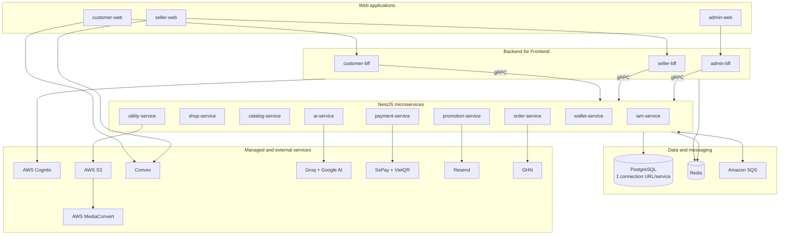

# V-Shop

V-Shop là sàn thương mại điện tử đa người bán được xây dựng theo kiến trúc microservices trên Nx monorepo. Hệ thống gồm ba cổng dành cho khách hàng, người bán và quản trị viên; giao tiếp nội bộ bằng gRPC; xử lý sự kiện bằng Amazon SQS; triển khai trên AWS EKS.

> Đề tài: **Xây dựng sàn thương mại điện tử theo kiến trúc Microservices trên nền tảng Cloud AWS**

## Nội dung

- [Tính năng chính](#tính-năng-chính)
- [Kiến trúc hệ thống](#kiến-trúc-hệ-thống)
- [Ứng dụng và dịch vụ](#ứng-dụng-và-dịch-vụ)
- [Công nghệ](#công-nghệ)
- [Cấu trúc thư mục](#cấu-trúc-thư-mục)
- [Chạy dự án ở local](#chạy-dự-án-ở-local)
- [Biến môi trường](#biến-môi-trường)
- [Code generation và database](#code-generation-và-database)
- [Kiểm tra chất lượng](#kiểm-tra-chất-lượng)
- [Triển khai](#triển-khai)
- [Tài liệu](#tài-liệu)

## Tính năng chính

### Khách hàng

- Đăng nhập bằng AWS Cognito/OIDC và quản lý hồ sơ.
- Tìm kiếm sản phẩm, duyệt danh mục, thương hiệu, gian hàng và video.
- Quản lý giỏ hàng, voucher, đặt hàng và theo dõi trạng thái đơn.
- Thanh toán COD, VietQR và sử dụng V-Xu theo nghiệp vụ của hệ thống.
- Đánh giá sản phẩm, báo cáo nội dung, nhận thông báo và trò chuyện với shop.
- Xem tóm tắt đánh giá bằng AI và dùng chatbot dựa trên knowledge base.
- Chủ động bật/tắt email ưu đãi và email nhắc voucher.

### Người bán

- Đăng ký merchant, thiết lập gian hàng và địa chỉ lấy hàng.
- Quản lý sản phẩm, SKU, tồn kho, video và đơn hàng.
- Trò chuyện với khách hàng và theo dõi thông báo theo thời gian thực.
- Theo dõi doanh thu, đối soát, khoản chi trả và yêu cầu rút tiền.
- Đăng ký vị trí quảng bá sản phẩm trên trang chủ.

### Quản trị viên

- Quản lý người dùng, quyền, gian hàng và hồ sơ merchant.
- Quản lý danh mục, thương hiệu, thuộc tính, sản phẩm, đơn hàng và video.
- Quản lý voucher, chương trình khuyến mại và vị trí quảng bá.
- Xử lý báo cáo vi phạm, hoàn tiền, đối soát, payout và doanh thu nền tảng.
- Quản lý knowledge base cho AI.
- Tạo, lên lịch và theo dõi chiến dịch email marketing qua Resend.

### Các luồng nổi bật

- **VietQR và SePay:** tạo yêu cầu thanh toán, nhận webhook, đối chiếu giao dịch và cập nhật trạng thái theo thời gian thực bằng SSE.
- **Video commerce:** tải video lên S3, chuyển mã HLS bằng AWS Elemental MediaConvert và cập nhật trạng thái qua SQS.
- **Chat thời gian thực:** trò chuyện khách hàng–shop và chatbot trên Convex.
- **AI review summary:** Groq tổng hợp ưu/nhược điểm từ đánh giá; Google Generative AI cung cấp embedding cho RAG.
- **Email marketing:** gửi email giới thiệu ưu đãi và nhắc voucher cho người dùng đã đồng ý; hỗ trợ one-click unsubscribe và nhận sự kiện Resend webhook.
- **Sổ cái người bán:** theo dõi credit, settlement, payout và bút toán nền tảng.

## Kiến trúc hệ thống



Luồng request đồng bộ đi từ web đến BFF bằng HTTP, sau đó từ BFF đến service bằng gRPC. Các tác vụ cần retry hoặc không cần hoàn tất trong cùng request được đưa qua SQS. Mỗi service sở hữu schema Prisma và connection URL PostgreSQL riêng.

Sơ đồ và sequence diagram chi tiết nằm trong [docs/architecture.md](docs/architecture.md).

## Ứng dụng và dịch vụ

### Web và BFF

| Project        | Vai trò                   | Cổng local | Địa chỉ local                  |
| -------------- | ------------------------- | ---------: | ------------------------------ |
| `customer-web` | Website mua sắm           |       3000 | `http://localhost:3000`        |
| `seller-web`   | Cổng người bán            |       4000 | `http://localhost:4000`        |
| `admin-web`    | Cổng quản trị             |       5000 | `http://localhost:5000`        |
| `customer-bff` | REST API cho customer-web |       3100 | `http://localhost:3100/api/v1` |
| `seller-bff`   | REST API cho seller-web   |       3200 | `http://localhost:3200/api/v1` |
| `admin-bff`    | REST API cho admin-web    |       3300 | `http://localhost:3300/api/v1` |

Swagger của ba BFF:

- Customer: `http://localhost:3100/api/v1/docs`
- Seller: `http://localhost:3200/api/v1/docs`
- Admin: `http://localhost:3300/api/v1/docs`

### Microservices

| Project             | Miền nghiệp vụ                                   | HTTP | gRPC |
| ------------------- | ------------------------------------------------ | ---: | ---: |
| `iam-service`       | Người dùng, quyền, Cognito, tùy chọn marketing   | 3001 | 5001 |
| `catalog-service`   | Danh mục, thương hiệu, thuộc tính, sản phẩm, SKU | 3003 | 5002 |
| `shop-service`      | Merchant và gian hàng                            | 3002 | 5003 |
| `order-service`     | Giỏ hàng, đơn hàng, outbox và giao vận           | 3004 | 5004 |
| `payment-service`   | Payment, transaction, VietQR và refund           | 3005 | 5005 |
| `promotion-service` | Khuyến mại, voucher và email marketing           | 3006 | 5006 |
| `utility-service`   | Media, video, đánh giá, báo cáo và thông báo     | 3007 | 5007 |
| `wallet-service`    | V-Xu, credit, placement, settlement và payout    | 3008 | 5008 |
| `ai-service`        | Tóm tắt đánh giá và nghiệp vụ AI                 | 3009 | 5009 |

HTTP port của service phục vụ tiến trình NestJS; BFF gọi nghiệp vụ chính qua gRPC. Giá trị gRPC trong `.env` phải có dạng `host:port`, không thêm `http://` hoặc `https://`.

### Shared libraries

| Library               | Mục đích                                                           |
| --------------------- | ------------------------------------------------------------------ |
| `libs/interfaces`     | Proto, kiểu dữ liệu sinh bởi ts-proto, interface và DTO dùng chung |
| `libs/configurations` | Đọc và kiểm tra biến môi trường bằng Zod                           |
| `libs/schemas`        | Schema validation dùng chung                                       |
| `libs/constants`      | Enum và hằng số nghiệp vụ                                          |
| `libs/decorators`     | NestJS decorators dùng chung                                       |
| `libs/guards`         | Xác thực và phân quyền                                             |
| `libs/interceptors`   | Response/error interceptors                                        |
| `libs/middlewares`    | Middleware dùng chung                                              |
| `libs/utils`          | Tiện ích backend                                                   |
| `libs/web-core`       | API client, OIDC và auth helpers cho web                           |
| `libs/web-ui`         | React components dùng chung                                        |
| `libs/web-theme`      | Theme và CSS/Tailwind dùng chung                                   |
| `libs/convex`         | Schema, function và agent cho chat/chatbot thời gian thực          |

## Công nghệ

| Lớp              | Công nghệ chính                                              |
| ---------------- | ------------------------------------------------------------ |
| Monorepo         | Nx 22, pnpm 10, TypeScript 5.9                               |
| Frontend         | Next.js 16, React 19, Tailwind CSS 3                         |
| Backend/BFF      | NestJS 11, Express 5, gRPC                                   |
| Database         | PostgreSQL, Prisma 7, `@prisma/adapter-pg`                   |
| Authentication   | AWS Cognito, OIDC, JWT, RBAC                                 |
| Cache            | Redis/Keyv                                                   |
| Messaging        | Amazon SQS                                                   |
| Storage/video    | Amazon S3, Lambda, MediaConvert, EventBridge, HLS            |
| Realtime         | Convex và SSE                                                |
| AI               | Groq, Google Generative AI, Vercel AI SDK                    |
| Payment/shipping | VietQR, SePay, MBBank proxy, GHN                             |
| Marketing        | Resend, SQS, EventBridge schedule                            |
| Infrastructure   | AWS EKS, VPC, ALB, IAM/IRSA, Terraform, Kubernetes/Kustomize |
| CI/CD            | GitHub Actions, OIDC, Amazon ECR Public                      |

## Cấu trúc thư mục

```text
fcj-hacmieu/
├── apps/
│   ├── bffs/                  # customer-bff, seller-bff, admin-bff
│   ├── services/              # 9 NestJS microservices
│   └── webs/                  # customer-web, seller-web, admin-web
├── libs/
│   ├── configurations/        # Environment configuration
│   ├── interfaces/            # Proto, generated types, DTO/interfaces
│   ├── convex/                # Realtime chat and AI agent
│   └── ...                    # Shared backend/web libraries
├── docs/                      # Kiến trúc, báo cáo và tài liệu môn học
├── helm/manifests/            # Kubernetes manifests + Kustomize
├── terraform/
│   ├── singapore-dev/         # VPC, EKS, bastion, IAM/IRSA, ALB controller
│   ├── modules/               # Terraform modules dùng chung
│   └── video-local/           # Video processing stack độc lập
├── .github/workflows/         # Build, push image và deploy
├── .env.example               # Mẫu biến môi trường
├── nx.json
├── package.json
└── pnpm-workspace.yaml
```

## Chạy dự án ở local

### Yêu cầu

- Node.js 22.x, cùng major version với Docker images của dự án.
- pnpm 10.25.0; phiên bản được khóa trong `package.json`.
- PostgreSQL cho chín service hoặc chín database/connection URL trên một dịch vụ managed.
- Redis.
- AWS account/profile có quyền với các SQS queue và S3 bucket được cấu hình.
- AWS Cognito User Pool và ba App Client cho customer, seller và admin.
- Convex deployment nếu chạy chat/chatbot.
- API key của các tích hợp được dùng: Groq, Google AI, GHN, Resend, SePay/MBBank.

### 1. Cài dependencies

```bash
corepack enable
corepack prepare pnpm@10.25.0 --activate
pnpm install --frozen-lockfile
```

### 2. Tạo file môi trường

PowerShell:

```powershell
Copy-Item .env.example .env
```

Bash:

```bash
cp .env.example .env
```

Thay toàn bộ giá trị `example`, URL queue mẫu và secret mẫu trước khi chạy. Không commit `.env`.

Các URL local phải khớp với target Nx hiện tại:

```dotenv
CUSTOMER_BFF_URL=http://localhost:3100/api/v1
CUSTOMER_WEB_URL=http://localhost:3000
SELLER_BFF_URL=http://localhost:3200/api/v1
SELLER_WEB_URL=http://localhost:4000
ADMIN_BFF_URL=http://localhost:3300/api/v1
ADMIN_WEB_URL=http://localhost:5000

CUSTOMER_REDIRECT_URI=http://localhost:3000/api/auth/callback/cognito
CUSTOMER_LOGOUT_URI=http://localhost:3000
SELLER_REDIRECT_URI=http://localhost:4000/api/auth/callback/cognito
SELLER_LOGOUT_URI=http://localhost:4000
ADMIN_REDIRECT_URI=http://localhost:5000/api/auth/callback/cognito
ADMIN_LOGOUT_URI=http://localhost:5000
```

Các callback URL trên cũng phải được khai báo trong Cognito App Client tương ứng.

### 3. Sinh Prisma Client

```bash
pnpm nx run-many -t generate-prisma --projects=iam-service,shop-service,catalog-service,order-service,payment-service,promotion-service,utility-service,wallet-service,ai-service
```

### 4. Sinh TypeScript từ proto khi cần

Các kiểu đã sinh nằm tại `libs/interfaces/src/lib/proto-types`. Chạy lại lệnh sau sau khi sửa file trong `libs/interfaces/src/lib/protos`:

```bash
pnpm generate-ts-proto
```

### 5. Chạy toàn bộ hệ thống

```bash
pnpm dev
```

Lệnh trên reset Nx daemon rồi chạy 9 service, 3 BFF và 3 web app. Các database, Redis, AWS queues và dịch vụ ngoài phải truy cập được trước khi khởi động.

### Chạy từng project

```bash
pnpm nx serve iam-service
pnpm nx serve promotion-service
pnpm nx serve customer-bff
pnpm nx serve customer-web
```

Để xem project và target hiện có:

```bash
pnpm nx show projects
pnpm nx show project promotion-service
pnpm nx graph
```

## Biến môi trường

Dự án dùng một file `.env` tại workspace root. `libs/configurations` kiểm tra cấu hình bằng Zod; ứng dụng sẽ dừng và in lỗi nếu biến bắt buộc thiếu hoặc sai định dạng.

### Nhóm cấu hình

| Nhóm        | Biến chính                                                                          |
| ----------- | ----------------------------------------------------------------------------------- |
| Cơ bản      | `NODE_ENV`, `GLOBAL_PREFIX`, `PROTO_PATH`, `AWS_REGION`                             |
| Database    | `*_SERVICE_DATABASE_URL` cho đủ 9 service                                           |
| Web/BFF     | `*_PORT`, `*_BFF_URL`, `*_WEB_URL`                                                  |
| gRPC        | `IAM_SERVICE_GRPC_URL` đến `AI_SERVICE_GRPC_URL`                                    |
| Cognito     | `COGNITO_DOMAIN`, `USER_POOL_ID`, client ID/secret, redirect/logout URI của ba cổng |
| Redis/cache | `REDIS_URL`, `REDIS_TTL`, các biến `CACHE_*_TTL`                                    |
| AWS SQS     | Tên và URL của từng queue                                                           |
| S3          | `S3_ENDPOINT`, `S3_IMAGE_BUCKET`, `S3_VIDEO_BUCKET`                                 |
| Thanh toán  | `PAYMENT_SECRET`, `BANK_CODE`, `BANK_NUMBER`, `API_MB_URL`                          |
| Giao hàng   | `GHN_API_BASE_URL`, `GHN_API_KEY`, `GHN_SHOP_ID`                                    |
| AI          | `GROQ_API_KEY`, `GOOGLE_GENERATIVE_AI_API_KEY`                                      |
| Convex      | `CONVEX_DEPLOYMENT`, `NEXT_PUBLIC_CONVEX_URL`, `NEXT_PUBLIC_CONVEX_SITE_URL`        |
| Marketing   | `RESEND_API_KEY`, `RESEND_WEBHOOK_SECRET`, `MARKETING_*`                            |
| Nghiệp vụ   | Commission, reward, tax và cấu hình product placement                               |

### SQS queues

Mỗi queue cần cả biến `*_QUEUE_NAME` và `*_QUEUE_URL`:

- `CREATE_PAYMENT`
- `CREATE_REDEMPTION`
- `CREATE_ORDER`
- `SETTLE_ORDER_REVENUE`
- `DELETE_CART_ITEM`
- `SEND_NOTIFICATION`
- `CREATE_USER`
- `UPDATE_VIDEO_STATUS`
- `SEND_MARKETING_EMAIL`
- `SCAN_MARKETING`

Ở local, AWS SDK dùng credential chain mặc định. Có thể đăng nhập bằng AWS profile/SSO; chỉ đặt `AWS_ACCESS_KEY_ID`, `AWS_SECRET_ACCESS_KEY` và `AWS_SESSION_TOKEN` khi thực sự cần. Trên EKS, workload dùng IRSA.

### Email marketing bằng Resend

Các giá trị tối thiểu để gửi email:

```dotenv
RESEND_API_KEY=re_...
MARKETING_FROM_EMAIL="V-Shop <marketing@your-verified-domain.com>"
MARKETING_REPLY_TO=support@your-domain.com
MARKETING_ADVERTISER_NAME=V-Shop
MARKETING_ADVERTISER_PHONE=...
MARKETING_ADVERTISER_ADDRESS=...
MARKETING_UNSUBSCRIBE_SECRET=use-a-long-random-secret-at-least-16-characters
MARKETING_REMINDER_HOURS=24
```

`MARKETING_FROM_EMAIL` phải thuộc domain đã xác minh trên Resend. `MARKETING_UNSUBSCRIBE_SECRET` dùng ký liên kết hủy đăng ký và phải ổn định giữa các replica. Thêm `RESEND_WEBHOOK_SECRET` để xác minh webhook theo dõi delivered/opened/clicked/bounced/complained.

Webhook public của Resend đi vào:

```text
POST /api/v1/promotion/marketing/webhooks/resend
```

Email chỉ được đưa vào hàng đợi khi người dùng đã bật chủ đề tương ứng. Tác vụ quét định kỳ có thể được gọi thủ công từ admin hoặc kích hoạt bằng EventBridge gửi message vào `SCAN_MARKETING`.

## Code generation và database

### Prisma

Mỗi service có schema tại `apps/services/<service>/prisma/schema.prisma`. Build target của service phụ thuộc vào `generate-prisma`, nên Prisma Client sẽ được sinh trước khi build.

Sau khi thay đổi schema của một service:

```bash
pnpm nx generate-prisma promotion-service
pnpm nx push-prisma promotion-service
```

`push-prisma` thay đổi database được trỏ bởi `.env`; hãy kiểm tra đúng connection URL và schema diff trước khi chạy. Không dùng target chấp nhận mất dữ liệu trên database có dữ liệu cần giữ.

### gRPC/proto

Proto nguồn nằm trong `libs/interfaces/src/lib/protos`. Sau khi sửa proto:

```bash
pnpm generate-ts-proto
pnpm nx build customer-bff
pnpm nx build promotion-service
```

Commit thay đổi proto và các kiểu TypeScript sinh ra trong cùng một thay đổi để BFF/service dùng cùng contract.

## Kiểm tra chất lượng

Build toàn bộ 15 application:

```bash
pnpm build
```

Lint các project:

```bash
pnpm nx run-many -t lint
```

Chạy bộ e2e của marketing trong promotion-service:

```bash
pnpm nx run promotion-service:e2e
```

Build hoặc lint một project khi đang phát triển:

```bash
pnpm nx build admin-web
pnpm nx lint promotion-service
```

## Triển khai

### AWS/Kubernetes

Hạ tầng chính ở region `ap-southeast-1`:

- Terraform tạo VPC, EKS, managed node group, bastion, IAM/IRSA và AWS Load Balancer Controller.
- Kubernetes manifests trong `helm/manifests` triển khai 9 service, 3 BFF, 3 web app và `api-mb`.
- ALB định tuyến ba domain `vshop.hacmieu.com`, `seller.vshop.hacmieu.com` và `admin.vshop.hacmieu.com`.
- Video processing dùng S3 → SQS → Lambda submit → MediaConvert → EventBridge → Lambda complete → SQS status.

Xem quy trình provisioning và kiểm tra cluster tại [terraform/singapore-dev/README.md](terraform/singapore-dev/README.md).

### CI/CD

GitHub Actions xác định application bị ảnh hưởng theo đường dẫn thay đổi:

- Pull request: build Docker image để kiểm tra.
- Push vào `main`: build và push image lên Amazon ECR Public bằng GitHub OIDC.
- Sau khi push thành công: restart deployment bị ảnh hưởng và chờ Kubernetes rollout hoàn tất.

CI cần các GitHub secrets `AWS_ROLE_ARN`, `AWS_REGION` và `EKS_CLUSTER_NAME`. Secret ứng dụng không được đưa vào image hoặc commit trong repository; cung cấp qua secret manager/Kubernetes Secret của môi trường triển khai.

## Xử lý lỗi thường gặp

### Ứng dụng dừng với thông báo `.env` không hợp lệ

Đọc chi tiết Zod error ngay sau thông báo, kiểm tra biến bắt buộc trong `.env` và bảo đảm URL/number đúng định dạng. Đặc biệt kiểm tra đủ chín database URL, Redis, Cognito và các SQS queue.

### BFF không kết nối được service

Kiểm tra service đang chạy, gRPC URL đúng cổng và không có protocol. Ví dụ:

```dotenv
CATALOG_SERVICE_GRPC_URL=0.0.0.0:5002
```

### Không tìm thấy Prisma Client

```bash
pnpm nx generate-prisma <service-name>
```

### TypeScript không khớp với proto

```bash
pnpm generate-ts-proto
```

Sau đó build lại BFF/service liên quan.

### Email không gửi được

Kiểm tra Resend API key, domain của `MARKETING_FROM_EMAIL`, quyền AWS với queue `SEND_MARKETING_EMAIL`, trạng thái opt-in của người nhận và log của `promotion-service`.

## Tài liệu

- [Kiến trúc hệ thống](docs/architecture.md)
- [Sơ đồ kiến trúc tổng thể](docs/vshop-main.png)
- [Sơ đồ video processing](docs/vshop-video.png)
- [Báo cáo môn Thương mại điện tử](docs/bao-cao-mon-hoc-thuong-mai-dien-tu.md)
- [Tài liệu triển khai Terraform/EKS](terraform/singapore-dev/README.md)

## Giấy phép

Dự án sử dụng giấy phép MIT theo khai báo trong `package.json`.
