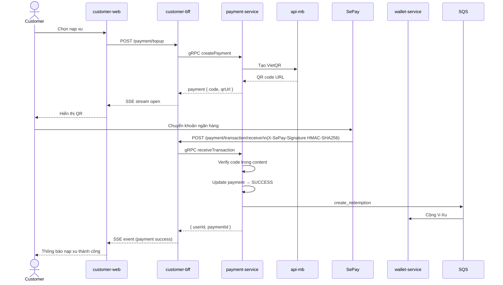
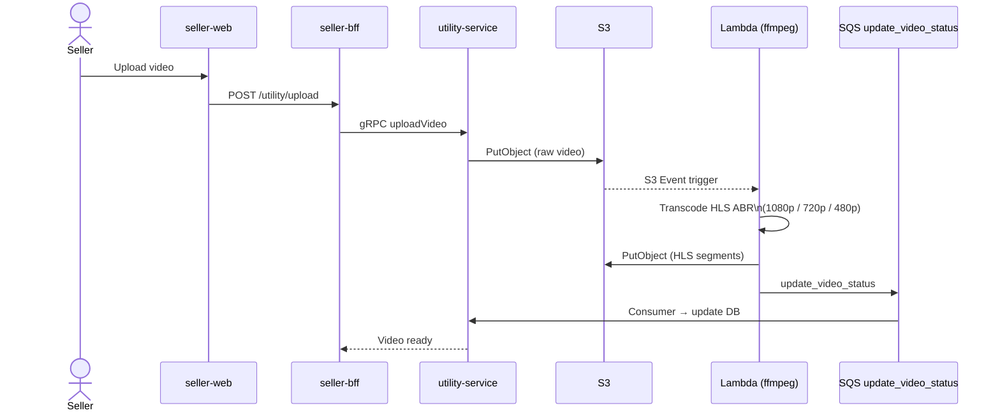
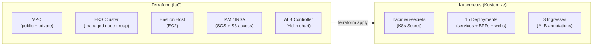

# V-Shop — Architecture Diagram

## System Overview

```mermaid
graph TB
    subgraph Users["👥 Users"]
        CU["Customer\nvshop.hacmieu.com"]
        SE["Seller\nseller.vshop.hacmieu.com"]
        AD["Admin\nadmin.vshop.hacmieu.com"]
    end

    subgraph CICD["🔄 CI/CD"]
        GHA["GitHub Actions"]
        ECR["ECR Public\n(Docker images)"]
        GHA -->|"build & push"| ECR
    end

    subgraph AWS["☁️ AWS ap-southeast-1"]
        COG["Cognito\n(OIDC / Managed Login)"]
        S3["S3\n(images + videos)"]
        LAM["Lambda\n(ffmpeg HLS)"]

        subgraph SQS_GROUP["SQS Queues"]
            SQS1["create_payment"]
            SQS2["create_order"]
            SQS3["create_redemption"]
            SQS4["delete_cart_item"]
            SQS5["send_notification"]
            SQS6["create_user"]
            SQS7["settle_order_revenue"]
            SQS8["update_video_status"]
        end

        subgraph VPC["VPC (public + private subnets)"]
            BASTION["Bastion Host"]

            subgraph EKS["EKS Cluster"]
                ALB["ALB\n(Internet-facing)"]

                subgraph WEBS["Web Apps — Next.js"]
                    CW["customer-web :3000"]
                    SW["seller-web :3001"]
                    AW["admin-web :3002"]
                end

                subgraph BFFS["BFF Layer — NestJS"]
                    CBFF["customer-bff :3100"]
                    SBFF["seller-bff :3200"]
                    ABFF["admin-bff :3300"]
                end

                subgraph SVCS["Microservices — NestJS gRPC"]
                    IAM["iam-service :5001"]
                    CAT["catalog-service :5002"]
                    SHOP["shop-service :5003"]
                    ORD["order-service :5004"]
                    PAY["payment-service :5005"]
                    PRO["promotion-service :5006"]
                    UTL["utility-service :5007"]
                    WAL["wallet-service :5008"]
                    AIS["ai-service :5009"]
                end

                APIMB["api-mb :2836\n(MBBank proxy)"]
            end
        end
    end

    subgraph EXT["🌐 External Services"]
        NEON["Neon PostgreSQL\n(9 databases)"]
        REDIS["Redis Cloud\n(Cache)"]
        CONVEX["Convex Cloud\n(Real-time Chat + AI Bot)"]
        GROQ["Groq API\n(Kimi K2 / Llama 4)"]
        GOOGLE["Google Embedding\n(RAG)"]
        SEPAY["SePay\n(Webhook)"]
    end

    %% Users → ALB
    CU -->|HTTPS| ALB
    SE -->|HTTPS| ALB
    AD -->|HTTPS| ALB

    %% ALB → Web + BFF
    ALB --> CW & SW & AW
    ALB -->|"/api/v1"| CBFF & SBFF & ABFF

    %% BFF → gRPC
    CBFF -.->|gRPC| IAM & CAT & ORD & PAY & WAL & UTL & PRO & AIS
    SBFF -.->|gRPC| SHOP & CAT & ORD
    ABFF -.->|gRPC| IAM & PAY

    %% Auth
    CBFF & SBFF & ABFF -->|OIDC| COG

    %% SePay webhook
    SEPAY -->|"POST HMAC-SHA256"| CBFF

    %% Services → DB
    IAM & CAT & SHOP & ORD & PAY & PRO & UTL & WAL & AIS --> NEON

    %% Cache
    CBFF & IAM --> REDIS

    %% SQS
    ORD --> SQS2 & SQS4
    PAY --> SQS1 & SQS3 & SQS7
    IAM --> SQS6
    UTL --> SQS5 & SQS8

    %% S3 + Lambda
    UTL -->|PutObject| S3
    S3 -->|S3 Event| LAM
    LAM --> SQS8

    %% AI
    AIS -->|LLM| GROQ
    AIS -->|Embedding| GOOGLE

    %% Real-time
    CW & SW -->|WebSocket| CONVEX

    %% MBBank
    PAY -->|VietQR| APIMB

    %% CI/CD
    ECR -.->|"kubectl apply"| EKS
```

---

## Data Flow: Payment (QR Top-up)

```mermaid
sequenceDiagram
    actor Customer
    participant CW as customer-web
    participant CBFF as customer-bff
    participant PAY as payment-service
    participant APIMB as api-mb
    participant SEPAY as SePay
    participant WAL as wallet-service
    participant SQS

    Customer->>CW: Chọn nạp xu
    CW->>CBFF: POST /payment/topup
    CBFF->>PAY: gRPC createPayment
    PAY->>APIMB: Tạo VietQR
    APIMB-->>PAY: QR code URL
    PAY-->>CBFF: payment { code, qrUrl }
    CBFF-->>CW: SSE stream open
    CW-->>Customer: Hiển thị QR

    Customer->>SEPAY: Chuyển khoản ngân hàng
    SEPAY->>CBFF: POST /payment/transaction/receiver\n(X-SePay-Signature HMAC-SHA256)
    CBFF->>PAY: gRPC receiveTransaction
    PAY->>PAY: Verify code trong content
    PAY->>PAY: Update payment → SUCCESS
    PAY->>SQS: create_redemption
    SQS->>WAL: Cộng V-Xu
    PAY-->>CBFF: { userId, paymentId }
    CBFF-->>CW: SSE event (payment success)
    CW-->>Customer: Thông báo nạp xu thành công
```

---

## Data Flow: Video Processing

```mermaid
sequenceDiagram
    actor Seller
    participant SW as seller-web
    participant SBFF as seller-bff
    participant UTL as utility-service
    participant S3
    participant LAM as Lambda (ffmpeg)
    participant SQS as SQS update_video_status

    Seller->>SW: Upload video
    SW->>SBFF: POST /utility/upload
    SBFF->>UTL: gRPC uploadVideo
    UTL->>S3: PutObject (raw video)
    S3-->>LAM: S3 Event trigger
    LAM->>LAM: Transcode HLS ABR\n(1080p / 720p / 480p)
    LAM->>S3: PutObject (HLS segments)
    LAM->>SQS: update_video_status
    SQS->>UTL: Consumer → update DB
    UTL-->>SBFF: Video ready
```

---

## Infrastructure

```mermaid
graph LR
    subgraph Terraform["Terraform (IaC)"]
        VPC_TF["VPC\n(public + private)"]
        EKS_TF["EKS Cluster\n(managed node group)"]
        BASTION_TF["Bastion Host\n(EC2)"]
        IAM_TF["IAM / IRSA\n(SQS + S3 access)"]
        ALB_TF["ALB Controller\n(Helm chart)"]
    end

    subgraph K8S["Kubernetes (Kustomize)"]
        SECRET["hacmieu-secrets\n(K8s Secret)"]
        DEPLOY["15 Deployments\n(services + BFFs + webs)"]
        INGRESS["3 Ingresses\n(ALB annotations)"]
    end

    Terraform -->|"terraform apply"| K8S
```
