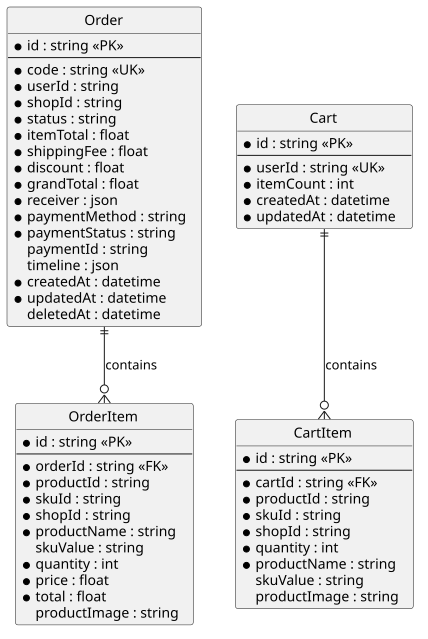
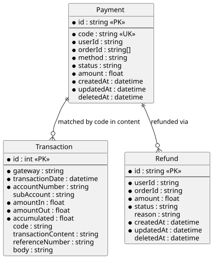
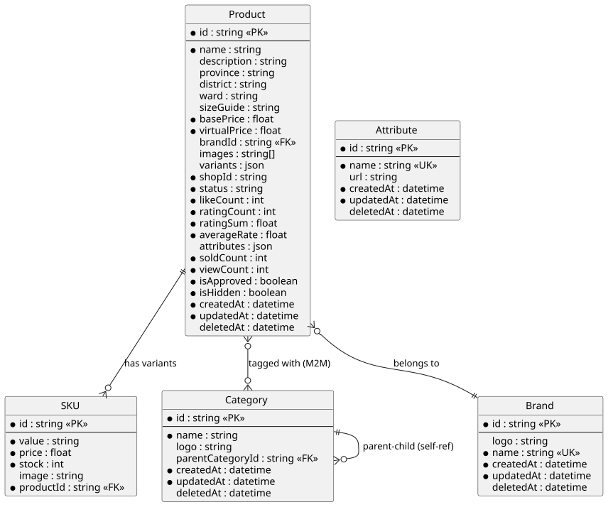
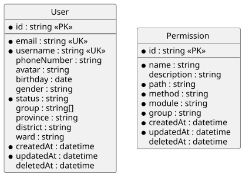
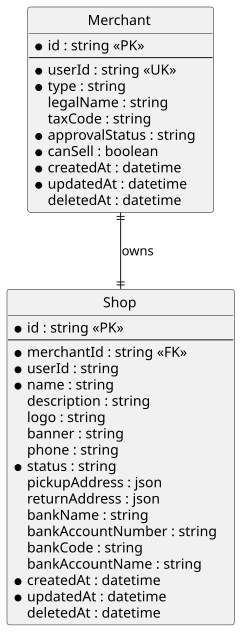
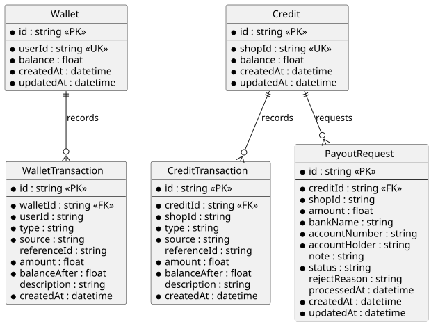
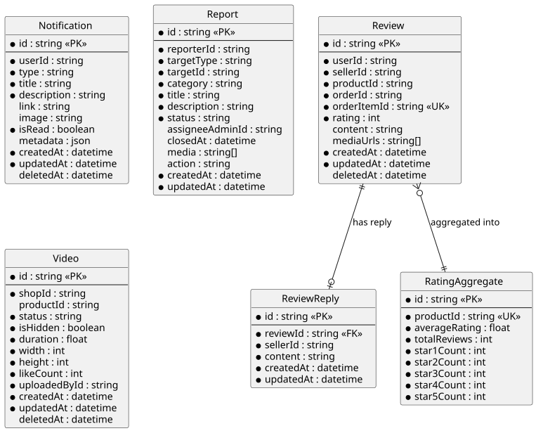
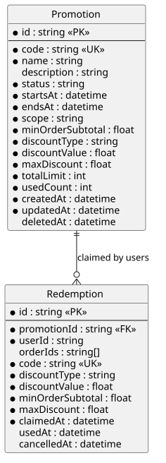
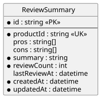

# BỘ XÂY DỰNG

# TRƯỜNG ĐẠI HỌC GIAO THÔNG VẬN TẢI THÀNH PHỐ HỒ CHÍ MINH

# BÁO CÁO HỆ QUẢN TRỊ CƠ SỞ DỮ LIỆU

## ĐỀ TÀI: HỆ THỐNG SÀN THƯƠNG MẠI ĐIỆN TỬ V-SHOP THEO KIẾN TRÚC MICROSERVICE

**Hệ quản trị cơ sở dữ liệu:** MySQL  
**Công nghệ truy cập dữ liệu:** Prisma ORM  
**Kiến trúc dữ liệu:** Database per Service  
**Thời điểm khảo sát mã nguồn:** 10/09/2026

> Thông tin giảng viên, lớp học, nhóm sinh viên và bảng phân công được bổ sung khi hoàn thiện bản nộp chính thức.

---

## LỜI CẢM ƠN

Nhóm chúng em xin gửi lời cảm ơn chân thành đến quý thầy cô Trường Đại học Giao thông Vận tải Thành phố Hồ Chí Minh đã cung cấp nền tảng kiến thức về hệ quản trị cơ sở dữ liệu. Những kiến thức về thiết kế dữ liệu, giao tác, tính toàn vẹn và xử lý tương tranh là cơ sở để nhóm xây dựng và đánh giá hệ thống V-Shop.

Trong quá trình thực hiện, do thời gian và kinh nghiệm còn hạn chế, báo cáo khó tránh khỏi thiếu sót. Nhóm kính mong nhận được ý kiến góp ý của giảng viên để tiếp tục hoàn thiện hệ thống.

## LỜI NÓI ĐẦU

Thương mại điện tử cần xử lý đồng thời nhiều nhóm dữ liệu có đặc điểm khác nhau như người dùng, sản phẩm, giỏ hàng, đơn hàng, thanh toán, khuyến mãi, ví điện tử, đánh giá và thông báo. Nếu toàn bộ dữ liệu được đặt trong một cơ sở dữ liệu nguyên khối, các miền nghiệp vụ dễ phụ thuộc chặt vào nhau và khó mở rộng độc lập.

V-Shop được xây dựng theo kiến trúc microservice. Mỗi dịch vụ sở hữu schema MySQL riêng và truy cập dữ liệu thông qua Prisma ORM. Cách tổ chức này tạo ranh giới dữ liệu rõ ràng, cho phép từng dịch vụ triển khai và mở rộng độc lập, đồng thời đặt ra yêu cầu kiểm soát nhất quán giữa các cơ sở dữ liệu.

Báo cáo tập trung khảo sát phần mã nguồn hiện có, mô tả đầy đủ các thực thể dữ liệu, khóa, ràng buộc và chỉ mục. Dựa trên nghiệp vụ thực tế, hệ thống triển khai thêm các View, Stored Procedure, Function và Trigger phù hợp với MySQL. Các đối tượng được lưu bằng Prisma Migrate, được gọi từ repository tương ứng và có script kiểm thử tích hợp.

---

## MỤC LỤC

1. Chương 1. Tổng quan đề tài
2. Chương 2. Phân tích và thiết kế cơ sở dữ liệu
3. Chương 3. Xây dựng cơ sở dữ liệu
4. Chương 4. Lập trình cơ sở dữ liệu
5. Chương 5. Các trường hợp lỗi tương tranh
6. Chương 6. Đánh giá và hướng phát triển
7. Kết luận
8. Tài liệu tham khảo

## DANH MỤC HÌNH

1. Hình 2.1. ERD Order Service.
2. Hình 2.2. ERD Payment Service.
3. Hình 2.3. ERD Catalog Service.
4. Hình 2.4. ERD IAM Service.
5. Hình 2.5. ERD Shop Service.
6. Hình 2.6. ERD Wallet Service.
7. Hình 2.7. ERD Utility Service.
8. Hình 2.8. ERD Promotion Service.
9. Hình 2.9. ERD AI Service.

## DANH MỤC BẢNG

1. Bảng 1.1. Phạm vi chín MySQL service.
2. Bảng 2.1. Danh sách 27 enum nghiệp vụ.
3. Bảng 2.2. Quan hệ dữ liệu liên service.
4. Bảng 3.1. Các loại đối tượng cơ sở dữ liệu hiện có.
5. Bảng 4.1. Danh sách đối tượng lập trình cơ sở dữ liệu trong báo cáo.
6. Bảng C.1. Số lượng model, enum và bảng vật lý theo schema.

---

## CHƯƠNG 1. TỔNG QUAN ĐỀ TÀI

### 1.1. Giới thiệu hệ thống V-Shop

V-Shop là sàn thương mại điện tử kết nối khách hàng và nhà bán hàng. Hệ thống hỗ trợ quản lý tài khoản, gian hàng, danh mục sản phẩm, SKU, giỏ hàng, đơn hàng, thanh toán QR, ví xu, doanh thu cửa hàng, yêu cầu rút tiền, voucher, đánh giá, video sản phẩm và tóm tắt đánh giá bằng trí tuệ nhân tạo.

Hệ thống phục vụ ba nhóm người dùng chính:

- **Khách hàng:** tìm kiếm sản phẩm, quản lý giỏ hàng, đặt hàng, thanh toán, sử dụng voucher và ví xu, đánh giá sản phẩm.
- **Nhà bán hàng:** quản lý gian hàng, sản phẩm, đơn hàng, video, doanh thu và yêu cầu rút tiền.
- **Quản trị viên:** quản lý người dùng, quyền truy cập, duyệt nhà bán hàng, xử lý báo cáo và quản trị danh mục dùng chung.

### 1.2. Bài toán quản trị dữ liệu

Các bài toán dữ liệu quan trọng của V-Shop gồm:

- Duy trì tính chính xác của tồn kho, giỏ hàng và đơn hàng khi có nhiều người dùng thao tác đồng thời.
- Không để số dư ví hoặc số dư doanh thu âm.
- Không ghi nhận trùng giao dịch ngân hàng, voucher hoặc doanh thu của cùng một đơn hàng.
- Lưu ảnh chụp thông tin sản phẩm và người nhận tại thời điểm đặt hàng để dữ liệu lịch sử không bị thay đổi theo dữ liệu hiện hành.
- Cho phép các microservice độc lập nhưng vẫn trao đổi dữ liệu qua gRPC, SQS và mã tham chiếu nghiệp vụ.
- Bảo toàn dữ liệu tài chính bằng transaction và các ràng buộc duy nhất.

### 1.3. Mục tiêu đề tài

- Phân tích cấu trúc dữ liệu thực tế của hệ thống V-Shop.
- Mô tả đầy đủ các bảng thuộc chín MySQL schema.
- Xác định khóa chính, khóa ngoại, khóa duy nhất và các chỉ mục quan trọng.
- Đề xuất các đối tượng lập trình MySQL dễ hiểu và sát nghiệp vụ.
- Trình bày một transaction đang được sử dụng trong mã nguồn.
- Phân tích, tái hiện và đề xuất cách khắc phục năm trường hợp lỗi tương tranh trên MySQL/InnoDB.

### 1.4. Phạm vi thực hiện

Báo cáo khảo sát chín backend service có Prisma schema:

| STT | Service             | Miền nghiệp vụ                        | Số Prisma model |
| --: | ------------------- | ------------------------------------- | --------------: |
|   1 | `iam-service`       | Người dùng và phân quyền              |               2 |
|   2 | `shop-service`      | Nhà bán hàng và gian hàng             |               2 |
|   3 | `catalog-service`   | Danh mục và sản phẩm                  |               5 |
|   4 | `order-service`     | Giỏ hàng và đơn hàng                  |               4 |
|   5 | `payment-service`   | Thanh toán và giao dịch ngân hàng     |               3 |
|   6 | `wallet-service`    | Ví xu, doanh thu và rút tiền          |               5 |
|   7 | `promotion-service` | Khuyến mãi và lượt sử dụng            |               2 |
|   8 | `utility-service`   | Thông báo, báo cáo, đánh giá và video |               6 |
|   9 | `ai-service`        | Kết quả tóm tắt đánh giá              |               1 |
|     | **Tổng cộng**       |                                       |          **30** |

Ba mươi Prisma model sinh ra 30 bảng chính. Ngoài ra, quan hệ nhiều-nhiều ngầm định giữa `Product` và `Category` làm Prisma tạo thêm một bảng nối vật lý. Vì vậy, nếu tính ở mức MySQL sau khi đồng bộ schema thì Catalog Database có thêm bảng nối này, nâng tổng số bảng vật lý dự kiến lên 31. Tên bảng nối là chi tiết do Prisma quản lý và có thể thay đổi theo phiên bản, nên báo cáo dùng tên model khi mô tả nghiệp vụ.

Ngoài MySQL, hệ thống còn sử dụng Redis cho cache/rate limit, Convex cho chat thời gian thực và S3 cho tệp media. Các kho dữ liệu này được nhắc đến ở mức kiến trúc nhưng không thuộc phạm vi thiết kế đối tượng MySQL của báo cáo.

### 1.5. Phương pháp thực hiện

Nhóm khảo sát toàn bộ Prisma schema, repository có thao tác transaction, cấu hình kết nối MySQL, tài liệu kiến trúc, sơ đồ ERD và các luồng nghiệp vụ trong monorepo. Schema Prisma được xem là nguồn chuẩn cho cấu trúc bảng hiện hành; mã repository được xem là nguồn chuẩn cho hành vi đọc/ghi dữ liệu.

---

## CHƯƠNG 2. PHÂN TÍCH VÀ THIẾT KẾ CƠ SỞ DỮ LIỆU

### 2.1. Kiến trúc Database per Service

Mỗi microservice sở hữu một cơ sở dữ liệu MySQL và chỉ service đó được quyền truy cập trực tiếp. Quan hệ bên trong cùng một service được bảo vệ bằng khóa ngoại. Quan hệ giữa hai service được biểu diễn bằng các mã tham chiếu như `userId`, `shopId`, `productId`, `orderId` hoặc `paymentId`, không tạo khóa ngoại vật lý xuyên database.

```text
Web/BFF
   │ REST/gRPC
   ├── IAM Service ─────── IAM Database
   ├── Shop Service ────── Shop Database
   ├── Catalog Service ─── Catalog Database
   ├── Order Service ───── Order Database
   ├── Payment Service ─── Payment Database
   ├── Wallet Service ──── Wallet Database
   ├── Promotion Service ─ Promotion Database
   ├── Utility Service ─── Utility Database
   └── AI Service ──────── AI Database
```

Ưu điểm của mô hình này là tách biệt dữ liệu, giảm liên kết triển khai và cho phép mở rộng từng service. Giới hạn chính là MySQL transaction chỉ đảm bảo tính nguyên tử trong một database; quy trình đi qua nhiều service cần idempotency, message queue hoặc Saga thay vì transaction phân tán thông thường.

#### 2.1.1. Sơ đồ quan hệ của chín database

Các ERD dưới đây được sinh từ Prisma schema trong mã nguồn. Đường quan hệ chỉ xuất hiện giữa các bảng thuộc cùng database; mã tham chiếu sang service khác không phải khóa ngoại vật lý.



_Hình 2.1. ERD Order Service._



_Hình 2.2. ERD Payment Service._



_Hình 2.3. ERD Catalog Service._



_Hình 2.4. ERD IAM Service._



_Hình 2.5. ERD Shop Service._



_Hình 2.6. ERD Wallet Service._



_Hình 2.7. ERD Utility Service._



_Hình 2.8. ERD Promotion Service._



_Hình 2.9. ERD AI Service._

### 2.2. Quy ước thiết kế chung

- Khóa chính nghiệp vụ phần lớn dùng UUID dạng `String`; riêng giao dịch ngân hàng dùng `Int` để giữ nguyên mã do cổng thanh toán cung cấp.
- Các bảng có thể chỉnh sửa thường có `createdAt`, `updatedAt`; nhiều bảng hỗ trợ xóa mềm bằng `deletedAt`.
- Trường `createdById`, `updatedById`, `deletedById` phục vụ truy vết người thao tác nhưng không liên kết vật lý sang IAM Database.
- Dữ liệu danh sách và snapshot linh hoạt được lưu bằng kiểu `JSON` do MySQL không có kiểu mảng.
- Tiền tệ nghiệp vụ chính được lưu bằng `Int` theo đơn vị đồng; một số trường giá sản phẩm hiện dùng `Float`.
- Chỉ mục được đặt tại khóa tra cứu, trạng thái, thời gian, mã chủ sở hữu và các cột xóa mềm.

### 2.3. Danh sách kiểu liệt kê

| Service   | Enum                      | Giá trị                                                                                            |
| --------- | ------------------------- | -------------------------------------------------------------------------------------------------- |
| IAM       | `USER_STATUS`             | ACTIVE, INACTIVE, BLOCKED                                                                          |
| IAM       | `GENDER`                  | MALE, FEMALE, OTHER                                                                                |
| IAM       | `HTTP_METHOD`             | GET, POST, PUT, DELETE, PATCH, OPTIONS, HEAD                                                       |
| IAM       | `GROUP`                   | ADMIN, SELLER, CUSTOMER                                                                            |
| Shop      | `MerchantType`            | INDIVIDUAL, BUSINESS                                                                               |
| Shop      | `MerchantApprovalStatus`  | PENDING, APPROVED, REJECTED, SUSPENDED                                                             |
| Shop      | `ShopStatus`              | DRAFT, ACTIVE, INACTIVE, CLOSED                                                                    |
| Catalog   | `ProductStatus`           | ACTIVE, INACTIVE, BANNED, DRAFT                                                                    |
| Order     | `OrderStatus`             | CREATING, PENDING, CONFIRMED, SHIPPING, COMPLETED, CANCELLED, REFUNDED                             |
| Order     | `PaymentMethod`           | COD, WALLET, ONLINE                                                                                |
| Order     | `PaymentStatus`           | PENDING, SUCCESS, FAILED, REFUNDED                                                                 |
| Payment   | `PaymentStatus`           | PENDING, SUCCESS, FAILED, CANCELLED                                                                |
| Payment   | `PaymentMethod`           | COD, ONLINE, WALLET                                                                                |
| Payment   | `RefundStatus`            | PENDING, APPROVED, REJECTED                                                                        |
| Wallet    | `WalletTransactionType`   | CREDIT, DEBIT                                                                                      |
| Wallet    | `WalletTransactionSource` | ORDER_REWARD, REVIEW_REWARD, PROMOTION_GIFT, REFERRAL, TOPUP, REFUND, ORDER_PAYMENT, SYSTEM, OTHER |
| Wallet    | `CreditTransactionType`   | CREDIT, DEBIT                                                                                      |
| Wallet    | `CreditTransactionSource` | ORDER_REVENUE, WITHDRAWAL, REFUND, SYSTEM, OTHER                                                   |
| Wallet    | `PayoutStatus`            | PENDING, TRANSFERRED, REJECTED                                                                     |
| Promotion | `PromotionStatus`         | DRAFT, ACTIVE, PAUSED, ENDED                                                                       |
| Promotion | `DiscountType`            | PERCENT, AMOUNT                                                                                    |
| Promotion | `PromotionScope`          | ORDER, SHIPPING                                                                                    |
| Utility   | `NotificationType`        | ORDER_UPDATE, PROMOTION, WALLET_UPDATE, OTHER                                                      |
| Utility   | `ReportTargetType`        | USER, SELLER, PRODUCT, ORDER, MESSAGE, REVIEW                                                      |
| Utility   | `ReportCategory`          | SCAM, FRAUD, FAKE, HARASSMENT, SPAM, OTHER                                                         |
| Utility   | `ReportStatus`            | PENDING, REVIEWING, RESOLVED, REJECTED                                                             |
| Utility   | `VideoStatus`             | PENDING, PROCESSING, READY, FAILED                                                                 |

### 2.4. Mô hình dữ liệu IAM Service

#### 2.4.1. Bảng `User`

Lưu hồ sơ người dùng đồng bộ với hệ thống xác thực, trạng thái, nhóm quyền và địa chỉ mặc định.

| Nhóm trường | Trường                                                                                      |
| ----------- | ------------------------------------------------------------------------------------------- |
| Khóa        | `id` (PK, UUID), `email` (unique), `username` (unique)                                      |
| Hồ sơ       | `phoneNumber`, `avatar`, `birthday`, `gender`, `status`                                     |
| Phân quyền  | `group` (JSON chứa danh sách nhóm)                                                          |
| Địa chỉ     | `provinceId`, `provinceName`, `districtId`, `districtName`, `wardId`, `wardName`, `address` |
| Theo dõi    | `updatedById`, `deletedById`, `deletedAt`, `createdAt`, `updatedAt`                         |
| Chỉ mục     | `email`, `username`, `status`, `deletedAt`                                                  |

#### 2.4.2. Bảng `Permission`

Lưu quyền gọi API theo đường dẫn, HTTP method và nhóm người dùng.

| Nhóm trường | Trường                                                                             |
| ----------- | ---------------------------------------------------------------------------------- |
| Khóa        | `id` (PK), unique (`path`, `method`, `group`)                                      |
| Nội dung    | `name`, `description`, `path`, `method`, `module`, `group`                         |
| Theo dõi    | `createdById`, `updatedById`, `deletedById`, `deletedAt`, `createdAt`, `updatedAt` |
| Chỉ mục     | `group`, `deletedAt`                                                               |

### 2.5. Mô hình dữ liệu Shop Service

#### 2.5.1. Bảng `Merchant`

Lưu hồ sơ pháp lý và trạng thái xét duyệt của nhà bán hàng.

| Nhóm trường | Trường                                                                             |
| ----------- | ---------------------------------------------------------------------------------- |
| Khóa        | `id` (PK), `userId` (unique)                                                       |
| Nghiệp vụ   | `type`, `legalName`, `taxCode`, `approvalStatus`, `canSell`                        |
| Theo dõi    | `createdById`, `updatedById`, `deletedById`, `deletedAt`, `createdAt`, `updatedAt` |
| Chỉ mục     | `approvalStatus`, `canSell`, `deletedAt`                                           |

#### 2.5.2. Bảng `Shop`

Lưu thông tin gian hàng, địa chỉ nhận/trả hàng và tài khoản ngân hàng.

| Nhóm trường | Trường                                                                             |
| ----------- | ---------------------------------------------------------------------------------- |
| Khóa        | `id` (PK), `merchantId` (unique, FK → `Merchant.id`)                               |
| Hiển thị    | `userId`, `name`, `description`, `logo`, `banner`, `phone`, `status`               |
| Vận hành    | `pickupAddress`, `returnAddress`                                                   |
| Ngân hàng   | `bankName`, `bankAccountNumber`, `bankCode`, `bankAccountName`                     |
| Theo dõi    | `createdById`, `updatedById`, `deletedById`, `deletedAt`, `createdAt`, `updatedAt` |
| Chỉ mục     | `status`, `deletedAt`                                                              |

Quan hệ `Merchant` – `Shop` là một-một. Khi xóa vật lý Merchant, Shop liên quan bị xóa theo `ON DELETE CASCADE`.

### 2.6. Mô hình dữ liệu Catalog Service

#### 2.6.1. Bảng `Category`

Lưu danh mục phân cấp. `parentCategoryId` tự tham chiếu tới `Category.id`; khi danh mục cha bị xóa, danh mục con được đưa về cấp gốc bằng `SET NULL`.

Các trường gồm `id`, `name`, `logo`, `parentCategoryId`, thông tin truy vết và thời gian. Chỉ mục đặt tại `name`, `parentCategoryId`, `deletedAt`.

#### 2.6.2. Bảng `Brand`

Lưu thương hiệu với các trường `id`, `name`, `logo`, thông tin truy vết và thời gian. `name` là duy nhất; `deletedAt` có chỉ mục.

#### 2.6.3. Bảng `Product`

Lưu thông tin sản phẩm và dữ liệu tổng hợp phục vụ hiển thị.

| Nhóm trường | Trường                                                                                          |
| ----------- | ----------------------------------------------------------------------------------------------- |
| Khóa        | `id` (PK), `brandId` (FK tùy chọn → `Brand.id`)                                                 |
| Cơ bản      | `name`, `description`, `sizeGuide`, `shopId`, `status`                                          |
| Địa điểm    | `provinceId`, `provinceName`, `districtId`, `districtName`, `wardId`, `wardName`                |
| Giá         | `basePrice`, `virtualPrice`                                                                     |
| JSON        | `images`, `variants`, `attributes`                                                              |
| Thống kê    | `likeCount`, `ratingCount`, `ratingSum`, `averageRate`, `soldCount`, `viewCount`                |
| Kiểm duyệt  | `isApproved`, `isHidden`                                                                        |
| Theo dõi    | `createdById`, `updatedById`, `deletedById`, `deletedAt`, `createdAt`, `updatedAt`              |
| Chỉ mục     | `isHidden`, `shopId`, `brandId`, `createdById`, `name`, `deletedAt`, `provinceId`, `districtId` |

`shopId` là tham chiếu logic sang Shop Service nên không có khóa ngoại vật lý.

#### 2.6.4. Bảng `Attribute`

Lưu thuộc tính dùng để mô tả biến thể sản phẩm. Bảng gồm `id`, `name` duy nhất, `url`, các trường truy vết và thời gian; có chỉ mục tại `deletedAt`.

#### 2.6.5. Bảng `SKU`

Lưu từng đơn vị tồn kho của sản phẩm. Bảng gồm `id`, `value`, `price`, `stock`, `image`, `productId`, các trường truy vết và thời gian. Khóa ngoại `productId` tham chiếu `Product.id` và xóa dây chuyền. Cặp (`productId`, `value`) là duy nhất; `productId` và `deletedAt` có chỉ mục.

#### 2.6.6. Bảng liên kết ngầm Category – Product

Quan hệ nhiều-nhiều `ProductCategories` được Prisma ánh xạ thành bảng nối ngầm trong MySQL. Bảng nối chứa khóa của Product và Category, bảo đảm một sản phẩm có thể thuộc nhiều danh mục và một danh mục có thể chứa nhiều sản phẩm.

### 2.7. Mô hình dữ liệu Order Service

#### 2.7.1. Bảng `Order`

Lưu đơn hàng theo từng shop.

| Nhóm trường | Trường                                                                             |
| ----------- | ---------------------------------------------------------------------------------- |
| Khóa        | `id` (PK), `code` (unique)                                                         |
| Chủ thể     | `userId`, `shopId`                                                                 |
| Trạng thái  | `status`, `paymentMethod`, `paymentStatus`, `paymentId`                            |
| Giá trị     | `itemTotal`, `shippingFee`, `discount`, `grandTotal`                               |
| Snapshot    | `receiver` (JSON), `timeline` (JSON tùy chọn)                                      |
| Theo dõi    | `createdById`, `updatedById`, `deletedById`, `deletedAt`, `createdAt`, `updatedAt` |
| Chỉ mục     | `userId`, `shopId`, (`status`, `deletedAt`), `deletedAt`                           |

#### 2.7.2. Bảng `OrderItem`

Lưu ảnh chụp sản phẩm tại thời điểm đặt hàng, gồm `id`, `orderId`, `productId`, `skuId`, `shopId`, `productName`, `skuValue`, `quantity`, `price`, `total`, `productImage`, `createdAt`, `updatedAt`. `orderId` là khóa ngoại tới `Order.id` với xóa dây chuyền. `orderId` và `shopId` có chỉ mục.

#### 2.7.3. Bảng `Cart`

Mỗi người dùng có một giỏ hàng. Bảng gồm `id`, `userId` duy nhất, `itemCount`, `createdAt`, `updatedAt`; `userId` có chỉ mục.

#### 2.7.4. Bảng `CartItem`

Lưu sản phẩm trong giỏ với các trường `id`, `cartId`, `productId`, `skuId`, `shopId`, `quantity`, `productName`, `skuValue`, `productImage`, `createdAt`, `updatedAt`. `cartId` là khóa ngoại tới `Cart.id` với xóa dây chuyền. Bộ (`cartId`, `productId`, `skuId`) là duy nhất; `cartId` và `shopId` có chỉ mục.

### 2.8. Mô hình dữ liệu Payment Service

#### 2.8.1. Bảng `Payment`

Lưu yêu cầu thanh toán gồm `id`, `code` duy nhất, `userId`, `orderId` dạng JSON, `method`, `status`, `amount`, các trường truy vết và thời gian. Các cột `code`, `userId`, `status` có chỉ mục. `orderId` là JSON vì một lần thanh toán có thể gắn nhiều đơn hàng thuộc nhiều shop.

#### 2.8.2. Bảng `Transaction`

Lưu nguyên bản giao dịch do webhook ngân hàng gửi đến. Các trường gồm `id`, `gateway`, `transactionDate`, `accountNumber`, `subAccount`, `amountIn`, `amountOut`, `accumulated`, `code`, `transactionContent`, `referenceNumber`, `body`, `createdAt`. Khóa chính `id` giúp từ chối webhook trùng.

#### 2.8.3. Bảng `Refund`

Lưu yêu cầu hoàn tiền gồm `id`, `userId`, `orderId`, `amount`, `status`, `reason`, các trường truy vết và thời gian. `userId`, `orderId`, `status` có chỉ mục.

### 2.9. Mô hình dữ liệu Wallet Service

#### 2.9.1. Bảng `Wallet`

Mỗi người dùng có một ví xu. Bảng gồm `id`, `userId` duy nhất, `balance`, `createdAt`, `updatedAt`.

#### 2.9.2. Bảng `WalletTransaction`

Là sổ cái biến động ví, gồm `id`, `walletId`, `userId`, `type`, `source`, `referenceId`, `amount`, `balanceAfter`, `description`, `createdAt`. `walletId` là khóa ngoại tới `Wallet.id` với xóa dây chuyền. Các chỉ mục ghép hỗ trợ xem lịch sử theo người dùng, ví, nguồn và thời gian.

#### 2.9.3. Bảng `Credit`

Lưu số dư doanh thu của shop, gồm `id`, `shopId` duy nhất, `balance`, `createdAt`, `updatedAt`.

#### 2.9.4. Bảng `CreditTransaction`

Là sổ cái doanh thu của shop, gồm `id`, `creditId`, `shopId`, `type`, `source`, `referenceId`, `amount`, `balanceAfter`, `description`, `createdAt`. `creditId` là khóa ngoại tới `Credit.id`. Bộ (`shopId`, `source`, `referenceId`) là duy nhất nhằm ngăn cộng doanh thu trùng cho cùng nguồn nghiệp vụ.

#### 2.9.5. Bảng `PayoutRequest`

Lưu yêu cầu rút doanh thu gồm `id`, `creditId`, `shopId`, `amount`, `bankName`, `accountNumber`, `accountHolder`, `note`, `status`, `rejectReason`, `processedAt`, `createdAt`, `updatedAt`. `creditId` là khóa ngoại tới `Credit.id`; các chỉ mục hỗ trợ lọc theo shop, trạng thái và thời gian.

### 2.10. Mô hình dữ liệu Promotion Service

#### 2.10.1. Bảng `Promotion`

Lưu chương trình khuyến mãi gồm `id`, `code` duy nhất, `name`, `description`, `status`, `startsAt`, `endsAt`, `scope`, `minOrderSubtotal`, `discountType`, `discountValue`, `maxDiscount`, `totalLimit`, `usedCount`, các trường truy vết và thời gian. `deletedAt`, `scope`, `discountType` có chỉ mục.

#### 2.10.2. Bảng `Redemption`

Lưu voucher mà người dùng đã nhận hoặc sử dụng, gồm `id`, `promotionId`, `userId`, `orderIds` dạng JSON, snapshot điều kiện giảm giá, `claimedAt`, `usedAt`, `cancelledAt`, `createdAt`. `promotionId` là khóa ngoại tới `Promotion.id`. Cặp (`promotionId`, `userId`) và (`code`, `userId`) là duy nhất.

### 2.11. Mô hình dữ liệu Utility Service

#### 2.11.1. Bảng `Notification`

Lưu thông báo gồm `id`, `userId`, `type`, `title`, `description`, `link`, `image`, `isRead`, `metadata` JSON, các trường truy vết và thời gian. `userId` và `deletedAt` có chỉ mục.

#### 2.11.2. Bảng `Report`

Lưu tố cáo hoặc báo cáo vi phạm gồm `id`, `reporterId`, `targetType`, `targetId`, `category`, `title`, `description`, `status`, `assigneeAdminId`, `closedAt`, `media` JSON, `action`, `createdAt`, `updatedAt`, `deletedAt`. Các chỉ mục ghép phục vụ hàng đợi xử lý theo trạng thái, đối tượng bị báo cáo, người báo cáo và quản trị viên phụ trách.

#### 2.11.3. Bảng `Review`

Lưu đánh giá sản phẩm gồm `id`, `userId`, `sellerId`, `productId`, `orderId`, `orderItemId`, `rating`, `content`, `mediaUrls` JSON, `createdAt`, `updatedAt`, `deletedAt`. Cặp (`userId`, `orderItemId`) là duy nhất để một sản phẩm trong đơn chỉ được đánh giá một lần.

#### 2.11.4. Bảng `ReviewReply`

Lưu phản hồi của người bán gồm `id`, `reviewId` duy nhất, `sellerId`, `content`, `createdAt`, `updatedAt`, `deletedAt`. `reviewId` là khóa ngoại tới `Review.id` với xóa dây chuyền.

#### 2.11.5. Bảng `RatingAggregate`

Lưu dữ liệu tổng hợp đánh giá theo sản phẩm gồm `id`, `productId` duy nhất, `averageRating`, `totalReviews`, `star1Count` đến `star5Count`, `updatedAt`. Bảng giúp đọc nhanh mà không phải tính lại trên toàn bộ Review.

#### 2.11.6. Bảng `Video`

Lưu metadata video sản phẩm gồm `id`, `shopId`, `productId`, `status`, `isHidden`, `duration`, `width`, `height`, `likeCount`, `uploadedById`, `deletedAt`, `createdAt`, `updatedAt`. Các cột tra cứu chính đều có chỉ mục.

### 2.12. Mô hình dữ liệu AI Service

#### 2.12.1. Bảng `ReviewSummary`

Lưu kết quả AI tổng hợp đánh giá theo sản phẩm gồm `id`, `productId` duy nhất, `pros` JSON, `cons` JSON, `summary`, `reviewCount`, `lastReviewAt`, `createdAt`, `updatedAt`. `productId` có chỉ mục để truy xuất nhanh trên trang chi tiết sản phẩm.

### 2.13. Quan hệ dữ liệu liên service

| Mã tham chiếu            | Service nguồn                   | Service đích  | Ý nghĩa                                                                                       |
| ------------------------ | ------------------------------- | ------------- | --------------------------------------------------------------------------------------------- |
| `userId`                 | Nhiều service                   | IAM           | Chủ sở hữu hoặc người thao tác                                                                |
| `shopId`                 | Catalog, Order, Wallet, Utility | Shop          | Gian hàng liên quan                                                                           |
| `productId`, `skuId`     | Order, Utility, AI              | Catalog       | Sản phẩm/SKU liên quan                                                                        |
| `orderId`, `orderItemId` | Payment, Utility, Promotion     | Order         | Đơn hàng hoặc dòng hàng liên quan                                                             |
| `paymentId`              | Order, Wallet                   | Payment       | Lần thanh toán liên quan                                                                      |
| `referenceId`            | Wallet                          | Nhiều service | Mã tương quan để truy vết nghiệp vụ; riêng `CreditTransaction` còn tham gia unique constraint |

Các quan hệ trên không dùng khóa ngoại vật lý. Service nhận phải kiểm tra tính hợp lệ qua API/gRPC hoặc chấp nhận mô hình nhất quán cuối cùng tùy luồng nghiệp vụ. `WalletTransaction.referenceId` hiện cho phép null và không có unique constraint, vì vậy bản thân trường này **không phải khóa idempotency**. Ngược lại, `CreditTransaction` có ràng buộc duy nhất trên bộ (`shopId`, `source`, `referenceId`).

---

## CHƯƠNG 3. XÂY DỰNG CƠ SỞ DỮ LIỆU

### 3.1. Lựa chọn hệ quản trị MySQL

Toàn bộ chín Prisma datasource hiện khai báo `provider = "mysql"`. Cấu hình khởi động cũng kiểm tra bắt buộc URL có giao thức `mysql://`; service sẽ dừng nếu còn URL PostgreSQL hoặc URL không hợp lệ. Ứng dụng sử dụng Prisma 7 và MariaDB adapter để kết nối hệ tương thích MySQL.

MySQL phù hợp vì hỗ trợ transaction ACID với InnoDB, chỉ mục B-tree, JSON, khóa ngoại, View, Stored Procedure, Function và Trigger. Đây cũng là các đối tượng cần thiết cho nội dung môn Hệ quản trị cơ sở dữ liệu.

### 3.2. Phân chia database

Tên database có thể cấu hình theo môi trường, nhưng về logic gồm:

```sql
CREATE DATABASE vshop_iam;
CREATE DATABASE vshop_shop;
CREATE DATABASE vshop_catalog;
CREATE DATABASE vshop_order;
CREATE DATABASE vshop_payment;
CREATE DATABASE vshop_wallet;
CREATE DATABASE vshop_promotion;
CREATE DATABASE vshop_utility;
CREATE DATABASE vshop_ai;
```

Mỗi tài khoản service chỉ nên có quyền trên database của chính nó. Không cấp quyền truy cập trực tiếp database của service khác.

### 3.3. Các loại đối tượng hiện có

| Loại đối tượng    | Trạng thái trong mã nguồn | Ghi chú                                                          |
| ----------------- | ------------------------- | ---------------------------------------------------------------- |
| Table/Model       | Đã có                     | 30 model nghiệp vụ và một bảng nối nhiều-nhiều do Prisma quản lý |
| Primary key       | Đã có                     | UUID String hoặc Int tùy bảng                                    |
| Foreign key       | Đã có trong từng service  | Không tạo FK xuyên database                                      |
| Unique constraint | Đã có                     | Bảo vệ mã nghiệp vụ và idempotency                               |
| Index             | Đã có                     | Khai báo bằng `@@index` trong Prisma                             |
| Enum              | Đã có                     | 27 enum nghiệp vụ                                                |
| JSON column       | Đã có                     | Danh sách và snapshot linh hoạt                                  |
| Transaction       | Đã triển khai             | Prisma transaction và transaction do procedure quản lý           |
| View              | 5 đối tượng               | Prisma migration và `$queryRaw` trong repository                 |
| Stored Procedure  | 5 đối tượng               | Prisma migration và `CALL` từ repository                         |
| Function          | 5 đối tượng               | Prisma migration và `SELECT function(...)`                       |
| Trigger           | 9 trigger vật lý          | Prisma migration; tự kích hoạt trên lệnh ghi                     |

Tại thời điểm khảo sát 10/09/2026, lệnh `prisma validate` thành công cho cả chín schema. Khi dùng `prisma migrate diff` để sinh DDL từ database trống, các schema tạo tổng cộng 31 câu lệnh `CREATE TABLE`: 30 bảng ứng với model và một bảng nối ngầm định trong Catalog Database.

### 3.4. Toàn vẹn dữ liệu

#### 3.4.1. Toàn vẹn thực thể

Mỗi bảng có khóa chính. UUID giảm phụ thuộc vào một bộ sinh số tập trung giữa các instance service. Giao dịch webhook sử dụng chính mã số từ nhà cung cấp để nhận biết bản tin lặp.

#### 3.4.2. Toàn vẹn tham chiếu nội bộ

Các quan hệ `Merchant`–`Shop`, `Product`–`SKU`, `Order`–`OrderItem`, `Cart`–`CartItem`, `Wallet`–`WalletTransaction`, `Credit`–`CreditTransaction`, `Credit`–`PayoutRequest`, `Promotion`–`Redemption`, `Review`–`ReviewReply` được bảo vệ bằng khóa ngoại.

#### 3.4.3. Toàn vẹn nghiệp vụ

- Một người dùng chỉ có một Wallet, một Cart và một Merchant.
- Một Merchant chỉ có một Shop.
- Một mã Payment, Order hoặc Promotion không được trùng.
- Một SKU value không được lặp trong cùng Product.
- Một người dùng không thể nhận cùng Promotion nhiều lần.
- Một người dùng không thể đánh giá cùng OrderItem nhiều lần.
- Một nguồn doanh thu có cùng `shopId`, `source`, `referenceId` không được ghi nhận hai lần.

### 3.5. Chiến lược lưu dữ liệu lịch sử

Order và OrderItem lưu snapshot người nhận, tên sản phẩm, giá, SKU và ảnh tại thời điểm mua. Vì vậy khi Catalog hoặc IAM thay đổi, chứng từ đơn hàng cũ vẫn giữ nguyên nội dung. Các bảng WalletTransaction và CreditTransaction ghi `balanceAfter`, tạo khả năng đối chiếu số dư sau từng biến động.

---

## CHƯƠNG 4. LẬP TRÌNH CƠ SỞ DỮ LIỆU

> Các mục 4.1 đến 4.4 mô tả đối tượng MySQL đã được triển khai. DDL nằm trong `apps/services/<service>/prisma/migrations`; code kiểm chứng nằm tại `database/verify-database-objects.mjs`. Mục 4.5 mô tả transaction điều chỉnh ví hiện được đóng gói trong procedure và gọi từ Prisma Client.

| Nhóm đối tượng       | Số lượng | Trạng thái                                                             |
| -------------------- | -------: | ---------------------------------------------------------------------- |
| View                 |        5 | Đã migrate và được repository đọc bằng `$queryRaw`                     |
| Stored Procedure     |        5 | Đã migrate và được repository gọi bằng `CALL`                          |
| Function             |        5 | Đã migrate và được repository gọi bằng `SELECT`                        |
| Quy tắc Trigger      |        5 | Đã migrate thành 9 trigger vật lý do INSERT/UPDATE phải tách sự kiện   |
| Transaction minh họa |        1 | Có thật trong `sp_adjust_wallet`, được `WalletRepository.adjust()` gọi |

Các đối tượng được phân chia theo đúng ranh giới Database per Service. Prisma
không sinh View, Procedure, Function và Trigger từ `schema.prisma`, vì vậy DDL
được viết trong migration tùy biến. Ứng dụng chỉ dùng tagged `$queryRaw` hoặc
`$executeRaw`, không ghép chuỗi đầu vào và không dùng biến thể `Unsafe`.

| Đối tượng                       | Database                        | Vị trí sử dụng thực tế                            |
| ------------------------------- | ------------------------------- | ------------------------------------------------- |
| `vw_active_products`            | Catalog                         | `ProductRepository.validateProducts()`            |
| `vw_shop_credit_revenue`        | Wallet                          | `CreditRepository.getRevenueSummary()`            |
| `vw_wallet_transaction_history` | Wallet                          | `WalletRepository.listTransactions()`             |
| `vw_pending_payouts`            | Wallet                          | `PayoutRepository.list()` khi lọc `PENDING`       |
| `vw_product_rating_summary`     | Utility                         | `ReviewRepository.recalculateRatingAggregate()`   |
| `fn_calculate_discount`         | Order                           | `OrderRepository.calculateDiscount()`             |
| `fn_order_grand_total`          | Order                           | `OrderRepository.create()`                        |
| `fn_wallet_available_balance`   | Wallet                          | `WalletRepository.upsert()`                       |
| `fn_average_rating`             | Utility                         | `ReviewRepository.recalculateRatingAggregate()`   |
| `fn_is_promotion_active`        | Promotion                       | `PromotionRepository.check()`                     |
| `sp_adjust_wallet`              | Wallet                          | `WalletRepository.adjust()`                       |
| `sp_create_payout_request`      | Wallet                          | `PayoutRepository.create()`                       |
| `sp_change_order_status`        | Order                           | `OrderRepository.updateStatus()`                  |
| `sp_use_promotion`              | Promotion                       | `RedemptionRepository.createFromOrder()`          |
| `sp_process_bank_transaction`   | Payment                         | `TransactionRepository.receiver()`                |
| 9 trigger                       | Wallet, Order, Utility, Payment | Tự chạy trên các lệnh `INSERT`/`UPDATE` tương ứng |

### 4.1. Views

#### 4.1.1. View `vw_active_products`

**Database:** Catalog  
**Mục đích:** Cung cấp danh sách sản phẩm đang hoạt động, đã được duyệt, chưa ẩn và chưa xóa để các truy vấn phía khách hàng dùng thống nhất.

```sql
CREATE VIEW vw_active_products AS
SELECT id, name, shopId, basePrice, virtualPrice,
       averageRate, soldCount, viewCount, createdAt
FROM Product
WHERE status = 'ACTIVE'
  AND isApproved = TRUE
  AND isHidden = FALSE
  AND deletedAt IS NULL;
```

#### 4.1.2. View `vw_shop_credit_revenue`

**Database:** Wallet  
**Mục đích:** Tổng hợp doanh thu đã thực sự được ghi có cho từng shop. View dùng `CreditTransaction` thay vì `Order.grandTotal`, vì `grandTotal` là số tiền người mua thanh toán gồm cả phí vận chuyển và giảm giá; số tiền nhà bán hàng nhận còn phụ thuộc hoa hồng.

```sql
CREATE VIEW vw_shop_credit_revenue AS
SELECT shopId,
       DATE(createdAt) AS revenueDate,
       COUNT(*) AS revenueEntries,
       SUM(amount) AS creditedRevenue
FROM CreditTransaction
WHERE type = 'CREDIT'
  AND source = 'ORDER_REVENUE'
GROUP BY shopId, DATE(createdAt);
```

#### 4.1.3. View `vw_wallet_transaction_history`

**Database:** Wallet  
**Mục đích:** Hiển thị sổ cái ví cùng số dư hiện tại mà không lặp lại phép nối ở tầng ứng dụng.

```sql
CREATE VIEW vw_wallet_transaction_history AS
SELECT w.userId, w.balance AS currentBalance,
       wt.id AS transactionId, wt.type, wt.source,
       wt.referenceId, wt.amount, wt.balanceAfter, wt.createdAt
FROM Wallet w
JOIN WalletTransaction wt ON wt.walletId = w.id;
```

#### 4.1.4. View `vw_pending_payouts`

**Database:** Wallet  
**Mục đích:** Cung cấp hàng đợi yêu cầu rút tiền đang chờ xử lý cho quản trị viên.

```sql
CREATE VIEW vw_pending_payouts AS
SELECT id, shopId, amount, bankName, accountNumber,
       accountHolder, note, createdAt
FROM PayoutRequest
WHERE status = 'PENDING';
```

#### 4.1.5. View `vw_product_rating_summary`

**Database:** Utility  
**Mục đích:** Trả về thống kê sao của sản phẩm từ bảng dữ liệu tổng hợp.

```sql
CREATE VIEW vw_product_rating_summary AS
SELECT productId, averageRating, totalReviews,
       star1Count, star2Count, star3Count, star4Count, star5Count,
       updatedAt
FROM RatingAggregate;
```

### 4.2. Stored Procedures

Các procedure dưới đây tự quản lý transaction bằng `START TRANSACTION`, `COMMIT`, `ROLLBACK`. Repository gọi procedure như đơn vị giao tác ngoài cùng, không gọi lồng bên trong một transaction do Prisma mở sẵn. Dữ liệu đầu vào được truyền bằng tagged `$queryRaw`, nên Prisma tạo prepared statement thay vì nối chuỗi SQL.

Các bảng baseline dùng `utf8mb4_unicode_ci`. MySQL 8 cục bộ ban đầu có database mặc định `utf8mb4_0900_ai_ci`, làm tham số chuỗi của routine khác collation với cột Prisma. Migration `20260910020000_fix_routine_collations` chuẩn hóa database về `utf8mb4_unicode_ci` và tạo lại các routine bị ảnh hưởng; đây là lỗi được phát hiện khi chạy script tích hợp, không phải thay đổi thủ công ngoài migration.

#### 4.2.1. Procedure `sp_adjust_wallet`

**Database:** Wallet  
**Tham số:** người dùng, loại CREDIT/DEBIT, nguồn, mã tham chiếu, số tiền và mô tả.  
**Nghiệp vụ:** khóa dòng Wallet, kiểm tra số dư, cập nhật Wallet và thêm WalletTransaction trong cùng một transaction. Đây là phiên bản thủ tục hóa của nghiệp vụ đang nằm trong repository.

```sql
DELIMITER $$

CREATE PROCEDURE sp_adjust_wallet(
    IN p_user_id VARCHAR(191),
    IN p_type VARCHAR(20),
    IN p_source VARCHAR(50),
    IN p_reference_id VARCHAR(191),
    IN p_amount INT,
    IN p_description VARCHAR(1000)
)
BEGIN
    DECLARE v_wallet_id VARCHAR(191);
    DECLARE v_balance INT;
    DECLARE v_new_balance INT;

    DECLARE EXIT HANDLER FOR SQLEXCEPTION
    BEGIN
        ROLLBACK;
        RESIGNAL;
    END;

    IF p_amount <= 0 THEN
        SIGNAL SQLSTATE '45000'
            SET MESSAGE_TEXT = 'Amount must be greater than zero';
    END IF;

    IF p_type NOT IN ('CREDIT', 'DEBIT') THEN
        SIGNAL SQLSTATE '45000'
            SET MESSAGE_TEXT = 'Invalid wallet transaction type';
    END IF;

    START TRANSACTION;

    INSERT INTO Wallet (id, userId, balance, createdAt, updatedAt)
    VALUES (UUID(), p_user_id, 0, NOW(), NOW())
    ON DUPLICATE KEY UPDATE updatedAt = updatedAt;

    SELECT id, balance
      INTO v_wallet_id, v_balance
      FROM Wallet
     WHERE userId = p_user_id
     FOR UPDATE;

    SET v_new_balance = v_balance
        + IF(p_type = 'CREDIT', p_amount, -p_amount);

    IF v_new_balance < 0 THEN
        SIGNAL SQLSTATE '45000'
            SET MESSAGE_TEXT = 'Wallet balance is insufficient';
    END IF;

    UPDATE Wallet
       SET balance = v_new_balance,
           updatedAt = NOW()
     WHERE id = v_wallet_id;

    INSERT INTO WalletTransaction (
        id, walletId, userId, type, source, referenceId,
        amount, balanceAfter, description, createdAt
    ) VALUES (
        UUID(), v_wallet_id, p_user_id, p_type, p_source,
        p_reference_id, p_amount, v_new_balance,
        p_description, NOW()
    );

    COMMIT;
END$$

DELIMITER ;
```

#### 4.2.2. Procedure `sp_create_payout_request`

**Database:** Wallet  
**Tham số:** shop, số tiền và thông tin tài khoản ngân hàng.  
**Nghiệp vụ:** kiểm tra Credit tồn tại, bảo đảm số dư đủ, tạo PayoutRequest và ghi biến động CreditTransaction.

```sql
DELIMITER $$

CREATE PROCEDURE sp_create_payout_request(
    IN p_payout_id VARCHAR(191),
    IN p_shop_id VARCHAR(191),
    IN p_amount INT,
    IN p_bank_name VARCHAR(255),
    IN p_account_number VARCHAR(255),
    IN p_account_holder VARCHAR(255),
    IN p_note VARCHAR(1000)
)
BEGIN
    DECLARE v_credit_id VARCHAR(191);
    DECLARE v_balance INT;
    DECLARE v_new_balance INT;

    DECLARE EXIT HANDLER FOR SQLEXCEPTION
    BEGIN
        ROLLBACK;
        RESIGNAL;
    END;

    IF p_amount <= 0 THEN
        SIGNAL SQLSTATE '45000'
            SET MESSAGE_TEXT = 'Payout amount must be greater than zero';
    END IF;

    START TRANSACTION;

    SELECT id, balance
      INTO v_credit_id, v_balance
      FROM Credit
     WHERE shopId = p_shop_id
     FOR UPDATE;

    IF v_credit_id IS NULL THEN
        SIGNAL SQLSTATE '45000'
            SET MESSAGE_TEXT = 'Shop credit account was not found';
    END IF;

    IF v_balance < p_amount THEN
        SIGNAL SQLSTATE '45000'
            SET MESSAGE_TEXT = 'Credit balance is insufficient';
    END IF;

    SET v_new_balance = v_balance - p_amount;

    INSERT INTO PayoutRequest (
        id, creditId, shopId, amount, bankName, accountNumber,
        accountHolder, note, status, createdAt, updatedAt
    ) VALUES (
        p_payout_id, v_credit_id, p_shop_id, p_amount,
        p_bank_name, p_account_number, p_account_holder,
        p_note, 'PENDING', NOW(), NOW()
    );

    UPDATE Credit
       SET balance = v_new_balance,
           updatedAt = NOW()
     WHERE id = v_credit_id;

    INSERT INTO CreditTransaction (
        id, creditId, shopId, type, source, referenceId,
        amount, balanceAfter, description, createdAt
    ) VALUES (
        UUID(), v_credit_id, p_shop_id, 'DEBIT', 'WITHDRAWAL',
        p_payout_id, p_amount, v_new_balance,
        'Reserve credit for payout request', NOW()
    );

    COMMIT;
END$$

DELIMITER ;
```

#### 4.2.3. Procedure `sp_change_order_status`

**Database:** Order  
**Tham số:** mã đơn, trạng thái mới và người cập nhật.  
**Nghiệp vụ:** kiểm tra chuyển trạng thái hợp lệ, cập nhật trạng thái và thêm mốc mới vào timeline của đơn hàng.

```sql
DELIMITER $$

CREATE PROCEDURE sp_change_order_status(
    IN p_order_id VARCHAR(191),
    IN p_shop_id VARCHAR(191),
    IN p_new_status VARCHAR(20),
    IN p_updated_by_id VARCHAR(191)
)
BEGIN
    DECLARE v_current_status VARCHAR(20);
    DECLARE v_allowed BOOLEAN DEFAULT FALSE;

    DECLARE EXIT HANDLER FOR SQLEXCEPTION
    BEGIN
        ROLLBACK;
        RESIGNAL;
    END;

    START TRANSACTION;

    SELECT status
      INTO v_current_status
      FROM `Order`
     WHERE id = p_order_id
       AND (p_shop_id IS NULL OR shopId = p_shop_id)
       AND deletedAt IS NULL
     FOR UPDATE;

    IF v_current_status IS NULL THEN
        SIGNAL SQLSTATE '45000'
            SET MESSAGE_TEXT = 'Order was not found';
    END IF;

    SET v_allowed = CASE
        WHEN v_current_status = 'CREATING'  AND p_new_status IN ('PENDING', 'CANCELLED') THEN TRUE
        WHEN v_current_status = 'PENDING'   AND p_new_status IN ('CONFIRMED', 'CANCELLED') THEN TRUE
        WHEN v_current_status = 'CONFIRMED' AND p_new_status IN ('SHIPPING', 'CANCELLED') THEN TRUE
        WHEN v_current_status = 'SHIPPING'  AND p_new_status = 'COMPLETED' THEN TRUE
        WHEN v_current_status = 'COMPLETED' AND p_new_status = 'REFUNDED' THEN TRUE
        ELSE FALSE
    END;

    IF NOT v_allowed THEN
        SIGNAL SQLSTATE '45000'
            SET MESSAGE_TEXT = 'Invalid order status transition';
    END IF;

    UPDATE `Order`
       SET status = p_new_status,
           timeline = JSON_ARRAY_APPEND(
               COALESCE(timeline, JSON_ARRAY()),
               '$',
               JSON_OBJECT('status', p_new_status, 'at', NOW())
           ),
           updatedById = p_updated_by_id,
           updatedAt = NOW()
     WHERE id = p_order_id;

    COMMIT;
END$$

DELIMITER ;
```

#### 4.2.4. Procedure `sp_use_promotion`

**Database:** Promotion  
**Tham số:** promotion, user và danh sách order.  
**Nghiệp vụ:** kiểm tra thời hạn và số lượt còn lại, đánh dấu Redemption đã sử dụng và tăng `usedCount` trong cùng giao tác.

```sql
DELIMITER $$

CREATE PROCEDURE sp_use_promotion(
    IN p_redemption_id VARCHAR(191),
    IN p_promotion_id VARCHAR(191),
    IN p_user_id VARCHAR(191),
    IN p_order_ids JSON
)
BEGIN
    DECLARE v_status VARCHAR(20);
    DECLARE v_starts_at DATETIME;
    DECLARE v_ends_at DATETIME;
    DECLARE v_total_limit INT;
    DECLARE v_used_count INT;
    DECLARE v_code VARCHAR(191);
    DECLARE v_discount_type VARCHAR(20);
    DECLARE v_discount_value INT;
    DECLARE v_min_subtotal INT;
    DECLARE v_max_discount INT;
    DECLARE v_redemption_id VARCHAR(191);
    DECLARE v_already_used_at DATETIME;

    DECLARE EXIT HANDLER FOR SQLEXCEPTION
    BEGIN
        ROLLBACK;
        RESIGNAL;
    END;

    IF p_order_ids IS NULL OR JSON_LENGTH(p_order_ids) = 0 THEN
        SIGNAL SQLSTATE '45000'
            SET MESSAGE_TEXT = 'Order list must not be empty';
    END IF;

    START TRANSACTION;

    SELECT status, startsAt, endsAt, totalLimit, usedCount,
           code, discountType, discountValue,
           minOrderSubtotal, maxDiscount
      INTO v_status, v_starts_at, v_ends_at, v_total_limit,
           v_used_count, v_code, v_discount_type,
           v_discount_value, v_min_subtotal, v_max_discount
      FROM Promotion
     WHERE id = p_promotion_id
       AND deletedAt IS NULL
     FOR UPDATE;

    IF v_status IS NULL THEN
        SIGNAL SQLSTATE '45000'
            SET MESSAGE_TEXT = 'Promotion was not found';
    END IF;

    IF v_status <> 'ACTIVE'
       OR (v_starts_at IS NOT NULL AND v_starts_at > NOW())
       OR (v_ends_at IS NOT NULL AND v_ends_at < NOW()) THEN
        SIGNAL SQLSTATE '45000'
            SET MESSAGE_TEXT = 'Promotion is not active';
    END IF;

    IF v_total_limit IS NOT NULL AND v_used_count >= v_total_limit THEN
        SIGNAL SQLSTATE '45000'
            SET MESSAGE_TEXT = 'Promotion usage limit was reached';
    END IF;

    SELECT id, usedAt
      INTO v_redemption_id, v_already_used_at
      FROM Redemption
     WHERE promotionId = p_promotion_id
       AND userId = p_user_id
     LIMIT 1
     FOR UPDATE;

    IF v_already_used_at IS NOT NULL THEN
        SIGNAL SQLSTATE '45000'
            SET MESSAGE_TEXT = 'Promotion was already used by this user';
    END IF;

    IF v_redemption_id IS NULL THEN
        SET v_redemption_id = p_redemption_id;
        INSERT INTO Redemption (
            id, promotionId, userId, orderIds, code, discountType,
            discountValue, minOrderSubtotal, maxDiscount,
            claimedAt, usedAt, createdAt
        ) VALUES (
            v_redemption_id, p_promotion_id, p_user_id, p_order_ids,
            v_code, v_discount_type, v_discount_value,
            v_min_subtotal, v_max_discount, NOW(), NOW(), NOW()
        );
    ELSE
        UPDATE Redemption
           SET orderIds = p_order_ids,
               usedAt = NOW(),
               cancelledAt = NULL
         WHERE id = v_redemption_id;
    END IF;

    UPDATE Promotion
       SET usedCount = usedCount + 1,
           updatedAt = NOW()
     WHERE id = p_promotion_id;

    COMMIT;
END$$

DELIMITER ;
```

#### 4.2.5. Procedure `sp_process_bank_transaction`

**Database:** Payment  
**Tham số:** dữ liệu webhook ngân hàng.  
**Nghiệp vụ:** ghi Transaction, tìm Payment theo code, kiểm tra số tiền và cập nhật Payment sang SUCCESS. Khóa chính của Transaction bảo đảm một webhook chỉ được xử lý một lần.

```sql
DELIMITER $$

CREATE PROCEDURE sp_process_bank_transaction(
    IN p_transaction_id INT,
    IN p_gateway VARCHAR(100),
    IN p_transaction_date DATETIME,
    IN p_account_number VARCHAR(100),
    IN p_sub_account VARCHAR(250),
    IN p_amount_in INT,
    IN p_amount_out INT,
    IN p_accumulated INT,
    IN p_bank_code VARCHAR(250),
    IN p_payment_code VARCHAR(250),
    IN p_content TEXT,
    IN p_reference_number VARCHAR(255),
    IN p_body TEXT
)
BEGIN
    DECLARE v_payment_id VARCHAR(191);
    DECLARE v_payment_amount INT;
    DECLARE v_payment_status VARCHAR(20);

    DECLARE EXIT HANDLER FOR SQLEXCEPTION
    BEGIN
        ROLLBACK;
        RESIGNAL;
    END;

    START TRANSACTION;

    INSERT INTO `Transaction` (
        id, gateway, transactionDate, accountNumber, subAccount,
        amountIn, amountOut, accumulated, code,
        transactionContent, referenceNumber, body, createdAt
    ) VALUES (
        p_transaction_id, p_gateway, p_transaction_date,
        p_account_number, p_sub_account, p_amount_in, p_amount_out,
        p_accumulated, p_bank_code, p_content,
        p_reference_number, p_body, NOW()
    );

    SELECT id, amount, status
      INTO v_payment_id, v_payment_amount, v_payment_status
      FROM Payment
     WHERE code = p_payment_code
     FOR UPDATE;

    IF v_payment_id IS NULL THEN
        SIGNAL SQLSTATE '45000'
            SET MESSAGE_TEXT = 'Payment was not found';
    END IF;

    IF v_payment_status = 'SUCCESS' THEN
        SIGNAL SQLSTATE '45000'
            SET MESSAGE_TEXT = 'Payment was already completed';
    END IF;

    IF p_amount_in <> v_payment_amount THEN
        SIGNAL SQLSTATE '45000'
            SET MESSAGE_TEXT = 'Transferred amount does not match payment amount';
    END IF;

    UPDATE Payment
       SET status = 'SUCCESS',
           updatedAt = NOW()
     WHERE id = v_payment_id;

    COMMIT;
END$$

DELIMITER ;
```

### 4.3. Functions

#### 4.3.1. Function `fn_calculate_discount`

**Database:** Order  
**Mục đích:** tính số tiền được giảm từ loại giảm, giá trị giảm, giá trị đơn và mức giảm tối đa.

```sql
DELIMITER $$

CREATE FUNCTION fn_calculate_discount(
    p_type VARCHAR(20), p_value INT,
    p_subtotal INT, p_max_discount INT
) RETURNS INT DETERMINISTIC
BEGIN
    DECLARE v_discount INT;
    IF p_type = 'PERCENT' THEN
        SET v_discount = FLOOR(p_subtotal * p_value / 10000);
    ELSE
        SET v_discount = p_value;
    END IF;
    IF p_max_discount IS NOT NULL THEN
        SET v_discount = LEAST(v_discount, p_max_discount);
    END IF;
    RETURN LEAST(v_discount, p_subtotal);
END$$

DELIMITER ;
```

#### 4.3.2. Function `fn_order_grand_total`

**Database:** Order  
**Mục đích:** tính tổng tiền phải trả theo đúng quy ước dữ liệu hiện tại: `discount` được lưu bằng số không dương, vì vậy công thức là `itemTotal + shippingFee + discount`. Ví dụ giảm 20.000 đồng được lưu là `-20000`.

```sql
DELIMITER $$

CREATE FUNCTION fn_order_grand_total(
    p_item_total INT, p_shipping_fee INT, p_discount INT
) RETURNS INT DETERMINISTIC
RETURN GREATEST(p_item_total + p_shipping_fee + p_discount, 0)$$

DELIMITER ;
```

#### 4.3.3. Function `fn_wallet_available_balance`

**Database:** Wallet  
**Mục đích:** trả về số dư hiện tại của người dùng; trả 0 nếu ví chưa được tạo.

```sql
DELIMITER $$

CREATE FUNCTION fn_wallet_available_balance(
    p_user_id VARCHAR(191)
) RETURNS INT
READS SQL DATA
BEGIN
    DECLARE v_balance INT DEFAULT 0;

    SELECT COALESCE(MAX(balance), 0)
      INTO v_balance
      FROM Wallet
     WHERE userId = p_user_id;

    RETURN v_balance;
END$$

DELIMITER ;
```

#### 4.3.4. Function `fn_average_rating`

**Database:** Utility  
**Mục đích:** tính điểm đánh giá trung bình từ tổng điểm và số lượt đánh giá, xử lý trường hợp chưa có đánh giá.

```sql
DELIMITER $$

CREATE FUNCTION fn_average_rating(
    p_rating_sum INT,
    p_rating_count INT
) RETURNS DECIMAL(3,2)
DETERMINISTIC
BEGIN
    IF p_rating_count IS NULL OR p_rating_count = 0 THEN
        RETURN 0.00;
    END IF;

    RETURN ROUND(p_rating_sum / p_rating_count, 2);
END$$

DELIMITER ;
```

#### 4.3.5. Function `fn_is_promotion_active`

**Database:** Promotion  
**Mục đích:** trả về TRUE khi promotion có trạng thái ACTIVE, đã đến thời điểm bắt đầu, chưa hết hạn và còn lượt sử dụng.

```sql
DELIMITER $$

CREATE FUNCTION fn_is_promotion_active(
    p_promotion_id VARCHAR(191),
    p_at DATETIME
) RETURNS BOOLEAN
READS SQL DATA
BEGIN
    DECLARE v_is_active BOOLEAN DEFAULT FALSE;

    SELECT COUNT(*) > 0
      INTO v_is_active
      FROM Promotion
     WHERE id = p_promotion_id
       AND status = 'ACTIVE'
       AND deletedAt IS NULL
       AND (startsAt IS NULL OR startsAt <= p_at)
       AND (endsAt IS NULL OR endsAt >= p_at)
       AND (totalLimit IS NULL OR usedCount < totalLimit);

    RETURN v_is_active;
END$$

DELIMITER ;
```

### 4.4. Triggers

#### 4.4.1. Trigger `trg_wallet_non_negative`

**Database:** Wallet  
**Thời điểm:** BEFORE INSERT và BEFORE UPDATE trên `Wallet`.  
**Mục đích:** từ chối cả thao tác tạo mới lẫn cập nhật nếu `NEW.balance < 0`, tạo lớp bảo vệ cuối cùng bên cạnh kiểm tra tại service.

```sql
DELIMITER $$

CREATE TRIGGER trg_wallet_non_negative_before_insert
BEFORE INSERT ON Wallet
FOR EACH ROW
BEGIN
    IF NEW.balance < 0 THEN
        SIGNAL SQLSTATE '45000'
            SET MESSAGE_TEXT = 'Wallet balance cannot be negative';
    END IF;
END$$

CREATE TRIGGER trg_wallet_non_negative_before_update
BEFORE UPDATE ON Wallet
FOR EACH ROW
BEGIN
    IF NEW.balance < 0 THEN
        SIGNAL SQLSTATE '45000'
            SET MESSAGE_TEXT = 'Wallet balance cannot be negative';
    END IF;
END$$

DELIMITER ;
```

#### 4.4.2. Trigger `trg_credit_non_negative`

**Database:** Wallet  
**Thời điểm:** BEFORE INSERT và BEFORE UPDATE trên `Credit`.  
**Mục đích:** không cho số dư doanh thu của shop âm khi tạo mới hoặc cập nhật.

```sql
DELIMITER $$

CREATE TRIGGER trg_credit_non_negative_before_insert
BEFORE INSERT ON Credit
FOR EACH ROW
BEGIN
    IF NEW.balance < 0 THEN
        SIGNAL SQLSTATE '45000'
            SET MESSAGE_TEXT = 'Credit balance cannot be negative';
    END IF;
END$$

CREATE TRIGGER trg_credit_non_negative_before_update
BEFORE UPDATE ON Credit
FOR EACH ROW
BEGIN
    IF NEW.balance < 0 THEN
        SIGNAL SQLSTATE '45000'
            SET MESSAGE_TEXT = 'Credit balance cannot be negative';
    END IF;
END$$

DELIMITER ;
```

#### 4.4.3. Trigger `trg_order_item_total`

**Database:** Order  
**Thời điểm:** BEFORE INSERT và BEFORE UPDATE trên `OrderItem`.  
**Mục đích:** gán `total = quantity * price`, đồng thời từ chối số lượng hoặc đơn giá không hợp lệ.

MySQL cần một trigger riêng cho mỗi sự kiện, vì vậy nghiệp vụ được cài đặt bằng cặp trigger sau:

```sql
DELIMITER $$

CREATE TRIGGER trg_order_item_total_before_insert
BEFORE INSERT ON OrderItem
FOR EACH ROW
BEGIN
    IF NEW.quantity <= 0 OR NEW.price < 0 THEN
        SIGNAL SQLSTATE '45000'
            SET MESSAGE_TEXT = 'Invalid order item quantity or price';
    END IF;

    SET NEW.total = NEW.quantity * NEW.price;
END$$

CREATE TRIGGER trg_order_item_total_before_update
BEFORE UPDATE ON OrderItem
FOR EACH ROW
BEGIN
    IF NEW.quantity <= 0 OR NEW.price < 0 THEN
        SIGNAL SQLSTATE '45000'
            SET MESSAGE_TEXT = 'Invalid order item quantity or price';
    END IF;

    SET NEW.total = NEW.quantity * NEW.price;
END$$

DELIMITER ;
```

#### 4.4.4. Trigger `trg_review_rating_range`

**Database:** Utility  
**Thời điểm:** BEFORE INSERT và BEFORE UPDATE trên `Review`.  
**Mục đích:** bảo đảm `rating` nằm trong khoảng từ 1 đến 5.

```sql
DELIMITER $$

CREATE TRIGGER trg_review_rating_range_before_insert
BEFORE INSERT ON Review
FOR EACH ROW
BEGIN
    IF NEW.rating < 1 OR NEW.rating > 5 THEN
        SIGNAL SQLSTATE '45000'
            SET MESSAGE_TEXT = 'Review rating must be between 1 and 5';
    END IF;
END$$

CREATE TRIGGER trg_review_rating_range_before_update
BEFORE UPDATE ON Review
FOR EACH ROW
BEGIN
    IF NEW.rating < 1 OR NEW.rating > 5 THEN
        SIGNAL SQLSTATE '45000'
            SET MESSAGE_TEXT = 'Review rating must be between 1 and 5';
    END IF;
END$$

DELIMITER ;
```

#### 4.4.5. Trigger `trg_payment_success_immutable`

**Database:** Payment  
**Thời điểm:** BEFORE UPDATE trên `Payment`.  
**Mục đích:** không cho sửa `code`, `amount`, `userId` và `orderId` sau khi thanh toán đã thành công, bảo toàn chứng từ tài chính.

```sql
DELIMITER $$

CREATE TRIGGER trg_payment_success_immutable
BEFORE UPDATE ON Payment
FOR EACH ROW
BEGIN
    IF OLD.status = 'SUCCESS'
       AND (
           NOT (NEW.code <=> OLD.code)
           OR NOT (NEW.amount <=> OLD.amount)
           OR NOT (NEW.userId <=> OLD.userId)
           OR NOT (NEW.orderId <=> OLD.orderId)
       ) THEN
        SIGNAL SQLSTATE '45000'
            SET MESSAGE_TEXT = 'Completed payment data is immutable';
    END IF;
END$$

DELIMITER ;
```

### 4.5. Giao tác đang sử dụng: điều chỉnh số dư ví

#### 4.5.1. Lý do lựa chọn

Transaction điều chỉnh ví được chọn vì ngắn, dễ giải thích và thể hiện rõ tính nguyên tử. `WalletRepository.adjust()` gọi `sp_adjust_wallet` bằng tagged `$queryRaw`; procedure khóa dòng bằng `FOR UPDATE` và tự quản lý `START TRANSACTION`, `COMMIT`, `ROLLBACK`.

#### 4.5.2. Các bước xử lý

1. Tìm Wallet theo `userId`; nếu chưa có thì tạo Wallet với số dư 0.
2. Tính độ biến động `delta`: CREDIT làm tăng số dư, DEBIT làm giảm số dư.
3. Tính `newBalance` và phát sinh lỗi nếu kết quả âm.
4. Cập nhật `Wallet.balance`.
5. Thêm một dòng `WalletTransaction` chứa số tiền, nguồn, mã tham chiếu và `balanceAfter`.
6. Commit khi mọi bước thành công; `EXIT HANDLER` rollback và phát lại lỗi nếu một thao tác hoặc kiểm tra thất bại.

```ts
await prisma.$queryRaw`
  CALL sp_adjust_wallet(
    ${data.userId}, ${data.type}, ${data.source},
    ${data.referenceId ?? null}, ${data.amount}, ${data.description}
  )
`;

return prisma.wallet.findUniqueOrThrow({
  where: { userId: data.userId },
});
```

Tagged template truyền giá trị thành tham số prepared statement. Repository không ghép chuỗi SQL và không dùng `$queryRawUnsafe`.

Raw SQL MySQL tương đương cho trường hợp trừ tiền từ một Wallet đã tồn tại:

```sql
START TRANSACTION;

SELECT id, balance
  INTO @wallet_id, @current_balance
  FROM Wallet
 WHERE userId = 'USER_ID_CAN_DIEU_CHINH'
 FOR UPDATE;

SET @amount = 100000;
SET @new_balance = @current_balance - @amount;

UPDATE Wallet
   SET balance = @new_balance,
       updatedAt = NOW()
 WHERE id = @wallet_id
   AND @new_balance >= 0;

SET @wallet_updated = ROW_COUNT();
```

Tầng gọi phải kiểm tra `@wallet_updated`. Nếu bằng 0 thì thực hiện `ROLLBACK` và dừng; tuyệt đối không ghi sổ cái hoặc `COMMIT` giao tác thất bại:

```sql
-- Nhánh thất bại: ví không tồn tại hoặc số dư không đủ.
ROLLBACK;
```

Chỉ khi `@wallet_updated = 1`, tầng gọi mới chạy nhánh thành công sau:

```sql
-- Nhánh thành công: ghi sổ cái rồi commit.

INSERT INTO WalletTransaction (
    id, walletId, userId, type, source, referenceId,
    amount, balanceAfter, description, createdAt
)
SELECT UUID(), @wallet_id, 'USER_ID_CAN_DIEU_CHINH',
       'DEBIT', 'ORDER_PAYMENT', 'ORDER_ID_THAM_CHIEU',
       @amount, @new_balance, 'Thanh toán đơn hàng', NOW()
WHERE @new_balance >= 0;

COMMIT;
```

Hai nhánh trên giải thích logic raw SQL bên trong `sp_adjust_wallet`. Trong mã triển khai, repository chỉ gọi procedure; toàn bộ khóa dòng, kiểm tra số dư, ghi sổ cái và commit/rollback diễn ra tại Wallet Database.

#### 4.5.3. Ý nghĩa ACID

- **Atomicity:** cập nhật số dư và ghi sổ cái cùng thành công hoặc cùng thất bại.
- **Consistency:** số dư không âm và `balanceAfter` phản ánh số dư sau nghiệp vụ.
- **Isolation:** giao tác chỉ cô lập các thao tác trong Wallet Database; để tránh lost update giữa hai yêu cầu đồng thời còn cần atomic update hoặc locking read như mục 5.1.
- **Durability:** sau khi commit, Wallet và WalletTransaction được MySQL lưu bền vững.

#### 4.5.4. Ranh giới trong kiến trúc microservice

Transaction chỉ bao phủ Wallet Database. Ví dụ khi Payment Service nhận webhook nạp xu, việc Payment chuyển SUCCESS và Wallet tăng số dư là hai local transaction khác nhau. Cần dùng idempotency key có unique constraint, message queue và cơ chế Saga/Outbox để phối hợp hai service; không nên mở một transaction MySQL xuyên hai database. `WalletTransaction.referenceId` hiện mới hỗ trợ truy vết và chưa đủ bảo đảm idempotency vì chưa có unique constraint.

### 4.6. Minh họa gọi và kiểm tra đối tượng SQL đã triển khai

Các lệnh trong mục này chạy trên database thử nghiệm sau `prisma migrate deploy`. Ngoài kiểm tra thủ công bằng MySQL Workbench, dự án có `npm run db:verify-objects` để kiểm tra tự động và dọn dữ liệu thử.

#### 4.6.1. Kiểm tra Function

```sql
SELECT fn_calculate_discount('PERCENT', 1000, 500000, 30000)
       AS discountAmount;
-- 10% của 500000 là 50000, bị giới hạn còn 30000.

SELECT fn_order_grand_total(200000, 50000, -20000)
       AS grandTotal;
-- Kết quả: 230000.

SELECT fn_average_rating(18, 4) AS averageRating;
-- Kết quả: 4.50.
```

#### 4.6.2. Kiểm tra View

```sql
SELECT *
FROM vw_shop_credit_revenue
ORDER BY creditedRevenue DESC
LIMIT 10;

SELECT *
FROM vw_pending_payouts
ORDER BY createdAt ASC;
```

#### 4.6.3. Kiểm tra Procedure

Ví dụ sau tạo một ví thử nghiệm, cộng 100.000 và kiểm tra cả số dư lẫn sổ cái. Sau khi chụp kết quả, hai lệnh cuối xóa dữ liệu thử nghiệm.

```sql
CALL sp_adjust_wallet(
    'USER_SQL_REPORT_TEST',
    'CREDIT',
    'SYSTEM',
    'REPORT-PROCEDURE-TEST',
    100000,
    'Kiem thu procedure trong database thu nghiem'
);

SELECT userId, balance
FROM Wallet
WHERE userId = 'USER_SQL_REPORT_TEST';

SELECT userId, type, source, referenceId, amount, balanceAfter
FROM WalletTransaction
WHERE referenceId = 'REPORT-PROCEDURE-TEST';

DELETE FROM WalletTransaction
WHERE referenceId = 'REPORT-PROCEDURE-TEST';

DELETE FROM Wallet
WHERE userId = 'USER_SQL_REPORT_TEST';
```

#### 4.6.4. Kiểm tra Trigger

```sql
START TRANSACTION;

INSERT INTO Wallet (id, userId, balance, createdAt, updatedAt)
VALUES ('WALLET_TRIGGER_TEST', 'USER_TRIGGER_TEST', -1, NOW(), NOW());

-- Kết quả mong đợi:
-- ERROR 1644 (45000): Wallet balance cannot be negative

ROLLBACK;
```

Trigger được kiểm tra trong transaction và rollback để không để lại dữ liệu thử nghiệm.

---

## CHƯƠNG 5. CÁC TRƯỜNG HỢP LỖI TƯƠNG TRANH

Chương này mô phỏng năm lỗi tương tranh phổ biến trên MySQL/InnoDB. Mỗi kịch bản được giới hạn trong database của một microservice; không sử dụng transaction xuyên nhiều service.

> **Lưu ý về mã nguồn dùng khi demo:** năm kịch bản được điều khiển bằng `pnpm db:demo` (hoặc `node scripts/select-database-demo.mjs`). Tại một thời điểm chỉ kịch bản được chọn chạy nhánh `DEMO LỖI 5.x`; bốn mục còn lại tự chạy nhánh đúng. Các nhánh lỗi dùng `SELECT SLEEP(...)` để tạo khoảng thời gian phát sinh tương tranh: mục 5.1, 5.2 và 5.4 chờ 5 giây; mục 5.3 và 5.5 chờ 10 giây. Chọn `0` khi muốn toàn bộ hệ thống chạy bản đúng.

Không phải cả năm lỗi đều đang chắc chắn xảy ra trong V-Shop. Bảng sau phân biệt giữa **hiện tượng có thể tái hiện ở MySQL**, **rủi ro sát với mã nguồn hiện tại** và **tình huống chỉ xuất hiện khi có thêm điều kiện cấu hình hoặc khi luồng đang dự kiến được kích hoạt**.

| Trường hợp                          | Mức độ sát hệ thống hiện tại                                                                          | Điều kiện để xảy ra                                                                                                                       |
| ----------------------------------- | ----------------------------------------------------------------------------------------------------- | ----------------------------------------------------------------------------------------------------------------------------------------- |
| Lost Update ở Wallet                | Đã khắc phục; mức rủi ro cao trong phiên bản repository cũ                                            | Xảy ra nếu bỏ locking read và quay lại mẫu hai lệnh cùng đọc số dư cũ rồi ghi số dư tuyệt đối                                             |
| Dirty Read ở Payment                | Mang tính minh họa isolation level; chỉ được chủ động bật trong chế độ demo 5.2                       | Chọn demo 5.2 để Payment Repository đọc ở `READ UNCOMMITTED`, đồng thời một session khác sửa Payment nhưng chưa commit                     |
| Non-repeatable Read ở SKU           | Trung bình ở góc độ race thay đổi giá; thấp nếu xét đúng định nghĩa hai lần đọc trong một transaction | Một nghiệp vụ Catalog đọc cùng SKU hai lần ở `READ COMMITTED`, xen giữa là thao tác đổi giá của người bán                                 |
| Phantom Read khi phân trang Order   | Đã khắc phục; rủi ro từng tồn tại trong phiên bản repository cũ                                       | Xảy ra nếu `findMany` và `count` chạy độc lập, trong lúc có đơn mới thỏa điều kiện được tạo                                               |
| Deadlock khi hoàn tồn kho nhiều SKU | Đã nối vào hủy đơn qua gRPC; repository khóa theo thứ tự cố định và retry                              | Có thể tái xuất hiện nếu một đường ghi khác khóa nhiều SKU theo thứ tự không thống nhất hoặc không retry transaction bị chọn làm nạn nhân |

Ở hệ thống microservice, thay đổi dữ liệu giữa hai lần gọi gRPC không tự động được gọi là Non-repeatable Read hoặc Phantom Read. Hai thuật ngữ đó chỉ áp dụng chính xác khi các lần đọc nằm trong cùng một transaction của cùng database. Sai lệch giữa nhiều service thường là stale data hoặc eventual consistency và cần được đánh giá riêng.

Các đoạn mã cần được chạy trên database thử nghiệm bằng hai kết nối MySQL độc lập:

- **Session A:** cửa sổ SQL thứ nhất.
- **Session B:** cửa sổ SQL thứ hai.
- Thực hiện câu lệnh theo đúng thứ tự được đánh số A1, B1, A2, B2.
- Các mã như `USER_TEST_01`, `PAYMENT_TEST_01`, `SKU_TEST_01` cần được thay bằng bản ghi thử nghiệm tồn tại trong database.
- Không chạy các lệnh thay đổi số dư, giá, tồn kho hoặc trạng thái trên production. Phần chuẩn bị và dọn dữ liệu được thực hiện tại Session A khi không có transaction nào đang mở.
- Sau mỗi kịch bản, phải kết thúc transaction ở cả hai session và trả isolation level về cấu hình mặc định của môi trường; các ví dụ dưới đây đặt lại về `REPEATABLE READ`, là mặc định thông dụng của InnoDB.

### 5.1. Lost Update khi trừ số dư ví

#### 5.1.1. Tình huống

Khách hàng `USER_TEST_01` có 700.000 V-Xu, mở hai tab và gần như đồng thời thanh toán đơn A và đơn B, mỗi đơn dùng 300.000 V-Xu. Một trường hợp tương tự là ứng dụng di động không nhận được phản hồi kịp thời nên gửi lại yêu cầu trong khi yêu cầu đầu vẫn đang xử lý.

Luồng trước khi triển khai procedure có thể diễn ra như sau:

1. Hai request của Order Service đều gọi `getMyWallet()` và cùng thấy số dư 700.000.
2. Mỗi request tạo đơn riêng, sau đó gọi gRPC `adjustWallet()` để trừ 300.000.
3. Hai lần `WalletRepository.adjust()` cũ chạy chồng thời gian. Mỗi transaction `upsert` Wallet, đọc `balance = 700000`, tính `newBalance = 400000`, rồi cập nhật bằng một giá trị tuyệt đối.
4. Transaction sau ghi lại 400.000 thay vì tiếp tục trừ trên số dư 400.000 do transaction trước vừa lưu.

Đây là rủi ro từng tồn tại khi repository thực hiện chuỗi “đọc–tính–ghi” bằng Prisma. Phiên bản hiện tại đã chuyển sang `sp_adjust_wallet`: procedure lấy khóa `FOR UPDATE` trên đúng Wallet trước khi tính số dư mới, nên hai yêu cầu cùng `userId` được tuần tự hóa. `WalletTransaction.referenceId` vẫn chưa có unique constraint, vì vậy khóa dòng xử lý Lost Update nhưng chưa tự giải quyết việc cùng một request bị gửi lặp.

#### 5.1.2. Dữ liệu ban đầu

Đặt số dư của ví thử nghiệm về 700.000:

```sql
SELECT balance INTO @wallet_original_balance
FROM Wallet
WHERE userId = 'USER_TEST_01';

UPDATE Wallet
SET balance = 700000,
    updatedAt = NOW()
WHERE userId = 'USER_TEST_01';

SELECT id, userId, balance
FROM Wallet
WHERE userId = 'USER_TEST_01';
```

Kết quả ban đầu mong đợi:

```text
USER_TEST_01 | 700000
```

#### 5.1.3. Mô phỏng lỗi

**Session A – A1: bắt đầu thanh toán thứ nhất và đọc số dư**

```sql
SET SESSION TRANSACTION ISOLATION LEVEL READ COMMITTED;
START TRANSACTION;

SELECT balance INTO @balance_a
FROM Wallet
WHERE userId = 'USER_TEST_01';

-- @balance_a = 700000
SET @new_balance_a = @balance_a - 300000;
```

**Session B – B1: bắt đầu thanh toán thứ hai và cũng đọc số dư cũ**

```sql
SET SESSION TRANSACTION ISOLATION LEVEL READ COMMITTED;
START TRANSACTION;

SELECT balance INTO @balance_b
FROM Wallet
WHERE userId = 'USER_TEST_01';

-- @balance_b = 700000
SET @new_balance_b = @balance_b - 300000;
```

**Session A – A2: ghi số dư đã tính và commit**

```sql
UPDATE Wallet
SET balance = @new_balance_a,
    updatedAt = NOW()
WHERE userId = 'USER_TEST_01';

COMMIT;
```

**Session B – B2: ghi đè bằng kết quả cũng được tính từ 700.000**

```sql
UPDATE Wallet
SET balance = @new_balance_b,
    updatedAt = NOW()
WHERE userId = 'USER_TEST_01';

COMMIT;
```

Kiểm tra số dư:

```sql
SELECT userId, balance
FROM Wallet
WHERE userId = 'USER_TEST_01';
```

Ví dụ đặt `READ COMMITTED` để thứ tự quan sát dễ tái hiện. Chỉ đổi sang `REPEATABLE READ` không phải cách sửa chắc chắn cho mẫu code đọc số dư rồi ghi lại một giá trị tuyệt đối; giải pháp phải là khóa dòng, atomic update hoặc optimistic concurrency có kiểm tra phiên bản.

#### 5.1.4. Hậu quả

Cả hai yêu cầu đều báo thành công nhưng số dư cuối là 400.000 thay vì 100.000. Kết quả ghi của Session B đã ghi đè kết quả của Session A, làm hệ thống mất một lần trừ 300.000. Nếu cả hai yêu cầu đều tạo WalletTransaction, tổng sổ cái cũng không còn khớp với Wallet.balance.

#### 5.1.5. Cách khắc phục bằng khóa dòng

Đặt lại số dư ban đầu, sau đó cả hai transaction phải đọc Wallet bằng `FOR UPDATE`.

```sql
UPDATE Wallet
SET balance = 700000,
    updatedAt = NOW()
WHERE userId = 'USER_TEST_01';
```

**Session A – A1: khóa Wallet và thực hiện lần trừ thứ nhất**

```sql
START TRANSACTION;

SELECT id, balance INTO @wallet_id_a, @balance_a
FROM Wallet
WHERE userId = 'USER_TEST_01'
FOR UPDATE;

SET @new_balance_a = @balance_a - 300000;

UPDATE Wallet
SET balance = @new_balance_a,
    updatedAt = NOW()
WHERE id = @wallet_id_a
  AND @new_balance_a >= 0;

-- Chưa COMMIT để quan sát Session B bị chờ.
```

**Session B – B1: yêu cầu thứ hai phải chờ tại `FOR UPDATE`**

```sql
START TRANSACTION;

SELECT id, balance INTO @wallet_id_b, @balance_b
FROM Wallet
WHERE userId = 'USER_TEST_01'
FOR UPDATE;
```

**Session A – A2: hoàn tất transaction thứ nhất**

```sql
COMMIT;
```

Sau khi A commit, câu `SELECT ... FOR UPDATE` của B tiếp tục và nhận số dư mới là 400.000.

**Session B – B2: tính từ dữ liệu mới nhất rồi commit**

```sql
SET @new_balance_b = @balance_b - 300000;

UPDATE Wallet
SET balance = @new_balance_b,
    updatedAt = NOW()
WHERE id = @wallet_id_b
  AND @new_balance_b >= 0;

COMMIT;
```

Một cách ngắn hơn là dùng phép cập nhật nguyên tử và kiểm tra số dòng bị ảnh hưởng:

```sql
UPDATE Wallet
SET balance = balance - 300000,
    updatedAt = NOW()
WHERE userId = 'USER_TEST_01'
  AND balance >= 300000;

SELECT ROW_COUNT() AS affectedRows;
```

`affectedRows = 0` nghĩa là ví không đủ tiền hoặc không tồn tại.

#### 5.1.6. Kết quả sau khắc phục

Session B không còn tính toán từ số dư cũ. Sau hai lần trừ, số dư chính xác là 100.000. Nếu số dư không đủ, điều kiện trong `UPDATE` ngăn số dư âm và service trả lỗi cho yêu cầu tương ứng.

#### 5.1.7. Liên hệ mã nguồn

Nghiệp vụ liên quan nằm tại `OrderService.create()` và `WalletRepository.adjust()`. Order Service vẫn kiểm tra ví qua gRPC trước khi tạo đơn, nhưng quyết định cuối cùng nằm trong `sp_adjust_wallet`: procedure khóa Wallet, đọc lại số dư mới nhất và từ chối nếu không đủ. Vì vậy kết quả không phụ thuộc vào giá trị đã đọc trước đó qua gRPC.

#### 5.1.8. Hoàn nguyên

```sql
UPDATE Wallet
SET balance = @wallet_original_balance,
    updatedAt = NOW()
WHERE userId = 'USER_TEST_01';

SET SESSION TRANSACTION ISOLATION LEVEL REPEATABLE READ;
```

#### 5.1.9. Note: cách nhận biết chính xác Lost Update

Lost Update không được xác định bằng việc có bao nhiêu đơn hàng được tạo. Dấu hiệu quyết định là **hai thao tác cập nhật cùng dựa trên một giá trị cũ, sau đó một kết quả ghi đè kết quả còn lại**. Vì vậy, trong demo V-Shop cần đối chiếu đồng thời ba dữ liệu: số đơn hàng, số bản ghi `WalletTransaction` và `Wallet.balance`.

Ví dụ rút gọn với số dư ban đầu 100.000 V-Xu và hai đơn hàng cùng sử dụng 18.000 V-Xu:

| Thời điểm | Request A | Request B |
|---|---|---|
| 1 | Đọc `balance = 100000` | Đọc `balance = 100000` |
| 2 | Tính `newBalance = 82000` | Tính `newBalance = 82000` |
| 3 | Ghi `balance = 82000` | Ghi đè `balance = 82000` |

Sau khi cả hai request hoàn thành, hệ thống có hai đơn hàng và hai dòng lịch sử `DEBIT 18000`, nhưng số dư cuối chỉ còn 82.000. Kết quả đúng phải là:

```text
100000 - 18000 - 18000 = 64000
```

Như vậy, một lần trừ 18.000 đã bị mất khỏi giá trị tổng hợp `Wallet.balance`; đây chính là lần cập nhật bị mất. Nếu chỉ nhìn bảng lịch sử giao dịch, cả hai thao tác đều có vẻ thành công. Nếu chỉ nhìn số dư, khó biết thao tác nào bị mất. Chỉ khi đối chiếu sổ giao dịch với số dư mới chứng minh được lỗi rõ ràng:

```text
Số giao dịch DEBIT: 2
Tổng tiền phải trừ: 36.000
Số dư thực tế:      82.000
Số dư đúng:         64.000
```

Ở bản đúng, transaction A khóa dòng Wallet bằng `SELECT ... FOR UPDATE`. Transaction B không được đọc ngay mà phải chờ A commit. Sau đó B đọc số dư mới 82.000, tính tiếp còn 64.000 và mới thực hiện cập nhật:

| Thời điểm | Request A | Request B |
|---|---|---|
| 1 | Khóa Wallet, đọc 100.000 | Chờ khóa |
| 2 | Ghi 82.000 và commit | Tiếp tục sau khi A commit |
| 3 | Hoàn thành | Đọc giá trị mới 82.000 |
| 4 |  | Ghi 64.000 và commit |

Cần phân biệt Lost Update với đặt trùng tài nguyên. Trường hợp hai khách cùng thấy một sân hoặc một khung giờ còn trống rồi cùng tạo hai phiếu đặt thường được gọi là race condition, double booking, check-then-insert hoặc write skew. Trường hợp đó chỉ trở thành Lost Update theo nghĩa chặt khi hai transaction thực sự cập nhật cùng một bản ghi và một giá trị ghi đè giá trị kia. Demo số dư V-Xu của V-Shop là ví dụ Lost Update trực tiếp vì cả hai request cùng cập nhật trường `Wallet.balance`.

Khi chạy demo qua giao diện, client có thể timeout trước khi backend hoàn thành khoảng chờ nhân tạo. Timeout chỉ cho biết phía client đã ngừng chờ; nó không tự động rollback transaction đang chạy trong service. Vì vậy phải kiểm tra database sau khi cả hai request kết thúc, không kết luận thất bại chỉ từ thông báo trên giao diện.

### 5.2. Dirty Read khi đọc trạng thái thanh toán

#### 5.2.1. Tình huống

Ngân hàng gửi webhook cho mã thanh toán `PAYMENT_TEST_01`. Transaction A của Payment Service ghi bản tin ngân hàng và đổi Payment từ `PENDING` thành `SUCCESS`, nhưng MySQL chưa commit. Đúng lúc đó, khách hàng bấm “Kiểm tra thanh toán” hoặc nhân viên vận hành mở chi tiết giao dịch; request B truy vấn cùng Payment Database bằng một connection bị cấu hình `READ UNCOMMITTED` và trả về `SUCCESS`. Sau đó A gặp deadlock, mất kết nối hoặc exception trước commit nên bị rollback về `PENDING`.

Điều kiện bắt buộc của lỗi này là:

1. Session đọc phải dùng `READ UNCOMMITTED`.
2. B đọc đúng khoảng thời gian sau câu `UPDATE` nhưng trước `COMMIT` của A.
3. Để quan sát hậu quả rõ nhất, A rollback. Nếu A commit, B vẫn đã đọc dữ liệu chưa commit về mặt kỹ thuật nhưng giá trị đó sau cùng trở thành chính thức nên khó nhận biết lỗi.

Đây là lỗi hợp lệ của MySQL nhưng không phải cấu hình vận hành bình thường của V-Shop. Khi chọn demo 5.2, `PaymentRepository.getOne()` chủ động mở transaction ở mức `READ UNCOMMITTED`, chờ 5 giây rồi đọc Payment để tạo cửa sổ cho Session A cập nhật nhưng chưa commit. Khi không chọn 5.2, cùng hàm dùng `READ COMMITTED`, vì vậy không đọc thấy thay đổi chưa commit. Order Service và Wallet Service cũng không đọc trực tiếp bảng Payment; chúng được gọi qua gRPC sau khi transaction trong repository đã hoàn tất. Kịch bản này minh họa vì sao dữ liệu tài chính không được hạ isolation level tùy tiện.

#### 5.2.2. Dữ liệu ban đầu

```sql
SELECT status INTO @payment_original_status
FROM Payment
WHERE id = 'PAYMENT_TEST_01';

UPDATE Payment
SET status = 'PENDING',
    updatedAt = NOW()
WHERE id = 'PAYMENT_TEST_01';

SELECT id, code, status, amount
FROM Payment
WHERE id = 'PAYMENT_TEST_01';
```

Trạng thái ban đầu phải là `PENDING`.

#### 5.2.3. Mô phỏng lỗi

**Session A – A1: cập nhật nhưng chưa commit**

```sql
START TRANSACTION;

UPDATE Payment
SET status = 'SUCCESS',
    updatedAt = NOW()
WHERE id = 'PAYMENT_TEST_01';

-- Giữ transaction mở, chưa COMMIT.
```

**Session B – B1: cho phép đọc dữ liệu chưa commit**

```sql
SET SESSION TRANSACTION ISOLATION LEVEL READ UNCOMMITTED;
START TRANSACTION;

SELECT id, status, amount
FROM Payment
WHERE id = 'PAYMENT_TEST_01';

COMMIT;
```

Session B có thể thấy `status = 'SUCCESS'` dù A chưa commit.

**Session A – A2: hủy thay đổi**

```sql
ROLLBACK;

SELECT id, status
FROM Payment
WHERE id = 'PAYMENT_TEST_01';
```

Sau rollback, trạng thái chính thức vẫn là `PENDING`.

#### 5.2.4. Hậu quả

Payment API hoặc màn hình vận hành có thể thông báo nhầm rằng giao dịch đã thành công. Nếu phía gọi dựa vào phản hồi này để xác nhận đơn, cấp quyền lợi hoặc thông báo cho khách hàng, hành động đó không tự đảo ngược khi Transaction A rollback. Trong kiến trúc database-per-service, service khác không thể tham gia transaction MySQL của Payment để rollback cùng.

#### 5.2.5. Cách khắc phục

Không dùng `READ UNCOMMITTED` cho dữ liệu thanh toán. Session đọc sử dụng ít nhất `READ COMMITTED`:

**Session A – A1: cập nhật nhưng chưa commit**

```sql
START TRANSACTION;

UPDATE Payment
SET status = 'SUCCESS',
    updatedAt = NOW()
WHERE id = 'PAYMENT_TEST_01';
```

**Session B – B1: chỉ đọc dữ liệu đã commit**

```sql
SET SESSION TRANSACTION ISOLATION LEVEL READ COMMITTED;
START TRANSACTION;

SELECT id, status, amount
FROM Payment
WHERE id = 'PAYMENT_TEST_01';

COMMIT;
```

Session B vẫn nhìn thấy `PENDING`. Sau đó A có thể rollback:

```sql
ROLLBACK;
```

#### 5.2.6. Kết quả sau khắc phục

Không service nào nhìn thấy trạng thái Payment chưa commit. Theo thiết kế an toàn, sự kiện thanh toán thành công chỉ được phát sau khi local transaction hoàn tất; nếu bổ sung Transactional Outbox thì bản ghi Outbox phải được tạo trong chính transaction đó.

#### 5.2.7. Liên hệ mã nguồn

`TransactionRepository.receiver()` gọi `sp_process_bank_transaction`; procedure ghi bản tin ngân hàng và cập nhật Payment trong một local transaction. Sau commit, `TransactionService.receiver()` mới gọi Order hoặc Wallet qua gRPC, nên luồng hiện tại không phải ví dụ trực tiếp của Dirty Read. Tuy nhiên, chưa tìm thấy Outbox trong mã nguồn khảo sát; lỗi mạng ở bước gRPC sau commit có thể làm trạng thái giữa các service lệch nhau. Đó là lỗi nhất quán phân tán khác với Dirty Read và cần retry/idempotency hoặc Saga bù trừ.

#### 5.2.8. Hoàn nguyên

```sql
UPDATE Payment
SET status = @payment_original_status,
    updatedAt = NOW()
WHERE id = 'PAYMENT_TEST_01';

SET SESSION TRANSACTION ISOLATION LEVEL REPEATABLE READ;
```

#### 5.2.9. Note: cách nhận biết và trình diễn Dirty Read

Dirty Read xảy ra khi một transaction đọc được thay đổi do transaction khác tạo ra **trước khi thay đổi đó được commit**. Dấu hiệu quyết định không phải chỉ là trạng thái thay đổi từ `PENDING` sang `SUCCESS`, mà là request đọc đã sử dụng một giá trị chưa chính thức tồn tại và giá trị đó sau đó bị rollback.

Timeline bản lỗi của V-Shop:

| Thời điểm | Transaction A – session ghi | Request B – Customer Web |
|---|---|---|
| 1 | Payment chính thức đang là `PENDING` | |
| 2 | `START TRANSACTION` | |
| 3 | Cập nhật thành `SUCCESS`, chưa commit | |
| 4 | Giữ transaction mở | Đọc bằng `READ UNCOMMITTED` và nhận `SUCCESS` |
| 5 | `ROLLBACK`, dữ liệu trở về `PENDING` | Đã hiển thị hoặc sử dụng kết quả `SUCCESS` |

`ROLLBACK` được thực hiện để chứng minh giá trị `SUCCESS` mà B vừa đọc là dữ liệu bẩn: nó chưa từng trở thành trạng thái chính thức của database. Trong hệ thống thật, rollback có thể do exception, vi phạm ràng buộc, deadlock, mất kết nối hoặc service dừng trước commit. Trong bài demo, người trình bày chủ động chạy `ROLLBACK` để tái hiện kết quả đó một cách chắc chắn. Nếu A cuối cùng commit thì B vẫn đã đọc dữ liệu chưa commit về mặt kỹ thuật, nhưng hậu quả khó quan sát vì `SUCCESS` sau đó trở thành dữ liệu chính thức.

Trên Customer Web, trang chi tiết đơn hàng `/profile/orders/[id]` chỉ đọc dữ liệu từ Order Service nên không kích hoạt `PaymentRepository.getOne()`. Điểm kích hoạt demo 5.2 là trang QR:

```text
/payment/qr/<PAYMENT_ID>
```

Khi render trang này, Customer Web gọi `GET /payment/payment/:id`. Quy trình trình diễn bằng ứng dụng như sau:

1. Chạy `pnpm db:demo`, chọn `2`, rồi khởi động lại các service cần thiết.
2. Chọn một Payment thuộc đúng người dùng đang đăng nhập và có trạng thái ban đầu `PENDING`.
3. Trong một session DBeaver ở chế độ Manual commit, lần lượt chạy `START TRANSACTION` và `UPDATE Payment SET status = 'SUCCESS' ...`, sau đó giữ transaction mở.
4. Mở hoặc refresh `/payment/qr/<PAYMENT_ID>`. Nhánh lỗi chờ 5 giây rồi đọc ở `READ UNCOMMITTED`, vì vậy trang có thể hiển thị đã thanh toán.
5. Quay lại đúng session DBeaver đã cập nhật và chạy `ROLLBACK`.
6. Truy vấn lại database và refresh trang QR để xác nhận trạng thái chính thức vẫn là `PENDING`.

Trong DBeaver, `Ctrl + Enter` chỉ chạy câu lệnh tại vị trí con trỏ. Nếu chỉ chạy câu `UPDATE` khi Auto-commit đang bật thì thay đổi được commit ngay và `ROLLBACK` sau đó không có tác dụng. `START TRANSACTION`, `UPDATE` và `ROLLBACK` phải thuộc cùng một connection/session; sau khi demo phải kết thúc transaction để tránh giữ khóa dòng Payment.

Bằng chứng tối thiểu cần chụp cho bản lỗi:

```text
Customer Web đã đọc: SUCCESS
Database sau ROLLBACK: PENDING
```

Ở bản đúng, chọn `0` hoặc chọn một demo khác để mục 5.2 chạy nhánh `READ COMMITTED`. Giữ nguyên Transaction A đang có `SUCCESS` chưa commit rồi refresh cùng trang QR. Request B chỉ nhìn thấy giá trị đã commit là `PENDING`; sau khi A rollback, database vẫn là `PENDING`:

| Phiên bản | Isolation của bên đọc | Kết quả khi A chưa commit |
|---|---|---|
| Bản lỗi 5.2 | `READ UNCOMMITTED` | Thấy `SUCCESS` tạm thời |
| Bản đúng | `READ COMMITTED` | Vẫn thấy `PENDING` |

Kịch bản này tương ứng với báo cáo tham khảo về hệ thống sân bóng: quản lý đổi giá từ 250.000 đồng lên 350.000 đồng nhưng chưa commit; session đọc ở `READ UNCOMMITTED` thấy 350.000 đồng, sau rollback giá trở lại 250.000 đồng. V-Shop thay giá sân bằng trạng thái Payment và dùng trang QR làm bên đọc, nhưng bản chất hai transaction là như nhau.

### 5.3. Non-repeatable Read khi đọc giá SKU

#### 5.3.1. Tình huống

Lúc 20:00, khách hàng bấm đặt một SKU đang có giá 200.000 đồng. Catalog Service kiểm tra sản phẩm và trả giá này cho Order Service. Trong khi Order Service còn tính voucher, V-Xu và phí vận chuyển, người bán cập nhật giá SKU lên 250.000 đồng. Nếu cùng một transaction Catalog ở mức `READ COMMITTED` thực hiện bước kiểm tra cuối và đọc lại SKU, lần đọc thứ hai sẽ nhận 250.000 thay vì 200.000.

Để đúng định nghĩa **Non-repeatable Read**, hai lần đọc phải thuộc cùng Transaction A và cùng Catalog Database, còn lần sửa giá thuộc Transaction B. Nếu chỉ có hai lời gọi gRPC riêng biệt thì đó là dữ liệu cũ giữa các service, không phải Non-repeatable Read theo nghĩa của hệ quản trị cơ sở dữ liệu.

Source hiện tại tại `ProductRepository.validateProducts()` chỉ đọc danh sách SKU một lần, sau đó Order Service dùng giá trả về để tạo snapshot `OrderItem.price`. Vì vậy, **SQL dưới đây là kịch bản isolation hợp lệ nhưng không phải lỗi đã hiện hữu nguyên dạng trong code**. Rủi ro thực tế gần nhất là giá thay đổi giữa lúc Catalog xác nhận và lúc Order được tạo: đơn có thể chốt theo giá cũ dù giá hiện hành đã là 250.000.

#### 5.3.2. Dữ liệu ban đầu

```sql
SELECT price INTO @sku_original_price
FROM SKU
WHERE id = 'SKU_TEST_01';

UPDATE SKU
SET price = 200000,
    updatedAt = NOW()
WHERE id = 'SKU_TEST_01';

SELECT id, productId, value, price
FROM SKU
WHERE id = 'SKU_TEST_01';
```

#### 5.3.3. Mô phỏng lỗi

**Session A – A1: đọc giá lần thứ nhất**

```sql
SET SESSION TRANSACTION ISOLATION LEVEL READ COMMITTED;
START TRANSACTION;

SELECT id, price
FROM SKU
WHERE id = 'SKU_TEST_01';

-- Lần 1: price = 200000.
```

**Session B – B1: thay đổi giá và commit**

```sql
START TRANSACTION;

UPDATE SKU
SET price = 250000,
    updatedAt = NOW()
WHERE id = 'SKU_TEST_01';

COMMIT;
```

**Session A – A2: đọc lại cùng dòng**

```sql
SELECT id, price
FROM SKU
WHERE id = 'SKU_TEST_01';

-- Lần 2: price = 250000.
COMMIT;
```

#### 5.3.4. Hậu quả

Trong kịch bản SQL, hai lần đọc cùng một SKU trong một transaction cho kết quả khác nhau nên phép kiểm tra đầu và phép tính cuối không dùng chung một mức giá. Trong luồng microservice hiện tại, OrderItem vẫn nhất quán nội bộ vì lưu snapshot giá do Catalog trả về, nhưng snapshot đó có thể không còn là giá mới nhất. Nếu yêu cầu nghiệp vụ là “giá tại thời điểm xác nhận đơn”, khách hàng có thể được mua theo giá cũ hoặc màn hình hiển thị và hóa đơn dùng hai mốc giá khác nhau.

#### 5.3.5. Cách khắc phục bằng `REPEATABLE READ`

Đặt lại SKU về 200.000 rồi thực hiện lại kịch bản.

```sql
UPDATE SKU
SET price = 200000,
    updatedAt = NOW()
WHERE id = 'SKU_TEST_01';
```

**Session A – A1: tạo consistent snapshot**

```sql
SET SESSION TRANSACTION ISOLATION LEVEL REPEATABLE READ;
START TRANSACTION;

SELECT id, price
FROM SKU
WHERE id = 'SKU_TEST_01';

-- Lần 1: price = 200000.
```

**Session B – B1: cập nhật giá mới**

```sql
START TRANSACTION;

UPDATE SKU
SET price = 250000,
    updatedAt = NOW()
WHERE id = 'SKU_TEST_01';

COMMIT;
```

**Session A – A2: đọc lại trên cùng snapshot**

```sql
SELECT id, price
FROM SKU
WHERE id = 'SKU_TEST_01';

-- Lần 2 trong A vẫn là 200000.
COMMIT;
```

Nếu nghiệp vụ cần chốt và khóa giá cho đến khi tạo OrderItem, có thể dùng locking read:

```sql
SELECT id, price, stock
FROM SKU
WHERE id = 'SKU_TEST_01'
FOR UPDATE;
```

`FOR UPDATE` chỉ hữu ích khi việc kiểm tra và chốt giá đều xảy ra trong Catalog Database và transaction được giữ rất ngắn. Với ranh giới Catalog–Order hiện tại, phương án thực tế hơn là Catalog trả thêm `priceVersion` hoặc `updatedAt`; Order gửi lại phiên bản đó khi xác nhận, và Catalog từ chối nếu SKU đã đổi trước khi chốt.

#### 5.3.6. Kết quả sau khắc phục

Với `REPEATABLE READ`, hai consistent read trong Transaction A trả cùng một mức giá. Với `FOR UPDATE`, Transaction B còn phải chờ A kết thúc trước khi được sửa SKU.

Trong hệ thống thực tế không nên giữ transaction mở trong thời gian khách hàng nhập thông tin. Giá nên được kiểm tra tại thời điểm bấm đặt hàng, gắn phiên bản, rồi lưu snapshot vào `OrderItem.price` và `OrderItem.total` trong một transaction ngắn. Nếu chính sách cho phép giữ giá đã báo cho khách hàng thì snapshot 200.000 là hợp lệ; nếu chính sách yêu cầu giá mới nhất thì phải phát hiện phiên bản đã đổi và yêu cầu khách hàng xác nhận lại.

#### 5.3.7. Liên hệ mã nguồn

Catalog Service sở hữu SKU, còn Order Service lưu snapshot giá. `ProductRepository.validateProducts()` đọc SKU và trả `price`; `OrderService.create()` dùng giá đó để tính `itemTotal`; `OrderRepository.create()` lưu snapshot. Vì dữ liệu nằm ở hai database khác nhau, `REPEATABLE READ` chỉ bảo vệ thao tác bên Catalog và không thể bao trùm lúc Order commit. Do đó hệ thống cần quy ước rõ “giữ giá tại lúc validate” hoặc “kiểm tra phiên bản giá trước lúc chốt”.

#### 5.3.8. Hoàn nguyên

```sql
UPDATE SKU
SET price = @sku_original_price,
    updatedAt = NOW()
WHERE id = 'SKU_TEST_01';

SET SESSION TRANSACTION ISOLATION LEVEL REPEATABLE READ;
```

#### 5.3.9. Note: phân biệt bản lỗi, bản sửa và ý nghĩa của snapshot

**Bản chất của lỗi.** Non-repeatable Read xảy ra khi cùng Transaction A đọc cùng một dòng hai lần nhưng nhận hai giá trị khác nhau, vì Transaction B đã sửa dòng đó và `COMMIT` ở giữa hai lần đọc. Khác với Dirty Read, giá trị mà A đọc ở lần thứ hai là dữ liệu đã commit. Hai lần tải trang hoặc hai request HTTP độc lập nhìn thấy hai mức giá khác nhau chỉ là thay đổi dữ liệu giữa các request; không đủ điều kiện gọi là Non-repeatable Read theo nghĩa của hệ quản trị cơ sở dữ liệu.

Trước khi demo, thay `SKU_ID_CAN_DEMO` bằng một `id` thật và ghi lại giá ban đầu:

```sql
USE `catalog-service`;

SELECT id, productId, value, price
FROM SKU
WHERE id = 'SKU_ID_CAN_DEMO';
```

**SQL tái hiện vấn đề – Transaction A dùng `READ COMMITTED`.**

Session A đọc giá lần thứ nhất nhưng chưa kết thúc transaction:

```sql
USE `catalog-service`;
SET SESSION TRANSACTION ISOLATION LEVEL READ COMMITTED;
START TRANSACTION;

SELECT id, price
FROM SKU
WHERE id = 'SKU_ID_CAN_DEMO';
-- Ví dụ lần 1: price = 30000.
```

Trong một SQL Editor/connection khác, Session B đổi giá và commit:

```sql
USE `catalog-service`;
START TRANSACTION;

UPDATE SKU
SET price = 29000,
    updatedAt = NOW()
WHERE id = 'SKU_ID_CAN_DEMO';

COMMIT;
```

Quay lại đúng Session A và đọc lần thứ hai:

```sql
SELECT id, price
FROM SKU
WHERE id = 'SKU_ID_CAN_DEMO';
-- Lần 2: price = 29000, khác lần 1 => Non-repeatable Read.

COMMIT;
```

**SQL giải quyết – Transaction A dùng `REPEATABLE READ`.** Trước tiên đặt lại giá thử nghiệm về 30.000 đồng, sau đó mở một transaction mới:

```sql
UPDATE SKU
SET price = 30000,
    updatedAt = NOW()
WHERE id = 'SKU_ID_CAN_DEMO';
COMMIT;
```

Session A tạo snapshot tại lần consistent read đầu tiên:

```sql
SET SESSION TRANSACTION ISOLATION LEVEL REPEATABLE READ;
START TRANSACTION;

SELECT id, price
FROM SKU
WHERE id = 'SKU_ID_CAN_DEMO';
-- Lần 1: price = 30000.
```

Session B vẫn được phép cập nhật và commit giá mới:

```sql
START TRANSACTION;

UPDATE SKU
SET price = 29000,
    updatedAt = NOW()
WHERE id = 'SKU_ID_CAN_DEMO';

COMMIT;
```

Quay lại Session A, lần đọc thứ hai vẫn dùng snapshot cũ:

```sql
SELECT id, price
FROM SKU
WHERE id = 'SKU_ID_CAN_DEMO';
-- Lần 2 trong A vẫn là 30000 => kết quả lặp lại ổn định.

COMMIT;
```

Sau khi Session A `COMMIT`, một câu `SELECT` thuộc transaction mới sẽ thấy `29000`. Đây là kết quả đúng: `REPEATABLE READ` không rollback thay đổi đã commit của Session B và cũng không bắt buộc chặn Session B; nó chỉ giữ cách nhìn dữ liệu nhất quán cho Transaction A. Tab Data của DBeaver cũng không tự làm mới, nên cần refresh hoặc chạy lại câu `SELECT` để xem giá đã commit.

Nếu nghiệp vụ cần ngăn người bán đổi giá trong lúc Catalog đang chốt giá, có thể dùng `SELECT ... FOR UPDATE`, nhưng transaction phải rất ngắn. Không nên giữ khóa trong thời gian khách hàng xem trang hoặc nhập thông tin. Với kiến trúc V-Shop, giải pháp production phù hợp hơn là đọc lại giá khi checkout, lưu snapshot vào `OrderItem.price`, đồng thời dùng `updatedAt` hoặc `priceVersion` để phát hiện giá đã đổi và yêu cầu khách hàng xác nhận lại.

Mã demo tại `SKURepository.findById()` đã mô phỏng đúng bản lỗi bằng hai lần đọc trong transaction `READ COMMITTED`. Tuy nhiên, trang chi tiết Product và luồng checkout hiện không gọi phương thức này; nhánh bình thường cũng chỉ đọc một lần thay vì trình diễn đối chứng bằng hai lần đọc ở `REPEATABLE READ`. Vì vậy phần SQL hai session ở trên là bằng chứng trực tiếp, còn muốn trình diễn trên giao diện cần nối một API demo tới `SKURepository.findById()` hoặc đưa phép đọc đối chứng vào một endpoint chuyên dùng cho demo.

### 5.4. Phantom Read khi thống kê đơn hàng

#### 5.4.1. Tình huống

Nhà bán hàng mở trang “Đơn chờ xác nhận” của `SHOP_TEST_01`. Order Service cần trả đồng thời danh sách trang đầu và `totalItems` để giao diện tính số trang. Giả sử lúc bắt đầu có 20 đơn `PENDING`. Trong khi truy vấn danh sách đang chạy, một khách hàng tạo thêm đơn mới cho cùng shop và transaction tạo đơn commit.

Trong phiên bản cũ của `OrderRepository.list()`, `findMany()` và `count()` được gọi bằng `Promise.all()` nhưng không nằm trong một database transaction chung. Vì vậy mỗi câu có thể nhận một ảnh chụp dữ liệu khác nhau: danh sách có 20 dòng nhưng `totalItems = 21`, hoặc đơn mới xuất hiện trong danh sách trong khi tổng đếm vẫn là 20. Hiện tượng này sát với luồng nghiệp vụ và có khả năng xảy ra khi hệ thống có nhiều đơn được tạo đồng thời.

Về thuật ngữ, trạng thái code cũ gồm hai câu lệnh autocommit độc lập nên chính xác hơn nên gọi là **inconsistent pagination/read skew**. Kịch bản SQL bên dưới đặt hai lần đọc vào cùng transaction `READ COMMITTED` để tái hiện dạng giáo khoa của Phantom Read: cùng một điều kiện truy vấn nhưng lần sau xuất hiện thêm bản ghi vừa được transaction khác chèn. Phiên bản hiện tại đã đưa hai truy vấn vào cùng Prisma transaction với mức cô lập `REPEATABLE READ`.

#### 5.4.2. Dữ liệu ban đầu

Xóa dữ liệu còn lại từ lần chạy trước rồi kiểm tra số đơn hiện có của shop thử nghiệm:

```sql
DELETE FROM `Order`
WHERE id IN ('ORDER_PHANTOM_ERROR_TEST', 'ORDER_PHANTOM_FIXED_TEST');

SELECT COUNT(*) AS pendingOrders
FROM `Order`
WHERE shopId = 'SHOP_TEST_01'
  AND status = 'PENDING'
  AND deletedAt IS NULL;
```

Gọi kết quả ban đầu là `N` (ví dụ dữ liệu thử nghiệm hiện có năm đơn thì `N = 5`).

#### 5.4.3. Mô phỏng lỗi

**Session A – A1: đọc tập kết quả lần đầu**

```sql
SET SESSION TRANSACTION ISOLATION LEVEL READ COMMITTED;
START TRANSACTION;

SELECT COUNT(*) AS pendingOrders
FROM `Order`
WHERE shopId = 'SHOP_TEST_01'
  AND status = 'PENDING'
  AND deletedAt IS NULL;

-- Lần 1: pendingOrders = N.
```

**Session B – B1: chèn một đơn mới và commit**

```sql
START TRANSACTION;

INSERT INTO `Order` (
    id, code, userId, shopId, status,
    itemTotal, shippingFee, discount, grandTotal,
    receiver, paymentMethod, paymentStatus, paymentId,
    createdAt, updatedAt
) VALUES (
    'ORDER_PHANTOM_ERROR_TEST', 'CODE-PHANTOM-ERROR-TEST',
    'USER_TEST_02', 'SHOP_TEST_01',
    'PENDING', 200000, 30000, 0, 230000,
    JSON_OBJECT(
        'name', 'Khach hang thu nghiem',
        'phone', '0900000000',
        'address', 'Dia chi thu nghiem'
    ),
    'COD', 'PENDING', CONCAT('PAYMENT-', UUID()), NOW(), NOW()
);

COMMIT;
```

**Session A – A2: chạy lại cùng điều kiện**

```sql
SELECT COUNT(*) AS pendingOrders
FROM `Order`
WHERE shopId = 'SHOP_TEST_01'
  AND status = 'PENDING'
  AND deletedAt IS NULL;

-- Lần 2: pendingOrders = N + 1.
COMMIT;
```

#### 5.4.4. Hậu quả

Giao diện có thể hiển thị sai tổng số trang, báo “21 đơn” nhưng chỉ có 20 bản ghi tương ứng, hoặc đẩy một đơn từ cuối trang 1 sang trang 2 khiến người bán bỏ sót khi chuyển trang. Với báo cáo gồm số lượng, tổng tiền và danh sách chi tiết, các phần có thể không khớp dù từng câu SQL riêng lẻ đều đúng tại thời điểm nó chạy.

#### 5.4.5. Cách khắc phục cho nghiệp vụ báo cáo

Với báo cáo chỉ đọc, sử dụng `REPEATABLE READ` để mọi consistent read trong transaction dùng cùng một snapshot:

**Session A – A1: đọc báo cáo trên snapshot**

```sql
SET SESSION TRANSACTION ISOLATION LEVEL REPEATABLE READ;
START TRANSACTION WITH CONSISTENT SNAPSHOT;

SELECT COUNT(*) AS pendingOrders
FROM `Order`
WHERE shopId = 'SHOP_TEST_01'
  AND status = 'PENDING'
  AND deletedAt IS NULL;
```

**Session B – B1: vẫn có thể thêm đơn mới và commit**

```sql
START TRANSACTION;

INSERT INTO `Order` (
    id, code, userId, shopId, status,
    itemTotal, shippingFee, discount, grandTotal,
    receiver, paymentMethod, paymentStatus, paymentId,
    createdAt, updatedAt
) VALUES (
    'ORDER_PHANTOM_FIXED_TEST', 'CODE-PHANTOM-FIXED-TEST',
    'USER_TEST_03', 'SHOP_TEST_01',
    'PENDING', 100000, 30000, 0, 130000,
    JSON_OBJECT(
        'name', 'Khach hang thu nghiem 2',
        'phone', '0900000001',
        'address', 'Dia chi thu nghiem 2'
    ),
    'COD', 'PENDING', CONCAT('PAYMENT-', UUID()), NOW(), NOW()
);

COMMIT;
```

**Session A – A2: truy vấn lần hai vẫn dùng snapshot ban đầu**

```sql
SELECT COUNT(*) AS pendingOrders
FROM `Order`
WHERE shopId = 'SHOP_TEST_01'
  AND status = 'PENDING'
  AND deletedAt IS NULL;

COMMIT;
```

#### 5.4.6. Kết quả sau khắc phục

Hai lần đọc của Session A cho cùng kết quả, trong khi đơn mới của Session B chỉ xuất hiện ở transaction báo cáo tiếp theo. Cách này phù hợp với báo cáo vì không chặn hoạt động tạo đơn bình thường.

`SELECT ... FOR UPDATE` không cần thiết cho báo cáo chỉ đọc. Locking read chỉ nên dùng khi nghiệp vụ cần khóa các dòng hoặc một khoảng khóa để chuẩn bị cập nhật; khi đó phải có composite index phù hợp với điều kiện truy vấn.

#### 5.4.7. Liên hệ mã nguồn

`OrderRepository.list()` hiện gọi `order.findMany()` và `order.count()` trong cùng một Prisma `$transaction` và đặt `isolationLevel: Prisma.TransactionIsolationLevel.RepeatableRead`. Prisma phát sinh transaction MySQL thật nên hai consistent read dùng cùng snapshot; không cần đổi hai truy vấn CRUD này thành Raw SQL. Với dữ liệu biến động mạnh vẫn có thể cân nhắc cursor pagination để giảm hiện tượng dịch chuyển bản ghi giữa các lần người dùng tải trang kế tiếp.

#### 5.4.8. Hoàn nguyên

```sql
DELETE FROM `Order`
WHERE id IN ('ORDER_PHANTOM_ERROR_TEST', 'ORDER_PHANTOM_FIXED_TEST');

SET SESSION TRANSACTION ISOLATION LEVEL REPEATABLE READ;
```

#### 5.4.9. Note: vì sao danh sách và tổng số phải dùng cùng snapshot

Giả sử seller đang có năm đơn hàng. Khi seller refresh trang quản lý, một request phải tạo response gồm cả `orders` và `totalItems`. Đây không phải một giá trị duy nhất mà là kết quả của hai truy vấn `findMany()` và `count()`.

Ở bản lỗi `READ COMMITTED`, dòng thời gian có thể xảy ra như sau:

```text
Database ban đầu có 5 đơn
    → findMany() lấy A, B, C, D, E
    → Order Service chờ 5 giây
    → customer tạo đơn F và COMMIT
    → count() nhìn snapshot mới và trả 6
    → response: orders có 5 phần tử nhưng totalItems = 6
```

`count()` không làm mới kết quả đã lưu bởi `findMany()`, vì vậy response đã ghép danh sách cũ với tổng số mới. Nếu mỗi trang có năm đơn, FE còn có thể hiển thị hai trang dù response trang hiện tại chỉ chứa năm đơn cũ. Đây là **inconsistent pagination/read skew**; nó có cùng cơ chế tập kết quả thay đổi với Phantom Read, nhưng kịch bản giáo khoa của Phantom Read thường chạy lại chính xác cùng một câu truy vấn và thấy một dòng mới xuất hiện.

Nhánh đúng đặt cả hai truy vấn trong cùng Prisma transaction ở mức `REPEATABLE READ`:

```ts
[orders, totalItems] = await prisma.$transaction(
  [
    prisma.order.findMany({ where, skip, take: limit }),
    prisma.order.count({ where }),
  ],
  {
    isolationLevel: Prisma.TransactionIsolationLevel.RepeatableRead,
  },
);
```

Khi `findMany()` tạo consistent snapshot ở thời điểm có năm đơn, đơn F vẫn có thể được customer tạo và commit trong lúc request đang chạy, nhưng `count()` của Transaction A tiếp tục nhìn snapshot năm đơn. Response hiện tại trả `5/5`; lần refresh kế tiếp mở transaction mới và trả `6/6`. Việc chưa đưa F vào response cũ không phải lỗi: mục tiêu là mỗi response nhất quán, không phải giữ request mở để liên tục nhận mọi thay đổi mới nhất.

Giải pháp này giống báo cáo tham khảo ở việc sử dụng `REPEATABLE READ`, nhưng V-Shop không dùng `FOR UPDATE`. Trang danh sách là nghiệp vụ chỉ đọc nên consistent snapshot đã đủ; `FOR UPDATE` phù hợp khi đọc các dòng để chuẩn bị cập nhật chúng. Khóa toàn bộ tập đơn chỉ để thống kê có thể làm tăng lock contention, cản trở tạo đơn và khiến transaction báo cáo giữ khóa trên nhiều dòng.

Có thể trình bày ngắn gọn với giảng viên như sau: “Bản lỗi dùng `READ COMMITTED`, nên `findMany` và `count` có thể nhìn hai snapshot khác nhau, tạo response danh sách 5 nhưng tổng 6. Bản sửa đặt hai câu trong một transaction `REPEATABLE READ`, nên chúng dùng cùng snapshot và chỉ trả 5/5 hoặc 6/6. Em không dùng `FOR UPDATE` vì đây là báo cáo chỉ đọc; khóa ghi không cần thiết và làm giảm khả năng phục vụ đồng thời.”

### 5.5. Deadlock khi hoàn tồn kho nhiều SKU

#### 5.5.1. Tình huống

Đơn A và đơn B đều có hai mặt hàng dùng `SKU_TEST_01` và `SKU_TEST_02`. Hai yêu cầu hủy đơn đến gần như đồng thời và đều cần hoàn tồn kho. Payload của đơn A liệt kê SKU 01 trước SKU 02, còn payload của đơn B có thứ tự ngược lại. Transaction A cập nhật SKU 01 rồi chờ SKU 02; Transaction B cập nhật SKU 02 rồi chờ SKU 01, tạo thành vòng chờ khóa.

Kịch bản này chỉ xảy ra khi đồng thời thỏa ba điều kiện:

1. Mỗi transaction cập nhật từ hai SKU trở lên.
2. Hai transaction có ít nhất hai SKU trùng nhau.
3. Thứ tự lấy khóa khác nhau và thời gian thực thi chồng lên nhau.

Phiên bản cũ của `SKURepository.increaseStock()` đã có transaction batch nhưng duyệt `data.items` bằng `Promise.all()` mà không sắp xếp ID, nên hình dạng rủi ro là có thật. Luồng hiện tại đã được nối vào thao tác hủy đơn qua RPC đồng bộ `SkuModule.RestoreStock`: Order Service lấy các OrderItem, yêu cầu Catalog Service hoàn tồn kho, và chỉ chuyển Order sang `CANCELLED` sau khi Catalog trả thành công. Nhánh đúng khóa SKU theo `id` tăng dần; riêng chế độ demo 5.5 cố ý cho hai request liên tiếp dùng thứ tự ASC và DESC, đồng thời giữ khóa đầu tiên 10 giây để tái hiện deadlock ngay trên ứng dụng.

#### 5.5.2. Dữ liệu ban đầu

```sql
SELECT stock INTO @sku01_original_stock
FROM SKU
WHERE id = 'SKU_TEST_01';

SELECT stock INTO @sku02_original_stock
FROM SKU
WHERE id = 'SKU_TEST_02';

UPDATE SKU
SET stock = 10,
    updatedAt = NOW()
WHERE id IN ('SKU_TEST_01', 'SKU_TEST_02');

SELECT id, stock
FROM SKU
WHERE id IN ('SKU_TEST_01', 'SKU_TEST_02')
ORDER BY id;
```

#### 5.5.3. Mô phỏng lỗi

**Session A – A1: khóa SKU 01**

```sql
START TRANSACTION;

SELECT id, stock
FROM SKU
WHERE id = 'SKU_TEST_01'
FOR UPDATE;

UPDATE SKU
SET stock = stock + 1,
    updatedAt = NOW()
WHERE id = 'SKU_TEST_01';
```

**Session B – B1: khóa SKU 02**

```sql
START TRANSACTION;

SELECT id, stock
FROM SKU
WHERE id = 'SKU_TEST_02'
FOR UPDATE;

UPDATE SKU
SET stock = stock + 1,
    updatedAt = NOW()
WHERE id = 'SKU_TEST_02';
```

**Session A – A2: chờ SKU đang bị B giữ**

```sql
SELECT id, stock
FROM SKU
WHERE id = 'SKU_TEST_02'
FOR UPDATE;
```

**Session B – B2: yêu cầu SKU đang bị A giữ**

```sql
SELECT id, stock
FROM SKU
WHERE id = 'SKU_TEST_01'
FOR UPDATE;
```

Sau khi InnoDB chọn một transaction làm nạn nhân, câu lệnh đang chờ ở transaction còn lại sẽ tiếp tục. Để kết thúc riêng phần mô phỏng mà không lưu thay đổi, chạy `ROLLBACK` ở cả hai session; lệnh này an toàn cả với session đã bị MySQL tự rollback.

```sql
ROLLBACK;
```

#### 5.5.4. Hậu quả

A chờ B giải phóng SKU 02 trong khi B chờ A giải phóng SKU 01. InnoDB phát hiện deadlock và rollback một transaction với lỗi `ERROR 1213 (40001): Deadlock found when trying to get lock`. Nếu tầng service nuốt lỗi hoặc đổi trạng thái Order trước khi hoàn kho, hệ thống có thể ghi `CANCELLED` nhưng tồn kho chưa tăng. Luồng hiện tại tránh trường hợp cụ thể này bằng cách hoàn kho trước: transaction bị deadlock được rollback toàn bộ ở Catalog, lỗi được truyền về Order Service và Order đó vẫn ở `PENDING` hoặc `CONFIRMED` để người dùng thử lại.

#### 5.5.5. Cách khắc phục

Mọi transaction phải khóa SKU theo cùng một thứ tự xác định, chẳng hạn `id` tăng dần.

**Session A và Session B đều sử dụng cùng quy tắc:**

```sql
START TRANSACTION;

SELECT id, stock
FROM SKU
WHERE id IN ('SKU_TEST_01', 'SKU_TEST_02')
ORDER BY id
FOR UPDATE;

UPDATE SKU
SET stock = stock + 1,
    updatedAt = NOW()
WHERE id = 'SKU_TEST_01';

UPDATE SKU
SET stock = stock + 1,
    updatedAt = NOW()
WHERE id = 'SKU_TEST_02';

COMMIT;
```

Trong repository, locking read được gọi bằng tagged Raw SQL để danh sách ID vẫn được tham số hóa an toàn:

```ts
const sortedItems = [...data.items].sort((a, b) => a.skuId.localeCompare(b.skuId));
const skuIds = [...new Set(sortedItems.map((item) => item.skuId))];

await tx.$queryRaw<Array<{ id: string }>>`
  SELECT id
  FROM SKU
  WHERE id IN (${Prisma.join(skuIds)})
  ORDER BY id
  FOR UPDATE
`;
```

Ngoài thứ tự khóa thống nhất, ứng dụng cần giữ transaction ngắn và retry toàn bộ transaction khi MySQL trả lỗi deadlock:

```ts
// Prisma được import từ generated client của service tương ứng.
async function executeWithDeadlockRetry<T>(operation: () => Promise<T>) {
  const maxAttempts = 3;

  for (let attempt = 1; attempt <= maxAttempts; attempt++) {
    try {
      return await operation();
    } catch (error) {
      const isRetryableWriteConflict = error instanceof Prisma.PrismaClientKnownRequestError && error.code === 'P2034';

      if (!isRetryableWriteConflict || attempt === maxAttempts) throw error;
    }
  }

  throw new Error('Deadlock retry exhausted');
}
```

#### 5.5.6. Kết quả sau khắc phục

Cả hai transaction cùng yêu cầu SKU 01 trước. Transaction đến sau chờ ngay tại khóa đầu tiên và chưa giữ SKU 02, nên không hình thành vòng chờ. Sau khi transaction trước commit, transaction sau tiếp tục với dữ liệu tồn kho mới nhất và hoàn phần số lượng của đơn còn lại.

Retry vẫn cần thiết vì deadlock có thể xuất hiện từ những đường truy cập hoặc khóa khác; InnoDB chỉ bảo đảm phát hiện và chọn một transaction làm nạn nhân, không tự chạy lại nghiệp vụ ứng dụng.

#### 5.5.7. Liên hệ mã nguồn

Catalog Service quản lý SKU. `SKURepository.increaseStock()` hiện sao chép và sắp xếp payload theo `skuId`, dùng tagged `$queryRaw` để chạy `SELECT ... ORDER BY id FOR UPDATE`, rồi cập nhật tuần tự trong cùng transaction. Việc giảm `Product.soldCount` cũng nằm trong transaction này và các Product được cập nhật theo thứ tự ID, tránh trạng thái SKU đã hoàn nhưng số lượng đã bán chưa giảm. Toàn bộ transaction được thử lại tối đa ba lần khi Prisma trả `P2034`. `SKUService.increaseStock()` không còn nuốt exception, vì vậy lỗi sau lần cuối được truyền cho tầng gọi xử lý.

Đường chạy ứng dụng là `customer-web/seller-web → BFF → Order Service → Catalog Service`. Catalog công khai RPC `RestoreStock`; Order Service gọi RPC này trước khi cập nhật trạng thái đơn. Deadlock được ánh xạ thành gRPC `ABORTED`, BFF đổi thành HTTP `409 Conflict`, và action phía web hiển thị toast “Có lỗi xung đột khi hoàn tồn kho. Vui lòng thử hủy đơn lại.” Vì gọi đồng bộ nên người dùng nhận đúng kết quả của lần hủy hiện tại; SQS không được dùng cho đoạn này vì producer nhận queue-ack chứ không chờ kết quả xử lý của consumer.

#### 5.5.8. Note giải thích và demo trên ứng dụng

Để demo bản lỗi, chọn chế độ `5.5`, khởi động lại Catalog Service, Order Service, BFF và web. Chuẩn bị hai đơn còn `PENDING` hoặc `CONFIRMED`; mỗi đơn phải chứa cùng ít nhất hai SKU. Mở hai chi tiết đơn ở hai tab và bấm **Hủy đơn** ở tab thứ hai trong vòng 10 giây sau tab thứ nhất. Log Catalog cho thấy một request khóa theo `ASC`, request kia theo `DESC`. Một request hoàn tất và hủy đơn thành công; request bị InnoDB chọn làm deadlock victim nhận toast lỗi, toàn bộ thay đổi tồn kho của nó bị rollback và đơn đó chưa bị hủy.

Việc một đơn thành công còn một đơn thất bại là hành vi xử lý deadlock bình thường của InnoDB. Khi phát hiện vòng chờ, MySQL không rollback cả hai transaction mà chọn một transaction làm **deadlock victim** để hủy, giải phóng các khóa transaction đó đang giữ. Transaction còn lại nhờ vậy lấy được khóa đang chờ, tiếp tục hoàn kho và commit; sau đó Order Service mới chuyển đơn tương ứng sang `CANCELLED`. Transaction nào trở thành victim do InnoDB quyết định dựa trên chi phí rollback và trạng thái khóa, nên không được giả định luôn là request gửi trước hay gửi sau.

Trong nhánh demo 5.5, repository cố ý không retry transaction victim để lỗi `P2034` được truyền qua gRPC/BFF và quan sát được bằng toast trên FE. Đây là cách làm phục vụ minh họa, không phải chính sách vận hành mong muốn. Nhánh đúng áp dụng đồng thời hai lớp bảo vệ: **ngăn ngừa** bằng thứ tự khóa thống nhất và transaction ngắn; **chấp nhận deadlock vẫn có thể xảy ra** bằng cách retry lại toàn bộ transaction tối đa ba lần. Chỉ khi đã hết số lần retry, lỗi mới được trả về người dùng để họ thử lại, tránh retry vô hạn.

Để demo bản đúng, chọn `0` rồi khởi động lại các tiến trình. Hai request đều sắp xếp SKU tăng dần và pre-lock bằng `SELECT ... ORDER BY id FOR UPDATE`. Request đến sau có thể phải chờ request trước nhả khóa, nhưng không tạo vòng chờ; sau đó cả hai lần hủy đều thành công. Nếu vẫn xuất hiện xung đột ghi từ đường khóa khác, repository retry toàn bộ transaction tối đa ba lần.

Cách trình bày ngắn với giảng viên: “Deadlock không phải hai transaction chỉ đơn thuần chờ nhau, mà là một vòng chờ. Bản lỗi cố ý lấy cùng hai khóa theo thứ tự ngược nhau nên A giữ SKU 1 chờ SKU 2, còn B giữ SKU 2 chờ SKU 1. Bản đúng buộc mọi transaction lấy khóa theo cùng thứ tự, vì vậy request sau chỉ chờ ở khóa đầu tiên và chưa giữ khóa gây vòng chờ. Hệ thống vẫn bắt lỗi và retry vì không thể khẳng định mọi deadlock đều bị loại bỏ hoàn toàn.”

#### 5.5.9. Hoàn nguyên

Sau khi cả hai session đã kết thúc transaction, chạy tại Session A:

```sql
UPDATE SKU
SET stock = CASE id
        WHEN 'SKU_TEST_01' THEN @sku01_original_stock
        WHEN 'SKU_TEST_02' THEN @sku02_original_stock
    END,
    updatedAt = NOW()
WHERE id IN ('SKU_TEST_01', 'SKU_TEST_02');

SET SESSION TRANSACTION ISOLATION LEVEL REPEATABLE READ;
```

### 5.6. Đánh giá tổng hợp tính thực tế

Cả năm kịch bản đều đúng về cơ chế của MySQL/InnoDB và có thể tái hiện bằng hai session, nhưng không nên kết luận rằng cả năm đang xảy ra trong production:

- **Đã được xử lý ở source:** Lost Update của Wallet từng xuất hiện theo mẫu đọc số dư, tính ở ứng dụng rồi ghi giá trị tuyệt đối. `sp_adjust_wallet` hiện khóa dòng bằng `FOR UPDATE`; kịch bản vẫn được giữ để giải thích nguyên nhân và đối chiếu trước/sau khắc phục.
- **Đã được xử lý ở source:** nguy cơ danh sách và `totalItems` của Order lệch nhau từng là inconsistent pagination/read skew. Hai truy vấn hiện nằm trong cùng transaction `REPEATABLE READ`; kịch bản Phantom Read vẫn được giữ để giải thích cơ chế snapshot.
- **Có race nghiệp vụ thật nhưng cần dùng đúng thuật ngữ:** giá SKU có thể đổi giữa validate và tạo Order. Chỉ gọi là Non-repeatable Read khi có hai lần đọc trong cùng một transaction Catalog.
- **Chỉ xảy ra khi cấu hình không phù hợp:** Dirty Read cần `READ UNCOMMITTED`; V-Shop chỉ chủ động bật mức này khi chọn chế độ demo 5.2, còn nhánh đúng dùng `READ COMMITTED`.
- **Đã phòng ngừa và đã nối vào ứng dụng:** luồng hủy Order gọi đồng bộ Catalog để hoàn nhiều SKU, khóa bản ghi theo thứ tự cố định và retry `P2034`. Chế độ 5.5 cố ý đảo thứ tự khóa để quan sát deadlock; nhánh đúng dùng thứ tự thống nhất.

Quá trình đối chiếu còn cho thấy hai rủi ro thực tế không nên gắn nhãn sai thành năm lỗi isolation trên: Payment có thể commit cục bộ rồi gọi gRPC thất bại, và luồng giảm tồn kho hiện cập nhật nhiều SKU thành các thao tác độc lập rồi bắt lỗi. Đây lần lượt là bài toán nhất quán phân tán và atomicity, cần được xử lý ở kiến trúc service/Saga và transaction batch.

---

## CHƯƠNG 6. ĐÁNH GIÁ VÀ HƯỚNG PHÁT TRIỂN

### 6.1. Kết quả đạt được

Hệ thống đã tách dữ liệu thành chín miền nghiệp vụ rõ ràng với 30 Prisma model, 27 enum và một bảng nối nhiều-nhiều ngầm định. Các quan hệ nội bộ có khóa ngoại, các mã nghiệp vụ quan trọng có unique constraint và phần lớn truy vấn phổ biến đã có chỉ mục. Dữ liệu lịch sử được bảo vệ bằng snapshot; dữ liệu tài chính có sổ cái riêng; các thao tác ghi liên quan được đóng gói bằng Prisma transaction hoặc stored procedure có transaction cục bộ.

Kiến trúc hiện tại phù hợp với microservice: mỗi service sở hữu database riêng, giao tiếp qua hợp đồng API/gRPC và dùng mã tham chiếu thay cho khóa ngoại xuyên service.

### 6.2. Hạn chế

- Dự án vẫn giữ target `prisma db push` cho giai đoạn thử nghiệm; nhóm phát triển phải dùng `db:migrate` ở môi trường cần lịch sử có phiên bản để tránh bỏ qua các đối tượng SQL tùy biến.
- Procedure quản lý local transaction nhưng không thể tạo transaction ACID xuyên nhiều database/service; bài toán nhất quán phân tán vẫn cần Outbox/Saga và idempotency key.
- Tính nhất quán xuyên service phụ thuộc vào luồng ứng dụng; chưa tìm thấy cài đặt Outbox/Saga hoàn chỉnh trong mã nguồn khảo sát.
- Một số giá sản phẩm dùng `Float`, có khả năng phát sinh sai số nhị phân khi tính tiền.
- Một số danh sách khóa tham chiếu được lưu trong JSON nên khó tạo khóa ngoại và chỉ mục trực tiếp.
- Trigger đã bảo vệ số dư Wallet/Credit không âm, nhưng trigger không thay thế idempotency key cho message hoặc request gửi lặp.
- Procedure đã khóa dòng Wallet; vẫn cần load test đồng thời để đo timeout và cấu hình retry khi tranh chấp khóa cao.
- `WalletTransaction.referenceId` chưa có unique constraint nên các yêu cầu lặp có thể tạo biến động ví trùng nếu tầng ứng dụng không chặn.
- Đã có script tích hợp cho các đối tượng Chương 4; các kịch bản tương tranh hai session ở Chương 5 vẫn cần chạy thủ công hoặc tự động hóa thêm.
- Cấu hình Helm cục bộ còn dùng tên biến `*_DATABASE_URL`, trong khi runtime yêu cầu `*_MYSQL_DATABASE_URL`; đồng thời Secret manifest không nên chứa thông tin kết nối dạng rõ. Cần đồng bộ tên biến và quản lý secret bằng cơ chế của môi trường triển khai trước khi phát hành.

### 6.3. Hướng phát triển

- Bổ sung integration test gọi qua API/gRPC đồng thời với script SQL hiện có để kiểm tra cả tầng ứng dụng.
- Chuẩn hóa tiền tệ về `INT/BIGINT` theo đơn vị nhỏ nhất hoặc `DECIMAL`, không dùng `Float` cho dữ liệu tài chính.
- Bổ sung idempotency key và unique constraint phù hợp cho mọi consumer/webhook có thể nhận lại sự kiện.
- Áp dụng Transactional Outbox và Saga cho quy trình Payment – Order – Wallet – Promotion.
- Bổ sung kiểm thử cạnh tranh với nhiều kết nối đồng thời cho tồn kho, voucher, ví và payout.
- Tự động hóa kiểm thử đồng thời cho khóa SKU có thứ tự và cơ chế retry `P2034` khi luồng hoàn kho được kích hoạt đầy đủ.
- Đồng bộ Helm với cấu hình MySQL thực tế, chuyển bí mật sang secret manager và xoay vòng mọi thông tin từng được lưu dạng rõ.
- Theo dõi slow query, thiết lập ngưỡng cảnh báo và điều chỉnh composite index bằng dữ liệu vận hành thực tế.

---

## KẾT LUẬN

Báo cáo đã khảo sát hệ thống V-Shop ở trạng thái mã nguồn hiện tại và mô tả 30 Prisma model thuộc chín MySQL database. Khi tính thêm bảng nối nhiều-nhiều ngầm định giữa Product và Category, schema vật lý dự kiến có 31 bảng. Thiết kế Database per Service tạo ranh giới sở hữu dữ liệu rõ ràng, phù hợp với cách tổ chức các NestJS microservice và các BFF của hệ thống.

Các khóa chính, khóa ngoại nội bộ, ràng buộc duy nhất, chỉ mục và transaction hiện có tạo nền tảng tốt cho tính toàn vẹn dữ liệu. Transaction điều chỉnh ví là ví dụ trực quan cho việc bảo đảm cập nhật số dư và ghi lịch sử cùng thành công hoặc cùng rollback. Năm View, năm Stored Procedure, năm Function và chín Trigger vật lý đã được triển khai bằng Prisma Migrate, được nối vào repository và được kiểm tra trên MySQL 8.

Năm lỗi tương tranh đã được trình bày đủ tình huống, điều kiện xảy ra, hậu quả, raw SQL hai session, cách khắc phục, kết quả và bước hoàn nguyên. Báo cáo đồng thời phân loại mức độ sát source thay vì khẳng định cả năm đang tồn tại trong production. Lost Update của Wallet đã được xử lý bằng locking read trong procedure; danh sách–tổng số Order đã dùng chung snapshot `REPEATABLE READ`; hoàn kho SKU đã khóa theo thứ tự và retry deadlock. Dirty Read chỉ mang tính phòng ngừa cấu hình, còn Non-repeatable Read xuyên ranh giới Catalog–Order cần quy ước snapshot hoặc phiên bản giá thay vì giữ transaction phân tán.

---

## TÀI LIỆU THAM KHẢO

1. Oracle Corporation, [MySQL Reference Manual: InnoDB transaction model](https://dev.mysql.com/doc/refman/8.4/en/innodb-transaction-model.html).
2. Oracle Corporation, [MySQL Reference Manual: Stored Objects](https://dev.mysql.com/doc/refman/8.4/en/stored-objects.html).
3. Prisma, [Prisma ORM error reference](https://docs.prisma.io/docs/orm/reference/error-reference).
4. Prisma, [Transactions and batch queries](https://www.prisma.io/docs/orm/prisma-client/queries/transactions).
5. Prisma, [Prisma Client API reference: atomic number operations and upsert](https://www.prisma.io/docs/orm/v7/reference/prisma-client-reference).
6. Prisma, [Unsupported database features: customize migrations for views, procedures and triggers](https://docs.prisma.io/docs/orm/prisma-migrate/workflows/unsupported-database-features).
7. Prisma, [Baselining an existing database](https://www.prisma.io/docs/orm/prisma-migrate/workflows/baselining).
8. Microsoft, [Data sovereignty per microservice](https://learn.microsoft.com/en-us/dotnet/architecture/microservices/architect-microservice-container-applications/data-sovereignty-per-microservice).
9. Martin Kleppmann, _Designing Data-Intensive Applications_, O'Reilly Media.
10. Mã nguồn nội bộ V-Shop: Prisma schema, repository, cấu hình database và tài liệu kiến trúc trong monorepo `fcj-hacmieu`.

---

## PHỤ LỤC A. NGUỒN ĐỐI CHIẾU TRONG MÃ NGUỒN

- `apps/services/*/prisma/schema.prisma`: cấu trúc chín MySQL schema.
- `apps/services/*/prisma/migrations`: DDL baseline và migration đối tượng SQL theo từng database.
- `database/verify-database-objects.mjs`: kiểm thử tự động 5 View, 5 Function, 5 Procedure và 9 Trigger.
- `apps/services/wallet-service/src/app/modules/wallet/repositories/wallet.repository.ts`: gọi procedure điều chỉnh ví và đọc view lịch sử.
- `apps/services/payment-service/src/app/modules/transaction/repositories/transaction.repository.ts`: gọi procedure nhận webhook ngân hàng.
- `apps/services/order-service/src/app/modules/order/repositories/order.repository.ts`: transaction tạo và cập nhật đơn hàng.
- `apps/services/order-service/src/app/modules/cart/repositories/cart-item.repository.ts`: transaction cập nhật giỏ hàng.
- `apps/services/promotion-service/src/app/modules/redemption/repositories/redemption.repository.ts`: gọi procedure dùng voucher.
- `libs/configurations/src/lib/database.config.ts`: kiểm tra bắt buộc chín URL MySQL.

## PHỤ LỤC B. GHI CHÚ PHẠM VI

Các View, Stored Procedure, Function và Trigger ở Chương 4 đã được áp dụng trên database MySQL cục bộ bằng `prisma migrate deploy`. Kết quả `database/verify-database-objects.mjs` xác nhận đủ 5 View, 5 Function, 5 Procedure và 9 Trigger, đồng thời kiểm tra hành vi nghiệp vụ và dọn sạch dữ liệu thử.

## PHỤ LỤC C. ĐỐI CHIẾU TỪ ĐIỂN DỮ LIỆU

### C.1. Số lượng model và enum theo schema

| Service   | File schema                                            |  Model |   Enum |           Bảng vật lý dự kiến |
| --------- | ------------------------------------------------------ | -----: | -----: | ----------------------------: |
| IAM       | `apps/services/iam-service/prisma/schema.prisma`       |      2 |      4 |                             2 |
| Shop      | `apps/services/shop-service/prisma/schema.prisma`      |      2 |      3 |                             2 |
| Catalog   | `apps/services/catalog-service/prisma/schema.prisma`   |      5 |      1 | 6, gồm một bảng nối ngầm định |
| Order     | `apps/services/order-service/prisma/schema.prisma`     |      4 |      3 |                             4 |
| Payment   | `apps/services/payment-service/prisma/schema.prisma`   |      3 |      3 |                             3 |
| Wallet    | `apps/services/wallet-service/prisma/schema.prisma`    |      5 |      5 |                             5 |
| Promotion | `apps/services/promotion-service/prisma/schema.prisma` |      2 |      3 |                             2 |
| Utility   | `apps/services/utility-service/prisma/schema.prisma`   |      6 |      5 |                             6 |
| AI        | `apps/services/ai-service/prisma/schema.prisma`        |      1 |      0 |                             1 |
| **Tổng**  |                                                        | **30** | **27** |                        **31** |

### C.2. Quy ước đọc từ điển dữ liệu

Chương 2 mô tả toàn bộ model, trường nghiệp vụ, khóa và chỉ mục. Khi cần đối chiếu kiểu và tính nullable ở mức cột, Prisma schema là nguồn chuẩn và được đọc theo các quy ước sau:

| Ký hiệu Prisma               | Ý nghĩa vật lý/logic                                                   |
| ---------------------------- | ---------------------------------------------------------------------- |
| `@id`                        | Khóa chính                                                             |
| `?` sau kiểu                 | Cột cho phép `NULL`                                                    |
| Không có `?`                 | Cột bắt buộc `NOT NULL`, trừ giá trị được database/client sinh tự động |
| `@default(...)`              | Giá trị mặc định                                                       |
| `@updatedAt`                 | Prisma Client tự cập nhật thời gian khi sửa bản ghi                    |
| `@unique`, `@@unique`        | Ràng buộc duy nhất một cột hoặc nhiều cột                              |
| `@relation(...)`             | Quan hệ và khóa ngoại trong cùng database                              |
| `@@index(...)`               | Chỉ mục đơn hoặc ghép                                                  |
| `@db.VarChar(n)`, `@db.Text` | Kiểu chuỗi MySQL được chỉ định rõ                                      |
| `Json`                       | Cột JSON; không tạo khóa ngoại trực tiếp tới phần tử bên trong         |

Kiểu `String` không có native type cụ thể được Prisma ánh xạ theo connector MySQL hiện hành; vì vậy không nên tự suy đoán độ dài từ phần mô tả mà phải xem migration/DDL được sinh bằng đúng phiên bản Prisma của dự án.

## PHỤ LỤC D. DDL VÀ QUY TRÌNH KIỂM CHỨNG

Mã nguồn chứa migration baseline được sinh từ từng schema bằng Prisma CLI 7.6.0 và migration tùy biến cho các đối tượng Chương 4. Mẫu lệnh kiểm tra hoặc tạo migration cho một service:

```powershell
pnpm exec prisma migrate diff `
  --config apps/services/order-service/prisma.config.ts `
  --from-empty `
  --to-schema apps/services/order-service/prisma/schema.prisma `
  --script
```

Thay đồng thời đường dẫn config và schema cho chín service liệt kê tại Phụ lục C để nhận DDL của từng database. Trước khi nộp hoặc triển khai, thực hiện checklist sau:

1. Validate đủ chín Prisma schema.
2. Dùng migration baseline hiện có; khi schema thay đổi, tạo migration mới bằng `prisma migrate dev --create-only` và rà DDL trước khi áp dụng.
3. Chạy DDL trên chín database thử nghiệm trống.
4. Chạy lần lượt script tạo View, Procedure, Function và Trigger ở Chương 4.
5. Thực hiện ví dụ mục 4.6 và lưu ảnh kết quả.
6. Mở hai kết nối độc lập, chạy năm kịch bản Chương 5 đúng thứ tự và lưu ảnh hai session.
7. Chạy phần hoàn nguyên của từng kịch bản, sau đó xác nhận không còn dữ liệu test.

Việc tách DDL theo database là bắt buộc trong kiến trúc này: một migration của Order Service không được tạo bảng hoặc khóa ngoại trong Wallet, Payment hay Catalog Database.
