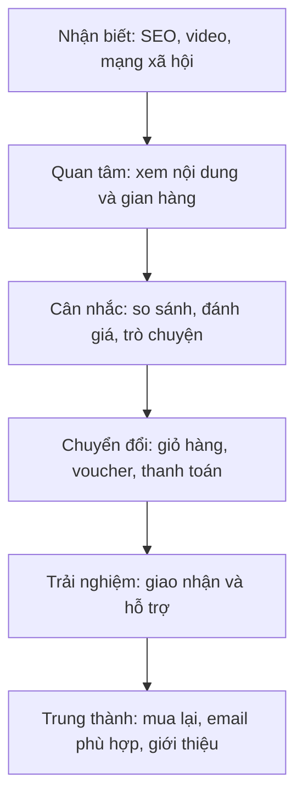

# TRƯỜNG ĐẠI HỌC GIAO THÔNG VẬN TẢI THÀNH PHỐ HỒ CHÍ MINH

## VIỆN ĐÀO TẠO CHẤT LƯỢNG CAO

 

# BÁO CÁO MÔN HỌC

# THƯƠNG MẠI ĐIỆN TỬ

## ĐỀ TÀI: XÂY DỰNG VÀ PHÁT TRIỂN SÀN THƯƠNG MẠI ĐIỆN TỬ VSHOP

**Giảng viên hướng dẫn:** Nguyễn Ngọc Thạch  
**Sinh viên thực hiện:** Cao Phi  
**Mã số sinh viên:** 049205000206  
**Lớp học phần:** 012012400602

 

**Thành phố Hồ Chí Minh, tháng 9 năm 2026**

---

## THÔNG TIN VÀ PHẠM VI BÁO CÁO

Báo cáo nghiên cứu VShop dưới góc độ một dự án thương mại điện tử đa người bán tại Việt Nam. Nội dung tập trung vào mô hình kinh doanh, khách hàng, quy trình giao dịch, thanh toán, tiếp thị, vận hành, an toàn, đạo đức và nghĩa vụ pháp lý. Kiến trúc phần mềm chỉ được trình bày ở mức cần thiết để chứng minh khả năng thực hiện các hoạt động thương mại.

Các nhận định về hệ thống được tổng hợp từ mã nguồn và tài liệu của VShop tại thời điểm lập báo cáo. Các số liệu ngân sách, tỷ lệ chuyển đổi và doanh thu trong phần kế hoạch là **giả định phục vụ học tập**, không phải kết quả kinh doanh đã được kiểm toán.

Phần pháp lý đã được đối chiếu theo tình trạng văn bản đến ngày **09/09/2026**. Đây là mốc cần lưu ý vì nhiều văn bản mới có hiệu lực trong năm 2026, thay thế các căn cứ thường xuất hiện trong giáo trình cũ.

---

## LỜI CẢM ƠN

Em xin chân thành cảm ơn giảng viên Nguyễn Ngọc Thạch đã cung cấp kiến thức nền tảng và định hướng thực hiện báo cáo môn Thương mại điện tử. Nội dung các bài giảng từ tổng quan, mô hình kinh doanh, cơ sở hạ tầng, an ninh, thanh toán, tiếp thị đến pháp lý và xây dựng website đã giúp em có cách nhìn đầy đủ hơn về một dự án thương mại điện tử.

Em cũng xin cảm ơn nhà trường và Viện Đào tạo Chất lượng cao đã tạo điều kiện để sinh viên tiếp cận bài toán thực tế. Qua việc phân tích VShop, em nhận thấy một website có nhiều chức năng chưa đủ để tạo nên hoạt động thương mại điện tử bền vững. Nền tảng còn phải giải quyết đồng thời niềm tin, chất lượng người bán, trải nghiệm thanh toán, giao nhận, bảo vệ người tiêu dùng, dữ liệu cá nhân, hiệu quả tiếp thị và trách nhiệm với xã hội.

Do giới hạn của một báo cáo môn học, một số đánh giá tài chính và thị trường được xây dựng theo kịch bản giả định. Em mong nhận được góp ý của giảng viên để tiếp tục hoàn thiện đề tài.

---

## DANH MỤC TỪ VIẾT TẮT

| Từ viết tắt | Nội dung |
|---|---|
| AI | Trí tuệ nhân tạo (Artificial Intelligence) |
| B2C | Giao dịch từ doanh nghiệp đến người tiêu dùng |
| B2B | Giao dịch giữa các doanh nghiệp |
| C2C | Giao dịch giữa các cá nhân |
| CAC | Chi phí thu hút một khách hàng mới |
| COD | Thanh toán khi nhận hàng (Cash on Delivery) |
| CRM | Quản trị quan hệ khách hàng |
| CTR | Tỷ lệ nhấp |
| GMV | Tổng giá trị hàng hóa giao dịch trên nền tảng |
| KPI | Chỉ số đánh giá hiệu quả |
| LTV | Giá trị vòng đời khách hàng |
| ROAS | Doanh thu trên chi phí quảng cáo |
| SEO | Tối ưu hóa công cụ tìm kiếm |
| SKU | Đơn vị lưu kho của một biến thể sản phẩm |
| SQS | Dịch vụ hàng đợi thông điệp của Amazon Web Services |
| TMĐT | Thương mại điện tử |
| UGC | Nội dung do người dùng tạo |
| UX/UI | Trải nghiệm người dùng/Giao diện người dùng |

---

## DANH MỤC HÌNH

1. Hình 1.1. Giao diện trang chủ VShop định hướng.
2. Hình 3.1. Hành trình giao dịch trên VShop.
3. Hình 3.2. Giao diện chi tiết sản phẩm và tóm tắt đánh giá bằng AI.
4. Hình 4.1. Giao diện thanh toán VShop định hướng.
5. Hình 4.2. Giao diện quản trị người bán định hướng.
6. Hình 5.1. Phễu tiếp thị VShop.
7. Hình 5.2. Luồng gửi email tiếp thị có sự đồng ý.

---

## DANH MỤC BẢNG

1. Bảng 1.1. Mục tiêu nghiên cứu của đề tài.
2. Bảng 2.1. Phân khúc khách hàng của VShop.
3. Bảng 2.2. Mô hình Business Model Canvas.
4. Bảng 2.3. Phân tích SWOT.
5. Bảng 3.1. Vai trò của các chủ thể trên nền tảng.
6. Bảng 3.2. Chỉ số vận hành thương mại.
7. Bảng 4.1. So sánh phương thức thanh toán.
8. Bảng 5.1. Kế hoạch kênh tiếp thị.
9. Bảng 5.2. KPI của phễu tiếp thị.
10. Bảng 6.1. Hệ thống văn bản pháp luật áp dụng.
11. Bảng 6.2. Văn bản cũ và văn bản thay thế.
12. Bảng 6.3. Ma trận tuân thủ của VShop.
13. Bảng 7.1. Ngân sách thử nghiệm.
14. Bảng 7.2. Lộ trình triển khai.

---

## MỤC LỤC

- [MỞ ĐẦU](#mở-đầu)
- [CHƯƠNG 1. TỔNG QUAN VỀ THƯƠNG MẠI ĐIỆN TỬ VÀ ĐỀ TÀI VSHOP](#chương-1-tổng-quan-về-thương-mại-điện-tử-và-đề-tài-vshop)
- [CHƯƠNG 2. MÔ HÌNH KINH DOANH VÀ PHÂN TÍCH THỊ TRƯỜNG](#chương-2-mô-hình-kinh-doanh-và-phân-tích-thị-trường)
- [CHƯƠNG 3. TỔ CHỨC HOẠT ĐỘNG THƯƠNG MẠI TRÊN VSHOP](#chương-3-tổ-chức-hoạt-động-thương-mại-trên-vshop)
- [CHƯƠNG 4. CƠ SỞ HẠ TẦNG, THANH TOÁN VÀ AN TOÀN](#chương-4-cơ-sở-hạ-tầng-thanh-toán-và-an-toàn)
- [CHƯƠNG 5. KẾ HOẠCH TIẾP THỊ ĐIỆN TỬ](#chương-5-kế-hoạch-tiếp-thị-điện-tử)
- [CHƯƠNG 6. PHÁP LÝ VÀ ĐẠO ĐỨC TRONG THƯƠNG MẠI ĐIỆN TỬ](#chương-6-pháp-lý-và-đạo-đức-trong-thương-mại-điện-tử)
- [CHƯƠNG 7. HIỆU QUẢ, RỦI RO VÀ LỘ TRÌNH PHÁT TRIỂN](#chương-7-hiệu-quả-rủi-ro-và-lộ-trình-phát-triển)
- [KẾT LUẬN](#kết-luận)
- [TÀI LIỆU THAM KHẢO](#tài-liệu-tham-khảo)

---

# MỞ ĐẦU

## 1. Lý do chọn đề tài

Thương mại điện tử đã chuyển hoạt động mua bán từ một điểm bán vật lý sang môi trường có thể phục vụ liên tục, đo lường được và mở rộng theo mạng lưới. Đối với người mua, giá trị nổi bật là khả năng tìm kiếm, so sánh, đặt hàng và thanh toán thuận tiện. Đối với người bán, nền tảng số giúp tiếp cận khách hàng ngoài khu vực địa lý truyền thống, thử nghiệm sản phẩm nhanh và theo dõi hiệu quả bằng dữ liệu.

Tuy nhiên, việc tạo một sàn thương mại điện tử không chỉ là xây dựng trang sản phẩm và nút đặt hàng. Một nền tảng đa người bán phải cân bằng lợi ích của ba nhóm: người mua cần hàng đúng mô tả và được bảo vệ; người bán cần công cụ bán hàng, dòng tiền và cơ hội tiếp cận; đơn vị vận hành cần doanh thu nhưng phải kiểm soát gian lận, khiếu nại, chất lượng và tuân thủ pháp luật.

VShop được chọn làm đề tài vì hệ thống thể hiện tương đối đầy đủ vòng đời của hoạt động thương mại điện tử: quản lý gian hàng và hàng hóa, giỏ hàng, đơn hàng, khuyến mại, thanh toán, đánh giá, trò chuyện, video gắn sản phẩm, ví/điểm thưởng, đối soát người bán, quản trị nền tảng và tiếp thị qua email. Đây là cơ sở phù hợp để kết nối kiến thức trong bài giảng với một tình huống thực tế.

## 2. Mục tiêu nghiên cứu

**Bảng 1.1. Mục tiêu nghiên cứu của đề tài**

| Mục tiêu | Nội dung cần làm rõ | Kết quả mong đợi |
|---|---|---|
| Nhận diện mô hình | Xác định loại hình giao dịch, chủ thể và giá trị cung cấp | Mô tả đúng VShop như một sàn đa người bán có trọng tâm B2C và yếu tố C2C |
| Phân tích kinh doanh | Khách hàng, thị trường, doanh thu, chi phí, SWOT | Đề xuất mô hình có khả năng kiểm chứng bằng số liệu |
| Thiết kế vận hành | Quy trình từ tìm kiếm đến hậu mãi | Hạn chế điểm đứt gãy và phân định trách nhiệm |
| Đánh giá thanh toán và an toàn | COD, VietQR, điểm thưởng, dữ liệu và gian lận | Lựa chọn phương án phù hợp từng giai đoạn |
| Lập kế hoạch tiếp thị | Định vị, phễu, kênh, email, KPI và ngân sách | Thu hút khách hàng có kiểm soát và duy trì quan hệ lâu dài |
| Rà soát pháp lý | TMĐT, quảng cáo, dữ liệu, người tiêu dùng, thanh toán, thuế, sở hữu trí tuệ | Lập danh sách nghĩa vụ và khoảng trống cần xử lý trước khi vận hành thật |

## 3. Đối tượng và phạm vi nghiên cứu

Đối tượng nghiên cứu là nền tảng VShop với ba không gian sử dụng: website dành cho khách hàng, cổng dành cho người bán và trang quản trị. Báo cáo xem xét quy trình kinh doanh nội địa Việt Nam, chủ yếu với hàng hóa tiêu dùng phổ thông. Các nhóm hàng có điều kiện như thuốc, thiết bị y tế, rượu, thuốc lá, tài chính hoặc sản phẩm dành cho trẻ em chỉ được nêu như nhóm cần kiểm soát riêng, không nằm trong phương án vận hành ban đầu.

Phạm vi kỹ thuật được giới hạn ở việc mô tả năng lực hỗ trợ kinh doanh. Báo cáo không đi sâu vào mã nguồn, thuật toán hay cấu hình hạ tầng. Phần tài chính dùng kịch bản thử nghiệm quy mô nhỏ vì dự án chưa cung cấp dữ liệu giao dịch thực tế đủ dài để dự báo chính xác.

## 4. Phương pháp thực hiện

Báo cáo sử dụng bốn nhóm phương pháp:

1. **Nghiên cứu tài liệu:** tổng hợp tám chương bài giảng về tổng quan, mô hình kinh doanh, hạ tầng, an ninh, thanh toán, tiếp thị, pháp lý và xây dựng website.
2. **Khảo sát hệ thống:** đọc cấu trúc ứng dụng, mô hình dữ liệu, luồng nghiệp vụ và tài liệu kiến trúc của VShop.
3. **Phân tích tình huống:** áp dụng hành trình khách hàng, Business Model Canvas, SWOT, phễu tiếp thị và ma trận rủi ro.
4. **Đối chiếu pháp lý:** kiểm tra số hiệu, ngày hiệu lực và văn bản thay thế trên Cổng thông tin văn bản của Chính phủ đến ngày 09/09/2026.

## 5. Kết cấu báo cáo

Ngoài phần mở đầu, kết luận và tài liệu tham khảo, báo cáo gồm bảy chương. Các chương đi từ nền tảng lý thuyết đến mô hình VShop, hoạt động giao dịch, thanh toán, tiếp thị, pháp lý và kế hoạch triển khai. Cách sắp xếp này phản ánh trình tự hình thành một hoạt động thương mại điện tử: xác định nhu cầu, thiết kế giá trị, tổ chức giao dịch, tạo khách hàng, kiểm soát nghĩa vụ và đo hiệu quả.

---

# CHƯƠNG 1. TỔNG QUAN VỀ THƯƠNG MẠI ĐIỆN TỬ VÀ ĐỀ TÀI VSHOP

## 1.1. Khái niệm thương mại điện tử

Thương mại điện tử có thể được hiểu là việc tiến hành một phần hoặc toàn bộ quy trình thương mại bằng phương tiện điện tử có kết nối mạng. Quy trình đó không dừng ở mua và bán, mà bao gồm quảng bá, tìm kiếm thông tin, đàm phán, giao kết, thanh toán, giao nhận, chăm sóc sau bán và giải quyết tranh chấp.

Điểm khác biệt cốt lõi của thương mại điện tử là thông tin và tương tác được số hóa. Giá sản phẩm, tình trạng hàng, hành vi xem, lịch sử đơn, phản hồi và hiệu quả chiến dịch đều có thể được ghi nhận. Nhờ vậy doanh nghiệp có thể cá nhân hóa trải nghiệm, tự động hóa công việc lặp lại và ra quyết định nhanh hơn. Ngược lại, dữ liệu sai hoặc bị sử dụng thiếu trách nhiệm có thể khuếch đại thiệt hại trên quy mô lớn.

## 1.2. Các loại hình giao dịch và vị trí của VShop

Bài giảng phân loại thương mại điện tử theo chủ thể như B2B, B2C, C2C, B2G và G2C. VShop chủ yếu vận hành theo mô hình **B2C marketplace**: doanh nghiệp, hộ kinh doanh hoặc nhà bán hàng mở gian hàng và bán cho người tiêu dùng thông qua hạ tầng của nền tảng. Khi cá nhân bán hàng cho cá nhân khác, nền tảng có thêm yếu tố C2C. Hoạt động giữa VShop và các đơn vị thanh toán, vận chuyển, điện toán đám mây hoặc nhà cung cấp email mang đặc điểm B2B.

VShop không chỉ là website giới thiệu sản phẩm. Hệ thống cho phép nhiều bên tham gia, hình thành đơn hàng, áp dụng voucher, thanh toán, đánh giá và quản lý dòng tiền. Vì vậy, VShop thuộc nhóm **nền tảng trung gian số có chức năng thương mại điện tử**, kéo theo trách nhiệm lớn hơn so với một website chỉ bán hàng của chính doanh nghiệp.

## 1.3. Lợi ích của mô hình

Đối với người mua, VShop tạo một điểm truy cập thống nhất để khám phá sản phẩm từ nhiều gian hàng. Bộ lọc, tìm kiếm, đánh giá, video và trò chuyện giúp giảm chi phí tìm thông tin. Voucher và các phương thức thanh toán khác nhau làm tăng khả năng hoàn tất đơn hàng. Lịch sử đơn và quy trình khiếu nại tạo căn cứ khi cần hậu mãi.

Đối với người bán, nền tảng cung cấp gian hàng, quản lý danh mục, đơn hàng, video, doanh thu, đối soát và vị trí quảng bá. Người bán nhỏ có thể bắt đầu mà không phải tự xây dựng toàn bộ website, hệ thống thanh toán và công cụ quản trị. Dữ liệu về lượt xem, tỷ lệ chuyển đổi và sản phẩm bán chạy hỗ trợ quyết định tồn kho và nội dung.

Đối với đơn vị vận hành, mô hình tạo cơ hội thu phí giao dịch, phí dịch vụ, vị trí hiển thị và các dịch vụ hỗ trợ người bán. Hiệu ứng mạng có thể xuất hiện khi nhiều người bán tạo danh mục phong phú, thu hút thêm người mua; nhiều người mua lại tạo động lực để người bán tham gia.

Đối với xã hội, nền tảng có thể giúp hộ kinh doanh tiếp cận thị trường số và thúc đẩy thanh toán không dùng tiền mặt. Tuy nhiên, lợi ích chỉ bền vững khi VShop hạn chế hàng giả, quảng cáo sai, lạm dụng dữ liệu, rác điện tử và bao bì dư thừa.

## 1.4. Hạn chế và thách thức

Người mua không thể kiểm tra trực tiếp sản phẩm trước khi đặt nên dễ gặp sai lệch giữa hình ảnh và hàng nhận được. Họ phải chia sẻ dữ liệu liên hệ, địa chỉ và hành vi mua sắm. Rủi ro lừa đảo, chiếm tài khoản, đánh giá giả và liên kết thanh toán giả có thể làm suy giảm niềm tin.

Người bán đối mặt với cạnh tranh giá, chi phí quảng bá, hoàn hàng COD, phụ thuộc vào thuật toán hiển thị và thời gian đối soát. Nếu quy tắc xếp hạng không rõ ràng, người bán nhỏ khó cạnh tranh với gian hàng có ngân sách lớn.

Đơn vị vận hành phải giải quyết bài toán hai phía: ít sản phẩm thì không có người mua, ít người mua thì không có người bán. Nền tảng còn phải xác minh người bán, kiểm duyệt hàng hóa, xử lý khiếu nại, bảo vệ dữ liệu, đối soát và duy trì hệ thống liên tục. Những chi phí này tăng theo quy mô và không thể xử lý chỉ bằng việc bổ sung chức năng giao diện.

## 1.5. Tổng quan VShop

VShop sử dụng thông điệp định vị: **“Nền tảng mua sắm trực quan, thuận tiện và đáng tin cậy.”** Ba thành phần của thông điệp tương ứng với ba nhu cầu:

- **Trực quan:** hình ảnh, video ngắn gắn với sản phẩm và tóm tắt đánh giá giúp khách hàng hiểu sản phẩm nhanh.
- **Thuận tiện:** tìm kiếm, giỏ hàng, voucher, COD, VietQR, theo dõi đơn và trò chuyện được tập trung trong cùng hành trình.
- **Đáng tin cậy:** xác minh người bán, đánh giá từ giao dịch, chính sách khiếu nại, trạng thái thanh toán và lịch sử xử lý tạo bằng chứng cho các bên.

*Hình 1.1 chỉ là hình minh họa định hướng trải nghiệm, không được sử dụng như bằng chứng về số liệu vận hành thực tế.*

Hệ thống hiện có ba nhóm giao diện. Khách hàng có thể tìm kiếm, xem sản phẩm, video, giỏ hàng, thanh toán, đơn hàng, đánh giá, voucher, thông báo, trò chuyện và tùy chọn nhận tiếp thị. Người bán có thể quản lý sản phẩm, đơn, video, cửa hàng, tài chính, đối soát và vị trí quảng bá. Quản trị viên có thể quản lý người dùng, gian hàng, danh mục, khuyến mại, báo cáo vi phạm, thanh toán, video, chiến dịch tiếp thị và các chỉ số tổng hợp.

## 1.6. Cơ hội phát triển

Chính sách phát triển thương mại điện tử quốc gia giai đoạn 2026–2030 đặt mục tiêu mở rộng mua sắm trực tuyến, hóa đơn điện tử, thanh toán không dùng tiền mặt và logistics xanh. Đây là điều kiện thuận lợi cho các nền tảng nội địa thử nghiệm mô hình mới. VShop có thể tạo khác biệt bằng video sản phẩm, nội dung từ người bán, tóm tắt đánh giá và dịch vụ hỗ trợ gian hàng nhỏ.

Cơ hội thực tế nhất trong giai đoạn đầu không phải cạnh tranh trực diện về quy mô với sàn lớn. VShop nên chọn một nhóm hàng và cộng đồng hẹp, nơi khả năng tư vấn, nội dung trực quan và quan hệ với người bán tạo lợi thế. Kết quả thử nghiệm sẽ cho biết phân khúc nào có tỷ lệ mua lại và chi phí phục vụ hợp lý trước khi mở rộng.

---

# CHƯƠNG 2. MÔ HÌNH KINH DOANH VÀ PHÂN TÍCH THỊ TRƯỜNG

## 2.1. Vấn đề thị trường

Người mua trực tuyến thường gặp ba khó khăn: quá nhiều lựa chọn nhưng thiếu thông tin đáng tin, chất lượng giữa các gian hàng không đồng đều, và quy trình sau bán không rõ ràng. Video hoặc quảng cáo có thể hấp dẫn nhưng không luôn gắn với thông tin giá, biến thể, tồn kho và chính sách cụ thể.

Người bán nhỏ lại thiếu nguồn lực sản xuất nội dung, thu hút khách hàng, vận hành thanh toán và xây dựng hệ thống riêng. Họ cần một cách đưa sản phẩm lên mạng nhanh nhưng vẫn quản lý được đơn, dòng tiền và phản hồi. VShop hướng đến việc nối hai nhu cầu này bằng trải nghiệm khám phá trực quan và bộ công cụ quản lý tập trung.

## 2.2. Phân khúc khách hàng

**Bảng 2.1. Phân khúc khách hàng của VShop**

| Nhóm | Đặc điểm | Nhu cầu chính | Rào cản | Giá trị VShop đề xuất |
|---|---|---|---|---|
| Sinh viên và người mới đi làm, 18–25 tuổi | Dùng điện thoại thường xuyên, nhạy cảm về giá, quen video ngắn | Giá hợp lý, voucher, mua nhanh, đánh giá thật | Ngân sách thấp, lo hàng không đúng mô tả | Nội dung trực quan, lọc giá, voucher, COD/VietQR |
| Nhân viên văn phòng, 25–35 tuổi | Thu nhập ổn định hơn, ít thời gian | Tiện lợi, giao đúng hẹn, hậu mãi | Ngại quy trình đổi trả phức tạp | Theo dõi đơn, thông tin chính sách rõ, hỗ trợ tập trung |
| Người bán nhỏ/hộ kinh doanh | Nhân sự ít, bán qua mạng xã hội | Có gian hàng, đơn hàng, thanh toán, tiếp thị | Thiếu kỹ thuật, nội dung và dữ liệu | Công cụ quản trị, video gắn sản phẩm, báo cáo, khuyến mại |
| Doanh nghiệp vừa và nhỏ | Danh mục ổn định, cần kiểm soát thương hiệu | Mở rộng kênh bán, đối soát, đo hiệu quả | Lo phí và mất quyền kiểm soát khách hàng | Gian hàng xác minh, báo cáo, vị trí quảng bá minh bạch |

Thị trường mục tiêu ban đầu nên là người mua 18–35 tuổi tại các đô thị, sử dụng điện thoại thường xuyên và sẵn sàng thử nền tảng mới khi có ưu đãi cùng cam kết bảo vệ. Phía cung nên ưu tiên cửa hàng có sản phẩm dễ vận chuyển, giá trị vừa phải, nguồn gốc chứng minh được và khả năng xử lý đơn ổn định.

## 2.3. Chân dung khách hàng điển hình

**Khách hàng A – sinh viên:** cần phụ kiện học tập hoặc đồ dùng cá nhân dưới 500.000 đồng. Người này khám phá sản phẩm qua video, đọc đánh giá, so sánh giá và dùng voucher. Yếu tố quyết định là tổng tiền sau phí vận chuyển, ngày nhận dự kiến và khả năng COD.

**Khách hàng B – nhân viên văn phòng:** cần mua nhanh sản phẩm gia dụng hoặc phụ kiện. Người này ưu tiên gian hàng uy tín, thông tin rõ, thanh toán bằng QR và quy trình đổi trả ít bước. Yếu tố quyết định là độ tin cậy và thời gian tiết kiệm được.

**Người bán C – hộ kinh doanh:** có 50–100 SKU, đang bán qua mạng xã hội. Người bán cần nhập sản phẩm, quản lý tồn, xác nhận đơn, đăng video, theo dõi tiền và nhận hỗ trợ khi khách khiếu nại. Yếu tố quyết định là lượng khách tiềm năng, phí thực trả và tốc độ nhận tiền.

## 2.4. Giá trị cốt lõi

Giá trị của VShop không nằm riêng ở số lượng chức năng. Nền tảng cần tạo bốn kết quả có thể cảm nhận:

1. Khách hàng hiểu sản phẩm nhanh hơn nhờ nội dung có cấu trúc, video và đánh giá gắn với giao dịch.
2. Khách hàng hoàn tất đơn thuận tiện nhờ giá cuối cùng rõ ràng, voucher hợp lệ và phương thức thanh toán phù hợp.
3. Người bán vận hành tập trung từ sản phẩm đến đối soát, giảm công việc thủ công rời rạc.
4. Các bên có cơ chế tạo niềm tin qua xác minh, bằng chứng trạng thái và giải quyết khiếu nại.

## 2.5. Business Model Canvas

**Bảng 2.2. Mô hình Business Model Canvas của VShop**

| Thành phần | Nội dung đề xuất |
|---|---|
| Phân khúc khách hàng | Người mua 18–35 tuổi; hộ kinh doanh; cửa hàng và doanh nghiệp vừa, nhỏ |
| Giá trị cung cấp | Mua sắm trực quan; giao dịch thuận tiện; gian hàng có xác minh; công cụ bán hàng và đối soát |
| Kênh tiếp cận | Website, video ngắn, mạng xã hội, SEO, email có đồng ý, cộng đồng người bán |
| Quan hệ khách hàng | Tự phục vụ có hướng dẫn; trò chuyện; thông báo đơn; chăm sóc sau bán; chương trình trung thành |
| Dòng doanh thu | Phí giao dịch; phí dịch vụ người bán; vị trí quảng bá; gói công cụ nâng cao; hợp tác tiếp thị hợp lệ |
| Nguồn lực chính | Nền tảng số; dữ liệu sản phẩm/giao dịch; đội vận hành; mạng lưới người bán; thương hiệu; quy trình tuân thủ |
| Hoạt động chính | Thu hút và xác minh người bán; quản lý nội dung; xử lý giao dịch; thanh toán/đối soát; hỗ trợ; tiếp thị; chống gian lận |
| Đối tác chính | Đơn vị thanh toán, ngân hàng, vận chuyển, hạ tầng đám mây, email, nhà cung cấp xác minh và tư vấn pháp lý |
| Cơ cấu chi phí | Phát triển/vận hành; hạ tầng; thanh toán; hỗ trợ; kiểm duyệt; khuyến mại; tiếp thị; pháp lý và bảo mật |

Mô hình doanh thu cần được triển khai theo từng giai đoạn. Trong giai đoạn thu hút nguồn cung, phí cố định cao có thể làm người bán rời bỏ. VShop nên ưu tiên phí theo giao dịch phát sinh, công bố rõ cách tính và thử nghiệm gói nâng cao tự nguyện. Vị trí quảng bá phải được gắn nhãn để người mua phân biệt với kết quả tự nhiên.

## 2.6. Phân tích cạnh tranh

VShop tham gia thị trường có các sàn lớn, website bán lẻ chuyên ngành, mạng xã hội và hình thức bán trực tiếp qua tin nhắn. Sàn lớn có ưu thế về lưu lượng, logistics và nhận diện. Mạng xã hội có ưu thế về nội dung và quan hệ cộng đồng nhưng quy trình giao dịch thường phân tán. Website riêng cho phép người bán kiểm soát thương hiệu nhưng tốn chi phí thu hút khách hàng.

VShop nên tránh dùng “giá rẻ nhất” làm lợi thế duy nhất vì cuộc đua trợ giá khó bền vững. Hướng khác biệt phù hợp là: lựa chọn người bán có kiểm soát, nội dung sản phẩm dễ hiểu, liên kết video với giao dịch, chính sách sau bán có bằng chứng và công cụ hỗ trợ người bán nhỏ. Lợi thế này phải được chứng minh bằng tỷ lệ khiếu nại thấp, nội dung đầy đủ, phản hồi nhanh và khách hàng mua lại.

## 2.7. Phân tích SWOT

**Bảng 2.3. Phân tích SWOT**

| Nhóm | Nội dung |
|---|---|
| Điểm mạnh | Hành trình mua tương đối đầy đủ; có website riêng cho ba vai trò; hỗ trợ video, trò chuyện, đánh giá, voucher, QR và đối soát; có khả năng tự động hóa tiếp thị |
| Điểm yếu | Thương hiệu mới; chưa có hiệu ứng mạng; nguồn lực kiểm duyệt và hỗ trợ hạn chế; dữ liệu kinh doanh thực tế chưa đủ; phạm vi chức năng rộng làm tăng chi phí vận hành |
| Cơ hội | Người dùng quen mua trực tuyến và video ngắn; hộ kinh doanh cần kênh bán số; thanh toán QR phổ biến; chính sách quốc gia thúc đẩy TMĐT và thanh toán không tiền mặt |
| Thách thức | Cạnh tranh từ sàn lớn; gian lận và hàng giả; chi phí thu hút khách; hoàn đơn COD; quy định pháp lý mới; phụ thuộc đối tác hạ tầng, thanh toán và email |

Từ SWOT có thể xây dựng bốn nhóm hành động. VShop dùng năng lực nội dung và quản trị để phục vụ ngách rõ ràng; bù điểm yếu thương hiệu bằng gian hàng xác minh và chính sách bảo vệ; tận dụng QR và video để giảm ma sát chuyển đổi; kiểm soát rủi ro bằng giới hạn ngành hàng, thử nghiệm địa bàn nhỏ và quy trình duyệt người bán.

## 2.8. Giả thuyết kinh doanh cần kiểm chứng

Trước khi mở rộng, VShop cần kiểm chứng các giả thuyết sau bằng dữ liệu:

- Video gắn sản phẩm làm tăng lượt xem chi tiết và tỷ lệ thêm vào giỏ.
- Thông tin người bán đã xác minh và đánh giá từ giao dịch làm tăng tỷ lệ thanh toán.
- VietQR giảm tỷ lệ hủy so với COD trong một số phân khúc.
- Email nhắc voucher tạo thêm đơn nhưng không làm tăng tỷ lệ hủy đăng ký quá mức.
- Người bán chấp nhận trả phí khi báo cáo và vị trí quảng bá tạo doanh thu tăng thêm đo được.
- Chi phí hỗ trợ, hoàn trả và gian lận trên mỗi đơn nằm trong biên lợi nhuận dịch vụ.

Mỗi giả thuyết cần chỉ số, nhóm so sánh và thời gian đánh giá. Nếu không đạt, nền tảng phải điều chỉnh giá trị cung cấp thay vì chỉ tăng chi phí quảng cáo.

---

# CHƯƠNG 3. TỔ CHỨC HOẠT ĐỘNG THƯƠNG MẠI TRÊN VSHOP

## 3.1. Các chủ thể và trách nhiệm

**Bảng 3.1. Vai trò của các chủ thể trên nền tảng**

| Chủ thể | Quyền lợi | Trách nhiệm chính |
|---|---|---|
| Người mua | Tiếp cận thông tin; lựa chọn; thanh toán; theo dõi; đánh giá; khiếu nại | Cung cấp thông tin giao nhận đúng; thanh toán/nhận hàng; phản hồi trung thực; không lạm dụng khuyến mại |
| Người bán | Mở gian hàng; đăng sản phẩm; nhận đơn; quảng bá; nhận đối soát | Xác minh danh tính; bảo đảm nguồn gốc/chất lượng; mô tả đúng; giao đúng; thực hiện bảo hành, đổi trả và nghĩa vụ thuế |
| VShop | Thu phí; quy định tiêu chuẩn; vận hành nền tảng | Công khai quy chế; xác minh người bán; quản lý nội dung; lưu bằng chứng; bảo vệ dữ liệu; tiếp nhận và phối hợp giải quyết khiếu nại |
| Đơn vị thanh toán | Thu và chuyển tiền theo thỏa thuận | Bảo mật; xác nhận giao dịch; đối soát; xử lý hoàn tiền theo quy trình |
| Đơn vị vận chuyển | Nhận, vận chuyển, phát và hoàn hàng | Cập nhật trạng thái; bảo quản; chứng minh giao nhận; xử lý sự cố |
| Cơ quan nhà nước | Quản lý, thanh tra, giải quyết theo thẩm quyền | Ban hành/hướng dẫn pháp luật; tiếp nhận báo cáo; bảo vệ trật tự thị trường và quyền lợi hợp pháp |

VShop phải mô tả rõ vai trò trên quy chế hoạt động. Việc ghi “người bán chịu mọi trách nhiệm” không loại bỏ nghĩa vụ của nền tảng khi pháp luật yêu cầu xác minh, tiếp nhận phản ánh, gỡ bỏ vi phạm, cung cấp thông tin hoặc bảo vệ người tiêu dùng.

## 3.2. Hành trình khách hàng

```mermaid
flowchart LR
    A[Nhận biết nhu cầu] --> B[Khám phá qua tìm kiếm, danh mục, video]
    B --> C[So sánh sản phẩm, giá, đánh giá, gian hàng]
    C --> D[Thêm giỏ và áp dụng voucher]
    D --> E[Chọn địa chỉ, vận chuyển, thanh toán]
    E --> F[Xác nhận và xử lý đơn]
    F --> G[Giao nhận]
    G --> H[Đánh giá, đổi trả hoặc hỗ trợ]
    H --> I[Mua lại và giới thiệu]
```

**Hình 3.1. Hành trình giao dịch trên VShop**

Mỗi bước có một “điểm tin cậy” cần bảo đảm. Ở bước khám phá, ảnh và giá phải đúng. Ở bước so sánh, đánh giá không bị làm giả. Tại thanh toán, tổng tiền và điều kiện voucher phải rõ. Khi xử lý đơn, trạng thái phải cập nhật. Sau giao hàng, khách cần biết thời hạn và cách yêu cầu hỗ trợ.

## 3.3. Quản lý gian hàng và người bán

Quy trình tham gia nên gồm đăng ký tài khoản, cung cấp thông tin định danh/đăng ký kinh doanh phù hợp, xác minh tài khoản nhận tiền, chấp nhận quy chế, khai báo ngành hàng và duyệt gian hàng. Trạng thái xác minh cần hiển thị theo ý nghĩa cụ thể, tránh khiến người mua hiểu rằng VShop đã chứng nhận chất lượng mọi sản phẩm.

Người bán mới nên có giới hạn số lượng sản phẩm hoặc doanh thu trong giai đoạn thử nghiệm. Nền tảng theo dõi tỷ lệ xác nhận đơn, giao trễ, hủy, hoàn, khiếu nại và vi phạm nội dung. Cơ chế cảnh báo phải có tiêu chí, bằng chứng và kênh khiếu nại. Việc đình chỉ gian hàng cần tương xứng với mức độ rủi ro và nghĩa vụ pháp luật.

## 3.4. Quản lý danh mục và nội dung sản phẩm

Một sản phẩm cần tối thiểu tên, danh mục, thương hiệu hoặc chủ thể chịu trách nhiệm, hình ảnh thật, mô tả, giá, SKU/biến thể, tồn kho, xuất xứ khi pháp luật yêu cầu, điều kiện bảo hành và đổi trả. Với ngành hàng đặc thù phải bổ sung giấy phép, công bố hoặc cảnh báo theo pháp luật chuyên ngành.

VShop nên kiểm tra tự động các trường bắt buộc, từ khóa cấm, giá bất thường và hình ảnh trùng lặp; trường hợp rủi ro cao chuyển cho người kiểm duyệt. Người mua và chủ thể quyền cần có nút báo cáo. Mọi thay đổi quan trọng về giá và mô tả sau khi đặt hàng phải được lưu để đối chiếu khi tranh chấp.

*Hình 3.2 là minh họa định hướng. Tóm tắt bằng AI phải ghi rõ nguồn là đánh giá của người dùng, thời điểm tổng hợp và cơ chế báo lỗi; không được tạo cảm giác rằng AI đã kiểm nghiệm sản phẩm.*

## 3.5. Giá, voucher và khuyến mại

Giá hiển thị cần giúp khách hiểu số tiền thực trả. Nếu có giá gạch ngang, nền tảng phải có cơ sở xác định giá trước khuyến mại, thời gian áp dụng và số lượng. Voucher cần mô tả đối tượng, giá trị tối thiểu, mức giảm tối đa, sản phẩm/gian hàng áp dụng, thời hạn và khả năng kết hợp.

Hệ thống VShop có mô hình khuyến mại và lượt sử dụng, phù hợp để kiểm tra điều kiện tự động. Tuy nhiên, khuyến mại là một cam kết thương mại nên quy tắc không được thay đổi hồi tố với voucher đã cấp, trừ trường hợp gian lận được quy định trước. Nếu hết ngân sách hoặc hết lượt, thông tin phải cập nhật kịp thời.

## 3.6. Đặt hàng và hợp đồng điện tử

Quy trình đặt hàng cần cho phép người mua xem lại sản phẩm, số lượng, bên bán, địa chỉ, phí vận chuyển, giảm giá, thuế/phí nếu có, phương thức thanh toán và tổng tiền trước khi xác nhận. Sau thao tác xác nhận, hệ thống gửi thông báo có mã đơn và nội dung giao dịch. Người mua phải có khả năng truy cập lịch sử đơn trong thời gian phù hợp.

Không phải mọi thao tác thêm giỏ đều tạo hợp đồng. Quy chế cần xác định thời điểm đề nghị giao kết, thời điểm chấp nhận, trường hợp hết hàng hoặc lỗi giá, cách sửa sai thông tin và quy trình hủy. Dữ liệu đơn, thời gian, phiên bản điều khoản và thông báo là bằng chứng quan trọng khi có tranh chấp.

## 3.7. Thực hiện đơn hàng và giao nhận

Luồng cơ bản gồm: đơn mới, xác nhận, chuẩn bị, bàn giao vận chuyển, đang giao, đã giao, hoàn tất; nhánh ngoại lệ gồm hủy, giao thất bại, hoàn hàng, hoàn tiền và tranh chấp. Mỗi lần chuyển trạng thái cần xác định chủ thể thực hiện, thời điểm và bằng chứng.

Trong giai đoạn đầu, VShop có thể kết nối đơn vị vận chuyển thay vì tự xây mạng lưới. Thỏa thuận dịch vụ cần quy định thời gian lấy hàng, giới hạn kích thước, hàng cấm, bồi thường, COD, đối soát và dữ liệu được chia sẻ. Phí và thời gian giao dự kiến phải hiển thị trước khi khách đặt.

Bao bì nên vừa đủ, có khả năng tái chế và hướng dẫn người bán tránh đóng gói nhiều lớp không cần thiết. Chỉ số giao lần đầu thành công giúp giảm cả chi phí và tác động môi trường.

## 3.8. Đổi trả, hoàn tiền và khiếu nại

Một quy trình hợp lý gồm: khách chọn đơn/sản phẩm, lý do và bằng chứng; hệ thống xác nhận tiếp nhận; người bán phản hồi trong thời hạn; VShop hoặc các bên thống nhất phương án; hàng được hoàn nếu cần; tiền được hoàn qua phương thức phù hợp; vụ việc được đóng với lịch sử đầy đủ.

Chính sách phải phân biệt lỗi người bán, lỗi vận chuyển, thay đổi nhu cầu của người mua và dấu hiệu lạm dụng. Thời hạn, chi phí hoàn hàng, tình trạng sản phẩm và trường hợp không được đổi trả phải công khai trước giao dịch. Với hàng lỗi, hàng giả hoặc không đúng mô tả, VShop cần ưu tiên bảo vệ người mua và thực hiện nghĩa vụ của nền tảng theo pháp luật, thay vì chỉ chuyển khách sang làm việc riêng với gian hàng.

## 3.9. Đánh giá, trò chuyện và nội dung cộng đồng

Đánh giá nên gắn nhãn “đã mua hàng” khi xuất phát từ đơn hoàn tất. Nền tảng cần phát hiện nội dung lặp, đánh giá đổi quà không công bố, công kích cá nhân và thao túng điểm. Không nên xóa đánh giá tiêu cực chỉ vì người bán không hài lòng; chỉ xử lý theo quy tắc công khai về nội dung bất hợp pháp, sai đối tượng hoặc không liên quan.

Trò chuyện giúp tư vấn trước bán và lưu bằng chứng, nhưng không nên khuyến khích thanh toán ngoài nền tảng. Cần cảnh báo khách không chia sẻ mật khẩu, mã OTP hoặc chuyển tiền đến tài khoản không được xác nhận. Dữ liệu trò chuyện chỉ được lưu và truy cập theo mục đích, thời hạn, phân quyền đã công bố.

## 3.10. Chỉ số vận hành thương mại

**Bảng 3.2. Chỉ số vận hành thương mại**

| Nhóm | Chỉ số | Ý nghĩa |
|---|---|---|
| Nguồn cung | Người bán được duyệt; SKU hoạt động; tỷ lệ sản phẩm đủ thông tin | Chất lượng và độ rộng danh mục |
| Chuyển đổi | Xem sản phẩm → thêm giỏ; giỏ → đặt hàng; đặt → thanh toán | Xác định điểm rơi trong hành trình |
| Đơn hàng | Tỷ lệ xác nhận; hủy; giao trễ; giao lần đầu thành công | Khả năng thực hiện cam kết |
| Chất lượng | Hoàn trả; khiếu nại; hàng không đúng mô tả; thời gian giải quyết | Niềm tin và chi phí sau bán |
| Tài chính | GMV; doanh thu thuần; phí trên đơn; chi phí thanh toán/hỗ trợ | Hiệu quả của mô hình |
| Khách hàng | CAC; tỷ lệ mua lại; LTV; mức hài lòng | Khả năng tăng trưởng bền vững |
| Người bán | Thời gian đối soát; doanh thu/người bán; tỷ lệ rời bỏ | Sức khỏe phía cung |

KPI không nên chỉ là GMV. Một chiến dịch giảm giá có thể làm GMV tăng nhưng kéo theo hoàn đơn, chi phí hỗ trợ và khách săn ưu đãi không quay lại. VShop cần xem đồng thời doanh thu, chất lượng đơn, mức hài lòng và lợi nhuận đóng góp.

---

# CHƯƠNG 4. CƠ SỞ HẠ TẦNG, THANH TOÁN VÀ AN TOÀN

## 4.1. Cơ sở hạ tầng của hoạt động thương mại điện tử

Theo nội dung bài giảng, hạ tầng thương mại điện tử bao gồm nhiều lớp: pháp luật, thanh toán, kho vận, nguồn nhân lực, kinh tế – xã hội và công nghệ. Một website hoạt động nhanh nhưng không có giao nhận, đối soát và hỗ trợ khách hàng ổn định vẫn không tạo được giao dịch bền vững.

Với VShop, hạ tầng cần được nhìn theo năm nhóm:

1. **Hạ tầng thị trường:** mạng lưới người bán, danh mục hàng, chính sách giá, nhu cầu người mua và thương hiệu.
2. **Hạ tầng vận hành:** duyệt gian hàng, kiểm soát nội dung, xử lý đơn, hỗ trợ, khiếu nại và đối soát.
3. **Hạ tầng đối tác:** ngân hàng/đơn vị thanh toán, vận chuyển, email, điện toán đám mây và xác minh.
4. **Hạ tầng pháp lý:** đăng ký nền tảng, quy chế hoạt động, hợp đồng, bảo vệ người tiêu dùng, dữ liệu và nghĩa vụ báo cáo.
5. **Hạ tầng kỹ thuật:** website khách hàng, người bán, quản trị; dịch vụ nghiệp vụ; cơ sở dữ liệu; thông điệp bất đồng bộ; lưu trữ và giám sát.

Hệ thống VShop hiện được tổ chức thành ba website và các dịch vụ chuyên trách cho tài khoản, sản phẩm, gian hàng, đơn hàng, thanh toán, khuyến mại, ví/đối soát, tiện ích và AI. Cách phân tách này hỗ trợ mở rộng từng nghiệp vụ. Về thương mại, yêu cầu quan trọng hơn tên công nghệ là dữ liệu phải nhất quán: một khoản tiền không được ghi nhận hai lần, tồn kho không được bán vượt, trạng thái đơn phải truy vết được và thông báo không được gửi sai đối tượng.

## 4.2. Lựa chọn tên miền và kênh truy cập

VShop sử dụng định hướng tên miền `vshop.hacmieu.com`, cùng các miền phụ cho người bán và quản trị. Tên miền ngắn, gắn với thương hiệu và dùng kết nối mã hóa là nền tảng cho nhận diện. Trước vận hành thương mại chính thức, doanh nghiệp cần sử dụng thông tin pháp nhân, địa chỉ liên hệ và tên miền thuộc quyền quản lý ổn định; đồng thời hoàn thành thủ tục thông báo/đăng ký theo loại hình nền tảng.

Thiết kế cần ưu tiên màn hình di động vì nhóm khách hàng mục tiêu thường khám phá qua điện thoại. Các chức năng quan trọng như tổng tiền, phí giao hàng, nút mua, điều kiện voucher, trạng thái đơn và yêu cầu hỗ trợ phải dễ nhìn, không dùng cách bố trí khiến khách vô tình chấp thuận.

## 4.3. Các phương thức thanh toán

VShop đang định hướng COD và VietQR/chuyển khoản có xác nhận, bên cạnh điểm thưởng hoặc số dư nội bộ. Thẻ thanh toán có thể được tích hợp ở giai đoạn sau qua đơn vị được cấp phép.

**Bảng 4.1. So sánh phương thức thanh toán**

| Phương thức | Lợi ích với khách hàng | Lợi ích với VShop/người bán | Rủi ro và biện pháp |
|---|---|---|---|
| COD | Dễ hiểu, phù hợp người chưa tin nền tảng | Tăng khả năng nhận đơn ban đầu | Tỷ lệ từ chối/hoàn cao; cần xác nhận đơn, đánh giá rủi ro và giới hạn COD khi lạm dụng |
| VietQR/chuyển khoản | Nhanh, không nhập dữ liệu thẻ, dễ dùng trên ứng dụng ngân hàng | Giảm thu tiền mặt; xác nhận tự động nếu tích hợp đúng | Chuyển sai nội dung/số tiền, giả ảnh biên lai; chỉ ghi nhận theo dữ liệu đối soát từ đối tác, không theo ảnh khách gửi |
| Thẻ qua cổng thanh toán | Trải nghiệm quen thuộc, hỗ trợ thanh toán tức thời | Tăng lựa chọn và khả năng tự động hoàn | Phí, chargeback, gian lận; không tự lưu dữ liệu thẻ, dùng cổng đạt chuẩn và xác thực phù hợp |
| Điểm thưởng/V-Xu | Giữ chân khách, giảm giá dễ hiểu | Tạo chương trình trung thành | Nếu cho nạp, giữ, chuyển hoặc đổi ra tiền có thể trở thành dịch vụ trung gian thanh toán; nên giới hạn như điểm khuyến mại không quy đổi hoặc hợp tác đơn vị có giấy phép |

*Hình 4.1 là minh họa định hướng cho bước áp dụng voucher và thanh toán bằng VietQR.*

## 4.4. Nguyên tắc thiết kế thanh toán

Trang thanh toán phải hiển thị tổng tiền cuối cùng trước khi khách xác nhận. Mọi phí phát sinh, giảm giá, đơn vị nhận tiền và thời hạn thanh toán cần minh bạch. Hệ thống phải ngăn gửi nhiều yêu cầu do nhấn lặp, có mã tham chiếu duy nhất và xử lý thông báo từ đối tác theo cơ chế chống ghi nhận trùng.

Không nên coi ảnh chụp giao dịch là căn cứ thanh toán. Trạng thái “đã thanh toán” chỉ xuất hiện khi nhận và kiểm tra dữ liệu đáng tin cậy từ đối tác hoặc đối soát ngân hàng. Hoàn tiền cần liên kết với giao dịch gốc, lý do, người duyệt và kết quả trả tiền.

Với tiền của người bán, VShop phải có sổ giao dịch rõ ràng: doanh thu đơn, phí, hoàn tiền, điều chỉnh, số tiền chờ đối soát và số tiền có thể rút. Người bán cần tải được báo cáo. Bất kỳ thay đổi thủ công nào cũng phải có người thực hiện, lý do và lịch sử kiểm tra.

## 4.5. Đối soát và kiểm soát dòng tiền

Một đơn hàng có thể trải qua thời điểm khách trả tiền, người bán giao hàng, khách xác nhận, thời hạn khiếu nại kết thúc và VShop chuyển tiền cho người bán. Quy chế phải nêu rõ tiền được giữ trong bao lâu, điều kiện giải ngân và trường hợp tạm giữ. Điều này vừa ảnh hưởng dòng tiền của người bán vừa liên quan đến bản chất pháp lý của dịch vụ thanh toán.

Quy trình đối soát hằng ngày nên so sánh ba nguồn: giao dịch từ đối tác thanh toán, trạng thái thanh toán trong VShop và bút toán đối soát người bán. Sai lệch được đưa vào danh sách xử lý, không tự động xóa. Định kỳ cần đối chiếu số dư tổng với chi tiết từng tài khoản.

*Hình 4.2 minh họa cách người bán theo dõi doanh thu và trạng thái đơn; số liệu trong hình không phải kết quả kinh doanh thực tế.*

## 4.6. Mục tiêu an toàn trong thương mại điện tử

Bài giảng nêu sáu mục tiêu quan trọng: tính toàn vẹn, chống chối bỏ, xác thực, bí mật, riêng tư và sẵn sàng. Với VShop, các mục tiêu được chuyển thành yêu cầu kinh doanh:

- **Toàn vẹn:** giá, đơn, thanh toán, voucher và số dư không bị sửa trái phép.
- **Chống chối bỏ:** lưu được bằng chứng người thực hiện, thời gian và nội dung giao dịch.
- **Xác thực:** chỉ đúng khách hàng, người bán hoặc quản trị viên được dùng chức năng tương ứng.
- **Bí mật:** địa chỉ, số điện thoại, trao đổi và dữ liệu thanh toán không bị lộ.
- **Riêng tư:** dữ liệu chỉ được dùng cho mục đích đã thông báo và có căn cứ hợp pháp.
- **Sẵn sàng:** khách vẫn có thể xem đơn và các bên xử lý giao dịch trong thời gian cam kết.

## 4.7. Các nguy cơ chính

**Chiếm đoạt tài khoản:** kẻ xấu dùng mật khẩu rò rỉ hoặc lừa lấy mã xác thực để đổi địa chỉ, chiếm voucher hay yêu cầu rút tiền. Biện pháp gồm xác thực nhiều lớp cho tác vụ nhạy cảm, giới hạn thử, cảnh báo đăng nhập lạ và xác minh lại khi đổi thông tin nhận tiền.

**Gian lận thanh toán:** ảnh chuyển khoản giả, thông báo giả, hoàn tiền lặp hoặc sử dụng tài khoản bị chiếm. Biện pháp gồm xác minh chữ ký/thông tin từ đối tác, mã giao dịch duy nhất, hạn mức và quy trình kiểm tra ngoại lệ.

**Gian lận người bán:** hàng giả, sản phẩm cấm, giá mồi, thay đổi mô tả, đơn ảo và đánh giá giả. Biện pháp gồm xác minh, lưu phiên bản sản phẩm, kiểm duyệt dựa trên rủi ro, phát hiện quan hệ bất thường và cơ chế báo cáo.

**Lừa đảo người mua:** liên kết đăng nhập/QR giả, yêu cầu thanh toán ngoài hệ thống, giả danh nhân viên hỗ trợ. Biện pháp gồm tên miền chính thức rõ, nội dung cảnh báo theo ngữ cảnh, không yêu cầu OTP và kênh xác minh thông báo.

**Tấn công kỹ thuật và gián đoạn:** mã độc, từ chối dịch vụ, lỗ hổng ứng dụng, rò rỉ khóa truy cập và mất dữ liệu. Biện pháp gồm cập nhật, phân quyền tối thiểu, mã hóa, sao lưu, giám sát, kiểm thử, giới hạn lưu lượng và kế hoạch ứng phó.

## 4.8. Quản trị an toàn và sự cố

An toàn cần có chủ sở hữu và quy trình, không chỉ là công cụ. VShop nên ban hành chính sách phân quyền; kiểm kê dữ liệu và nhà cung cấp; đánh giá rủi ro trước thay đổi lớn; quản lý khóa bí mật; sao lưu có kiểm tra khôi phục; ghi nhật ký quản trị; đào tạo nhân sự; và có kênh báo cáo lỗ hổng.

Khi có sự cố, nhóm xử lý cần xác định phạm vi, ngăn lan rộng, bảo toàn bằng chứng, phục hồi, thông báo cho chủ thể/cơ quan khi pháp luật yêu cầu và rút kinh nghiệm. Kịch bản nên bao gồm rò rỉ dữ liệu, chiếm gian hàng, sai lệch thanh toán, gửi email hàng loạt nhầm đối tượng và gián đoạn đặt hàng.

---

# CHƯƠNG 5. KẾ HOẠCH TIẾP THỊ ĐIỆN TỬ

## 5.1. Mục tiêu và nguyên tắc

Tiếp thị điện tử của VShop có ba nhiệm vụ: thu hút đúng nhóm khách hàng, chuyển sự quan tâm thành giao dịch có chất lượng và duy trì quan hệ sau mua. Hoạt động tiếp thị phải đo được hiệu quả trên toàn hành trình, không dừng ở lượt xem hoặc số email gửi.

Các nguyên tắc đề xuất gồm: thông điệp đúng sự thật; khách chủ động đồng ý với kênh quảng cáo; ưu đãi có điều kiện rõ; phân nhóm vừa đủ; giới hạn tần suất; cho phép từ chối dễ dàng; và không dùng thủ thuật gây áp lực giả như bộ đếm ngược không có thật.

## 5.2. STP: phân khúc, lựa chọn và định vị

VShop có thể phân khúc theo vai trò (người mua/người bán), nhu cầu, nhóm hàng, mức độ tương tác và giai đoạn vòng đời. Trong thử nghiệm, nhóm trọng tâm là người mua 18–35 tuổi tại đô thị và người bán nhỏ có hàng hóa rõ nguồn gốc, dễ vận chuyển.

Thông điệp định vị “Nền tảng mua sắm trực quan, thuận tiện và đáng tin cậy” cần được chứng minh bằng trải nghiệm:

- Video dẫn thẳng đến đúng sản phẩm và biến thể.
- Tổng giá và ngày giao dự kiến xuất hiện trước khi đặt.
- Đánh giá có dấu hiệu giao dịch thật.
- Gian hàng hiển thị trạng thái xác minh với ý nghĩa rõ.
- Khiếu nại có mã, thời hạn phản hồi và lịch sử.

## 5.3. Phối thức tiếp thị

**Sản phẩm:** VShop cung cấp trải nghiệm mua sắm và dịch vụ nền tảng. Chất lượng “sản phẩm” được đo bằng độ đầy đủ danh mục, khả năng tìm đúng hàng, tỷ lệ giao thành công và chất lượng sau bán.

**Giá:** người mua nhìn thấy giá hàng, phí vận chuyển và mức giảm. Người bán nhìn thấy phí dịch vụ, phí thanh toán, chi phí quảng bá và số tiền thực nhận. Giá phải đơn giản, dự đoán được và không có khoản bắt buộc chỉ xuất hiện ở bước cuối.

**Phân phối:** kênh chính là website tối ưu cho di động; mạng xã hội và công cụ tìm kiếm dẫn khách đến trang sản phẩm. Phân phối vật lý được thực hiện qua người bán và đối tác vận chuyển.

**Xúc tiến:** nội dung video, SEO, mạng xã hội, khuyến mại, email có đồng ý, giới thiệu bạn bè và quảng bá trong nền tảng. Mỗi kênh có mục tiêu và mã đo riêng.

**Con người, quy trình, bằng chứng hữu hình:** nhân viên hỗ trợ, người bán, quy trình khiếu nại, nhãn xác minh, trạng thái đơn và biên nhận là phần quan trọng của trải nghiệm dịch vụ.

## 5.4. Phễu tiếp thị

**Hình 5.1. Phễu tiếp thị VShop**

Ở tầng nhận biết, VShop cần nội dung giải quyết nhu cầu cụ thể thay vì chỉ phát thông điệp giảm giá. Ở tầng cân nhắc, thông tin sản phẩm, đánh giá và uy tín người bán quyết định niềm tin. Ở tầng chuyển đổi, các điểm ma sát gồm phí bất ngờ, voucher khó hiểu, thiếu phương thức trả và lỗi trạng thái. Sau mua, giao hàng và giải quyết sự cố quyết định việc khách có quay lại hay không.

## 5.5. Kế hoạch kênh tiếp thị

**Bảng 5.1. Kế hoạch kênh tiếp thị**

| Kênh | Vai trò | Nội dung | Chỉ số chính |
|---|---|---|---|
| SEO và nội dung | Tạo nhu cầu bền vững | Hướng dẫn chọn hàng, so sánh, câu hỏi thường gặp, trang danh mục | Lượt truy cập tự nhiên, thứ hạng, chuyển đổi hỗ trợ |
| Video ngắn | Khám phá trực quan | Trình diễn thật, cách dùng, trước/sau có căn cứ, gắn sản phẩm | Tỷ lệ xem, nhấp sản phẩm, thêm giỏ |
| Mạng xã hội | Phân phối và cộng đồng | Nội dung người bán, phản hồi khách, chương trình theo chủ đề | Tương tác chất lượng, lượt vào trang, đơn |
| Khuyến mại | Giảm rào cản thử nghiệm | Voucher khách mới, freeship có điều kiện, ưu đãi theo gian hàng | Tỷ lệ dùng, doanh thu tăng thêm, biên đóng góp |
| Email | Duy trì quan hệ có đồng ý | Giới thiệu ưu đãi và nhắc voucher sắp hết hạn | Gửi thành công, nhấp, chuyển đổi, hủy đăng ký, khiếu nại |
| Giới thiệu | Tạo tăng trưởng từ khách hài lòng | Mã giới thiệu, thưởng sau đơn hợp lệ | Khách mới hợp lệ, chi phí/khách, gian lận |
| Quảng bá trong sàn | Hỗ trợ người bán | Sản phẩm/gian hàng tài trợ có gắn nhãn | Doanh thu tăng thêm, ROAS, mức tập trung hiển thị |

## 5.6. Chiến lược nội dung

Nội dung nên theo tỷ lệ tham khảo: 50% giải quyết vấn đề và hướng dẫn, 25% minh chứng sản phẩm/người bán, 15% cộng đồng và phản hồi, 10% ưu đãi trực tiếp. Tỷ lệ được điều chỉnh theo dữ liệu, không phải quy tắc cố định.

Mỗi nội dung cần một mục tiêu. Video hướng dẫn nên dẫn đến sản phẩm liên quan; bài so sánh cần nêu tiêu chí và lợi ích thương mại nếu có; nội dung của người có ảnh hưởng phải công khai quan hệ quảng cáo. Hình ảnh do người bán tải lên phải có quyền sử dụng và không chỉnh sửa gây hiểu sai đặc tính hàng hóa.

VShop có thể khuyến khích nội dung sau mua nhưng không được đổi quà để buộc đánh giá tích cực. Nếu thưởng cho việc gửi đánh giá, phần thưởng không phụ thuộc số sao và cần công khai việc đánh giá có khuyến khích.

## 5.7. Hai loại email tiếp thị của VShop

### 5.7.1. Email giới thiệu ưu đãi

Email này dùng để thông báo một chương trình khuyến mại đang hoạt động. Nội dung tối thiểu gồm tên chương trình, lợi ích thật, đối tượng/đơn hàng áp dụng, thời gian bắt đầu – kết thúc, giới hạn, nút xem chi tiết và liên kết hủy đăng ký.

Không nên gửi cùng một nội dung cho toàn bộ dữ liệu khách hàng. Phân nhóm có thể dựa trên lựa chọn chủ đề, lịch sử danh mục ở mức được phép và tình trạng đồng ý tiếp thị. VShop không nên suy luận các đặc điểm nhạy cảm từ hành vi mua hàng để quảng cáo.

### 5.7.2. Email nhắc voucher sắp hết hạn

Email này chỉ gửi khi người dùng đang sở hữu quyền sử dụng voucher còn hiệu lực, đã đồng ý nhận nhắc nhở và thời hạn gần kết thúc. Nội dung phải nêu ngày/giờ hết hạn, điều kiện dùng, giá trị tối đa và đường dẫn đến trang voucher hoặc sản phẩm hợp lệ. Hệ thống kiểm tra lại trạng thái ngay trước khi gửi để tránh nhắc voucher đã dùng, bị thu hồi hoặc đã hết hạn.

### 5.7.3. Luồng nghiệp vụ

```mermaid
flowchart LR
    A[Khách chủ động bật chủ đề email] --> B[Lưu bằng chứng đồng ý]
    B --> C[Chiến dịch hợp lệ hoặc voucher sắp hết hạn]
    C --> D[Kiểm tra lại đồng ý, điều kiện và tần suất]
    D --> E[Đưa yêu cầu vào hàng đợi]
    E --> F[Nhà cung cấp email gửi thư]
    F --> G[Ghi nhận gửi, trả, mở, nhấp hoặc lỗi]
    G --> H[Khách mua hoặc hủy đăng ký]
    H --> I[Cập nhật hồ sơ và danh sách không gửi]
```

**Hình 5.2. Luồng gửi email tiếp thị có sự đồng ý**

Hệ thống hiện có hướng triển khai phù hợp: hai chủ đề đồng ý riêng, mặc định không đăng ký; quản trị viên tạo/lên lịch/gửi chiến dịch; tác vụ định kỳ tìm voucher sắp hết hạn; hàng đợi tách việc phát hiện và gửi; nhà cung cấp Resend chuyển thư; webhook cập nhật trạng thái; liên kết hủy đăng ký dùng mã xác thực. Điểm cần hoàn thiện về quản trị là lưu thời điểm, nguồn, phiên bản nội dung đồng ý, lịch sử rút lại và bảo đảm yêu cầu hủy được áp dụng ngay cho mọi chiến dịch chưa gửi.

## 5.8. Thiết kế email

Tiêu đề cần cụ thể và không gây hiểu lầm, ví dụ “Voucher 50.000 đồng của bạn hết hạn ngày 12/09” khi dữ liệu đúng. Tên người gửi phải nhận diện VShop; địa chỉ gửi dùng tên miền đã xác minh; nội dung có bản văn bản đơn giản; liên kết dùng miền chính thức; và chân thư nêu lý do người nhận nhận được email cùng cách hủy.

Khóa bí mật hủy đăng ký chỉ dùng để tạo và kiểm tra mã liên kết, không chứa dữ liệu nhạy cảm trong URL. API key của nhà cung cấp email và khóa này phải được quản lý như thông tin bí mật, thay đổi được và không đưa vào mã nguồn. Tên miền gửi cần cấu hình SPF, DKIM và DMARC phù hợp để bảo vệ uy tín và giảm giả mạo.

## 5.9. Tần suất và quản trị sự đồng ý

VShop cần đặt giới hạn nội bộ thấp hơn hoặc bằng giới hạn pháp luật. Kịch bản thử nghiệm có thể tối đa 1–2 email tiếp thị mỗi tuần/người, không quá một email cùng mục tiêu trong một khoảng ngắn, và không vượt trần pháp lý. Email giao dịch về đơn hàng phải tách khỏi email quảng cáo cả về mục đích và tùy chọn.

Biểu mẫu đồng ý không được đánh dấu sẵn. Nội dung phải nói rõ loại email, chủ thể gửi và cách rút lại. Khách có thể bật riêng “ưu đãi” và “nhắc voucher”. Khi khách hủy, hệ thống ghi nhận ngay và chặn các yêu cầu đang chờ. Việc đã từng mua hàng hoặc cung cấp email để nhận hóa đơn không tự động đồng nghĩa với đồng ý quảng cáo.

## 5.10. Đo lường chiến dịch

**Bảng 5.2. KPI của phễu tiếp thị**

| Giai đoạn | KPI | Cách đọc |
|---|---|---|
| Gửi | Tỷ lệ chấp nhận, trả thư, khiếu nại spam | Chất lượng danh sách và uy tín gửi |
| Tương tác | Tỷ lệ nhấp, lượt xem trang sau nhấp | Mức phù hợp của thông điệp; tỷ lệ mở chỉ tham khảo vì có giới hạn đo lường riêng tư |
| Chuyển đổi | Đơn hợp lệ, doanh thu tăng thêm, tỷ lệ dùng voucher | Giá trị thương mại thực tế |
| Chất lượng | Hủy đơn, hoàn hàng, biên đóng góp | Tránh coi đơn kém chất lượng là thành công |
| Quan hệ | Hủy đăng ký, phản ánh, mua lại | Tác động dài hạn đến khách hàng |

Hiệu quả tăng thêm nên được đo bằng nhóm nhận và nhóm đối chứng hợp lý, thay vì quy mọi đơn sau email cho chiến dịch. Một email nhắc voucher có thể trùng với nhu cầu sẵn có; kiểm thử giúp xác định phần tác động thực của thông điệp.

## 5.11. Kế hoạch thử nghiệm bốn tuần

- **Tuần 1 – chuẩn bị:** chọn một ngành hàng, tuyển người bán, chuẩn hóa trang sản phẩm, kiểm tra đồng ý email, đo dữ liệu nền.
- **Tuần 2 – nhận biết:** phát nội dung hướng dẫn/video, SEO trang danh mục, theo dõi lượt vào và xem chi tiết.
- **Tuần 3 – chuyển đổi:** chạy voucher có giới hạn, email giới thiệu ưu đãi cho nhóm đã đồng ý, so sánh chuyển đổi và chất lượng đơn.
- **Tuần 4 – duy trì:** gửi nhắc voucher đúng điều kiện, thu phản hồi sau giao hàng, đo mua lại sớm và tổng hợp chi phí.

Sau bốn tuần, VShop chỉ mở rộng nếu tỷ lệ giao thành công, khiếu nại, chi phí/đơn và phản hồi người bán nằm trong ngưỡng đã đặt. Nếu kết quả kém, cần xác định vấn đề ở nguồn hàng, thông điệp, giá, giao nhận hay trải nghiệm trước khi tăng ngân sách.

---

# CHƯƠNG 6. PHÁP LÝ VÀ ĐẠO ĐỨC TRONG THƯƠNG MẠI ĐIỆN TỬ

## 6.1. Phương pháp và mốc kiểm tra hiệu lực

Phần này đối chiếu văn bản trên Cổng thông tin điện tử Chính phủ và nguồn chính thức của cơ quan quản lý đến ngày **09/09/2026**. Mốc thời gian có ý nghĩa đặc biệt vì Luật Thương mại điện tử, Luật An ninh mạng mới và nhiều nghị định hướng dẫn đã có hiệu lực từ giữa năm 2026. Do đó, những văn bản từng đúng trong bài giảng hoặc báo cáo cũ có thể không còn là căn cứ chính ở thời điểm nộp báo cáo.

Một dự án thực tế vẫn cần rà soát theo ngành hàng, tư cách pháp nhân, cách giữ tiền và phạm vi cung cấp dịch vụ trước khi khai trương. Báo cáo dùng pháp luật để nhận diện nghĩa vụ thiết kế và vận hành, không thay thế hồ sơ tư vấn pháp lý cho một doanh nghiệp cụ thể.

## 6.2. Hệ thống văn bản pháp luật áp dụng

**Bảng 6.1. Các văn bản chính đã kiểm tra đến 09/09/2026**

| Lĩnh vực | Văn bản, ngày ban hành và hiệu lực | Tình trạng tại mốc báo cáo | Liên hệ với VShop |
|---|---|---|---|
| Thương mại điện tử | [Luật Thương mại điện tử số 122/2025/QH15](https://vanban.chinhphu.vn/?docid=216503&pageid=27160), ban hành 10/12/2025, hiệu lực 01/07/2026 | Đang có hiệu lực | Khung pháp lý trực tiếp cho nền tảng, người bán, giao dịch, livestream/tiếp thị liên kết và bảo vệ người tiêu dùng |
| Hướng dẫn TMĐT | [Nghị định số 248/2026/NĐ-CP](https://vanban.chinhphu.vn/?docid=218747&orggroupid=2&pageid=27160), ban hành 30/06/2026, hiệu lực 01/07/2026 | Đang có hiệu lực | Điều kiện, thủ tục, thông tin, quản lý hoạt động và trách nhiệm cụ thể của nền tảng |
| Giao dịch điện tử | [Luật Giao dịch điện tử số 20/2023/QH15](https://vanban.chinhphu.vn/?classid=1&docid=208421&orggroupid=1&pageid=27160), ban hành 22/06/2023, hiệu lực 01/07/2024 | Đang có hiệu lực | Giá trị pháp lý của thông điệp dữ liệu, gửi/nhận, lưu trữ và giao kết điện tử |
| Chữ ký điện tử | [Nghị định số 23/2025/NĐ-CP](https://vanban.chinhphu.vn/?classid=1&docid=212829&pageid=27160), ban hành 21/02/2025, hiệu lực 10/04/2025 | Đang có hiệu lực | Xác thực điện tử và dịch vụ tin cậy khi nghiệp vụ cần mức bảo đảm cao |
| Thương mại | [Luật Thương mại số 36/2005/QH11](https://vanban.chinhphu.vn/default.aspx?docid=14765&pageid=27160), ban hành 27/06/2005, hiệu lực 01/01/2006 | Đang áp dụng cùng các luật sửa đổi trong phạm vi liên quan | Mua bán hàng hóa, xúc tiến thương mại, quyền và nghĩa vụ thương nhân |
| Khuyến mại | Nghị định số 81/2018/NĐ-CP, được sửa đổi bởi [Nghị định số 128/2024/NĐ-CP](https://vanban.chinhphu.vn/?classid=1&docid=211405&pageid=27160&typegroupid=5) và [Nghị định số 239/2026/NĐ-CP](https://vanban.chinhphu.vn/?classid=1&docid=218591&orggroupid=2&pageid=27160) | Khung hiện hành đã được sửa đổi | Thiết kế voucher, hạn mức, thủ tục thông báo/đăng ký và công bố điều kiện chương trình |
| Người tiêu dùng | [Luật Bảo vệ quyền lợi người tiêu dùng số 19/2023/QH15](https://vanban.chinhphu.vn/?classid=1&docid=208363&pageid=27160), ban hành 20/06/2023, hiệu lực 01/07/2024 | Đang có hiệu lực | Thông tin, hợp đồng theo mẫu, giao dịch từ xa, trách nhiệm nền tảng và nhóm người tiêu dùng dễ bị tổn thương |
| Hướng dẫn bảo vệ người tiêu dùng | [Nghị định số 55/2024/NĐ-CP](https://vanban.chinhphu.vn/?docid=210254&pageid=27160), ban hành 16/05/2024, hiệu lực 01/07/2024 | Đang có hiệu lực | Quy trình thực hiện quyền của người tiêu dùng và trách nhiệm tổ chức kinh doanh |
| Quảng cáo | Luật Quảng cáo số 16/2012/QH13, được sửa đổi bởi [Luật số 75/2025/QH15](https://vanban.chinhphu.vn/?classid=1&docid=214561&pageid=27160&typegroupid=3), hiệu lực phần sửa đổi từ 01/01/2026; nội dung hiện hành tại [Văn bản hợp nhất số 88/VBHN-VPQH](https://vanban.chinhphu.vn/?classid=0&docid=215066&pageid=27160), ban hành 22/08/2025 | Đang có hiệu lực sau sửa đổi | Nội dung quảng cáo, trách nhiệm người quảng cáo/người chuyển tải, quảng cáo trên mạng và email |
| Hướng dẫn quảng cáo | [Nghị định số 342/2025/NĐ-CP](https://vanban.chinhphu.vn/?classid=1&docid=216403&pageid=27160&typegroupid=4), ban hành 26/12/2025, hiệu lực 15/02/2026 | Đang có hiệu lực | Hướng dẫn Luật Quảng cáo mới, thay khung hướng dẫn cũ |
| Chống thư rác | [Nghị định số 91/2020/NĐ-CP](https://vanban.chinhphu.vn/default.aspx?docid=200773&pageid=27160), ban hành 14/08/2020, hiệu lực 01/10/2020 | Đang có hiệu lực trong phạm vi liên quan | Sự đồng ý trước, nhận diện thư quảng cáo, giới hạn gửi và quyền từ chối |
| Dữ liệu cá nhân | [Luật Bảo vệ dữ liệu cá nhân số 91/2025/QH15](https://vanban.chinhphu.vn/?classid=1&docid=214590&pageid=27160), ban hành 26/06/2025, hiệu lực 01/01/2026 | Đang có hiệu lực | Căn cứ xử lý, quyền chủ thể, tiếp thị, theo dõi hành vi, dữ liệu nhạy cảm và chuyển dữ liệu |
| Hướng dẫn dữ liệu cá nhân | [Nghị định số 356/2025/NĐ-CP](https://vanban.chinhphu.vn/?classid=1&docid=216387&pageid=27160), ban hành 31/12/2025, hiệu lực 01/01/2026 | Đang có hiệu lực | Biện pháp thực hiện, hồ sơ và nghĩa vụ quản trị dữ liệu |
| Xử phạt dữ liệu/an ninh mạng | [Nghị định số 330/2026/NĐ-CP](https://vanban.chinhphu.vn/?docid=219266&pageid=27160), ban hành và hiệu lực 19/08/2026 | Đang có hiệu lực | Chế tài làm cho yêu cầu bảo vệ dữ liệu và an ninh trở thành rủi ro tài chính trực tiếp |
| An ninh mạng | [Luật An ninh mạng số 116/2025/QH15](https://vanban.chinhphu.vn/?classid=1&docid=216499&pageid=27160), ban hành 10/12/2025, hiệu lực 01/07/2026 | Đang có hiệu lực | Bảo vệ hoạt động trên không gian mạng, phòng ngừa và xử lý sự cố/hành vi xâm hại |
| Bảo vệ hệ thống thông tin | [Nghị định số 331/2026/NĐ-CP](https://vanban.chinhphu.vn/?docid=219243&pageid=27160&typegroupid=4), ban hành và hiệu lực 19/08/2026 | Đang có hiệu lực | Quản trị an ninh mạng đối với hệ thống thông tin theo phạm vi áp dụng |
| Thanh toán | [Nghị định số 52/2024/NĐ-CP](https://vanban.chinhphu.vn/?docid=210262&pageid=27160), ban hành 15/05/2024, hiệu lực 01/07/2024 | Đang có hiệu lực | Thanh toán không dùng tiền mặt và dịch vụ trung gian thanh toán |
| Cạnh tranh | [Luật Cạnh tranh số 23/2018/QH14](https://vanban.chinhphu.vn/?docid=206113&pageid=27160), ban hành 12/06/2018, hiệu lực 01/07/2019 | Đang có hiệu lực | Hành vi cạnh tranh không lành mạnh, vị trí thị trường, quan hệ nền tảng – người bán |
| Sở hữu trí tuệ | Luật Sở hữu trí tuệ số 50/2005/QH11 và các luật sửa đổi, gần nhất là [Luật số 131/2025/QH15](https://vanban.chinhphu.vn/?docid=216511&pageid=27160), hiệu lực 01/04/2026 | Đang có hiệu lực sau sửa đổi | Nhãn hiệu, hình ảnh, video, mô tả, phần mềm, hàng giả và cơ chế gỡ bỏ |
| Trí tuệ nhân tạo | [Luật Trí tuệ nhân tạo số 134/2025/QH15](https://vanban.chinhphu.vn/?docid=216334&pageid=27160&typegroupid=3), ban hành 10/12/2025, hiệu lực 01/03/2026 | Đang có hiệu lực | Minh bạch nội dung AI, quản trị rủi ro và trách nhiệm đối với tóm tắt đánh giá/trợ lý AI |
| Chất lượng hàng hóa | Luật Chất lượng sản phẩm, hàng hóa số 05/2007/QH12, được sửa đổi bởi [Luật số 78/2025/QH15](https://vanban.chinhphu.vn/?classid=1&docid=214606&orggroupid=1&pageid=27160), hiệu lực 01/01/2026; tham khảo [Văn bản hợp nhất số 156/VBHN-VPQH](https://vanban.chinhphu.vn/?classid=2629&docid=215310&pageid=27160) | Đang có hiệu lực sau sửa đổi | Trách nhiệm về chất lượng, truy xuất và xử lý sản phẩm không bảo đảm |
| Nhãn hàng hóa | [Nghị định số 43/2017/NĐ-CP](https://vanban.chinhphu.vn/default.aspx?docid=189385&pageid=27160), được sửa đổi bởi [Nghị định số 111/2021/NĐ-CP](https://vanban.chinhphu.vn/?classid=1&docid=204681&pageid=27160&typegroupid=4) | Đang áp dụng sau sửa đổi trong phạm vi liên quan | Thông tin nhãn, nguồn gốc, chủ thể chịu trách nhiệm và nội dung sản phẩm |
| Hóa đơn | Nghị định số 123/2020/NĐ-CP, được sửa đổi bởi [Nghị định số 70/2025/NĐ-CP](https://vanban.chinhphu.vn/?classid=1&docid=213179&pageid=27160&typegroupid=4), hiệu lực phần sửa đổi từ 01/06/2025 | Đang áp dụng sau sửa đổi | Hóa đơn/chứng từ và bằng chứng giao dịch |
| Quản lý thuế | [Luật Quản lý thuế số 108/2025/QH15](https://vanban.chinhphu.vn/?docid=216541&orggroupid=1&pageid=27160), ban hành 10/12/2025, hiệu lực 01/07/2026; [Nghị định số 117/2025/NĐ-CP](https://vanban.chinhphu.vn/?classid=1&docid=213883&orggroupid=2&pageid=27160) về hộ/cá nhân kinh doanh trên nền tảng | Đang có hiệu lực | Thu thập/cung cấp dữ liệu, kê khai, khấu trừ hoặc nộp thay trong trường hợp pháp luật yêu cầu |
| Chuyển đổi số | [Luật Chuyển đổi số số 148/2025/QH15](https://congbao.chinhphu.vn/van-ban/luat-so-148-2025-qh15-468708.html), hiệu lực 01/07/2026 | Đang có hiệu lực | Khung chung cho hoạt động số và thay thế phần lớn Luật Công nghệ thông tin cũ |

Danh mục trên là khung chung. Khi VShop mở từng ngành hàng, còn phải kiểm tra pháp luật chuyên ngành về hàng cấm/hạn chế, an toàn thực phẩm, mỹ phẩm, thiết bị y tế, rượu, bảo hành, đo lường và thu hồi sản phẩm.

## 6.3. Những văn bản trong tài liệu cũ đã được thay thế

**Bảng 6.2. Đối chiếu văn bản cũ và căn cứ dùng tại ngày 09/09/2026**

| Văn bản thường gặp trong bài giảng/báo cáo cũ | Tình trạng cần lưu ý | Căn cứ hiện hành chính |
|---|---|---|
| Luật Giao dịch điện tử số 51/2005/QH11 | Hết hiệu lực từ 01/07/2024 | Luật số 20/2023/QH15 |
| Luật Bảo vệ quyền lợi người tiêu dùng số 59/2010/QH12 | Hết hiệu lực từ 01/07/2024 | Luật số 19/2023/QH15 và Nghị định số 55/2024/NĐ-CP |
| Nghị định số 52/2013/NĐ-CP và Nghị định số 85/2021/NĐ-CP về TMĐT | Không còn là khung điều chỉnh chính từ 01/07/2026 | Luật số 122/2025/QH15 và Nghị định số 248/2026/NĐ-CP |
| Nghị định số 13/2023/NĐ-CP về bảo vệ dữ liệu cá nhân | Được thay bằng khung luật mới từ 01/01/2026 | Luật số 91/2025/QH15 và Nghị định số 356/2025/NĐ-CP |
| Luật An toàn thông tin mạng số 86/2015/QH13 và Luật An ninh mạng số 24/2018/QH14 | Được thay thế bởi luật hợp nhất mới từ 01/07/2026 | Luật An ninh mạng số 116/2025/QH15 và nghị định hướng dẫn |
| Luật Công nghệ thông tin số 67/2006/QH11 | Phần lớn được thay thế theo điều khoản chuyển tiếp từ 01/07/2026 | Luật Chuyển đổi số số 148/2025/QH15 |
| Nghị định số 181/2013/NĐ-CP và nội dung sửa đổi tại Nghị định số 70/2021/NĐ-CP về quảng cáo | Khung hướng dẫn cũ được thay từ 15/02/2026 | Nghị định số 342/2025/NĐ-CP |

Vì vậy, trang chính sách VShop hiện còn viện dẫn Nghị định số 52/2013/NĐ-CP và Nghị định số 85/2021/NĐ-CP cần được cập nhật. Nếu website/ứng dụng đã được xác nhận đăng ký theo cơ chế cũ, VShop phải kiểm tra điều khoản chuyển tiếp của Luật số 122/2025/QH15 và Nghị định số 248/2026/NĐ-CP; việc được tiếp tục sử dụng xác nhận cũ trong thời hạn chuyển tiếp không đồng nghĩa được miễn các nghĩa vụ nội dung mới.

## 6.4. Nghĩa vụ của nền tảng thương mại điện tử

Luật số 122/2025/QH15 và Nghị định số 248/2026/NĐ-CP chuyển trọng tâm từ việc chỉ đăng ký website sang quản trị trách nhiệm của nền tảng. Với mô hình VShop, các công việc tối thiểu gồm:

1. Xác định đúng loại hình, hoàn thành thủ tục với cơ quan quản lý trước khi cung cấp dịch vụ chính thức.
2. Công khai tên, địa chỉ, thông tin liên hệ và người chịu trách nhiệm của đơn vị vận hành.
3. Xây dựng quy chế nêu quy trình giao dịch, thanh toán, giao nhận, đổi trả, khiếu nại, xử lý vi phạm và phân định trách nhiệm.
4. Xác minh người bán trước khi cho hoạt động; lưu và cập nhật thông tin; có cơ chế nhận diện gian hàng.
5. Yêu cầu thông tin sản phẩm đầy đủ, kiểm soát hàng cấm/hạn chế và xử lý nhanh nội dung vi phạm.
6. Cung cấp công cụ để người mua xem lại, sửa lỗi và xác nhận giao dịch; lưu thông điệp dữ liệu làm bằng chứng.
7. Tiếp nhận phản ánh của người tiêu dùng và chủ thể quyền; phối hợp giải quyết, tạm ngừng hoặc gỡ bỏ khi có căn cứ.
8. Lưu dữ liệu giao dịch và cung cấp cho cơ quan có thẩm quyền theo đúng trình tự pháp luật.
9. Minh bạch nội dung thương mại trong livestream, tiếp thị liên kết, quảng bá trả phí và kết quả xếp hạng.
10. Có đầu mối và năng lực ứng phó sự cố, bảo vệ dữ liệu, thu hồi sản phẩm và cảnh báo người dùng.

VShop đã có cổng người bán, quy trình merchant, báo cáo vi phạm, quản trị sản phẩm và lịch sử đơn. Đây là nền tảng tốt, nhưng tính năng phải đi cùng nhân sự, thời hạn xử lý và bằng chứng vận hành. Một nút “Báo cáo” không có quy trình theo sau chưa đáp ứng mục tiêu bảo vệ người dùng.

## 6.5. Hợp đồng và chứng cứ điện tử

Theo Luật Giao dịch điện tử số 20/2023/QH15, thông điệp dữ liệu không bị phủ nhận giá trị chỉ vì ở dạng điện tử nếu đáp ứng điều kiện luật định. VShop cần bảo đảm nội dung giao dịch có thể truy cập và kiểm tra khi cần; xác định được nguồn, thời điểm gửi/nhận và tính toàn vẹn ở mức phù hợp.

Trang đặt hàng cần cho khách sửa sai trước xác nhận và nhận lại nội dung đơn sau giao kết. Hệ thống nên lưu mã đơn, người bán, sản phẩm/SKU, giá, phí, voucher, địa chỉ, lựa chọn thanh toán, thời điểm, phiên bản quy chế và các thông báo. Nhật ký phải chống sửa tùy tiện và có thời hạn lưu theo nghĩa vụ pháp luật, kế toán, thuế và giải quyết tranh chấp.

Điều khoản sử dụng và quy chế hoạt động là hợp đồng theo mẫu/điều kiện giao dịch chung trong nhiều tình huống. Nội dung không được loại trừ bất hợp lý trách nhiệm của VShop, hạn chế quyền khiếu nại hoặc buộc người tiêu dùng từ bỏ quyền luật định. Khi thay đổi điều khoản, phải thông báo và lưu phiên bản có hiệu lực.

## 6.6. Bảo vệ quyền lợi người tiêu dùng

Luật số 19/2023/QH15 tăng trách nhiệm trong giao dịch từ xa và trên không gian mạng. VShop cần cung cấp thông tin chính xác về hàng hóa, người bán, tổng giá, thanh toán, giao nhận, đổi trả, bảo hành và cách khiếu nại trước khi khách quyết định.

Nhóm người tiêu dùng dễ bị tổn thương cần được hỗ trợ phù hợp. Giao diện không nên dùng “mô thức đen” như nút từ chối khó thấy, lựa chọn mua thêm được đánh dấu sẵn, tạo khan hiếm giả hoặc cản trở hủy. VShop phải có đầu mối hỗ trợ dễ tiếp cận, xác nhận đã nhận yêu cầu và theo dõi thời hạn xử lý.

Thông tin “gian hàng đã xác minh” chỉ nên mô tả việc danh tính/tư cách đã được kiểm tra theo quy trình. Nếu nền tảng dùng biểu tượng làm khách hiểu thành bảo đảm tuyệt đối về chất lượng, VShop có thể tạo kỳ vọng sai. Chính sách hoàn tiền cũng cần nói rõ trường hợp VShop trực tiếp xử lý và trường hợp phối hợp với người bán.

## 6.7. Quảng cáo, khuyến mại và email

Luật Quảng cáo hiện hành sau sửa đổi yêu cầu nội dung trung thực, không gây nhầm lẫn về chất lượng, công dụng, giá, nguồn gốc, bảo hành và chủ thể kinh doanh. Người có ảnh hưởng hoặc người chuyển tải quảng cáo phải nhận biết, kiểm tra thông tin theo trách nhiệm và công khai tính chất quảng cáo. VShop vì vậy cần gắn nhãn “Được tài trợ/Quảng cáo” cho vị trí trả phí và nội dung hợp tác.

Đối với email quảng cáo, Nghị định số 91/2020/NĐ-CP và Luật Quảng cáo đặt ra các yêu cầu thực tế:

- Chỉ gửi khi người nhận đã đồng ý trước theo quy định, trừ trường hợp luật có quy định khác.
- Nhận diện rõ đây là nội dung quảng cáo, chủ thể gửi và thông tin liên hệ.
- Cung cấp cách từ chối thuận tiện, miễn phí; chấm dứt gửi ngay khi có yêu cầu.
- Không vượt quá **03 email quảng cáo đến một địa chỉ trong 24 giờ**, trừ khi có thỏa thuận khác; VShop nên dùng giới hạn nội bộ thấp hơn.
- Lưu bằng chứng đồng ý và lịch sử từ chối; không mua danh sách email không rõ nguồn.

Hai loại email của VShop phù hợp về mục tiêu nếu người dùng bật riêng từng chủ đề. Email nhắc voucher vẫn có mục đích thúc đẩy mua hàng nên nên được quản trị như tiếp thị, không tự xếp thành thông báo giao dịch bắt buộc. Việc có địa chỉ email từ tài khoản hoặc đơn hàng không đủ để suy ra đồng ý nhận quảng cáo.

Với voucher, VShop phải tuân thủ Luật Thương mại và Nghị định số 81/2018/NĐ-CP sau các sửa đổi 128/2024 và 239/2026. Chương trình phải có thể lệ rõ, thực hiện thủ tục thông báo/đăng ký khi thuộc trường hợp yêu cầu, không nâng giá để tạo giảm giá giả và xử lý đầy đủ quyền lợi đã công bố.

## 6.8. Bảo vệ dữ liệu cá nhân

VShop xử lý nhiều nhóm dữ liệu: tên, email, số điện thoại, địa chỉ, vị trí, lịch sử xem/mua, thanh toán, trò chuyện, đánh giá, thông tin định danh người bán và dữ liệu thiết bị. Một số dữ liệu hoặc tổ hợp dữ liệu có mức độ nhạy cảm cao. Luật số 91/2025/QH15 và Nghị định số 356/2025/NĐ-CP yêu cầu nền tảng xác định rõ vai trò và căn cứ xử lý cho từng mục đích.

Các nguyên tắc cần áp dụng:

- Thu thập đúng mục đích, trong phạm vi cần thiết; không giữ “phòng khi cần”.
- Thông báo dễ hiểu về loại dữ liệu, mục đích, bên nhận, thời hạn và quyền của chủ thể.
- Tách đồng ý tiếp thị khỏi điều kiện bắt buộc để mua hàng.
- Cho phép truy cập, sửa, rút lại sự đồng ý và thực hiện các quyền khác theo điều kiện luật định.
- Đặt thời hạn lưu theo mục đích và nghĩa vụ pháp lý; xóa/ẩn danh an toàn khi hết căn cứ.
- Quản lý quyền truy cập, mã hóa, nhật ký và kiểm tra nhà cung cấp xử lý dữ liệu.
- Lập hồ sơ đánh giá cần thiết đối với hoạt động xử lý và chuyển dữ liệu theo luật.

Đối với tiếp thị dựa trên hành vi, VShop phải đặc biệt chú ý yêu cầu của luật về đồng ý theo dõi, quảng cáo nhắm mục tiêu/cá nhân hóa, quyền từ chối chia sẻ và chính sách lưu/xóa. Không nên suy luận sức khỏe, tài chính, tôn giáo hoặc đặc điểm nhạy cảm để nhắm quảng cáo.

Hệ thống sử dụng các nhà cung cấp như hạ tầng đám mây, cơ sở dữ liệu, trò chuyện thời gian thực, AI và Resend. VShop cần lập bản đồ dữ liệu: dữ liệu nào rời hệ thống, đến quốc gia/khu vực nào, cho mục đích gì, thời hạn bao lâu, nhà cung cấp là bên xử lý hay bên kiểm soát, và cơ chế xóa/trả dữ liệu. Việc nhà cung cấp có tiêu chuẩn quốc tế không tự động hoàn thành nghĩa vụ của VShop theo pháp luật Việt Nam.

Theo dõi mở email bằng điểm ảnh có thể không chính xác và cũng là một dạng theo dõi. VShop nên thu thập ở mức cần thiết, công khai trong chính sách và ưu tiên chỉ số nhấp/chuyển đổi thay vì cố thu thập nhiều dữ liệu cá nhân.

## 6.9. Thanh toán và điểm thưởng

Nghị định số 52/2024/NĐ-CP điều chỉnh thanh toán không dùng tiền mặt và dịch vụ trung gian thanh toán. VShop có thể kết nối ngân hàng hoặc đơn vị được cấp phép để cung cấp VietQR/cổng thanh toán, nhưng không nên tự nhận mình là ví điện tử nếu chưa đáp ứng điều kiện pháp lý.

Chức năng V-Xu cần được xác định rõ. Nếu chỉ là điểm khuyến mại do VShop cấp, không cho nạp, không chuyển giữa người dùng, không rút/đổi thành tiền và chỉ dùng theo thể lệ, rủi ro giống ví điện tử được giảm. Nếu cho khách nạp tiền, giữ số dư, chuyển hoặc thanh toán rộng, VShop phải làm việc với đơn vị trung gian thanh toán có giấy phép hoặc xin phép theo mô hình pháp luật cho phép. Trước khi mở chức năng thật cần có ý kiến pháp lý bằng văn bản và thiết kế sổ cái/đối soát tương ứng.

VShop cũng cần tuân thủ quy định phòng chống rửa tiền, nhận biết khách hàng và lưu trữ khi phạm vi dịch vụ khiến mình hoặc đối tác thuộc đối tượng áp dụng. Dữ liệu thẻ không nên đi qua hoặc được lưu trong hệ thống VShop nếu có thể dùng trang/cơ chế của cổng thanh toán.

## 6.10. Thuế, hóa đơn và dữ liệu người bán

VShop cần thu thập thông tin định danh và thuế của người bán phù hợp với tư cách doanh nghiệp, hộ hoặc cá nhân kinh doanh. Hệ thống phải lưu doanh thu giao dịch, phí, hoàn trả, đối soát và hóa đơn/chứng từ để các bên thực hiện nghĩa vụ.

Luật Quản lý thuế số 108/2025/QH15 có hiệu lực từ 01/07/2026 cùng các văn bản liên quan làm tăng vai trò dữ liệu của nền tảng. Nghị định số 117/2025/NĐ-CP quy định quản lý thuế với hộ, cá nhân kinh doanh trên nền tảng. VShop cần xác định trường hợp phải khấu trừ, kê khai, nộp thay hoặc cung cấp dữ liệu; không nên tự áp một tỷ lệ chung cho mọi người bán vì còn phụ thuộc chủ thể, ngành và phương thức giao dịch.

Hóa đơn điện tử phải liên kết với giao dịch, thể hiện đúng chủ thể bán hàng. Nền tảng cần phân biệt hóa đơn của người bán cho hàng hóa với hóa đơn VShop xuất cho phí dịch vụ. Việc thiết kế này phải phối hợp kế toán và pháp lý ngay từ đầu để tránh sửa dữ liệu giao dịch sau khi đã phát sinh quy mô lớn.

## 6.11. Sở hữu trí tuệ, hàng giả và chất lượng

Người bán phải cam kết có quyền sử dụng nhãn hiệu, hình ảnh, video, mô tả và tài liệu. VShop cần kênh để chủ thể quyền gửi yêu cầu, danh sách bằng chứng cần cung cấp, cơ chế tạm ẩn, phản hồi của người bán và quyết định có lưu vết. Tài khoản tái phạm phải bị xử lý theo quy tắc và pháp luật.

VShop không nên sao chép mô tả/hình từ website khác chỉ vì nội dung công khai. Nội dung do người dùng tải lên cần điều khoản cấp quyền vừa đủ để nền tảng hiển thị và quảng bá, không chiếm quyền sở hữu quá mức.

Luật Chất lượng sản phẩm, hàng hóa sau sửa đổi và quy định nhãn hàng hóa yêu cầu thông tin, nguồn gốc, chủ thể chịu trách nhiệm và xử lý sản phẩm không bảo đảm. VShop cần có danh mục hàng cấm/hạn chế, yêu cầu chứng từ theo rủi ro, cơ chế truy xuất đơn đã mua và khả năng thông báo/thu hồi khi phát hiện vấn đề.

## 6.12. Trí tuệ nhân tạo

VShop có chức năng AI tóm tắt đánh giá và có thể phát triển trợ lý hỏi đáp. Theo Luật Trí tuệ nhân tạo số 134/2025/QH15, dự án phải xem AI là một hoạt động cần quản trị, không chỉ là tiện ích.

Tóm tắt phải ghi rõ do AI tạo, nêu nguồn và phạm vi dữ liệu, tránh khẳng định tuyệt đối. Người dùng cần xem được đánh giá gốc và báo cáo tóm tắt sai. Nền tảng phải kiểm tra hiện tượng AI làm mất ý kiến thiểu số, trộn sản phẩm/biến thể, tạo công dụng không có trong nguồn hoặc biến đánh giá quảng cáo thành nhận định khách quan. Các quyết định ảnh hưởng mạnh đến tài khoản người bán không nên chỉ dựa vào mô hình tự động mà thiếu người xem xét và kênh khiếu nại.

Dữ liệu gửi đến nhà cung cấp AI phải được giảm thiểu và loại bỏ thông tin cá nhân không cần thiết. Hợp đồng và cấu hình cần làm rõ việc dữ liệu có được dùng để huấn luyện, lưu bao lâu và được xử lý ở đâu.

## 6.13. Cạnh tranh và công bằng nền tảng

VShop vừa đặt quy tắc vừa có thể bán vị trí hiển thị. Vì vậy, nền tảng cần phân biệt kết quả tự nhiên và quảng cáo, công khai các yếu tố xếp hạng chính ở mức hợp lý, không tạo đánh giá giả hoặc làm giảm hiển thị để buộc người bán mua quảng cáo.

Quy trình khóa gian hàng, giữ tiền và thay đổi phí phải có tiêu chí, thông báo và cơ chế phản hồi. Dữ liệu kinh doanh riêng của người bán không nên được dùng thiếu công bằng để sao chép sản phẩm hoặc ưu tiên một bên liên quan. Khi quy mô và vị trí thị trường tăng, nghĩa vụ theo Luật Cạnh tranh và pháp luật người tiêu dùng càng cần được đánh giá kỹ.

## 6.14. Đạo đức trong thương mại điện tử

Pháp luật đặt mức tối thiểu; đạo đức quyết định niềm tin lâu dài. VShop nên áp dụng các chuẩn sau:

- Không khiến người dùng đồng ý tiếp thị hoặc chia sẻ dữ liệu do giao diện gây nhầm lẫn.
- Không dùng dữ liệu về hoàn cảnh khó khăn hoặc đặc điểm nhạy cảm để ép mua.
- Không che giấu tài trợ, làm giả lượt mua, đánh giá hoặc mức khan hiếm.
- Không để thuật toán xếp hạng trở thành “hộp đen” hoàn toàn đối với người bán.
- Không hy sinh quyền khiếu nại để giảm chi phí hỗ trợ.
- Không gửi thư chỉ vì kỹ thuật cho phép; phải cân nhắc mức hữu ích và tần suất.
- Thiết kế bao bì, giao nhận và hạ tầng theo hướng giảm lãng phí.
- Cung cấp khả năng tiếp cận cho người khuyết tật và nội dung dễ hiểu cho người ít kinh nghiệm số.

## 6.15. Ma trận tuân thủ và khoảng trống của VShop

**Bảng 6.3. Ma trận tuân thủ ưu tiên**

| Hạng mục | Năng lực đã thấy trong hệ thống | Khoảng trống/việc cần làm | Mức ưu tiên |
|---|---|---|---|
| Đăng ký nền tảng | Có mô hình sàn, miền và ba cổng người dùng | Xác định pháp nhân; hoàn thành thủ tục theo Luật 122/NĐ 248; công khai thông tin thật | Rất cao |
| Quy chế/chính sách | Có trang chính sách và quy trình chức năng | Cập nhật căn cứ đã hết hiệu lực; thống nhất quy chế giao dịch, hoàn trả, khiếu nại, dữ liệu | Rất cao |
| Xác minh người bán | Có hồ sơ merchant và trang quản trị duyệt | Chuẩn hóa bằng chứng, tái kiểm tra, tài khoản nhận tiền và ngành hàng rủi ro | Rất cao |
| Hàng hóa vi phạm | Có quản lý sản phẩm và báo cáo | Danh mục cấm/hạn chế, SLA xử lý, lưu bằng chứng, thu hồi và chủ thể quyền | Rất cao |
| Bảo vệ người mua | Có đơn, đánh giá, trò chuyện, báo cáo | Quy trình khiếu nại liên bên, thời hạn, hoàn tiền và hỗ trợ nhóm dễ tổn thương | Cao |
| Email tiếp thị | Hai chủ đề opt-in, chiến dịch, hàng đợi, Resend, webhook, hủy đăng ký | Lưu bằng chứng đồng ý đầy đủ; giới hạn tần suất; suppression; chính sách theo dõi; xử lý phản ánh | Cao |
| Dữ liệu cá nhân | Có xác thực/phân quyền và các miền nghiệp vụ | Bản đồ dữ liệu, thông báo mới, thời hạn lưu, hồ sơ đánh giá, quản lý nhà cung cấp/chuyển dữ liệu | Rất cao |
| Thanh toán | Có COD, VietQR, giao dịch và hoàn tiền | Hợp đồng đối tác; đối soát; kiểm tra chữ ký; quy trình sai lệch/chargeback | Rất cao |
| V-Xu/số dư | Có mô hình ví, sổ cái, thanh toán và rút/đối soát ở mức hệ thống | Chốt mô hình pháp lý; không vận hành như ví chưa phép; giới hạn chức năng hoặc dùng đối tác được cấp phép | Rất cao |
| Thuế/hóa đơn | Có dữ liệu đơn, phí, settlement/payout | Thu thập mã số thuế; phân vai xuất hóa đơn; nghĩa vụ khấu trừ/nộp thay/cung cấp dữ liệu | Cao |
| AI | Có tóm tắt đánh giá/cơ sở tri thức | Nhãn AI, truy nguồn, báo sai, kiểm thử sai lệch, giám sát con người và điều khoản nhà cung cấp | Cao |
| An ninh/sự cố | Có hạ tầng định danh, phân quyền, hàng đợi và giám sát theo kiến trúc | Chính sách, phân loại hệ thống, diễn tập, kế hoạch thông báo và kiểm tra nhà cung cấp | Cao |

Ba việc phải hoàn thành trước giao dịch thật là: chốt tư cách pháp nhân và thủ tục của sàn; cập nhật toàn bộ quy chế/chính sách theo luật mới; và giải quyết mô hình pháp lý của dòng tiền/V-Xu. Sau đó mới nên mở rộng tiếp thị trả phí.

---

# CHƯƠNG 7. HIỆU QUẢ, RỦI RO VÀ LỘ TRÌNH PHÁT TRIỂN

## 7.1. Cách đánh giá hiệu quả

Hiệu quả VShop cần được đo ở ba cấp. Cấp giao dịch xem đơn, doanh thu, chi phí thanh toán, vận chuyển hỗ trợ và hoàn trả. Cấp khách hàng xem CAC, tỷ lệ mua lại và LTV. Cấp nền tảng xem sức khỏe người bán, chất lượng danh mục, chi phí tuân thủ và khả năng vận hành ổn định.

Các công thức tham khảo:

- **Tỷ lệ chuyển đổi** = số đơn hợp lệ / số phiên có ý định mua.
- **Giá trị đơn trung bình** = GMV / số đơn hoàn tất.
- **Tỷ lệ hoàn** = số đơn hoàn / số đơn đã giao.
- **CAC** = tổng chi phí thu hút / số khách hàng mới có đơn hợp lệ.
- **Lợi nhuận đóng góp/đơn** = doanh thu phí – khuyến mại do VShop tài trợ – phí thanh toán – hỗ trợ – gian lận/hoàn trả phân bổ – chi phí biến đổi khác.
- **LTV đơn giản** = lợi nhuận đóng góp trung bình mỗi kỳ × số kỳ duy trì dự kiến.

VShop chưa nên công bố ROI dự báo như một kết quả chắc chắn. Dữ liệu thử nghiệm phải tách khách mới/khách cũ, đơn tạo bởi trợ giá và đơn tự nhiên, đồng thời trừ hủy/hoàn để tránh đánh giá quá cao.

## 7.2. Ngân sách thử nghiệm tham khảo

**Bảng 7.1. Ngân sách bốn tuần (giả định học tập)**

| Hạng mục | Mức dự kiến (VNĐ) | Ghi chú |
|---|---:|---|
| Sản xuất/chỉnh sửa nội dung | 500.000 | Tận dụng nội dung người bán, ưu tiên chất lượng hơn số lượng |
| Quảng cáo thử nghiệm | 1.000.000 | Chia nhóm nhỏ, dừng nhóm không đạt |
| Voucher do VShop tài trợ | 500.000 | Có trần ngân sách và điều kiện đơn tối thiểu |
| Email và công cụ đo | 0–300.000 | Phụ thuộc gói Resend, số người đã đồng ý và hạ tầng sẵn có |
| Dự phòng xử lý/hoàn hỗ trợ | 300.000 | Không dùng để che giấu lỗi người bán |
| **Tổng** | **2.300.000–2.600.000** | Chưa gồm nhân công phát triển và chi phí hạ tầng chung |

Ngân sách chỉ được tăng khi có bằng chứng về đơn hợp lệ và lợi nhuận đóng góp. Nếu chiến dịch tạo nhiều đơn COD bị từ chối, chỉ số nhấp cao không có ý nghĩa kinh doanh.

## 7.3. Kịch bản kiểm chứng kinh tế đơn vị

Giả định một đơn hoàn tất có giá trị 400.000 đồng, VShop thu phí dịch vụ 5% tương đương 20.000 đồng. Nếu chi phí biến đổi phân bổ gồm 4.000 đồng thanh toán/hạ tầng, 5.000 đồng hỗ trợ/rủi ro và 6.000 đồng khuyến mại thì lợi nhuận đóng góp còn 5.000 đồng trước chi phí cố định. Trong kịch bản đó, CAC vượt xa 5.000 đồng chỉ có thể chấp nhận khi khách mua lại đủ nhiều.

Ví dụ này cho thấy tăng GMV không tự động tạo lợi nhuận. VShop cần thương lượng mức phí theo ngành, giảm lỗi vận hành, xây dựng mua lại tự nhiên và bán dịch vụ thực sự tạo giá trị cho người bán. Mọi giả định phải được thay bằng dữ liệu thực sau thử nghiệm.

## 7.4. Ma trận rủi ro

| Rủi ro | Khả năng | Tác động | Biện pháp chính |
|---|---|---|---|
| Thiếu người bán hoặc danh mục kém | Cao | Cao | Chọn ngách, tuyển thủ công, tiêu chuẩn nội dung, hỗ trợ nhập sản phẩm |
| Không có đủ người mua | Cao | Cao | Thử cộng đồng nhỏ, nội dung nhu cầu thật, giới thiệu và SEO trước quảng cáo lớn |
| Hàng giả/sai mô tả | Trung bình–cao | Rất cao | Xác minh, chứng từ, kiểm duyệt rủi ro, báo cáo, thu hồi, chế tài tái phạm |
| Hoàn COD/gian lận voucher | Cao | Trung bình–cao | Xác nhận, hạn mức, điểm rủi ro, điều kiện voucher, theo dõi thiết bị/tài khoản hợp pháp |
| Sai lệch thanh toán/đối soát | Trung bình | Rất cao | Đối tác cấp phép, mã duy nhất, đối chiếu ba nguồn, phân quyền và kiểm toán |
| Rò rỉ dữ liệu | Trung bình | Rất cao | Giảm dữ liệu, mã hóa, phân quyền, giám sát, quản lý nhà cung cấp, ứng phó sự cố |
| Email bị coi là spam | Trung bình | Cao | Opt-in rõ, tần suất thấp, hủy ngay, làm sạch danh sách, SPF/DKIM/DMARC |
| Không tuân thủ luật mới | Trung bình | Rất cao | Chủ sở hữu tuân thủ, hồ sơ nghĩa vụ, rà soát định kỳ, tư vấn theo lĩnh vực |
| Phụ thuộc nhà cung cấp | Trung bình | Cao | Cam kết dịch vụ, sao lưu/xuất dữ liệu, cơ chế thay thế và giám sát chi phí |
| Phạm vi chức năng quá rộng | Cao | Cao | Ưu tiên luồng mua–giao–hoàn–đối soát; hoãn tính năng chưa có giá trị kiểm chứng |

## 7.5. Lộ trình triển khai

**Bảng 7.2. Lộ trình đề xuất**

| Giai đoạn | Thời gian tham khảo | Trọng tâm thương mại | Điều kiện chuyển giai đoạn |
|---|---|---|---|
| 0. Hoàn thiện pháp lý và vận hành | 4–8 tuần | Pháp nhân, đăng ký, quy chế, xác minh, thanh toán, dữ liệu, khiếu nại | Hồ sơ và quy trình được duyệt; diễn tập đơn/hoàn/sự cố thành công |
| 1. Thử nghiệm kín | 4 tuần | 5–10 người bán, một nhóm hàng, khách mời; COD/VietQR qua đối tác | Đơn hoàn tất ổn định; sai lệch tiền bằng 0; khiếu nại trong ngưỡng |
| 2. Thử nghiệm thị trường | 2–3 tháng | Nội dung, voucher giới hạn, hai loại email cho người đồng ý | CAC, mua lại và lợi nhuận đóng góp có xu hướng chấp nhận được |
| 3. Mở rộng chọn lọc | 3–6 tháng | Thêm ngành hàng/địa bàn, công cụ người bán, đối tác giao nhận | Đội hỗ trợ và kiểm duyệt tăng cùng quy mô; SLA không suy giảm |
| 4. Tối ưu nền tảng | Liên tục | Xếp hạng, cá nhân hóa có trách nhiệm, tự động hóa và chương trình trung thành | Mô hình được kiểm tra công bằng, riêng tư và hiệu quả tăng thêm |

## 7.6. Tiêu chí sẵn sàng trước khi mở bán

VShop chỉ nên mở giao dịch thật khi đạt tối thiểu các tiêu chí sau:

- Pháp nhân, tên miền, thủ tục nền tảng và thông tin liên hệ đã hoàn tất.
- Quy chế hoạt động, bảo vệ dữ liệu, đổi trả, khiếu nại và điều khoản người bán thống nhất với chức năng.
- Người bán thử nghiệm được xác minh và danh mục không thuộc nhóm chưa đủ năng lực quản lý.
- Thanh toán, hoàn tiền, đối soát và số dư đã thử bằng kịch bản thành công lẫn lỗi.
- Đơn hàng có thể truy vết từ đặt đến giao, hoàn và đóng khiếu nại.
- Dữ liệu cá nhân có bản đồ, căn cứ, thời hạn lưu và đầu mối thực hiện quyền.
- Email tiếp thị chỉ gửi cho người đồng ý và hủy đăng ký có hiệu lực ngay.
- Có người trực hỗ trợ, xử lý vi phạm và ứng phó sự cố; không chỉ dựa vào tự động hóa.

## 7.7. Định hướng phát triển bền vững

VShop có thể gắn tăng trưởng với ba mục tiêu. Thứ nhất, tăng tính bao trùm bằng hướng dẫn đơn giản cho hộ kinh doanh và giao diện tiếp cận được. Thứ hai, giảm tác động môi trường qua bao bì phù hợp, gom giao hợp lý, giảm giao thất bại và hiển thị lựa chọn giao tiết kiệm. Thứ ba, xây dựng môi trường thông tin lành mạnh bằng kiểm soát đánh giá giả, nhãn quảng cáo và AI minh bạch.

Định hướng này phù hợp với Kế hoạch tổng thể phát triển thương mại điện tử quốc gia giai đoạn 2026–2030 tại [Quyết định số 1568/QĐ-BCT ngày 03/06/2025](https://moit.gov.vn/van-ban-phap-luat/quyet-dinh-phe-duyet-ke-hoach-tong-the-phat-trien-thuong-mai-dien-tu-quoc-gia-giai-doan-2026-2030.html), trong đó nhấn mạnh phát triển bao trùm, thanh toán số, hóa đơn điện tử và thương mại điện tử xanh.

---

# KẾT LUẬN

VShop có nền tảng chức năng tương đối đầy đủ cho một sàn thương mại điện tử đa người bán: quản lý gian hàng và sản phẩm, khám phá bằng video, giỏ hàng, đơn, voucher, COD/VietQR, đánh giá, trò chuyện, tài chính người bán, quản trị và tiếp thị. Điểm mạnh của đề tài là có thể xem xét trọn vẹn mối quan hệ giữa người mua, người bán và đơn vị vận hành thay vì chỉ mô tả một website bán hàng.

Khả năng thành công của VShop phụ thuộc vào việc thu hẹp thị trường thử nghiệm và tạo niềm tin. Nền tảng nên bắt đầu với một nhóm hàng dễ kiểm soát, số người bán giới hạn, quy trình giao–hoàn–đối soát rõ, sau đó đo chất lượng đơn và tỷ lệ mua lại. Video, AI và email chỉ tạo giá trị khi thông tin sản phẩm đúng, giao hàng ổn định và khiếu nại được giải quyết.

Kế hoạch tiếp thị đề xuất kết hợp SEO, nội dung/video, mạng xã hội, voucher có giới hạn và hai loại email: giới thiệu ưu đãi, nhắc voucher. Email phải dựa trên sự đồng ý riêng, mặc định tắt, kiểm tra lại trước gửi, có giới hạn tần suất và hủy đăng ký tức thì. Hiệu quả được đánh giá bằng đơn hợp lệ, doanh thu tăng thêm, chi phí và quan hệ khách hàng, không chỉ bằng lượt mở.

Phần pháp lý cho thấy đây là giai đoạn chuyển đổi lớn. Tại ngày 09/09/2026, VShop phải dùng Luật Thương mại điện tử số 122/2025/QH15 và Nghị định số 248/2026/NĐ-CP, Luật Bảo vệ dữ liệu cá nhân số 91/2025/QH15, Luật An ninh mạng số 116/2025/QH15 và các văn bản mới liên quan. Các dẫn chiếu cũ như Nghị định số 52/2013/NĐ-CP, Nghị định số 13/2023/NĐ-CP hoặc Luật Giao dịch điện tử năm 2005 cần được thay. Ba ưu tiên trước vận hành thật là hoàn thành tư cách/thủ tục của sàn, cập nhật chính sách và chốt mô hình pháp lý cho thanh toán/V-Xu.

Từ góc độ môn học, VShop minh họa rằng thương mại điện tử là sự kết hợp của thị trường, quy trình, con người, dữ liệu, công nghệ và pháp luật. Công nghệ giúp giao dịch diễn ra; niềm tin và năng lực vận hành quyết định nền tảng có tồn tại lâu dài hay không.

---

# TÀI LIỆU THAM KHẢO

## A. Bài giảng môn học trong thư mục dự án

1. Nguyễn Ngọc Thạch, *Chương 1. Tổng quan về thương mại điện tử*, tài liệu PDF môn học.
2. Nguyễn Ngọc Thạch, *Chương 2. Mô hình kinh doanh*, tài liệu PDF môn học.
3. Nguyễn Ngọc Thạch, *Chương 3. Cơ sở hạ tầng*, tài liệu PDF môn học.
4. Nguyễn Ngọc Thạch, *Chương 4. An ninh trong thương mại điện tử*, tài liệu PDF môn học.
5. Nguyễn Ngọc Thạch, *Chương 5. Thanh toán trong thương mại điện tử*, tài liệu PDF môn học.
6. Nguyễn Ngọc Thạch, *Chương 6. Tiếp thị điện tử*, tài liệu PDF môn học.
7. Nguyễn Ngọc Thạch, *Chương 7. Pháp lý và đạo đức*, tài liệu PDF môn học.
8. Nguyễn Ngọc Thạch, *Chương 8. Xây dựng website thương mại điện tử và triển khai*, tài liệu PDF môn học.

## B. Tài liệu dự án và báo cáo tham khảo

9. Cao Phi, *Báo cáo Thực tập tốt nghiệp*, tài liệu Word dùng để tham khảo cách tổ chức một báo cáo học thuật.
10. Nhóm 1, *Bài tập môn Thương mại điện tử – VShop*; *Kế hoạch tiếp thị*; *Thanh toán*, tài liệu Word trong thư mục `docs`.
11. Tài liệu kiến trúc, mã nguồn, mô hình dữ liệu và các giao diện VShop trong kho dự án, khảo sát tháng 09/2026.
12. Các ảnh mục lục/bố cục báo cáo trong thư mục ảnh tham khảo của người thực hiện; chỉ dùng để tham khảo cách tổ chức đề mục.

## C. Nguồn pháp luật và chính sách chính thức

13. Quốc hội, [Luật Thương mại điện tử số 122/2025/QH15](https://vanban.chinhphu.vn/?docid=216503&pageid=27160), 10/12/2025.
14. Chính phủ, [Nghị định số 248/2026/NĐ-CP quy định chi tiết một số điều của Luật Thương mại điện tử](https://vanban.chinhphu.vn/?docid=218747&orggroupid=2&pageid=27160), 30/06/2026.
15. Quốc hội, [Luật Giao dịch điện tử số 20/2023/QH15](https://vanban.chinhphu.vn/?classid=1&docid=208421&orggroupid=1&pageid=27160), 22/06/2023.
16. Quốc hội, [Luật Bảo vệ quyền lợi người tiêu dùng số 19/2023/QH15](https://vanban.chinhphu.vn/?classid=1&docid=208363&pageid=27160), 20/06/2023; Chính phủ, [Nghị định số 55/2024/NĐ-CP](https://vanban.chinhphu.vn/?docid=210254&pageid=27160), 16/05/2024.
17. Văn phòng Quốc hội, [Văn bản hợp nhất số 88/VBHN-VPQH về Luật Quảng cáo](https://vanban.chinhphu.vn/?classid=0&docid=215066&pageid=27160), 22/08/2025; Chính phủ, [Nghị định số 342/2025/NĐ-CP](https://vanban.chinhphu.vn/?classid=1&docid=216403&pageid=27160&typegroupid=4), 26/12/2025.
18. Chính phủ, [Nghị định số 91/2020/NĐ-CP về chống tin nhắn rác, thư điện tử rác, cuộc gọi rác](https://vanban.chinhphu.vn/default.aspx?docid=200773&pageid=27160), 14/08/2020.
19. Quốc hội, [Luật Bảo vệ dữ liệu cá nhân số 91/2025/QH15](https://vanban.chinhphu.vn/?classid=1&docid=214590&pageid=27160), 26/06/2025; Chính phủ, [Nghị định số 356/2025/NĐ-CP](https://vanban.chinhphu.vn/?classid=1&docid=216387&pageid=27160), 31/12/2025.
20. Quốc hội, [Luật An ninh mạng số 116/2025/QH15](https://vanban.chinhphu.vn/?classid=1&docid=216499&pageid=27160), 10/12/2025; Chính phủ, [Nghị định số 330/2026/NĐ-CP](https://vanban.chinhphu.vn/?docid=219266&pageid=27160), 19/08/2026.
21. Chính phủ, [Nghị định số 52/2024/NĐ-CP về thanh toán không dùng tiền mặt](https://vanban.chinhphu.vn/?docid=210262&pageid=27160), 15/05/2024.
22. Quốc hội, [Luật Trí tuệ nhân tạo số 134/2025/QH15](https://vanban.chinhphu.vn/?docid=216334&pageid=27160&typegroupid=3), 10/12/2025.
23. Quốc hội, [Luật sửa đổi, bổ sung một số điều của Luật Sở hữu trí tuệ số 131/2025/QH15](https://vanban.chinhphu.vn/?docid=216511&pageid=27160), 10/12/2025.
24. Bộ Công Thương, [Quyết định số 1568/QĐ-BCT phê duyệt Kế hoạch tổng thể phát triển thương mại điện tử quốc gia giai đoạn 2026–2030](https://moit.gov.vn/van-ban-phap-luat/quyet-dinh-phe-duyet-ke-hoach-tong-the-phat-trien-thuong-mai-dien-tu-quoc-gia-giai-doan-2026-2030.html), 03/06/2025.

---

## PHỤ LỤC A. CHECKLIST TRƯỚC KHI VẬN HÀNH THẬT

- [ ] Có pháp nhân, địa chỉ, đầu mối, tên miền và thông tin liên hệ chính xác.
- [ ] Hoàn thành thủ tục của nền tảng TMĐT theo Luật số 122/2025/QH15 và Nghị định số 248/2026/NĐ-CP.
- [ ] Công bố quy chế hoạt động, điều khoản người mua/người bán, đổi trả, giải quyết khiếu nại.
- [ ] Thay toàn bộ viện dẫn pháp luật đã hết hiệu lực trong website và biểu mẫu.
- [ ] Xác minh người bán và tài khoản nhận tiền; có quy tắc tái kiểm tra.
- [ ] Thiết lập danh mục hàng cấm/hạn chế và hồ sơ theo ngành hàng.
- [ ] Kiểm thử giá, voucher, tồn kho, đặt hàng, hủy, hoàn và bằng chứng giao dịch.
- [ ] Ký hợp đồng với đối tác thanh toán/vận chuyển; kiểm tra giấy phép trong phạm vi cần thiết.
- [ ] Chốt mô hình V-Xu; không cho nạp/chuyển/rút như ví khi chưa có cơ sở pháp lý.
- [ ] Hoàn thành bản đồ dữ liệu, thông báo riêng tư, thời hạn lưu và hồ sơ nhà cung cấp.
- [ ] Thiết lập quy trình thực hiện quyền của chủ thể dữ liệu.
- [ ] Tách email giao dịch và email quảng cáo; lưu đồng ý; giới hạn tần suất; hủy ngay.
- [ ] Cấu hình xác thực tên miền gửi email và theo dõi tỷ lệ trả thư/khiếu nại.
- [ ] Có quy trình hàng giả, sở hữu trí tuệ, thu hồi và thông báo người đã mua.
- [ ] Có quy trình hỗ trợ nhóm người tiêu dùng dễ bị tổn thương.
- [ ] Gắn nhãn quảng cáo, nội dung tài trợ và nội dung do AI tạo.
- [ ] Xây dựng chính sách an ninh, sao lưu, giám sát và kế hoạch ứng phó sự cố.
- [ ] Phân định hóa đơn, thuế, phí và báo cáo đối soát giữa VShop và người bán.
- [ ] Chạy thử với quy mô nhỏ và duyệt kết quả chất lượng trước khi tăng ngân sách.

## PHỤ LỤC B. MẪU KPI THỬ NGHIỆM HẰNG TUẦN

| KPI | Tuần 1 | Tuần 2 | Tuần 3 | Tuần 4 | Mục tiêu/nhận xét |
|---|---:|---:|---:|---:|---|
| Người bán hoạt động |  |  |  |  |  |
| SKU đạt chuẩn nội dung |  |  |  |  |  |
| Lượt xem sản phẩm |  |  |  |  |  |
| Tỷ lệ thêm giỏ |  |  |  |  |  |
| Đơn hợp lệ |  |  |  |  |  |
| Tỷ lệ thanh toán trước |  |  |  |  |  |
| Tỷ lệ giao lần đầu thành công |  |  |  |  |  |
| Tỷ lệ hủy/hoàn |  |  |  |  |  |
| Số khiếu nại và thời gian xử lý |  |  |  |  |  |
| CAC |  |  |  |  |  |
| Lợi nhuận đóng góp/đơn |  |  |  |  |  |
| Email gửi/nhấp/chuyển đổi |  |  |  |  |  |
| Tỷ lệ hủy đăng ký/khiếu nại email |  |  |  |  |  |
| Tỷ lệ khách mua lại |  |  |  |  |  |

