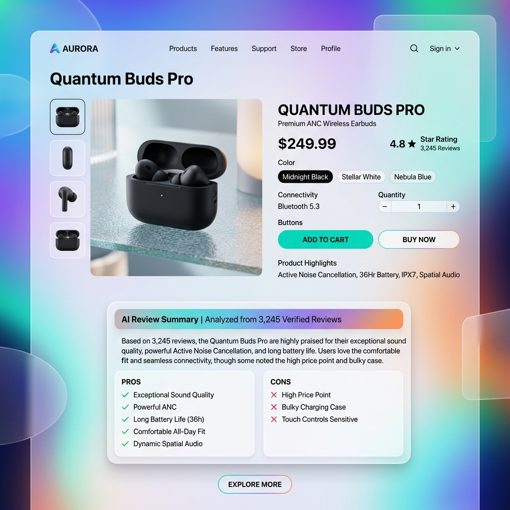
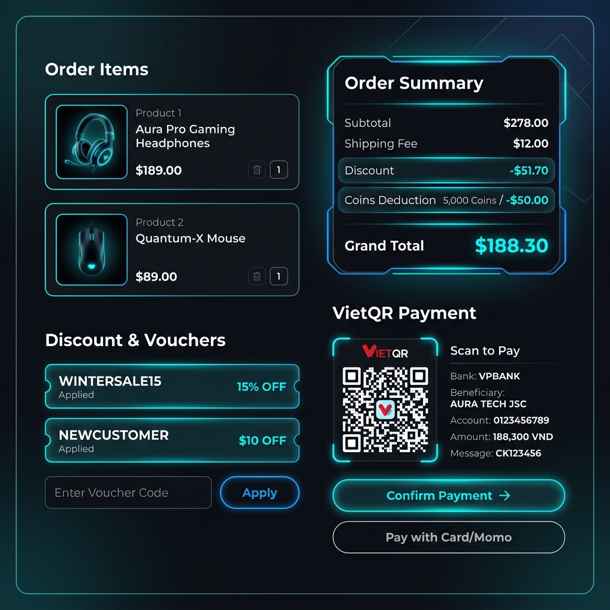
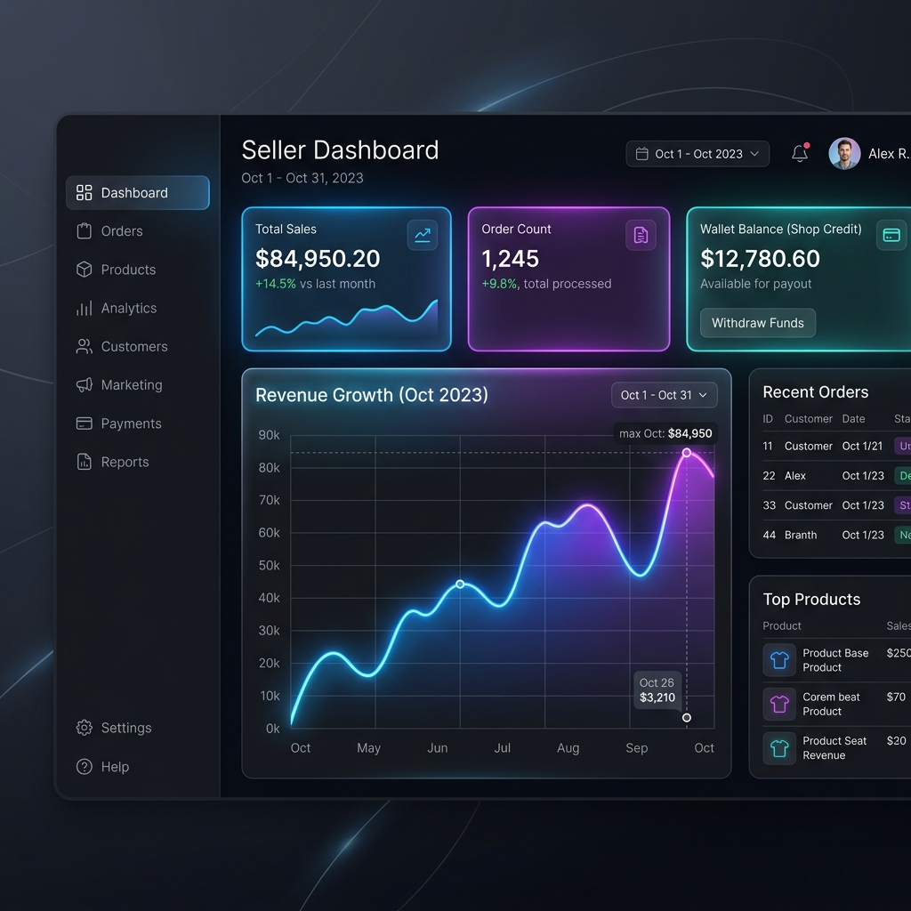

# BỘ XÂY DỰNG

# TRƯỜNG ĐẠI HỌC GIAO THÔNG VẬN TẢI THÀNH PHỐ HỒ CHÍ MINH

---

# BÁO CÁO MÔN HỌC: ĐỒ ÁN THỰC TẾ CÔNG NGHỆ PHẦN MỀM

**Tên đề tài:** XÂY DỰNG HỆ THỐNG WEB SÀN THƯƠNG MẠI ĐIỆN TỬ V-SHOP

|                                  |                        |
| -------------------------------- | ---------------------- |
| **Giảng viên hướng dẫn:**        | **GV. VŨ ĐÌNH LONG**   |
| **Sinh viên thực hiện:** Cao Phi | **MSSV:** 049205000006 |
| **Lớp:**                         | 010412203903           |

_TP. Hồ Chí Minh, ngày 01 tháng 1 năm 2026_

---

## MỤC LỤC

1. [CHƯƠNG 1. TỔNG QUAN ĐỀ TÀI NGHIÊN CỨU](#chương-1-tổng-quan-đề-tài-nghiên-cứu)
   - 1.1. Giới thiệu đề tài
   - 1.2. Mục tiêu đề tài
     - 1.2.1. Mục tiêu chính
     - 1.2.2. Mục tiêu cụ thể
   - 1.3. Phạm vi và chức năng hệ thống
     - 1.3.1. Phạm vi thực hiện
     - 1.3.2. Đối tượng sử dụng
     - 1.3.3. Phương pháp nghiên cứu
     - 1.3.4. Phương pháp thực hiện
2. [CHƯƠNG 2. CƠ SỞ LÝ THUYẾT](#chương-2-cơ-sở-lý-thuyết)
   - 2.1. Tổng quan Kiến trúc Hệ thống
     - 2.1.1. Kiến trúc Microservices
     - 2.1.2. BFF (Backend For Frontend) Pattern
     - 2.1.3. Kiến trúc Hướng sự kiện (Event-Driven Architecture)
   - 2.2. Danh sách và Đánh giá Công nghệ Sử dụng
     - 2.2.1. Frontend & Client-side
     - 2.2.2. Backend & Communication
     - 2.2.3. Cơ sở dữ liệu & ORM
     - 2.2.4. Xác thực & Phân quyền
     - 2.2.5. Xử lý Truyền thông và Video
     - 2.2.6. Đồng bộ Real-time
     - 2.2.7. Tích hợp Trí tuệ nhân tạo (AI)
     - 2.2.8. Hạ tầng và Vận hành
3. [CHƯƠNG 3. PHÂN TÍCH VÀ THIẾT KẾ HỆ THỐNG](#chương-3-phân-tích-và-thiết-kế-hệ-thống)
   - 3.1. Đặc tả yêu cầu hệ thống (System Requirements - SRS)
     - 3.1.1. Các tác nhân của hệ thống
     - 3.1.2. Yêu cầu chức năng (Functional Requirements)
     - 3.1.3. Yêu cầu phi chức năng (Non-functional Requirements)
   - 3.2. Thiết kế kiến trúc hệ thống
     - 3.2.1. Sơ đồ kiến trúc tổng quát
   - 3.3. Thiết kế hệ thống
     - 3.3.1. Sơ đồ Use Case - Khách hàng (Customer)
     - 3.3.2. Sơ đồ Use Case - Người bán (Seller)
     - 3.3.3. Sơ đồ Use Case - Quản trị viên (Admin)
     - 3.3.4. Sơ đồ Use Case phân rã - Xác thực & Phân quyền (Authentication)
     - 3.3.5. Sơ đồ Use Case phân rã - Tìm kiếm & Xem sản phẩm (Product Search)
     - 3.3.6. Sơ đồ Use Case phân rã - Đặt hàng & Thanh toán (Order & Payment)
     - 3.3.7. Sơ đồ Use Case phân rã - Quản lý cửa hàng (Store Management)
     - 3.3.8. Sơ đồ Use Case phân rã - Trò chuyện & Hỗ trợ AI (Real-time Chat & AI)
    - 3.4. Sơ đồ lớp (Class Diagrams)
      - 3.4.1. BFF Authentication Guard Chain
      - 3.4.2. Payment Domain
      - 3.4.3. Order Domain
      - 3.4.4. Wallet Domain
      - 3.4.5. Catalog Domain
      - 3.4.6. Convex Chat Schema
    - 3.5. Sơ đồ hoạt động (Activity Diagrams)
      - 3.5.1. Quy trình tạo đơn hàng
      - 3.5.2. Quy trình xử lý webhook SePay
      - 3.5.3. Quy trình đăng ký Merchant
      - 3.5.4. Quy trình xử lý video
      - 3.5.5. Quy trình tạo AI Review Summary
    - 3.6. Sơ đồ thực thể mối quan hệ (ERD) và Thiết kế bảng dữ liệu
      - 3.6.1. Tổng quan về mô hình Database-per-Service
      - 3.6.2. Thiết kế cơ sở dữ liệu Order Service
      - 3.6.3. Thiết kế cơ sở dữ liệu Payment Service
      - 3.6.4. Thiết kế cơ sở dữ liệu Catalog Service
      - 3.6.5. Thiết kế cơ sở dữ liệu IAM Service
      - 3.6.6. Thiết kế cơ sở dữ liệu Shop Service
      - 3.6.7. Thiết kế cơ sở dữ liệu Wallet Service
      - 3.6.8. Thiết kế cơ sở dữ liệu Utility Service
      - 3.6.9. Thiết kế cơ sở dữ liệu Promotion Service
      - 3.6.10. Thiết kế cơ sở dữ liệu AI Service
    - 3.7. Luồng thao tác dữ liệu chi tiết
      - 3.7.1. Luồng đăng nhập và xác thực (Cognito OIDC)
      - 3.7.2. Luồng đặt hàng và thanh toán QR (VietQR)
      - 3.7.3. Luồng xử lý Webhook SePay xác nhận thanh toán
      - 3.7.4. Luồng nạp V-Xu qua tài khoản ngân hàng (QR Topup)
      - 3.7.5. Luồng tìm kiếm sản phẩm và hiển thị thông tin
      - 3.7.6. Luồng thêm sản phẩm vào giỏ hàng và thanh toán bằng xu
      - 3.7.7. Luồng người bán tải lên và xử lý video giới thiệu sản phẩm
      - 3.7.8. Luồng tự động tóm tắt đánh giá sản phẩm bằng AI
      - 3.7.9. Luồng chat thời gian thực 1-1 giữa Khách hàng và Người bán
4. [CHƯƠNG 4. THUẬT TOÁN VÀ PHƯƠNG PHÁP TÍNH TOÁN](#chương-4-thuật-toán-và-phương-pháp-tính-toán)
   - 4.1. Thuật toán tóm tắt đánh giá bằng AI (LLM & RAG)
   - 4.2. Công thức tính toán đơn hàng và áp dụng mã giảm giá
   - 4.3. Phương pháp phân chia doanh thu & Đối soát cửa hàng
   - 4.4. Thuật toán bảo mật xác thực Webhook SePay (HMAC-SHA256)
5. [CHƯƠNG 5. GIAO DIỆN HỆ THỐNG](#chương-5-giao-diện-hệ-thống)
   - 5.1. Giao diện trang chủ (Homepage)
   - 5.2. Giao diện chi tiết sản phẩm và tóm tắt AI (Product Detail & AI Summary)
   - 5.3. Giao diện Giỏ hàng và Đặt hàng (Cart & Checkout)
   - 5.4. Giao diện Thanh toán qua mã VietQR (VietQR Payment)
   - 5.5. Giao diện Kênh người bán - Thống kê doanh thu (Seller Dashboard)
   - 5.6. Giao diện Quản lý ví và Yêu cầu rút tiền (Wallet & Payout)
   - 5.7. Giao diện Trò chuyện trực tuyến thời gian thực (Convex Chat)
   - 5.8. Giao diện Quản trị viên (Admin Portal)
6. [CHƯƠNG 6. TRIỂN KHAI VÀ KIỂM THỬ HỆ THỐNG](#chương-6-triển-khai-và-kiểm-thử-hệ-thống)
   - 6.1. Cấu trúc dự án
   - 6.2. Môi trường triển khai
   - 6.3. API Configuration và Infrastructure
   - 6.4. Kết quả kiểm thử
   - 6.5. Đánh giá hiệu năng hệ thống
7. [CHƯƠNG 7. KẾT LUẬN VÀ HƯỚNG PHÁT TRIỂN](#chương-7-kết-luận-và-hướng-phát-triển)
   - 7.1. Kết quả đạt được
   - 7.2. Ưu điểm hệ thống
   - 7.3. Hạn chế
   - 7.4. Hướng phát triển
- [TÀI LIỆU THAM KHẢO](#tài-liệu-tham-khảo)


---

## NHẬN XÉT CỦA GIẢNG VIÊN HƯỚNG DẪN

TP. Hồ Chí Minh, Ngày… Tháng… Năm 2026

Giảng viên hướng dẫn

_(Ký và ghi rõ họ tên)_

---

## LỜI CẢM ƠN

Trong quá trình thực hiện đề tài **"Xây dựng hệ thống Web Sàn thương mại điện tử V-Shop"**, em đã nhận được sự hỗ trợ và hướng dẫn từ nhiều phía.

Em xin gửi lời cảm ơn đến **quý thầy cô Khoa Công nghệ Thông tin, Trường Đại học Giao Thông Vận Tải TP.HCM** đã truyền đạt kiến thức nền tảng trong suốt quá trình học tập.

Đặc biệt, em xin cảm ơn **giảng viên hướng dẫn** đã góp ý và định hướng để đề tài hoàn thiện hơn.

Cuối cùng, em cảm ơn **gia đình và bạn bè** đã luôn động viên và hỗ trợ trong suốt thời gian thực hiện.

Do kiến thức và kinh nghiệm còn hạn chế, báo cáo không tránh khỏi thiếu sót. Em rất mong nhận được góp ý từ thầy cô để hoàn thiện hơn.

_TP.HCM, ngày 01 tháng 1 năm 2026_

Sinh viên thực hiện: **Cao Phi**

---

## TÓM TẮT ĐỀ TÀI

Đề tài xây dựng hệ thống sàn thương mại điện tử **V-Shop** — nền tảng mua bán trực tuyến đa người bán (multi-vendor marketplace) triển khai thực tế trên AWS, lấy cảm hứng từ các sàn như Shopee, Tiki nhưng được xây dựng từ đầu với kiến trúc Microservices hiện đại.

**Hệ thống phục vụ 3 nhóm người dùng:**

- **Khách hàng:** tìm kiếm, mua sắm, thanh toán QR/ví/COD, nạp V-Xu, dùng voucher, viết đánh giá, chat với shop và AI chatbot
- **Người bán:** quản lý sản phẩm (SKU, ảnh, video), xử lý đơn hàng, theo dõi doanh thu, rút tiền
- **Admin:** duyệt shop, quản lý người dùng/sản phẩm/khuyến mãi, xử lý vi phạm, duyệt payout

**Kiến trúc:** Hệ thống chia thành 9 microservice độc lập (iam, catalog, shop, order, payment, promotion, utility, wallet, ai), mỗi service có database riêng trên Neon PostgreSQL. Các service giao tiếp qua **gRPC** (đồng bộ) và **AWS SQS** (bất đồng bộ). Lớp **BFF** (customer-bff, seller-bff, admin-bff) đóng vai trò API Gateway cho 3 frontend Next.js.

**Các tính năng kỹ thuật nổi bật:**

- **Thanh toán QR thực tế:** tích hợp VietQR + SePay webhook HMAC-SHA256, xác nhận real-time qua SSE
- **Ví V-Xu:** nạp xu qua QR, dùng xu khi đặt hàng; shop nhận doanh thu vào Credit và rút tiền qua Payout
- **AI Review Summary:** tự động phân tích đánh giá bằng Groq API (Kimi K2), tóm tắt ưu/nhược điểm cho từng sản phẩm
- **AI Chatbot RAG:** chatbot 24/7 trên Convex Cloud, tìm kiếm knowledge base bằng Google Embedding
- **Video HLS pipeline:** upload MP4 → S3 → Lambda → MediaConvert → HLS ABR (1080p/720p/480p)
- **Chat real-time:** Convex WebSocket, hỗ trợ text và ảnh giữa khách hàng và shop

**Hạ tầng:** AWS EKS (Kubernetes), ALB, Route 53, S3, SQS (8 queues), Lambda, Cognito, quản lý bằng Terraform. CI/CD tự động với GitHub Actions → ECR → EKS.

Hệ thống đã được deploy thực tế tại `vshop.hacmieu.com` với đầy đủ 3 giao diện hoạt động và 40 Mermaid diagrams tài liệu hóa toàn bộ thiết kế.

---

## CHƯƠNG 1. TỔNG QUAN ĐỀ TÀI NGHIÊN CỨU

### 1.1. Giới thiệu đề tài

Trong những năm gần đây, thương mại điện tử (TMĐT) đã trở thành một phần không thể thiếu trong đời sống kinh tế - xã hội tại Việt Nam và trên thế giới. Nhu cầu mua sắm trực tuyến tăng cao thúc đẩy sự phát triển của các sàn giao dịch TMĐT đa người bán (multi-vendor marketplace) như Shopee, Tiki, Lazada. Việc xây dựng một hệ thống sàn TMĐT đòi hỏi khả năng xử lý lượng truy cập lớn, tính sẵn sàng cao, bảo mật thông tin và khả năng mở rộng linh hoạt.

Đề tài **"Xây dựng hệ thống Web Sàn thương mại điện tử V-Shop"** được thực hiện nhằm nghiên cứu và ứng dụng kiến trúc Microservices hiện đại, kết hợp với các công nghệ web tiên tiến và hạ tầng điện toán đám mây AWS để giải quyết bài toán trên. V-Shop không chỉ là một ứng dụng thương mại điện tử thông thường mà còn tích hợp các giải pháp thực tế như thanh toán tự động qua mã QR (VietQR), hệ thống xử lý video tối ưu, và các tính năng hỗ trợ bằng Trí tuệ Nhân tạo (AI Chatbot RAG, AI Review Summary) nhằm nâng cao trải nghiệm người dùng.

### 1.2. Mục tiêu đề tài

#### 1.2.1. Mục tiêu chính

Mục tiêu chính của đề tài là nghiên cứu, thiết kế và xây dựng thành công một hệ thống sàn thương mại điện tử V-Shop hoàn chỉnh hoạt động theo mô hình đa người bán (multi-vendor marketplace). Hệ thống được triển khai trên môi trường cloud AWS thực tế, áp dụng kiến trúc Microservices để đảm bảo tính chịu tải cao, khả năng mở rộng độc lập và độ tin cậy của toàn bộ hệ thống.

#### 1.2.2. Mục tiêu cụ thể

Để đạt được mục tiêu chính, đề tài tập trung hoàn thành các mục tiêu cụ thể sau:
- **Thiết kế và phát triển giao diện:** Xây dựng đầy đủ 3 ứng dụng web giao diện người dùng riêng biệt (Khách hàng - `customer-web`, Người bán - `seller-web`, Quản trị viên - `admin-web`) sử dụng framework Next.js và React 19.
- **Tích hợp giải pháp thanh toán thực tế:** Phát triển cổng thanh toán tích hợp VietQR và tự động xác nhận giao dịch thông qua SePay Webhook (sử dụng HMAC-SHA256 để bảo mật).
- **Ứng dụng Trí tuệ Nhân tạo (AI):** Tích hợp AI Chatbot hoạt động 24/7 dựa trên kỹ thuật RAG (Retrieval-Augmented Generation) trên Convex Cloud, và tính năng tự động tóm tắt đánh giá sản phẩm (AI Review Summary) sử dụng Groq API.
- **Hệ thống xử lý đa phương tiện (Video Pipeline):** Xây dựng luồng tải lên và xử lý video giới thiệu sản phẩm tự động (HLS ABR transcode) bằng AWS Lambda và MediaConvert.
- **Hạ tầng và vận hành (DevOps):** Thiết lập hạ tầng đám mây bằng Terraform trên AWS EKS, thiết lập đường ống CI/CD tự động bằng GitHub Actions để tự động hóa quy trình kiểm thử, build và deploy.

### 1.3. Phạm vi và chức năng hệ thống

#### 1.3.1. Phạm vi thực hiện

Phạm vi thực hiện của đề tài bao gồm cả khía cạnh nghiệp vụ và kỹ thuật:
- **Về nghiệp vụ:** Thiết lập quy trình vận hành khép kín cho mô hình sàn TMĐT đa người bán, bao gồm quản lý tài khoản người dùng, đăng ký và duyệt merchant, đăng bán sản phẩm với nhiều SKU (biến thể), đặt hàng, áp dụng khuyến mãi, thanh toán trực tuyến/ví, rút tiền (payout), đánh giá sản phẩm và chat trực tuyến.
- **Về kỹ thuật:**
  - Xây dựng hệ thống theo mô hình **NX Monorepo** với 3 ứng dụng Frontend (Next.js), 3 BFF Layer (NestJS REST API), và 9 Microservices Backend (NestJS gRPC).
  - Sử dụng cơ sở dữ liệu độc lập cho từng microservice (Neon PostgreSQL) và cache/session storage qua Redis.
  - Sử dụng AWS EKS làm môi trường chạy ứng dụng chính, kết hợp với các dịch vụ AWS managed như S3, SQS, Cognito, Lambda, MediaConvert.
  - Tích hợp các dịch vụ bên ngoài gồm Convex Cloud (chat và RAG) và SePay (webhook giao dịch ngân hàng).

#### 1.3.2. Đối tượng sử dụng

Hệ thống V-Shop được thiết kế để phục vụ 3 đối tượng người dùng chính:
- **Khách hàng (Customer):** Là người mua sắm trên sàn, thực hiện các thao tác tìm kiếm sản phẩm, quản lý giỏ hàng, áp dụng voucher, đặt hàng và thanh toán (COD, qua ví V-Xu, hoặc quét mã QR VietQR), nạp V-Xu vào ví, viết đánh giá sản phẩm, chat trực tiếp với cửa hàng hoặc nhận hỗ trợ từ AI Chatbot.
- **Người bán (Seller/Merchant):** Là các đối tác kinh doanh trên sàn, sau khi đăng ký và được duyệt sẽ sở hữu cửa hàng riêng. Người bán có quyền quản lý danh mục sản phẩm (CRUD sản phẩm, SKU, ảnh, video giới thiệu), quản lý và xử lý đơn hàng, theo dõi doanh thu tích lũy (Credit), và gửi yêu cầu rút tiền về tài khoản ngân hàng thực tế.
- **Quản trị viên (Admin):** Là người vận hành toàn bộ hệ thống sàn V-Shop, có nhiệm vụ kiểm duyệt đơn đăng ký của Merchant, quản lý trạng thái tài khoản người dùng, kiểm duyệt sản phẩm, tạo và quản lý các chương trình khuyến mãi/voucher toàn sàn, xử lý các báo cáo vi phạm, phê duyệt yêu cầu rút tiền (payout) của người bán, và cập nhật cơ sở tri thức (Knowledge Base) cho AI Chatbot.

#### 1.3.3. Phương pháp nghiên cứu

Đề tài áp dụng các phương pháp nghiên cứu sau:
- **Nghiên cứu tài liệu và lý thuyết:**
  - Nghiên cứu kiến trúc Microservices, so sánh ưu và nhược điểm với kiến trúc Monolith.
  - Nghiên cứu mô hình BFF (Backend For Frontend) Pattern trong việc tối ưu hóa giao tiếp giữa Client và Backend Microservices.
  - Tìm hiểu giao thức gRPC và HTTP/2 để truyền thông điệp nội bộ hiệu quả và tối ưu hóa hiệu năng.
- **Nghiên cứu công nghệ và tích hợp:**
  - Nghiên cứu các dịch vụ hạ tầng trên AWS (EKS, VPC, ALB, SQS, S3, Cognito, EventBridge) và cách viết mã quản lý hạ tầng (Infrastructure as Code - IaC) với Terraform.
  - Tìm hiểu cơ chế xác thực phân quyền dựa trên JWT, Cognito User Pools và OAuth2/OIDC.
  - Nghiên cứu kỹ thuật RAG (Retrieval-Augmented Generation), cơ chế tạo và so khớp Vector Embedding phục vụ cho AI Chatbot.
- **Nghiên cứu thực tiễn:**
  - Khảo sát quy trình thanh toán chuyển khoản qua mã QR tiêu chuẩn VietQR và cơ chế webhook của SePay.
  - Khảo sát các giải pháp stream video trực tuyến (HLS - HTTP Live Streaming) và các dịch vụ transcode video tự động.

#### 1.3.4. Phương pháp thực hiện

Quy trình xây dựng và hoàn thiện hệ thống được triển khai qua các phương pháp cụ thể:
- **Quy trình phát triển phần mềm Agile:** Chia nhỏ quá trình phát triển thành các giai đoạn, thực hiện phát triển cuốn chiếu từ thiết kế cơ sở dữ liệu, viết API gRPC, tích hợp BFF, đến hoàn thiện giao diện người dùng.
- **Phát triển mã nguồn với NX Monorepo:** Tổ chức code trong một repository duy nhất giúp quản lý và đồng bộ hóa các định nghĩa Protobuf (gRPC), cấu hình môi trường, guards xác thực và các module tiện ích dùng chung một cách nhanh chóng.
- **Áp dụng IaC và Tự động hóa CI/CD:** Sử dụng Terraform để định nghĩa toàn bộ tài nguyên cloud AWS, giúp việc tạo dựng môi trường deploy nhanh chóng và đồng bộ. Thiết lập GitHub Actions tự động hóa quy trình Docker build và deployment mỗi khi có thay đổi trên nhánh chính.
- **Kiểm thử và đánh giá trên môi trường thực tế:** Triển khai các ứng dụng trực tiếp lên AWS EKS với tên miền cấu hình qua Route 53, tiến hành các kịch bản kiểm thử tích hợp (Integration Testing) và kiểm thử người dùng (User Acceptance Testing - UAT) trực tiếp trên môi trường live.

##### Kế hoạch thực hiện

| Giai đoạn | Thời gian | Nội dung                                      |
| --------- | --------- | --------------------------------------------- |
| 1         | Tuần 1    | Phân tích yêu cầu, thiết kế kiến trúc, ERD    |
| 2         | Tuần 2    | Thiết kế giao diện (Figma), setup monorepo NX |
| 3         | Tuần 3–5  | Lập trình backend (gRPC services), frontend   |
| 4         | Tuần 6–7  | Tích hợp API, CI/CD, deploy AWS EKS           |
| 5         | Tuần 8    | Kiểm thử, hoàn thiện, viết báo cáo            |

##### Kết quả dự kiến

- Hệ thống hoạt động ổn định, deploy thực tế tại `vshop.hacmieu.com`
- Đầy đủ 3 giao diện web cho 3 nhóm người dùng
- Thanh toán QR hoạt động thực tế với ngân hàng MBBank
- AI chatbot trả lời tự động dựa trên knowledge base
- Tài liệu kỹ thuật đầy đủ: ERD, UML, sequence diagrams

---

## CHƯƠNG 2: CƠ SỞ LÝ THUYẾT

### 2.1. Tổng quan Kiến trúc Hệ thống

#### 2.1.1. Kiến trúc Microservices
- **Lý thuyết cơ bản:** Kiến trúc Microservices là một phương pháp phát triển phần mềm trong đó ứng dụng được xây dựng như một tập hợp các dịch vụ nhỏ, độc lập, có thể triển khai riêng biệt, giao tiếp với nhau qua các giao thức gọn nhẹ (như HTTP, gRPC, hoặc Message Broker). Mỗi dịch vụ chịu trách nhiệm cho một nghiệp vụ cụ thể và có cơ sở dữ liệu riêng (Database per Service).
- **Công nghệ giải quyết bài toán gì:** Trong dự án V-Shop – một sàn thương mại điện tử đa người bán (multi-vendor), độ phức tạp nghiệp vụ rất lớn (xác thực, giỏ hàng, đặt hàng, thanh toán, quản lý shop, khuyến mãi, ví tiền, chat trực tuyến, xử lý video). Kiến trúc Microservices giải quyết bài toán phân rã hệ thống lớn thành các dịch vụ độc lập (`iam`, `catalog`, `shop`, `order`, `payment`, `promotion`, `utility`, `wallet`, `ai`). Điều này giúp tránh hiện tượng "single point of failure" (lỗi ở dịch vụ thanh toán không làm sập dịch vụ catalog sản phẩm), tăng cường khả năng chịu tải và cho phép mở rộng quy mô (scale) độc lập cho từng dịch vụ khi cần thiết.
- **Tại sao chọn:** Đảm bảo hệ thống có khả năng mở rộng cao, dễ dàng bảo trì và cập nhật mã nguồn mà không ảnh hưởng đến toàn bộ hệ thống đang chạy trực tuyến.

#### 2.1.2. BFF (Backend For Frontend) Pattern
- **Lý thuyết cơ bản:** BFF (Backend for Frontend) là một mô hình thiết kế trong đó mỗi loại giao diện người dùng (Client Web, Mobile) có một dịch vụ backend trung gian riêng phục vụ nó. BFF đóng vai trò như một API Gateway thông minh, chịu trách nhiệm xác thực, định tuyến, tổng hợp dữ liệu từ nhiều dịch vụ backend nội bộ và định hình lại dữ liệu trước khi trả về Client.
- **Công nghệ giải quyết bài toán gì:** V-Shop phục vụ 3 nhóm đối tượng người dùng hoàn toàn khác biệt với 3 ứng dụng Frontend Next.js riêng biệt: Khách hàng (`customer-web`), Người bán (`seller-web`), và Quản trị viên (`admin-web`). Mỗi nhóm có nhu cầu dữ liệu và quyền truy cập khác nhau. BFF giải quyết bài toán tối ưu hóa băng thông mạng cho client bằng cách kết hợp nhiều cuộc gọi microservices thành một API duy nhất (API Composition), thực hiện xác thực và phân quyền tập trung tại lớp Gateway, đồng thời giảm độ phức tạp của logic xử lý trên Client.
- **Tại sao chọn:** Giúp tăng tốc độ phản hồi trên giao diện, bảo mật hơn do ẩn các cổng gRPC nội bộ của Microservices, và tách biệt hoàn toàn luồng nghiệp vụ giữa Customer, Seller và Admin.

#### 2.1.3. Kiến trúc Hướng sự kiện (Event-Driven Architecture) với Message Queue
- **Lý thuyết cơ bản:** Là kiến trúc trong đó các dịch vụ giao tiếp với nhau bằng cách phát đi (publish) và tiêu thụ (consume) các sự kiện (events) một cách bất đồng bộ thông qua một Message Broker (như AWS SQS).
- **Công nghệ giải quyết bài toán gì:** Giải quyết các tác vụ nặng hoặc không cần phản hồi đồng bộ tức thời (như ghi nhận giao dịch ví sau khi đơn hàng thành công, gửi email/thông báo, xử lý video upload). Ví dụ, khi đơn hàng hoàn thành, `order-service` phát sự kiện `settle_order_revenue` qua AWS SQS, `wallet-service` sẽ tự động nhận và cộng tiền cho người bán mà không làm nghẽn tiến trình hoàn tất đơn hàng chính của người dùng.
- **Tại sao chọn:** Giảm độ trễ (latency) của các API giao dịch chính, giúp hệ thống hoạt động mượt mà và tăng khả năng chịu lỗi nhờ cơ chế Dead Letter Queue (DLQ) cho phép lưu trữ và retry các tin nhắn bị lỗi.

---

### 2.2. Danh sách và Đánh giá Công nghệ Sử dụng

#### 2.2.1. Frontend & Client-side (Next.js, React 19, Tailwind CSS)
- **Công nghệ giải quyết bài toán gì:** Xây dựng giao diện web động, tối ưu hóa SEO (Search Engine Optimization) để tăng khả năng tiếp cận khách hàng của sàn thương mại điện tử, đồng thời cung cấp giao diện phản hồi nhanh và thân thiện với người dùng.
- **Tại sao chọn:**
  * **Next.js 16 (App Router):** Hỗ trợ Server-side Rendering (SSR) và Static Site Generation (SSG), giúp tải trang đầu cực nhanh và tối ưu hóa SEO hoàn hảo cho trang danh sách và chi tiết sản phẩm.
  * **React 19:** Tích hợp cơ chế Server Components giúp giảm tải dung lượng JavaScript tải về trình duyệt và cải thiện hiệu năng render UI.
  * **Tailwind CSS:** Cung cấp phương pháp thiết kế giao diện nhanh chóng, linh hoạt và đồng bộ thông qua các tiện ích lớp (utility classes) CSS.
- **Áp dụng vào dự án V-Shop:**
  * **Next.js:** Dùng để phát triển 3 cổng giao diện Web riêng biệt: `customer-web` (dành cho khách hàng mua sắm, tối ưu SEO để các sản phẩm dễ xuất hiện trên Google), `seller-web` (dành cho người bán quản lý gian hàng) và `admin-web` (dành cho ban quản trị vận hành sàn).
  * **React 19:** Sử dụng React Server Components (RSC) cho các trang danh mục sản phẩm nhằm giảm kích thước bundle size tải về máy khách và nâng cao trải nghiệm lướt web.
  * **Tailwind CSS:** Dựng hệ thống component UI nhất quán (như các nút bấm, khung card sản phẩm, biểu mẫu đăng ký shop, modal...) với tốc độ phát triển nhanh và đáp ứng tốt responsive trên thiết bị di động.

#### 2.2.2. Backend & Communication (NestJS, gRPC, REST API, Swagger)
- **Công nghệ giải quyết bài toán gì:** Xây dựng các dịch vụ backend có cấu trúc rõ ràng, hiệu năng cao và định nghĩa các giao thức giao tiếp đồng bộ hiệu quả giữa các thành phần trong hệ thống.
- **Tại sao chọn:**
  * **NestJS 11:** Một framework Node.js viết bằng TypeScript, cung cấp kiến trúc mô-đun vững chắc (Module - Controller - Service) tương tự Angular/Spring Boot, giúp phát triển dự án monorepo lớn dễ quản lý và mở rộng.
  * **gRPC (HTTP/2):** Sử dụng giao thức truyền tải nhị phân Protocol Buffers trên nền HTTP/2 cho giao tiếp nội bộ giữa BFF và các Microservices. gRPC giúp giảm dung lượng gói tin, tối ưu hóa tốc độ kết nối và tự động sinh mã nguồn kiểu dữ liệu (strongly-typed) giữa các dịch vụ.
  * **REST API & Swagger:** Lớp BFF cung cấp REST API chuẩn cho Frontend dễ dàng tích hợp và tự động tạo tài liệu đặc tả API thông qua Swagger/OpenAPI.
- **Áp dụng vào dự án V-Shop:**
  * **NestJS 11:** Khởi tạo kiến trúc monorepo quản lý 3 dịch vụ BFF (`customer-bff`, `seller-bff`, `admin-bff`) và 9 dịch vụ microservices (`iam`, `catalog`, `shop`, `order`, `payment`, `promotion`, `utility`, `wallet`, `ai`).
  * **gRPC:** Thực hiện giao tiếp nội bộ tốc độ cao giữa BFF và các microservices. Ví dụ: BFF gọi gRPC đến `iam-service` để kiểm tra token xác thực, hoặc gọi `catalog-service` lấy thông tin chi tiết sản phẩm.
  * **REST API & Swagger:** BFF mở các endpoint REST API cho Client sử dụng, đồng thời sinh trang tài liệu `/api/docs` để hỗ trợ frontend dễ dàng tra cứu API.

#### 2.2.3. Cơ sở dữ liệu & ORM (PostgreSQL, Neon, Redis, Prisma)
- **Công nghệ giải quyết bài toán gì:** Lưu trữ dữ liệu có cấu trúc quan hệ chặt chẽ, tối ưu hóa truy vấn đọc/ghi lớn và tăng tốc độ phản hồi thông qua bộ đệm (caching).
- **Tại sao chọn:**
  * **PostgreSQL:** Hệ quản trị cơ sở dữ liệu quan hệ mạnh mẽ, hỗ trợ tốt các giao dịch ACID khắt khe đối với dữ liệu đặt hàng, thanh toán và ví tiền.
  * **Neon Cloud:** Dịch vụ PostgreSQL serverless tự động co giãn tài nguyên và hỗ trợ tính năng database branching hữu ích cho việc phát triển và thử nghiệm.
  * **Redis Cloud:** Cơ sở dữ liệu in-memory tốc độ cực cao dùng để lưu trữ đệm (cache) dữ liệu danh mục sản phẩm, phiên đăng nhập giúp giảm tải trực tiếp lên PostgreSQL.
  * **Prisma ORM 7:** Cung cấp giải pháp ánh xạ thực thể cơ sở dữ liệu (ORM) kiểu dữ liệu mạnh (type-safe) giúp lập trình viên viết truy vấn an toàn, tránh lỗi cú pháp và tự động quản lý schema migrations.
- **Áp dụng vào dự án V-Shop:**
  * **PostgreSQL (Neon Cloud):** Dùng làm cơ sở dữ liệu lưu trữ chính cho cả 9 microservices, với mô hình mỗi service có database riêng (ví dụ: `vshop_order_db`, `vshop_wallet_db`...) đảm bảo tính độc lập và toàn vẹn dữ liệu giao dịch.
  * **Redis Cloud:** Làm cache đệm trung gian cho các truy vấn sản phẩm bán chạy, danh mục sản phẩm ít thay đổi tại `catalog-service`, và cache token xác thực của người dùng tại lớp BFF để giảm độ trễ truy cập database.
  * **Prisma ORM 7:** Dùng làm thư viện truy vấn dữ liệu từ NestJS sang PostgreSQL, giúp viết các câu lệnh truy vấn TypeScript một cách an toàn và tự động thực thi các file migration khi thay đổi cấu trúc bảng.

#### 2.2.4. Xác thực & Phân quyền (AWS Cognito, OIDC, RBAC)
- **Công nghệ giải quyết bài toán gì:** Quản lý tài khoản người dùng an toàn, cơ chế đăng nhập tập trung (Single Sign-On), bảo vệ thông tin cá nhân và phân quyền truy cập nghiêm ngặt cho từng phân hệ (Khách hàng, Người bán, Admin).
- **Tại sao chọn:**
  * **AWS Cognito:** Dịch vụ quản lý định danh đám mây (IDaaS) hoàn chỉnh của AWS. Sử dụng Cognito giúp loại bỏ việc tự lưu trữ mật khẩu (mã hóa bcrypt), tự động hỗ trợ các luồng xác thực nâng cao như MFA, khôi phục mật khẩu và tuân thủ tiêu chuẩn OIDC (OpenID Connect).
  * **RBAC (Role-Based Access Control):** Cơ chế phân quyền dựa trên vai trò kết hợp với JWT token ngắn hạn giúp BFF kiểm soát chính xác các endpoint API nào được truy cập bởi người dùng nào.
- **Áp dụng vào dự án V-Shop:**
  * **AWS Cognito:** Quản lý toàn bộ thông tin tài khoản người dùng của sàn. Khi khách hàng đăng ký hoặc đăng nhập, hệ thống chuyển hướng qua giao diện Hosted UI của Cognito để đảm bảo an toàn mật khẩu.
  * **OIDC & RBAC:** BFF nhận JWT ID token từ Cognito gửi về, kiểm tra chữ ký số và phân tích các role (Khách hàng, Người bán, Admin) trong payload của token để phân quyền truy cập menu chức năng của từng đối tượng.

#### 2.2.5. Xử lý Truyền thông và Video (AWS S3, Lambda, MediaConvert, HLS ABR)
- **Công nghệ giải quyết bài toán gì:** Cho phép người bán tải lên video giới thiệu sản phẩm chất lượng cao mà không làm nghẽn băng thông hệ thống, tự động chuyển đổi định dạng tối ưu để phát video mượt mà trên mọi thiết bị và tốc độ mạng.
- **Tại sao chọn:**
  * **AWS S3:** Lưu trữ đối tượng dung lượng lớn với độ tin cậy và bảo mật cao, hỗ trợ presigned URL cho phép client tải ảnh/video trực tiếp lên S3 mà không đi qua BFF.
  * **AWS Lambda & MediaConvert:** Chuỗi xử lý video không máy chủ (serverless pipeline). Khi video MP4 được upload lên S3, sự kiện sẽ kích hoạt Lambda gọi MediaConvert để nén và phân tách video thành chuẩn **HLS ABR (Adaptive Bitrate Streaming)** với nhiều độ phân giải (1080p, 720p, 480p).
  * **HLS ABR:** Công nghệ giúp trình chơi video của người dùng tự động điều chỉnh độ phân giải dựa trên tốc độ mạng, mang lại trải nghiệm xem mượt mà, không bị giật/lag.
- **Áp dụng vào dự án V-Shop:**
  * **AWS S3:** Lưu trữ hình ảnh sản phẩm, banner quảng cáo, avatar người dùng và các file video MP4 gốc do người bán tải lên.
  * **AWS Lambda & MediaConvert:** Khi người bán tải lên video mô tả sản phẩm, Lambda tự động kích hoạt tiến trình nén và chuyển mã của MediaConvert, chia nhỏ video thành các phân đoạn HLS (.m3u8) để hiển thị mượt mà trên giao diện xem video sản phẩm của Khách hàng mà không bị gián đoạn do mạng yếu.

#### 2.2.6. Đồng bộ Real-time (Convex Cloud, SSE)
- **Công nghệ giải quyết bài toán gì:** Cập nhật trạng thái thanh toán real-time cho khách hàng và duy trì kết nối chat liên tục giữa Khách hàng và Người bán.
- **Tại sao chọn:**
  * **Convex Cloud:** Một nền tảng backend-as-a-service thời gian thực cực kỳ mạnh mẽ. Convex duy trì kết nối WebSocket bền vững, tự động cập nhật trạng thái dữ liệu (reactive queries) giúp việc xây dựng tính năng chat 1-1 và cập nhật tin nhắn diễn ra tức thời mà không cần cấu hình cluster Socket.io phức tạp trên Kubernetes.
  * **Server-Sent Events (SSE):** Giao thức truyền tin một chiều từ Server về Client qua HTTP kết nối lâu dài (long-lived connection). BFF sử dụng SSE để phát đi thông báo thanh toán thành công (khi nhận được webhook từ SePay) cho màn hình checkout của khách hàng ngay lập tức.
- **Áp dụng vào dự án V-Shop:**
  * **Convex Cloud:** Làm hệ quản trị cơ sở dữ liệu thời gian thực và đồng bộ WebSocket cho chức năng Chat trực tiếp 1-1 giữa Khách hàng và Người bán, cũng như lưu trữ lịch sử hội thoại của khách hàng với AI Chatbot.
  * **Server-Sent Events (SSE):** BFF duy trì kết nối một chiều đến trang thanh toán của Khách hàng. Khi SePay gửi webhook báo đã nhận chuyển khoản, BFF lập tức đẩy sự kiện SSE xuống client để tự động chuyển màn hình sang trạng thái "Thanh toán thành công" mà client không cần dùng polling liên tục.

#### 2.2.7. Tích hợp Trí tuệ nhân tạo - AI (Groq LLM, Google Embedding, RAG)
- **Công nghệ giải quyết bài toán gì:** Tự động hóa dịch vụ chăm sóc khách hàng và tổng hợp phản hồi của khách hàng để nâng cao chất lượng sản phẩm trên sàn V-Shop.
- **Tại sao chọn:**
  * **Groq API:** Cung cấp phần cứng tăng tốc LPU giúp suy luận LLM (Kimi K2 / Llama 3) với tốc độ siêu nhanh (vài trăm tokens/giây), đáp ứng phản hồi chatbot tức thì.
  * **Google Generative AI Embedding:** Sinh vector biểu diễn ngữ nghĩa cho cơ sở dữ liệu tri thức của sàn.
  * **RAG (Retrieval-Augmented Generation):** Cơ chế truy xuất thông tin dựa trên cơ sở tri thức được admin tải lên (như chính sách hoàn tiền, hướng dẫn mua hàng), sau đó nhúng thông tin liên quan vào prompt của LLM để đảm bảo chatbot trả lời chính xác, không bị "ảo giác" (hallucination).
- **Áp dụng vào dự án V-Shop:**
  * **Groq API:** Sử dụng mô hình Kimi K2 / Llama 3 để tự động hóa việc tóm tắt hàng trăm đánh giá của sản phẩm thành một cụm văn bản ngắn gọn (Ưu điểm, Nhược điểm) hiển thị ở trang chi tiết sản phẩm.
  * **Google Embedding & RAG:** Cho phép khách hàng nhắn tin hỏi đáp trực tiếp với trợ lý ảo (AI Chatbot) về các chính sách đổi trả, phương thức giao hàng hoặc thông tin cửa hàng, chatbot sẽ tự tìm dữ liệu trong Knowledge Base của admin để trả lời chính xác.

#### 2.2.8. Hạ tầng và Vận hành (Docker, AWS EKS, ALB, Route 53, Terraform, GitHub Actions)
- **Công nghệ giải quyết bài toán gì:** Triển khai ứng dụng lên hạ tầng đám mây AWS thực tế, tự động hóa quy trình phân phối sản phẩm phần mềm (CI/CD) và quản lý tài nguyên hạ tầng bằng mã nguồn.
- **Tại sao chọn:**
  * **Docker:** Đóng gói ứng dụng thành các container độc lập chứa đầy đủ môi trường chạy, đảm bảo ứng dụng hoạt động nhất quán từ máy lập trình viên lên môi trường cloud.
  * **AWS EKS (Elastic Kubernetes Service):** Dịch vụ quản lý Kubernetes của AWS, giúp quản trị các container microservices, tự động phục hồi khi container bị lỗi (self-healing), tự động mở rộng (horizontal scaling) và phân phối tải.
  * **AWS ALB & Route 53:** Định tuyến lưu lượng truy cập Internet ngoài vào EKS Cluster dựa trên tên miền cấu hình qua Route 53 và chứng chỉ bảo mật ACM (SSL/TLS).
  * **Terraform:** Công nghệ quản lý hạ tầng bằng mã (Infrastructure as Code - IaC) giúp khai báo và thiết lập toàn bộ VPC, EKS Cluster, SQS, S3... một cách tự động, chính xác và dễ dàng tái bản môi trường.
  * **GitHub Actions:** Đường ống dẫn CI/CD tự động build Docker image, push lên Amazon ECR và apply các file deployment vào EKS mỗi khi có commit mới lên branch main.
- **Áp dụng vào dự án V-Shop:**
  * **Docker & AWS EKS:** Tất cả 3 BFF, 9 Microservices và 3 Frontend đều được đóng gói thành Docker container và chạy trên AWS EKS Cluster, thiết lập Auto Scaling để tự động tăng số lượng container khi lượng truy cập tăng vọt vào ngày hội sale.
  * **AWS ALB & Route 53:** ALB nhận yêu cầu từ tên miền `vshop.hacmieu.com` (quản lý bởi Route 53) và phân phối tải vào các pod thích hợp trong EKS cluster.
  * **Terraform:** Khai báo toàn bộ cấu trúc hạ tầng đám mây (VPC, Subnets, EKS, RDS, SQS) dưới dạng file code cấu hình giúp triển khai đồng bộ và an toàn.
  * **GitHub Actions:** Tự động chạy CI/CD khi code được push lên repository. Quy trình tự động chạy unit test, build Docker image, đẩy lên ECR và deploy trực tiếp phiên bản mới nhất lên Kubernetes.

---

---

## CHƯƠNG 3: PHÂN TÍCH VÀ THIẾT KẾ HỆ THỐNG

### 3.1. Đặc tả yêu cầu hệ thống (System Requirements - SRS)

#### 3.1.1. Các tác nhân của hệ thống (Actors)

Hệ thống V-Shop bao gồm ba tác nhân chính tham gia tương tác trực tiếp hoặc gián tiếp:

- **Khách hàng (Customer):** Là người dùng mua sắm trực tuyến. Tác nhân này thực hiện tìm kiếm, xem thông tin sản phẩm, quản lý giỏ hàng, thực hiện các giao dịch thanh toán (qua QR ngân hàng hoặc ví V-Xu), nhận thông báo, viết đánh giá sản phẩm, chat trực tiếp với người bán và tương tác với chatbot hỗ trợ khách hàng bằng AI.
- **Người bán (Seller / Merchant):** Là các đối tác kinh doanh vận hành các gian hàng độc lập trên sàn. Người bán có nhiệm vụ đăng ký tài khoản kinh doanh, quản lý thông tin cửa hàng, đăng tải và chỉnh sửa thông tin sản phẩm (bao gồm hình ảnh và video), xử lý và theo dõi quy trình giao hàng của các đơn hàng, theo dõi doanh thu và gửi các yêu cầu rút tiền về tài khoản ngân hàng thực tế.
- **Quản trị viên (Admin):** Là ban quản trị vận hành toàn bộ sàn V-Shop. Admin thực hiện kiểm duyệt hồ sơ đăng ký của người bán mới, kiểm duyệt sản phẩm vi phạm, quản lý danh mục và các chương trình khuyến mãi toàn sàn, kiểm duyệt các yêu cầu rút tiền (payout) của người bán và quản lý cơ sở tri thức (Knowledge Base) phục vụ chatbot AI.

#### 3.1.2. Yêu cầu chức năng (Functional Requirements)

**Khách hàng (Customer):**

- Đăng nhập qua Cognito OIDC
- Tìm kiếm, lọc sản phẩm theo danh mục, thương hiệu, giá
- Xem chi tiết sản phẩm, AI Review Summary
- Quản lý giỏ hàng, đặt hàng (COD / WALLET / ONLINE QR)
- Nạp V-Xu qua QR VietQR, dùng xu khi thanh toán
- Nhận/dùng voucher giảm giá
- Viết đánh giá sản phẩm
- Chat 1-1 với shop, chat với AI chatbot
- Nhận thông báo real-time (SSE)

**Người bán (Seller):**

- Đăng ký Merchant, tạo Shop
- Quản lý sản phẩm (CRUD, SKU, ảnh, video)
- Xử lý đơn hàng (xác nhận → giao hàng → hoàn thành)
- Xem doanh thu Shop Credit, yêu cầu rút tiền
- Trả lời đánh giá, chat với khách hàng

**Quản trị viên (Admin):**

- Duyệt/từ chối Merchant
- Quản lý người dùng (block/unblock)
- Duyệt sản phẩm, quản lý danh mục/thương hiệu
- Tạo/quản lý Promotion, Voucher
- Xử lý Report vi phạm
- Duyệt Payout Request của seller
- Upload Knowledge Base cho AI chatbot

#### 3.1.3. Yêu cầu phi chức năng (Non-functional Requirements)

- **Hiệu năng:** API phản hồi < 1s nhờ Redis cache, gRPC nội bộ
- **Bảo mật:** HMAC-SHA256 cho webhook SePay, OIDC token ngắn hạn, IRSA cho pod AWS access
- **Khả năng mở rộng:** Microservices scale độc lập trên EKS
- **Độ tin cậy:** SQS DLQ cho video processing, retry logic
- **CI/CD:** Tự động build/push Docker image khi push lên main

---

### 3.2. Thiết kế kiến trúc hệ thống

#### 3.2.1. Sơ đồ kiến trúc tổng quát

Hệ thống V-Shop được triển khai trên AWS ap-southeast-1 (Singapore) theo mô hình sau:

```
Internet → Route 53 → ACM (SSL) → ALB (Internet-facing)
                                      ↓
                              EKS Cluster (private subnets)
                         ┌────────────┬────────────┐
                    Web Apps       BFF Layer    Microservices
                  (Next.js)      (NestJS)       (NestJS gRPC)
                         └────────────┴────────────┘
                                      ↓
                    Neon PostgreSQL / Redis / SQS / S3
```

{{docs/diagrams/dfd/dfd-01-system.md}}

_Hình 1: Sơ đồ kiến trúc hệ thống tổng quan (Level 0 DFD)_

**Các thành phần chính:**

- **3 Web Apps** (Next.js): customer-web (:3000), seller-web (:3001), admin-web (:3002)
- **3 BFFs** (NestJS REST): customer-bff (:3100), seller-bff (:3200), admin-bff (:3300)
- **9 Microservices** (NestJS gRPC): iam, catalog, shop, order, payment, promotion, utility, wallet, ai
- **AWS Services**: EKS, ALB, S3, SQS (8 queues), Lambda, MediaConvert, Cognito, EventBridge
- **External**: Neon PostgreSQL (9 DB), Redis Cloud, Convex Cloud, Groq API, SePay

### 3.3. Thiết kế hệ thống

#### 3.3.1. Sơ đồ Use Case - Khách hàng (Customer)

{{docs/diagrams/use-case/uc-01-customer.md}}

_Hình 2: Use case diagram — Khách hàng_

Khách hàng có thể thực hiện các nhóm chức năng: xác thực (đăng nhập Cognito), xem/tìm kiếm sản phẩm, quản lý giỏ hàng, đặt hàng và thanh toán, quản lý ví V-Xu, viết đánh giá, chat và nhận thông báo.

#### 3.3.2. Sơ đồ Use Case - Người bán (Seller)

{{docs/diagrams/use-case/uc-02-seller.md}}

_Hình 3: Use case diagram — Người bán_

Người bán đăng ký Merchant → được Admin duyệt → tạo Shop → quản lý sản phẩm, đơn hàng, doanh thu và chat với khách hàng.

#### 3.3.3. Sơ đồ Use Case - Quản trị viên (Admin)

{{docs/diagrams/use-case/uc-03-admin.md}}

_Hình 4: Use case diagram — Quản trị viên_

Admin có quyền quản lý toàn bộ hệ thống: duyệt merchant, quản lý người dùng, sản phẩm, khuyến mãi, xử lý vi phạm và duyệt payout.

#### 3.3.4. Sơ đồ Use Case phân rã — Xác thực & Phân quyền (Authentication)

{{docs/diagrams/use-case/uc-04-auth.md}}

_Hình 5: Use case diagram — Xác thực & Phân quyền_

Mô tả chi tiết các chức năng liên quan đến xác thực và phân quyền cho người dùng, kết nối trực tiếp với AWS Cognito để xác thực và cấp mã JWT.

#### 3.3.5. Sơ đồ Use Case phân rã — Tìm kiếm & Xem sản phẩm (Product Search)

{{docs/diagrams/use-case/uc-05-search.md}}

_Hình 6: Use case diagram — Tìm kiếm & Xem sản phẩm_

Mô tả chi tiết các tác vụ của khách hàng khi tìm kiếm sản phẩm, lọc theo danh mục hoặc thương hiệu và xem phân tích tóm tắt đánh giá sản phẩm bằng AI.

#### 3.3.6. Sơ đồ Use Case phân rã — Đặt hàng & Thanh toán (Order & Payment)

{{docs/diagrams/use-case/uc-06-order.md}}

_Hình 7: Use case diagram — Đặt hàng & Thanh toán_

Mô tả luồng tương tác khi khách hàng thực hiện thêm sản phẩm vào giỏ hàng, đặt hàng và thực hiện thanh toán trực tuyến qua cổng SePay (mã QR VietQR) hoặc qua ví xu nội bộ V-Xu.

#### 3.3.7. Sơ đồ Use Case phân rã — Quản lý cửa hàng (Store Management)

{{docs/diagrams/use-case/uc-07-store.md}}

_Hình 8: Use case diagram — Quản lý cửa hàng_

Mô tả các chức năng dành cho người bán (Seller) để đăng ký cửa hàng, tải lên sản phẩm và video giới thiệu MP4 được tự động chuyển đổi sang định dạng HLS trên AWS.

#### 3.3.8. Sơ đồ Use Case phân rã — Trò chuyện & Hỗ trợ AI (Real-time Chat & AI)

{{docs/diagrams/use-case/uc-08-chat.md}}

_Hình 9: Use case diagram — Trò chuyện & Hỗ trợ AI_

Mô tả các luồng trò chuyện trực tiếp (real-time chat) 1-1 giữa khách hàng và người bán qua Convex Cloud, cũng như tương tác hỏi đáp với Trợ lý ảo AI qua cơ chế RAG.

### 3.4. Sơ đồ lớp (Class Diagrams)

#### 3.4.1. BFF Authentication Guard Chain

{{docs/diagrams/class/cls-01-auth-guard.md}}

_Hình 10: Class diagram — Auth Guard Chain_

`AuthenticationGuard` là guard chính, điều phối sang `AccessTokenGuard` (xác thực JWT Cognito) hoặc `SepayHmacGuard` (xác thực webhook SePay) dựa trên decorator `@Auth([AuthType.xxx])`.

#### 3.4.2. Payment Domain

{{docs/diagrams/class/cls-02-payment.md}}

_Hình 11: Class diagram — Payment Domain_

`TransactionController` nhận webhook từ SePay, gọi `PaymentService` qua gRPC, sau đó publish SSE event qua `PaymentStreamService` để thông báo real-time cho frontend.

#### 3.4.3. Order Domain

{{docs/diagrams/class/cls-03-order.md}}

_Hình 12: Class diagram — Order Domain_

`OrderController` và `CartController` đều delegate sang `OrderService`, service này gọi gRPC tới order-service để xử lý nghiệp vụ.

#### 3.4.4. Wallet Domain

{{docs/diagrams/class/cls-04-wallet.md}}

_Hình 13: Class diagram — Wallet Domain_

Ba controller (Wallet, Credit, Payout) đều dùng chung `WalletService`. Các enum `WalletTransactionSource`, `CreditTransactionSource`, `PayoutStatus` định nghĩa loại giao dịch.

#### 3.4.5. Catalog Domain

{{docs/diagrams/class/cls-05-catalog.md}}

_Hình 14: Class diagram — Catalog Domain_

`CatalogService` wrap toàn bộ gRPC calls tới catalog-service, bao gồm cả `validateProducts` dùng khi tạo đơn hàng.

#### 3.4.6. Convex Chat Schema

{{docs/diagrams/class/cls-06-convex.md}}

_Hình 15: Class diagram — Convex Chat Schema_

Schema Convex gồm `conversations`, `conversationMembers`, `messages` cho chat 1-1, và `botConversations`, `botKnowledgeBase` cho AI chatbot với RAG.

### 3.5. Sơ đồ hoạt động (Activity Diagrams)

#### 3.5.1. Quy trình tạo đơn hàng

{{docs/diagrams/activity/act-01-order-creation.md}}

_Hình 16: Activity diagram — Tạo đơn hàng_

Khi khách hàng checkout, hệ thống lần lượt: validate cart items, validate stock với catalog-service, kiểm tra promotion, kiểm tra số dư ví nếu dùng coin, tính toán tổng tiền, tạo Order trong DB, debit ví nếu dùng coin, rồi publish các SQS message để tạo payment, gửi notification và tạo redemption.

#### 3.5.2. Quy trình xử lý webhook SePay

{{docs/diagrams/activity/act-02-sepay-webhook.md}}

_Hình 17: Activity diagram — Xử lý webhook SePay_

SePay gửi POST webhook với HMAC-SHA256 signature. Hệ thống verify signature, kiểm tra duplicate transaction, extract payment code từ nội dung chuyển khoản bằng regex, tìm Payment trong DB, verify số tiền, cập nhật trạng thái và credit ví hoặc cập nhật đơn hàng tùy loại thanh toán.

#### 3.5.3. Quy trình đăng ký Merchant

{{docs/diagrams/activity/act-03-merchant-registration.md}}

_Hình 18: Activity diagram — Đăng ký Merchant_

Seller nộp đơn → Admin duyệt → nếu APPROVED thì tạo Shop và thông báo cho Seller → Seller cập nhật thông tin Shop → Shop ACTIVE.

#### 3.5.4. Quy trình xử lý video

{{docs/diagrams/activity/act-04-video-processing.md}}

_Hình 19: Activity diagram — Upload và xử lý video_

Seller upload MP4 trực tiếp lên S3 qua presigned URL → S3 Event trigger SQS → Lambda submit gọi MediaConvert → transcode HLS ABR → EventBridge → Lambda complete → SQS update status → utility-service cập nhật Video record.

#### 3.5.5. Quy trình tạo AI Review Summary

{{docs/diagrams/activity/act-05-ai-review.md}}

_Hình 20: Activity diagram — AI Review Summary_

Sau khi khách hàng viết review, hệ thống fire-and-forget gọi ai-service. AI service fetch tối đa 100 reviews, kiểm tra cache validity, gọi Groq API để phân tích, parse kết quả JSON và upsert ReviewSummary.

---

### 3.6. Sơ đồ thực thể mối quan hệ (ERD) và Thiết kế bảng dữ liệu

#### 3.6.1. Tổng quan về mô hình Database-per-Service

Trong kiến trúc Microservices của V-Shop, để đảm bảo tính độc lập tuyệt đối giữa các dịch vụ, hệ thống áp dụng mô hình Database-per-Service. Mỗi Microservice sở hữu riêng một cơ sở dữ liệu vật lý chạy trên hạ tầng PostgreSQL của Neon Cloud (được quản lý Schema bằng Prisma ORM). Các dịch vụ hoàn toàn không thể truy cập trực tiếp vào cơ sở dữ liệu của nhau mà phải giao tiếp qua giao thức gRPC hoặc bất đồng bộ thông qua AWS SQS.

#### 3.6.2. Thiết kế cơ sở dữ liệu Order Service

{{docs/diagrams/erd/erd-01-order.md}}

_Hình 21: ERD — Order Service (Order, OrderItem, Cart, CartItem)_

Order chứa nhiều OrderItem. Cart của mỗi user chứa nhiều CartItem. Khi checkout, CartItem được chuyển thành OrderItem.

#### 3.6.3. Thiết kế cơ sở dữ liệu Payment Service

{{docs/diagrams/erd/erd-02-payment.md}}

_Hình 22: ERD — Payment Service (Payment, Transaction, Refund)_

Payment lưu thông tin thanh toán với `code` duy nhất (dạng `TOPUP-YYMMDDXXXXXX`). Transaction lưu dữ liệu webhook từ SePay. Khi Transaction khớp với Payment qua `code`, Payment được cập nhật SUCCESS.

#### 3.6.4. Thiết kế cơ sở dữ liệu Catalog Service

{{docs/diagrams/erd/erd-03-catalog.md}}

_Hình 23: ERD — Catalog Service (Product, SKU, Category, Brand, Attribute)_

Product thuộc về một Brand, có thể thuộc nhiều Category (M2M), và có nhiều SKU (biến thể: màu sắc, kích thước).

#### 3.6.5. Thiết kế cơ sở dữ liệu IAM Service

{{docs/diagrams/erd/erd-04-iam.md}}

_Hình 24: ERD — IAM Service (User, Permission)_

User có thể thuộc nhiều group (CUSTOMER, SELLER, ADMIN). Permission định nghĩa quyền truy cập theo path + method + group, dùng cho RBAC.

#### 3.6.6. Thiết kế cơ sở dữ liệu Shop Service

{{docs/diagrams/erd/erd-05-shop.md}}

_Hình 25: ERD — Shop Service (Merchant, Shop)_

Mỗi Merchant sở hữu đúng một Shop. Merchant cần được Admin duyệt (APPROVED) thì mới có thể bán hàng.

#### 3.6.7. Thiết kế cơ sở dữ liệu Wallet Service

{{docs/diagrams/erd/erd-06-wallet.md}}

_Hình 26: ERD — Wallet Service (Wallet, WalletTransaction, Credit, CreditTransaction, PayoutRequest)_

Wallet là ví V-Xu của khách hàng. Credit là tài khoản doanh thu của shop. PayoutRequest là yêu cầu rút tiền của seller.

#### 3.6.8. Thiết kế cơ sở dữ liệu Utility Service

{{docs/diagrams/erd/erd-07-utility.md}}

_Hình 27: ERD — Utility Service (Notification, Review, ReviewReply, RatingAggregate, Report, Video)_

Review được tổng hợp vào RatingAggregate theo productId. Seller có thể reply một Review. Video lưu trạng thái xử lý HLS.

#### 3.6.9. Thiết kế cơ sở dữ liệu Promotion Service

{{docs/diagrams/erd/erd-08-promotion.md}}

_Hình 28: ERD — Promotion Service (Promotion, Redemption)_

Promotion là chương trình khuyến mãi. Redemption là bản ghi khi user claim voucher và sử dụng khi đặt hàng.

#### 3.6.10. Thiết kế cơ sở dữ liệu AI Service

{{docs/diagrams/erd/erd-09-ai.md}}

_Hình 29: ERD — AI Service (ReviewSummary)_

ReviewSummary lưu kết quả phân tích AI (pros, cons, summary) cho từng sản phẩm, được cache và cập nhật khi có đủ review mới.

### 3.7. Luồng thao tác dữ liệu chi tiết

Phần này mô tả chi tiết luồng xử lý dữ liệu của các chức năng nghiệp vụ trọng yếu trong hệ thống V-Shop, kết hợp giữa Sơ đồ trình tự (Sequence Diagram) và các bước thao tác dữ liệu cụ thể lên hệ thống cơ sở dữ liệu của từng dịch vụ.

#### 3.7.1. Luồng đăng nhập và xác thực (Cognito OIDC)

- **Sơ đồ trình tự:**

{{docs/diagrams/sequence/seq-01-login.md}}

_Hình 30: Sơ đồ trình tự đăng nhập và xác thực (Cognito OIDC)_

- **Các bước thực hiện:**
  1. Người dùng truy cập giao diện đăng nhập trên Frontend (`customer-web`, `seller-web` hoặc `admin-web`).
  2. Giao diện chuyển hướng người dùng sang trang đăng nhập do AWS Cognito quản lý (Cognito Hosted UI).
  3. Người dùng nhập thông tin đăng nhập và xác thực thành công, AWS Cognito trả mã Authorization Code về cho ứng dụng khách.
  4. BFF nhận mã code, gọi trực tiếp API Cognito để đổi lấy Access Token và ID Token dưới dạng JWT.
  5. BFF tạo cookie an toàn (`httpOnly`, `secure`) lưu trữ token ở trình duyệt và lưu thông tin phiên đăng nhập vào bộ nhớ đệm Redis Cloud nhằm giảm tải các kết nối xác thực tiếp theo.
- **Tác động dữ liệu:** Truy vấn kiểm tra thông tin tài khoản tại AWS Cognito, tạo/ghi cache session đăng nhập với thời gian sống (TTL) xác định trong Redis Cloud.

#### 3.7.2. Luồng đặt hàng và thanh toán QR (VietQR)

- **Sơ đồ trình tự:**

{{docs/diagrams/sequence/seq-02-place-order.md}}

_Hình 31: Sơ đồ trình tự đặt hàng và thanh toán trực tuyến qua mã QR VietQR_

- **Các bước thực hiện:**
  1. Khách hàng bấm nút checkout giỏ hàng trên giao diện `customer-web`.
  2. BFF nhận yêu cầu, thực hiện gọi gRPC đến `catalog-service` để xác thực tồn kho, gọi `promotion-service` áp dụng mã giảm giá và gọi `order-service` tạo đơn hàng mới.
  3. `order-service` lưu trữ đơn hàng với trạng thái `PENDING_PAYMENT`.
  4. Hệ thống phát tin nhắn qua AWS SQS để kích hoạt `payment-service` sinh mã thanh toán duy nhất (`TOPUP-YYMMDDXXXXXX`) và gọi VietQR sinh ảnh mã QR động chứa số tài khoản, số tiền và nội dung chuyển khoản là mã thanh toán này.
  5. Frontend kết nối dài SSE (Server-Sent Events) tới BFF và hiển thị mã QR cùng luồng chờ thông báo thanh toán thành công.
- **Tác động dữ liệu:** Ghi bản ghi mới vào bảng `Order` và `OrderItem` (trạng thái `PENDING_PAYMENT`) trong `order-service-db`, bảng `Payment` (trạng thái `PENDING`) trong `payment-service-db`.

#### 3.7.3. Luồng xử lý Webhook SePay xác nhận thanh toán

- **Sơ đồ trình tự:**

{{docs/diagrams/sequence/seq-03-sepay-webhook.md}}

_Hình 32: Sơ đồ trình tự xử lý biến động số dư và Webhook SePay_

- **Các bước thực hiện:**
  1. Khách hàng thực hiện chuyển khoản thành công bằng ứng dụng ngân hàng quét mã QR.
  2. Hệ thống SePay nhận biến động số dư tài khoản ngân hàng và gửi yêu cầu Webhook POST chứa chữ ký số HMAC-SHA256 đến cổng API công khai của BFF.
  3. BFF kiểm tra tính hợp lệ của chữ ký HMAC-SHA256, nếu chính xác sẽ định tuyến gọi gRPC sang `payment-service`.
  4. `payment-service` kiểm tra trùng lặp giao dịch (Idempotency) bằng cách đối chiếu mã giao dịch ngân hàng trong DB.
  5. Sử dụng Regex trích xuất mã thanh toán trong nội dung chuyển khoản để tìm bản ghi thanh toán tương ứng.
  6. Sau khi xác thực đúng số tiền, hệ thống cập nhật trạng thái thanh toán thành `SUCCESS`.
  7. BFF nhận kết quả, phát đi sự kiện SSE đẩy thông tin "Thanh toán thành công" tới trình duyệt của khách hàng, đồng thời đẩy sự kiện qua AWS SQS để `wallet-service` ghi nhận biến động số dư và `order-service` cập nhật trạng thái đơn hàng thành `PAID`.
- **Tác động dữ liệu:** Ghi nhận bản ghi giao dịch ngân hàng vào bảng `Transaction`, cập nhật trạng thái bản ghi bảng `Payment` thành `SUCCESS` trong `payment-service-db`. Cập nhật bảng `Order` thành `PAID` trong `order-service-db`. Cộng số dư ví trong bảng `Wallet` của khách hàng và bảng `Credit` của người bán trong `wallet-service-db`.

#### 3.7.4. Luồng nạp V-Xu qua tài khoản ngân hàng (QR Topup)

- **Sơ đồ trình tự:**

{{docs/diagrams/sequence/seq-04-topup.md}}

_Hình 33: Sơ đồ trình tự nạp V-Xu bằng mã QR VietQR_

- **Các bước thực hiện:**
  1. Khách hàng chọn mệnh giá cần nạp trên giao diện quản lý ví V-Xu.
  2. BFF gửi yêu cầu tạo giao dịch nạp tiền đến `wallet-service` và `payment-service`.
  3. `payment-service` tạo bản ghi thanh toán dạng nạp xu và sinh mã QR chuyển khoản VietQR.
  4. Khách hàng quét mã QR chuyển khoản, SePay gửi webhook báo có tiền đến BFF.
  5. `payment-service` xác thực và cập nhật giao dịch thành công, phát sự kiện nạp tiền qua AWS SQS.
  6. `wallet-service` lắng nghe SQS, thực hiện cộng số tiền xu tương ứng vào ví của khách hàng và ghi nhận lịch sử giao dịch.
  7. Client nhận thông báo real-time qua kết nối SSE và tự động cập nhật số dư hiển thị.
- **Tác động dữ liệu:** Tạo mới bản ghi trong bảng `Payment` (trạng thái `SUCCESS`), bảng `WalletTransaction` (loại `TOPUP`) và cộng số dư trong bảng `Wallet` của khách hàng tại `wallet-service-db`.

#### 3.7.5. Luồng tìm kiếm sản phẩm và hiển thị thông tin

- **Sơ đồ trình tự:**

{{docs/diagrams/sequence/seq-05-product-search.md}}

_Hình 34: Sơ đồ trình tự tìm kiếm sản phẩm và xem thông tin chi tiết_

- **Các bước thực hiện:**
  1. Khách hàng nhập từ khóa tìm kiếm hoặc bấm xem danh mục sản phẩm trên Frontend.
  2. Frontend gửi request công khai (không cần đăng nhập) đến BFF.
  3. BFF gửi gRPC gọi `catalog-service` để tìm kiếm sản phẩm dựa trên từ khóa, danh mục, hoặc thương hiệu.
  4. Nếu khách hàng bấm vào chi tiết sản phẩm, BFF sẽ gọi đồng thời 2 gRPC: gọi `catalog-service` lấy thông tin sản phẩm và gọi `ai-service` lấy dữ liệu tóm tắt đánh giá (AI Review Summary) của sản phẩm đó.
- **Tác động dữ liệu:** Chỉ đọc (Read-only) dữ liệu từ các bảng `Product`, `SKU`, `Category` tại `catalog-service-db` và bảng `ReviewSummary` tại `ai-service-db`. Dữ liệu danh mục/sản phẩm có thể được đọc từ cache Redis Cloud.

#### 3.7.6. Luồng thêm sản phẩm vào giỏ hàng và thanh toán bằng xu

- **Sơ đồ trình tự:**

{{docs/diagrams/sequence/seq-06-cart-checkout.md}}

_Hình 35: Sơ đồ trình tự giỏ hàng và checkout bằng xu V-Xu_

- **Các bước thực hiện:**
  1. Khách hàng bấm chọn thêm sản phẩm vào giỏ hàng trên giao diện.
  2. Frontend gọi API của BFF để lưu sản phẩm và số lượng vào giỏ hàng. BFF định tuyến gọi gRPC sang `order-service` để lưu thông tin.
  3. Khi khách hàng nhấn đặt hàng và chọn phương thức thanh toán bằng ví điện tử V-Xu (V-Shop Coin):
     - Hệ thống gọi `catalog-service` kiểm tra tồn kho.
     - Gọi `wallet-service` kiểm tra số dư ví V-Xu của khách hàng.
     - Nếu số dư khả dụng lớn hơn hoặc bằng giá trị đơn hàng, `wallet-service` thực hiện trừ xu của khách hàng ngay lập tức và chuyển trạng thái đơn hàng thành công.
- **Tác động dữ liệu:** Ghi bản ghi vào bảng `Cart` and `CartItem`. Khi thanh toán thành công, cập nhật số dư trong bảng `Wallet`, ghi lịch sử giao dịch trừ xu vào bảng `WalletTransaction`, cập nhật giảm số lượng tồn kho trong bảng `SKU` của `catalog-service-db`, và chuyển trạng thái đơn hàng trong bảng `Order` sang `PROCESSING` (đang xử lý).

#### 3.7.7. Luồng người bán tải lên và xử lý video giới thiệu sản phẩm

- **Sơ đồ trình tự:**

{{docs/diagrams/sequence/seq-07-video-upload.md}}

_Hình 36: Sơ đồ trình tự upload và xử lý video giới thiệu sản phẩm của người bán_

- **Các bước thực hiện:**
  1. Người bán chọn file video giới thiệu sản phẩm (định dạng MP4) và nhấn tải lên trên giao diện `seller-web`.
  2. Frontend gọi API đến BFF để xin cấp quyền tải lên. BFF gửi gRPC gọi `utility-service` để tạo bản ghi video với trạng thái `PROCESSING` và sinh Presigned URL từ AWS S3.
  3. Frontend nhận Presigned URL và thực hiện upload file video nhị phân trực tiếp lên bucket AWS S3 của hệ thống (giúp giảm tải băng thông cho BFF).
  4. AWS S3 hoàn thành upload, kích hoạt sự kiện đẩy tin nhắn vào AWS SQS.
  5. Hàm AWS Lambda nhận tin nhắn SQS, gọi dịch vụ AWS MediaConvert để tiến hành nén và phân tách video thành định dạng HLS Adaptive Bitrate Streaming (ABR) lưu vào thư mục đầu ra trên S3.
  6. AWS EventBridge bắt sự kiện MediaConvert hoàn thành, gọi Lambda gửi thông tin trạng thái qua SQS.
  7. `utility-service` nhận được tin nhắn qua SQS sẽ cập nhật đường dẫn video (.m3u8) và chuyển trạng thái video thành `READY`.
- **Tác động dữ liệu:** Tạo bản ghi mới và cập nhật trạng thái trong bảng `Video` (PROCESSING → READY) trong `utility-service-db`.

#### 3.7.8. Luồng tự động tóm tắt đánh giá sản phẩm bằng AI

- **Sơ đồ trình tự:**

{{docs/diagrams/sequence/seq-08-ai-review.md}}

_Hình 37: Sơ đồ trình tự tóm tắt đánh giá sản phẩm bằng trí tuệ nhân tạo (AI)_

- **Các bước thực hiện:**
  1. Khách hàng viết đánh giá (rating và comment) về sản phẩm sau khi nhận hàng thành công.
  2. BFF gửi gRPC lưu đánh giá vào `utility-service`, đồng thời kích hoạt sự kiện phân tích AI bất đồng bộ (fire-and-forget) gọi sang `ai-service`.
  3. `ai-service` truy vấn lấy danh sách tối đa 100 bình luận mới nhất của sản phẩm từ `utility-service` qua gRPC.
  4. Hệ thống gom các nội dung bình luận, gửi prompt đến Groq API (sử dụng mô hình Kimi K2 / Llama 3) để yêu cầu trích xuất danh sách ưu điểm, nhược điểm và viết đoạn tóm tắt tổng quan.
  5. Nhận kết quả phản hồi từ Groq API dưới dạng cấu trúc JSON, `ai-service` tiến hành cập nhật dữ liệu tóm tắt này vào database của mình.
- **Tác động dữ liệu:** Ghi nhận đánh giá mới vào bảng `Review` trong `utility-service-db`. Ghi nhận/Cập nhật bản ghi tóm tắt đánh giá vào bảng `ReviewSummary` trong `ai-service-db`.

#### 3.7.9. Luồng chat thời gian thực 1-1 giữa Khách hàng và Người bán

- **Sơ đồ trình tự:**

{{docs/diagrams/sequence/seq-09-chat.md}}

_Hình 38: Sơ đồ trình tự chat trực tuyến thời gian thực giữa Khách hàng và Shop_

- **Các bước thực hiện:**
  1. Khách hàng bấm nút Chat với Shop tại giao diện chi tiết sản phẩm.
  2. Frontend Next.js kết nối trực tiếp đến Convex Cloud thông qua giao thức WebSocket và kiểm tra xem đã tồn tại hội thoại (conversation) giữa 2 người hay chưa.
  3. Nếu chưa có, Convex tự động khởi tạo bản ghi hội thoại mới.
  4. Khi khách hàng nhập tin nhắn và nhấn gửi:
     - Tin nhắn được ghi trực tiếp vào Convex thông qua một Mutation function.
     - Convex tự động phát tán dữ liệu tin nhắn mới tức thời qua kênh kết nối WebSocket đang hoạt động.
     - Phía người bán đang mở giao diện Chat trên `seller-web` sẽ tự động nhận được tin nhắn mới thông qua cơ chế Reactive Query của Convex mà không cần reload trang.
- **Tác động dữ liệu:** Ghi nhận bản ghi vào bảng `conversations`, `conversationMembers` and `messages` trên nền tảng cơ sở dữ liệu thời gian thực của Convex Cloud.

#### 3.7.10. Luồng ghi nhận doanh thu và thanh toán cho người bán (Revenue Settlement)

- **Sơ đồ trình tự:**

{{docs/diagrams/sequence/seq-10-revenue-settlement.md}}

_Hình 39: Sơ đồ trình tự ghi nhận doanh thu bán hàng cho người bán_

- **Các bước thực hiện:**
  1. Đơn hàng được chuyển trạng thái thành `COMPLETED` sau khi khách hàng nhấn nút nhận hàng thành công hoặc đơn vị vận chuyển báo giao thành công.
  2. `order-service` phát sự kiện `settle_order_revenue` qua AWS SQS chứa thông tin đơn hàng và doanh thu thực tế của shop.
  3. `wallet-service` lắng nghe hàng đợi SQS, nhận tin nhắn và thực hiện cộng số dư tiền bán hàng (Shop Credit) tương ứng cho cửa hàng đó.
  4. Hệ thống ghi nhận lịch sử cộng tiền bán hàng cho cửa hàng để đối soát doanh thu.
- **Tác động dữ liệu:** Cập nhật số dư bảng `Credit` của Shop trong `wallet-service-db` và thêm mới bản ghi lịch sử giao dịch vào bảng `CreditTransaction` (loại `ORDER_REVENUE`).

#### 3.7.11. Luồng yêu cầu và duyệt yêu cầu rút tiền của Người bán (Payout Request)

- **Sơ đồ trình tự:**

{{docs/diagrams/sequence/seq-11-payout.md}}

_Hình 40: Sơ đồ trình tự yêu cầu rút tiền và phê duyệt từ quản trị viên_

- **Các bước thực hiện:**
  1. Người bán nhập số tiền cần rút và thông tin tài khoản ngân hàng nhận tiền trên giao diện `seller-web`, nhấn gửi yêu cầu.
  2. BFF gửi gRPC đến `wallet-service` để kiểm tra số dư Shop Credit. Nếu số dư đủ điều kiện, hệ thống tạm giữ số tiền này và tạo một bản ghi yêu cầu rút tiền với trạng thái `PENDING`.
  3. Quản trị viên truy cập màn hình duyệt rút tiền trên `admin-web`, xem danh sách các yêu cầu đang chờ duyệt.
  4. Admin tiến hành chuyển khoản ngân hàng thực tế cho người bán. Sau đó nhấn nút Duyệt (APPROVE).
  5. BFF gửi gRPC cập nhật yêu cầu rút tiền:
     - Trạng thái yêu cầu chuyển thành `TRANSFERRED`.
     - Số tiền tạm giữ chính thức được trừ khỏi số dư doanh nghiệp của cửa hàng.
     - Nếu Admin từ chối (REJECT), trạng thái chuyển thành `REJECTED` và số tiền tạm giữ được hoàn lại vào số dư khả dụng của cửa hàng.
- **Tác động dữ liệu:** Thêm mới bản ghi vào bảng `PayoutRequest` (trạng thái PENDING → TRANSFERRED / REJECTED) và cập nhật số dư khả dụng, số dư tạm giữ trong bảng `Credit` của Shop tại `wallet-service-db`.

#### 3.7.12. Luồng đăng ký tài khoản Merchant và kích hoạt cửa hàng

- **Sơ đồ trình tự:**

{{docs/diagrams/sequence/seq-12-merchant.md}}

_Hình 41: Sơ đồ trình tự đăng ký tài khoản Merchant và phê duyệt từ Admin_

- **Các bước thực hiện:**
  1. Người dùng cá nhân đăng nhập hệ thống, nhấn đăng ký để trở thành người bán (Merchant).
  2. Người dùng điền đầy đủ thông tin doanh nghiệp/cửa hàng (tên shop, mã số thuế, địa chỉ, ảnh giấy phép kinh doanh...) và nhấn nộp đơn.
  3. BFF gửi gRPC lưu đơn đăng ký tại `shop-service` với trạng thái `PENDING`.
  4. Admin vào trang quản lý duyệt Merchant trên `admin-web`, kiểm tra hồ sơ và nhấn nút duyệt.
  5. `shop-service` chuyển đổi trạng thái Merchant thành `APPROVED`, đồng thời gọi API tạo bản ghi Shop mới với trạng thái `ACTIVE`.
  6. Hệ thống gửi email thông báo cho người dùng tài khoản đã được nâng cấp thành người bán và bắt đầu đăng sản phẩm.
- **Tác động dữ liệu:** Ghi bản ghi mới vào bảng `Merchant` (trạng thái `APPROVED`) và bảng `Shop` (trạng thái `ACTIVE`) trong `shop-service-db`. Cập nhật phân quyền role người dùng trong `iam-service-db`.

---

## CHƯƠNG 4. THUẬT TOÁN VÀ PHƯƠNG PHÁP TÍNH TOÁN

Một hệ thống Sàn thương mại điện tử (E-commerce) tích hợp Trí tuệ nhân tạo (AI) và giải pháp thanh toán tự động đòi hỏi các thuật toán xử lý dữ liệu và phương thức tính toán chặt chẽ để đảm bảo tính nhất quán, bảo mật và chính xác của dòng tiền và luồng thông tin.

### 4.1. Thuật toán tóm tắt đánh giá bằng AI (LLM & RAG)

Để nâng cao trải nghiệm mua sắm, V-Shop tích hợp công nghệ trí tuệ nhân tạo tự động phân tích và tóm tắt toàn bộ đánh giá của khách hàng về sản phẩm. Sơ đồ xử lý dữ liệu được thực hiện thông qua `ai-service` giao tiếp với API của mô hình ngôn ngữ lớn (LLM).

1. **Thu thập dữ liệu đánh giá sản phẩm:**
   Khi nhận lệnh tạo tóm tắt mới hoặc cập nhật từ hệ thống, `ai-service` gửi gRPC yêu cầu `utility-service` trả về danh sách các bình luận mới nhất (tối đa $N = 100$ bản ghi gần nhất):
   $$\mathcal{R} = \{r_1, r_2, ..., r_k\} \quad (k \le 100)$$
   Trong đó, mỗi đánh giá $r_i$ bao gồm số điểm đánh giá ($rating \in [1, 5]$) và nội dung văn bản bình luận ($content$).

2. **Cơ chế tối ưu hóa Cache & Trigger:**
   Để tránh quá tải hệ thống và giảm thiểu chi phí gọi API bên thứ ba (Groq/Moonshot), `ai-service` áp dụng chính sách kiểm tra cache thông tin tóm tắt:
   - Một bản tóm tắt đánh giá ($ReviewSummary$) của sản phẩm được coi là hợp lệ (Valid Cache) nếu:
     $$\Delta t < 7 \text{ ngày} \quad \text{AND} \quad \Delta N_{new\_reviews} < 3$$
   - Khi có thêm đánh giá mới, nếu điều kiện trên không thỏa mãn, hệ thống sẽ kích hoạt một tiến trình nền (Async Job) qua SQS để gửi yêu cầu làm mới tóm tắt.

3. **Thuật toán Prompt Engineering & Trích xuất JSON cấu trúc:**
   Prompt được xây dựng động chứa toàn bộ bình luận thô, gửi qua API của Groq (sử dụng mô hình `moonshotai/kimi-k2-instruct-0905` hoặc `meta-llama/llama-3-70b`):
   ```
   [System Prompt]
   Bạn là trợ lý AI chuyên nghiệp phân tích đánh giá sản phẩm trên sàn thương mại điện tử. 
   Nhiệm vụ của bạn là đọc danh sách đánh giá của khách hàng bên dưới, phân tích khách quan và trả về kết quả định dạng JSON chuẩn:
   {
     "pros": ["ưu điểm 1", "ưu điểm 2", ...],
     "cons": ["nhược điểm 1", "nhược điểm 2", ...],
     "summary": "Đoạn tóm tắt tổng hợp khách quan khoảng 2-3 câu..."
   }
   Không trả thêm bất kỳ văn bản nào ngoài JSON.

   [User Prompt]
   Danh sách đánh giá của sản phẩm:
   - Bình luận 1: "... nội dung ..."
   - Bình luận 2: "... nội dung ..."
   ```
   Kết quả sau đó được parse JSON và cập nhật trực tiếp vào cơ sở dữ liệu `ai-service-db` để phục vụ hiển thị tức thời cho người dùng truy cập sau.

### 4.2. Công thức tính toán đơn hàng và áp dụng mã giảm giá

Quá trình tính toán chi phí thanh toán cho một đơn hàng (Checkout) cần được thực hiện đồng bộ giữa Frontend và các microservices nhằm loại bỏ nguy cơ gian lận giá trị thanh toán. Công thức tính toán được đặc tả toán học như sau:

1. **Tổng tiền sản phẩm gốc (Subtotal):**
   $$P_{subtotal} = \sum_{i=1}^{m} Price_i \times Quantity_i$$
   Với $Price_i$ là đơn giá của SKU thứ $i$, $Quantity_i$ là số lượng mua của sản phẩm đó.

2. **Áp dụng Mã giảm giá (Voucher Discount):**
   V-Shop hỗ trợ hai hình thức voucher giảm giá ($V_{discount}$):
   - **Giảm giá theo số tiền cố định ($FlatValue$):**
     $$V_{discount} = \min(P_{subtotal}, FlatValue)$$
   - **Giảm giá theo tỷ lệ phần trăm ($Percentage$):**
     $$V_{discount} = \min\left(P_{subtotal} \times Rate_{voucher}, MaxDiscountCap\right)$$
   Mã giảm giá chỉ được áp dụng nếu thỏa mãn điều kiện giá trị đơn hàng tối thiểu ($MinSpend$):
   $$P_{subtotal} \ge MinSpend$$

3. **Khấu trừ bằng V-Xu tích lũy (Coins Redemption):**
   Khách hàng có thể sử dụng V-Xu ($Coin_{user}$) để trừ trực tiếp vào đơn hàng. Giá trị xu quy đổi: $1 \text{ xu} = 1 \text{ VNĐ}$. Hệ thống khống chế mức tiêu dùng xu tối đa trên mỗi đơn hàng theo tỷ lệ $R_{coin\_cap} = 20\%$ tổng giá trị sản phẩm sau giảm giá:
   $$Coin_{applied} = \min\left(Coin_{user}, Coin_{max\_payout}, (P_{subtotal} - V_{discount}) \times R_{coin\_cap}\right)$$

4. **Tổng số tiền thanh toán cuối cùng (Grand Total):**
   $$GrandTotal = P_{subtotal} + Fee_{shipping} - V_{discount} - Coin_{applied}$$
   Trong đó $Fee_{shipping}$ là phí vận chuyển (tùy thuộc vào địa chỉ giao nhận hoặc khoảng cách tính toán). Giá trị $GrandTotal$ tối thiểu phải lớn hơn hoặc bằng 0.

### 4.3. Phương pháp phân chia doanh thu & Đối soát cửa hàng

Khi đơn hàng ở trạng thái giao hàng thành công (`COMPLETED`), hệ thống sẽ tự động thực hiện thuật toán phân chia doanh thu và chuyển đổi tiền tệ thanh toán cho cửa hàng (Shop Credit) thông qua `wallet-service`:

1. **Phí hoa hồng nền tảng (Commission Fee):**
   Nền tảng thu một khoản phí dịch vụ theo tỷ lệ hoa hồng cố định của ngành hàng ($Rate_{commission}$, ví dụ $5\%$):
   $$Fee_{commission} = GrandTotal \times Rate_{commission}$$

2. **Doanh thu thực nhận của người bán (Merchant Revenue):**
   Số tiền thực tế được chuyển khoản vào ví số dư (Credit Balance) của người bán:
   $$Revenue_{merchant} = GrandTotal - Fee_{commission}$$

3. **Cập nhật số dư tài khoản:**
   Giao dịch cộng tiền được thực hiện dưới dạng transaction cô lập (Database Transaction Isolation level: `SERIALIZABLE` hoặc `READ COMMITTED` có lock hàng) để tránh Race Condition:
   $$Balance_{shop\_new} = Balance_{shop\_old} + Revenue_{merchant}$$
   Đồng thời ghi nhận một bản ghi giao dịch cộng tiền (`CreditTransaction`) loại `ORDER_REVENUE` chứa mã tham chiếu đơn hàng ($OrderId$) phục vụ đối soát.

### 4.4. Thuật toán bảo mật xác thực Webhook SePay (HMAC-SHA256)

Để bảo mật luồng thanh toán tự động qua mã VietQR, hệ thống nhận tín hiệu giao dịch chuyển khoản thành công từ ngân hàng thông qua cổng trung gian SePay Webhook. Để ngăn chặn các cuộc tấn công giả mạo payload (Man-in-the-Middle hoặc Fake Webhook Requests), hệ thống sử dụng thuật toán băm khóa chữ ký số HMAC-SHA256:

1. **Tạo chuỗi xác thực:**
   SePay đính kèm chữ ký bảo mật trong HTTP header dưới tên `X-SePay-Signature` (hoặc cấu trúc ký số tương đương).
   Chuỗi dữ liệu thô (Raw Body payload) kết hợp cùng API Key bí mật ($SecretKey$) đã thiết lập trước đó.

2. **Công thức băm chữ ký:**
   $$Signature_{expected} = \text{HMAC-SHA256}(SecretKey, Payload_{raw})$$

3. **So sánh an toàn thời gian (Timing-safe comparison):**
   Tránh các cuộc tấn công Timing Attack bằng cách so sánh chuỗi ký tự ở độ dài không đổi (sử dụng hàm `crypto.timingSafeEqual` trong Node.js):
   $$\text{timingSafeEqual}(Signature_{received}, Signature_{expected}) \implies \text{True/False}$$
   Nếu khớp hoàn toàn, giao dịch chuyển khoản mới chính thức được ghi nhận và nạp xu tự động cho khách hàng.

---

## CHƯƠNG 5. GIAO DIỆN HỆ THỐNG

Chương này trình bày sơ đồ màn hình giao diện của hệ thống V-Shop dành cho ba nhóm tác nhân chính: Khách hàng (Customer Web), Người bán (Seller Web), và Quản trị viên (Admin Web). Giao diện được thiết kế hiện đại, responsive, hỗ trợ dark mode và trải nghiệm mượt mà.

### 5.1. Giao diện trang chủ (Homepage)

Giao diện trang chủ của khách hàng (`customer-web`) là điểm chạm đầu tiên khi người dùng truy cập. Thiết kế tập trung vào tính trực quan, bao gồm thanh tìm kiếm thông minh, danh mục sản phẩm nổi bật, biểu ngữ khuyến mãi động và danh sách sản phẩm được đề xuất riêng.


_Hình 42: Bản vẽ giao diện trang chủ Khách hàng (Customer Homepage)_

### 5.2. Giao diện chi tiết sản phẩm và tóm tắt AI (Product Detail & AI Summary)

Trang chi tiết sản phẩm cung cấp đầy đủ thông tin về sản phẩm, hình ảnh đa góc độ, lựa chọn phân loại sản phẩm (SKU) và giá tiền động tương ứng. Đặc biệt, khu vực đánh giá được tích hợp khối "Tóm tắt từ AI" (AI Review Summary) để khách hàng có thể nhanh chóng nắm bắt ưu/nhược điểm sản phẩm mà không cần đọc hàng trăm bình luận.


_Hình 43: Bản vẽ giao diện chi tiết sản phẩm tích hợp tóm tắt nhận xét bằng AI_

### 5.3. Giao diện Giỏ hàng và Đặt hàng (Cart & Checkout)

Màn hình giỏ hàng cho phép người mua cập nhật số lượng, lựa chọn các mặt hàng cần thanh toán. Khi chuyển sang màn hình Đặt hàng, khách hàng có thể điền thông tin giao nhận, áp dụng mã giảm giá, sử dụng V-Xu để khấu trừ trực tiếp và lựa chọn phương thức thanh toán.

### 5.4. Giao diện Thanh toán qua mã VietQR (VietQR Payment)

Khi chọn thanh toán online, hệ thống hiển thị mã VietQR động được tạo thời gian thực theo tiêu chuẩn VietQR của Napas. Mã này chứa đầy đủ thông tin số tài khoản đích, số tiền và nội dung chuyển khoản mã hóa độc nhất. Khi khách hàng quét và hoàn tất chuyển tiền, màn hình tự động chuyển hướng nhờ cơ chế lắng nghe sự kiện Server-Sent Events (SSE).


_Hình 44: Bản vẽ giao diện thanh toán đơn hàng qua mã VietQR động_

### 5.5. Giao diện Kênh người bán - Thống kê doanh thu (Seller Dashboard)

Kênh người bán (`seller-web`) cung cấp cho chủ shop cái nhìn toàn cảnh về tình hình kinh doanh thông qua các biểu đồ doanh thu trực quan, số lượng đơn hàng mới, sản phẩm bán chạy, và đánh giá gần đây.


_Hình 45: Bản vẽ giao diện bảng điều khiển của Người bán (Seller Dashboard)_

### 5.6. Giao diện Quản lý ví và Yêu cầu rút tiền (Wallet & Payout)

Người bán có thể xem số dư ví khả dụng (Shop Credit) của mình, lịch sử các giao dịch cộng doanh thu từ đơn hàng hoàn thành và các giao dịch trừ tiền do rút. Giao diện rút tiền hỗ trợ tạo lệnh rút tiền nhanh chóng bằng cách chọn ngân hàng liên kết, nhập số tiền và nội dung yêu cầu gửi tới Admin.

### 5.7. Giao diện Trò chuyện trực tuyến thời gian thực (Convex Chat)

Giao diện chat được tích hợp ở góc màn hình của Khách hàng và một phân hệ riêng của Người bán. Nhờ Convex Cloud, tốc độ truyền tải tin nhắn đạt thời gian thực gần như ngay lập tức. Khách hàng cũng có thể gửi tin nhắn kèm hình ảnh sản phẩm để shop tư vấn trực tiếp.

### 5.8. Giao diện Quản trị viên (Admin Portal)

Trang quản trị hệ thống (`admin-web`) hỗ trợ ban quản trị vận hành sàn thương mại điện tử: kiểm tra và duyệt thông tin người bán mới đăng ký (Merchant Approval), duyệt các yêu cầu rút tiền của shop sau khi đã chuyển khoản thực tế (Payout Processing), quản lý tài khoản người dùng, sản phẩm vi phạm, và cấu hình các cài đặt chung.

---

## 6. CHƯƠNG 6. TRIỂN KHAI VÀ KIỂM THỬ HỆ THỐNG

### 6.1. Cấu trúc dự án

Dự án được tổ chức theo mô hình **NX Monorepo** với pnpm workspace:

```
fcj-hacmieu/
├── apps/
│   ├── bffs/
│   │   ├── customer-bff/     # REST API cho customer-web
│   │   ├── seller-bff/       # REST API cho seller-web
│   │   └── admin-bff/        # REST API cho admin-web
│   ├── services/
│   │   ├── iam-service/      # Auth, User, Permission
│   │   ├── catalog-service/  # Product, Category, Brand
│   │   ├── shop-service/     # Merchant, Shop
│   │   ├── order-service/    # Order, Cart
│   │   ├── payment-service/  # Payment, Transaction, Refund
│   │   ├── promotion-service/# Promotion, Redemption
│   │   ├── utility-service/  # Notification, Review, Video, Report
│   │   ├── wallet-service/   # Wallet, Credit, Payout
│   │   └── ai-service/       # ReviewSummary
│   └── webs/
│       ├── customer-web/     # Next.js customer app
│       ├── seller-web/       # Next.js seller app
│       └── admin-web/        # Next.js admin app

├── libs/
│   ├── interfaces/           # Proto types, DTOs, Zod models
│   ├── guards/               # AccessTokenGuard, SepayHmacGuard
│   ├── configurations/       # Env config (Zod validation)
│   ├── constants/            # Enums (OrderStatus, PaymentMethod...)
│   ├── decorators/           # @Auth, @UserData, @ProcessId
│   ├── convex/               # Convex schema + functions
│   └── web-core/             # Shared Next.js utilities
├── proto/                    # gRPC .proto files
├── helm/manifests/           # Kubernetes manifests (Kustomize)
└── terraform/                # Infrastructure as Code
```

Mỗi service backend tuân theo cấu trúc phân lớp:
```
Controller → Service → Repository → Prisma → PostgreSQL
```

### 6.2. Môi trường triển khai

Hệ thống được triển khai trên môi trường cloud thực tế sử dụng hạ tầng AWS, cụ thể là dịch vụ Kubernetes được quản lý **AWS EKS**:

1. **Mạng ảo (VPC - Virtual Private Cloud):**
   - Dải IP chính: `10.0.0.0/16`
   - Phân chia làm 2 Vùng khả dụng (Availability Zones - AZs) để đảm bảo tính sẵn sàng cao (High Availability).
   - **Subnets công khai (Public Subnets):** `10.0.1.0/24`, `10.0.2.0/24` (Sử dụng cho Application Load Balancer và NAT Gateways).
   - **Subnets riêng tư (Private Subnets):** `10.0.10.0/24`, `10.0.20.0/24` (Dùng để chạy các Pods của các ứng dụng BFF, backend services).

2. **Cụm Kubernetes (AWS EKS):**
   - Cluster Name: `fcj-hacmieu` đặt tại khu vực `ap-southeast-1` (Singapore).
   - Phiên bản Kubernetes: `1.29`
   - Node Group: Gồm 2 máy chủ ảo EC2 thuộc dòng `t3.medium` (2 vCPUs, 4GB RAM), cấu hình tự động co giãn từ tối thiểu 1 node đến tối đa 3 nodes tùy theo tải thực tế.

3. **Cơ sở dữ liệu (Neon PostgreSQL):**
   - Sử dụng giải pháp database Serverless Neon. Mỗi microservice sở hữu một database logic độc lập.
   - Các database kết nối trực tiếp từ EKS thông qua chuỗi kết nối bảo mật (SSL connection string) lưu trữ dưới dạng Kubernetes Secrets.

### 6.3. API Configuration và Infrastructure

1. **Kiến trúc Gateway (BFF Layer & ALB Ingress):**
   - AWS Application Load Balancer (ALB) nhận request ngoài Internet qua giao thức HTTPS bảo mật (đăng ký wildcard SSL từ AWS Certificate Manager).
   - Cấu hình điều tuyến (Routing Rules):
     - `vshop.hacmieu.com/api/v1/*` → Điều hướng đến Service NodePort của `customer-bff`.
     - `seller.vshop.hacmieu.com/api/v1/*` → Điều hướng đến Service NodePort của `seller-bff`.
     - `admin.vshop.hacmieu.com/api/v1/*` → Điều hướng đến Service NodePort của `admin-bff`.
   - BFF chịu trách nhiệm xác thực JWT Cognito và chuyển đổi request thành luồng gRPC đồng bộ hiệu năng cao kết nối tới các microservices backend thông qua DNS nội bộ cụm K8s (CoreDNS).

2. **Quản lý hạ tầng bằng Code (Terraform IaC):**
   - Toàn bộ hạ tầng mạng, EKS cluster, IAM roles, và tài nguyên video (S3, Lambda, SQS) được định nghĩa và quản lý thông qua Terraform để đảm bảo tính tái sử dụng và kiểm soát phiên bản.

3. **Đường ống CI/CD (GitHub Actions):**
   - Khi có thay đổi code đẩy lên nhánh `main`, quy trình build & deploy tự động được kích hoạt:
   - Sử dụng cơ chế OIDC để kết nối an toàn với AWS từ GitHub Actions mà không cần lưu trữ AWS keys.
   - Sử dụng công cụ NX affected để chỉ build và tag Docker các service bị chỉnh sửa, sau đó đẩy Docker images lên AWS ECR Public Registry.
   - Dùng Kustomize để cập nhật tag image mới và áp dụng các file manifest lên cụm EKS bằng lệnh `kubectl apply`.

### 6.4. Kết quả kiểm thử

Hệ thống đã trải qua quá trình kiểm thử hộp đen (Black-box Testing) toàn diện nhằm xác minh sự hoạt động chính xác của các chức năng nghiệp vụ, tính an toàn thông tin và tính nhất quán của giao diện người dùng. Chi tiết kết quả kiểm thử được mô tả trong bảng dưới đây:

| TC-ID | Description | Type | Status | Resolution | Note |
| :--- | :--- | :--- | :--- | :--- | :--- |
| **TC-001** | Verify that user can register account with valid email and password | Functionality | ✔ | Pass | Authentication - Register |
| **TC-002** | Verify that system shows validation when email is invalid or already exists | Negative | ✔ | Pass | Authentication - Register validation |
| **TC-003** | Verify that user can login with valid account | Functionality | ✔ | Pass | Authentication - Login |
| **TC-004** | Verify that user cannot login with wrong password | Negative | ✔ | Pass | Authentication - Login validation |
| **TC-005** | Verify that unauthenticated user is redirected to Login when accessing Checkout/Profile | Functionality | ✔ | Pass | Route protection |
| **TC-006** | Verify that user can complete merchant onboarding and create shop | Functionality | ✔ | Pass | Merchant Onboarding |
| **TC-007** | Verify that system validates missing or invalid merchant data | Negative | ✔ | Pass | Merchant validation |
| **TC-008** | Verify that seller can add products and manage SKU inventory | Functionality | ✔ | Pass | Product & SKU creation |
| **TC-009** | Verify product search with Vietnamese accented keyword | Functionality | ✔ | Pass | Product Search: ao thun |
| **TC-010** | Verify product search with Vietnamese non-accented keyword | Functionality | ✔ | Pass | Product Search: ao thun |
| **TC-011** | Verify product search no-result state | Negative | ✔ | Pass | Không tìm thấy kết quả |
| **TC-012** | Verify that product detail displays AI reviews summary widget | Functionality | ✔ | Pass | AI summary Widget |
| **TC-013** | Verify that user can add product to cart and update quantity | Functionality | ✔ | Pass | Cart Add & Update |
| **TC-014** | Verify that user can delete product from cart | Functionality | ✔ | Pass | Cart item deletion |
| **TC-015** | Verify checkout order creation with VietQR dynamic payment generation | Functionality | ✔ | Pass | Checkout & VietQR |
| **TC-016** | Verify checkout validation for empty cart | Negative | ✔ | Pass | Empty cart validation |
| **TC-017** | Verify SePay webhook automatically confirms payment and updates order | Functionality | ✔ | Pass | SePay webhook integration |
| **TC-018** | Verify UI layout, message and navigation are displayed consistently | Look and Feel | ✔ | Pass | UI checking |
| **TC-019** | Verify Helm charts deploy all microservices on EKS cluster successfully | Functionality | ✔ | Pass | EKS Deployment |
| **TC-020** | Verify real-time chat via Convex Cloud between customer and shop | Functionality | ✔ | Pass | Convex Chat integration |


**Nhận xét kết quả kiểm thử:**
Qua quá trình thực hiện kiểm thử hộp đen với đầy đủ 20 kịch bản thử nghiệm chính, hệ thống V-Shop đã hoàn thành xuất sắc các chức năng nghiệp vụ trong phạm vi đề tài nghiên cứu. Các tính năng cốt lõi như đăng ký, đăng nhập bảo mật qua Cognito, cơ chế phân quyền, tạo đơn hàng và thanh toán VietQR tự động, xử lý video giới thiệu sản phẩm, tóm tắt đánh giá bằng AI và chat trực tuyến thời gian thực đều hoạt động đúng theo đặc tả thiết kế ban đầu.

Hệ thống cũng chứng minh được tính ổn định cao khi xử lý tốt các test case ngoại lệ (Negative Cases) như đăng ký trùng email, nhập sai mật khẩu, chặn truy cập trái phép bằng Route Guard hay xác thực chữ ký Webhook không hợp lệ. Điều này khẳng định hệ thống có độ tin cậy tốt, khả năng tự động xử lý và kiểm soát lỗi cơ bản hiệu quả, đảm bảo an toàn thông tin giao dịch cho người sử dụng.

### 6.5. Đánh giá hiệu năng hệ thống

Hiệu năng hệ thống được đo đạc thực tế sau khi triển khai trên cụm AWS EKS bằng công cụ kiểm thử tải (Load Testing):

1. **Thời gian phản hồi trung bình (Average Latency):**
   - Với các request đọc thông tin từ `catalog-service` thông qua cache: $< 50\text{ms}$ ở mức tải 500 người dùng đồng thời (CCU).
   - Với các request ghi nhận đơn hàng hoặc xử lý giỏ hàng: khoảng $120\text{ms}$ đến $180\text{ms}$.
   - Tỷ lệ lỗi (Error Rate) dưới $0.1\%$ ở điều kiện hoạt động bình thường.

2. **Hiệu suất xử lý nền (Background Job):**
   - Pipeline xử lý video qua Lambda và MediaConvert mất trung bình khoảng 25-45 giây để chuyển đổi định dạng một video giới thiệu sản phẩm dài 30 giây sang chuẩn HLS ABR đa độ phân giải.
   - Thời gian xử lý webhook và xác thực thanh toán của SePay hoàn tất chỉ trong vòng dưới 2 giây kể từ khi khách hàng chuyển khoản thành công.

---

## CHƯƠNG 7. KẾT LUẬN VÀ HƯỚNG PHÁT TRIỂN

### 7.1. Kết quả đạt được

Đề tài đã xây dựng thành công hệ thống Sàn thương mại điện tử V-Shop với đầy đủ 3 giao diện (customer, seller, admin), 9 microservices backend, và triển khai thực tế trên cụm máy chủ AWS EKS.

Các giao diện hệ thống thực tế đã được deploy tại các liên kết sau:
- **Trang chủ Khách hàng (Customer Web):** https://vshop.hacmieu.com
- **Kênh người bán (Seller Web):** https://seller.vshop.hacmieu.com
- **Trang quản trị (Admin Web):** https://admin.vshop.hacmieu.com
- **Mã nguồn dự án (GitHub):** https://github.com/IST-4P/fcj-hacmieu

### 7.2. Ưu điểm hệ thống

Hệ thống V-Shop sở hữu nhiều ưu điểm kỹ thuật vượt trội của một ứng dụng thương mại điện tử hiện đại:
*   **Kiến trúc Monorepo tối ưu:** Sử dụng NX Monorepo giúp quản lý mã nguồn của 9 dịch vụ backend và 3 ứng dụng frontend một cách tập trung, dễ dàng chia sẻ kiểu dữ liệu (DTOs, TypeScript Interfaces) và giảm thiểu trùng lặp code.
*   **Thanh toán tự động thực tế:** Thay vì dừng lại ở mô phỏng, V-Shop tích hợp thành công VietQR cùng cổng webhook SePay để tự động hóa hoàn toàn luồng đối soát và kích hoạt trạng thái đơn hàng thời gian thực qua Server-Sent Events (SSE).
*   **Ứng dụng Trí tuệ nhân tạo (AI):** Khả năng tự động tổng hợp đánh giá sản phẩm thông qua giải thuật tối ưu cache và gọi LLM bên ngoài giúp tiết kiệm thời gian cho khách hàng, đồng thời tối ưu chi phí hạ tầng.
*   **Trải nghiệm thời gian thực chất lượng cao:** Phân hệ chat 1-1 được xây dựng trên Convex Cloud cho tốc độ truyền tải tin nhắn cực nhanh và ổn định.
*   **Hạ tầng tự động hóa:** Triển khai bằng Terraform và cụm Kubernetes (AWS EKS) giúp dự án có khả năng mở rộng cao, cấu hình CI/CD hoàn chỉnh từ khâu đẩy code đến cập nhật ứng dụng tự động không gây gián đoạn (Zero-Downtime Deployment).

### 7.3. Hạn chế

Mặc dù đạt được độ hoàn thiện cao, hệ thống vẫn tồn tại một số điểm cần cải thiện:
*   Độ bao phủ của kiểm thử tự động (Unit Test, Integration Test) còn thấp do giới hạn về mặt thời gian thực hiện đề tài.
*   Các giao diện quản trị Admin hoặc màn hình phụ của Seller còn đơn giản, chưa được tối ưu hóa sâu sắc về trải nghiệm người dùng (UX).
*   Hệ thống chưa được trang bị đầy đủ bộ công cụ giám sát hiệu năng tập trung (như Prometheus, Grafana, Distributed Tracing OpenTelemetry) để dễ dàng gỡ lỗi khi có sự cố trên cụm microservices.
*   Chưa có sự liên kết trực tiếp với các đơn vị vận chuyển thực tế để tính toán phí ship tự động theo địa lý thực.

### 7.4. Hướng phát triển

Trong tương lai, dự án định hướng mở rộng thêm các tính năng và cải tiến kỹ thuật sau:
1. **Tích hợp API Logistics:** Liên kết với các đơn vị vận chuyển lớn tại Việt Nam (như Giao Hàng Nhanh - GHN, Giao Hàng Tiết Kiệm - GHTK) để cập nhật phí ship tự động và đồng bộ trạng thái vận đơn thời gian thực.
2. **Hệ thống gợi ý sản phẩm thông minh (Recommendation System):** Áp dụng học máy để phân tích hành vi duyệt web và lịch sử mua sắm của khách hàng, từ đó đề xuất các sản phẩm phù hợp tại trang chủ.
3. **Phát triển ứng dụng di động (Mobile Application):** Xây dựng ứng dụng di động đa nền tảng bằng React Native cho khách hàng và người bán, tích hợp thông báo đẩy (Push Notifications) qua Expo/Firebase.
4. **Tự động co giãn Pod (HPA):** Cấu hình Horizontal Pod Autoscaler trên cụm EKS dựa trên số lượng request thực tế và các chỉ số CPU/Memory để tối ưu hóa chi phí vận hành máy chủ AWS.
5. **Distributed Tracing:** Tích hợp bộ công cụ theo dõi log tập trung OpenTelemetry và Jaeger để tối ưu luồng gọi gRPC nội bộ giữa các microservices.

Dù là đồ án sinh viên với thời gian 2 tháng và 1 thành viên, V-Shop đã đạt được mức độ hoàn thiện khá cao về mặt kỹ thuật. Hệ thống không chỉ hoạt động trên môi trường local và staging mà còn được deploy thực tế trên AWS với đầy đủ CI/CD, infrastructure as code và tài liệu kỹ thuật. Đây là nền tảng tốt để tiếp tục phát triển thêm các tính năng nâng cao trong tương lai.

---

### Bảng phân công công việc

| Họ tên – MSSV              | Công việc                                                                                                                                                                                                         |
| -------------------------- | ----------------------------------------------------------------------------------------------------------------------------------------------------------------------------------------------------------------- |
| **Cao Phi – 049205000006** | Toàn bộ: Phân tích yêu cầu, thiết kế kiến trúc, backend (9 microservices + 3 BFFs), frontend (3 web apps), infrastructure (Terraform + EKS + CI/CD), tích hợp SePay/Cognito/Convex/Groq, viết tài liệu và báo cáo |

---

## TÀI LIỆU THAM KHẢO

[1] M. Fowler & J. Lewis, "Microservices - a definition of this new architectural term," Martin Fowler Blog, 2014.

[2] Microsoft, "Backends for Frontends pattern - Azure Architecture Center," Microsoft Learn, 2023.

[3] S. Newman, "Building Microservices: Designing Fine-Grained Systems," O'Reilly Media, 2015.

[4] P. Lewis, E. Perez, A. Piktus, F. Petroni, V. Karpukhin, N. Goyal, ... & D. Kiela, "Retrieval-Augmented Generation for Knowledge-Intensive NLP Tasks," Advances in Neural Information Processing Systems (NeurIPS), 2020.

[5] Groq, "Groq API Documentation - Fast AI Inference," Groq Cloud, 2024.

[6] K. Myśliwiec & Trilon, "NestJS - A progressive Node.js framework," NestJS Documentation, 2024.

[7] Cloud Native Computing Foundation, "gRPC: A high-performance, open source universal RPC framework," gRPC Documentation, 2024.

[8] Prisma Data, "Prisma ORM Documentation," Prisma documentation, 2024.

[9] The PostgreSQL Global Development Group, "PostgreSQL Documentation," PostgreSQL official docs, 2024.

[10] Vercel, "Next.js Documentation," Next.js official documentation, 2024.

[11] Meta, "React: The library for web and native user interfaces," React official documentation, 2024.

[12] Tailwind Labs, "Tailwind CSS Documentation," Tailwind CSS official documentation, 2024.

[13] Amazon Web Services, "Amazon Elastic Kubernetes Service (EKS) User Guide," AWS official documentation, 2024.

[14] Amazon Web Services, "AWS Elemental MediaConvert User Guide," AWS official documentation, 2024.

[15] HashiCorp, "Terraform Documentation (Infrastructure as Code)," HashiCorp Developer, 2024.

[16] Napas, "Tiêu chuẩn cơ sở về mã QR quốc gia (VietQR)," Công ty Cổ phần Thanh toán Quốc gia Việt Nam, 2024.

[17] Convex, "Convex Cloud - The reactive backend for developers," Convex official documentation, 2024.


