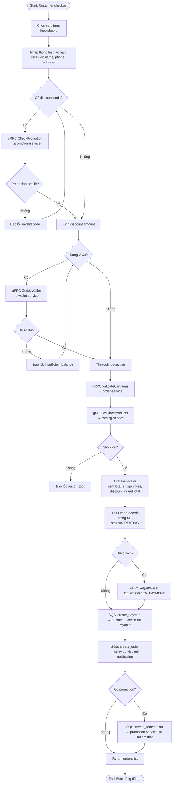

# ACT-01: Order Creation Activity

```mermaid
flowchart TD
    Start([Start: Customer checkout]) --> A[Chọn cart items\ntheo shopId]
    A --> B[Nhập thông tin giao hàng\nreceiver: name, phone, address]
    B --> C{Có discount code?}
    C -- Có --> D[gRPC CheckPromotion\n→ promotion-service]
    D --> E{Promotion hợp lệ?}
    E -- Không --> F[Báo lỗi: invalid code]
    F --> C
    E -- Có --> G[Tính discount amount]
    C -- Không --> G
    G --> H{Dùng V-Xu?}
    H -- Có --> I[gRPC GetMyWallet\n→ wallet-service]
    I --> J{Đủ số dư?}
    J -- Không --> K[Báo lỗi: insufficient balance]
    K --> H
    J -- Có --> L[Tính coin deduction]
    H -- Không --> L
    L --> M[gRPC ValidateCartItems\n→ order-service]
    M --> N[gRPC ValidateProducts\n→ catalog-service]
    N --> O{Stock đủ?}
    O -- Không --> P[Báo lỗi: out of stock]
    O -- Có --> Q[Tính toán totals\nitemTotal, shippingFee,\ndiscount, grandTotal]
    Q --> R[Tạo Order records\ntrong DB\nstatus=CREATING]
    R --> S{Dùng coin?}
    S -- Có --> T[gRPC AdjustWallet\nDEBIT, ORDER_PAYMENT]
    S -- Không --> U
    T --> U[SQS: create_payment\n→ payment-service tạo Payment]
    U --> V[SQS: create_order\n→ utility-service gửi notification]
    V --> W{Có promotion?}
    W -- Có --> X[SQS: create_redemption\n→ promotion-service tạo Redemption]
    W -- Không --> Y
    X --> Y[Return orders list]
    Y --> End([End: Đơn hàng đã tạo])
```
