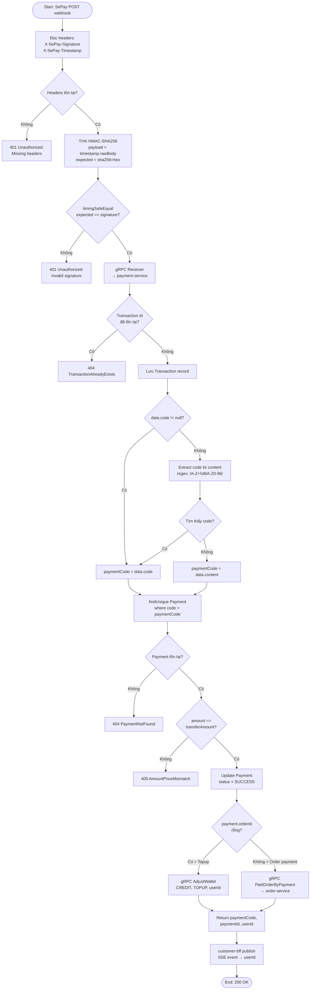

# ACT-02: SePay Webhook Processing Activity

```mermaid
flowchart TD
    Start([Start: SePay POST webhook]) --> A[Đọc headers:\nX-SePay-Signature\nX-SePay-Timestamp]
    A --> B{Headers tồn tại?}
    B -- Không --> ERR1[401 Unauthorized:\nMissing headers]
    B -- Có --> C[Tính HMAC-SHA256\npayload = timestamp.rawBody\nexpected = sha256=hex]
    C --> D{timingSafeEqual\nexpected == signature?}
    D -- Không --> ERR2[401 Unauthorized:\nInvalid signature]
    D -- Có --> E[gRPC Receiver\n→ payment-service]
    E --> F{Transaction id\nđã tồn tại?}
    F -- Có --> ERR3[404 TransactionAlreadyExists]
    F -- Không --> G[Lưu Transaction record]
    G --> H{data.code != null?}
    H -- Có --> I[paymentCode = data.code]
    H -- Không --> J[Extract code từ content\nregex: /A-Z+\\d6A-Z0-96/]
    J --> K{Tìm thấy code?}
    K -- Có --> I
    K -- Không --> L[paymentCode = data.content]
    L --> M
    I --> M[findUnique Payment\nwhere code = paymentCode]
    M --> N{Payment tồn tại?}
    N -- Không --> ERR4[404 PaymentNotFound]
    N -- Có --> O{amount ==\ntransferAmount?}
    O -- Không --> ERR5[400 AmountPriceMismatch]
    O -- Có --> P[Update Payment\nstatus = SUCCESS]
    P --> Q{payment.orderId\nrỗng?}
    Q -- Có = Topup --> R[gRPC AdjustWallet\nCREDIT, TOPUP, userId]
    Q -- Không = Order payment --> S[gRPC PaidOrderByPayment\n→ order-service]
    R --> T[Return paymentCode,\npaymentId, userId]
    S --> T
    T --> U[customer-bff publish\nSSE event → userId]
    U --> End([End: 200 OK])
```
