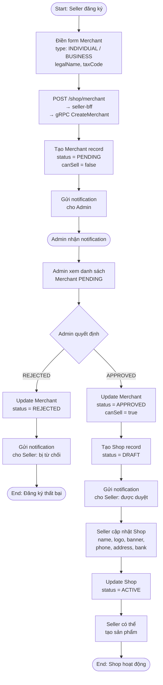

# ACT-03: Merchant Registration & Approval Activity

```mermaid
flowchart TD
    Start([Start: Seller đăng ký]) --> A[Điền form Merchant\ntype: INDIVIDUAL / BUSINESS\nlegalName, taxCode]
    A --> B[POST /shop/merchant\n→ seller-bff\n→ gRPC CreateMerchant]
    B --> C[Tạo Merchant record\nstatus = PENDING\ncanSell = false]
    C --> D[Gửi notification\ncho Admin]
    D --> E([Admin nhận notification])
    E --> F[Admin xem danh sách\nMerchant PENDING]
    F --> G{Admin quyết định}
    G -- APPROVED --> H[Update Merchant\nstatus = APPROVED\ncanSell = true]
    G -- REJECTED --> I[Update Merchant\nstatus = REJECTED]
    I --> J[Gửi notification\ncho Seller: bị từ chối]
    J --> End2([End: Đăng ký thất bại])
    H --> K[Tạo Shop record\nstatus = DRAFT]
    K --> L[Gửi notification\ncho Seller: được duyệt]
    L --> M[Seller cập nhật Shop\nname, logo, banner,\nphone, address, bank]
    M --> N[Update Shop\nstatus = ACTIVE]
    N --> O[Seller có thể\ntạo sản phẩm]
    O --> End([End: Shop hoạt động])
```
