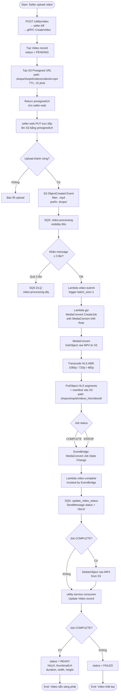

# ACT-04: Video Upload & Processing Activity

```mermaid
flowchart TD
    Start([Start: Seller upload video]) --> A[POST /utility/video\n→ seller-bff\n→ gRPC CreateVideo]
    A --> B[Tạo Video record\nstatus = PENDING]
    B --> C[Tạo S3 Presigned URL\npath: shops/shopId/videos/videoId.mp4\nTTL: 15 phút]
    C --> D[Return presignedUrl\ncho seller-web]
    D --> E[seller-web PUT trực tiếp\nlên S3 bằng presignedUrl]
    E --> F{Upload thành công?}
    F -- Không --> ERR[Báo lỗi upload]
    F -- Có --> G[S3 ObjectCreated Event\nfilter: .mp4\nprefix: shops/]
    G --> H[SQS: video-processing\nvisibility 60s]
    H --> I{Nhận message\n≤ 3 lần?}
    I -- Quá 3 lần --> DLQ[SQS DLQ:\nvideo-processing-dlq]
    I -- OK --> J[Lambda video-submit\ntrigger batch_size=1]
    J --> K[Lambda gọi\nMediaConvert CreateJob\nwith MediaConvert IAM Role]
    K --> L[MediaConvert\nGetObject raw MP4 từ S3]
    L --> M[Transcode HLS ABR:\n1080p / 720p / 480p]
    M --> N[PutObject HLS segments\n+ manifest vào S3\npath: shops/shopId/videos_hls/videoId/]
    N --> O{Job status}
    O -- COMPLETE --> P[EventBridge:\nMediaConvert Job State Change]
    O -- ERROR --> P
    P --> Q[Lambda video-complete\ninvoked by EventBridge]
    Q --> R[SQS: update_video_status\nSendMessage status + hlsUrl]
    R --> S{Job COMPLETE?}
    S -- Có --> T[DeleteObject raw MP4\nfrom S3]
    S -- Không --> U
    T --> U[utility-service consumer\nUpdate Video record]
    U --> V{Job COMPLETE?}
    V -- Có --> W[status = READY\nhlsUrl, thumbnailUrl\nduration, width, height]
    V -- Không --> X[status = FAILED]
    W --> End([End: Video sẵn sàng phát])
    X --> End2([End: Video thất bại])
```
