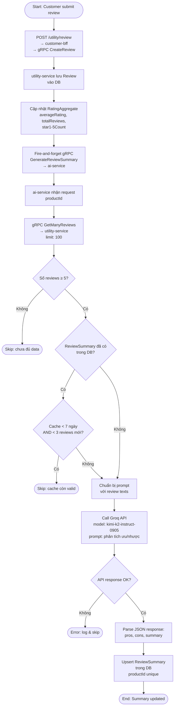

# ACT-05: AI Review Summary Generation Activity

```mermaid
flowchart TD
    Start([Start: Customer submit review]) --> A[POST /utility/review\n→ customer-bff\n→ gRPC CreateReview]
    A --> B[utility-service lưu Review\nvào DB]
    B --> C[Cập nhật RatingAggregate\naverageRating, totalReviews,\nstar1-5Count]
    C --> D[Fire-and-forget gRPC\nGenerateReviewSummary\n→ ai-service]
    D --> E[ai-service nhận request\nproductId]
    E --> F[gRPC GetManyReviews\n→ utility-service\nlimit: 100]
    F --> G{Số reviews ≥ 5?}
    G -- Không --> Skip1([Skip: chưa đủ data])
    G -- Có --> H{ReviewSummary đã có\ntrong DB?}
    H -- Có --> I{Cache < 7 ngày\nAND < 3 reviews mới?}
    I -- Có --> Skip2([Skip: cache còn valid])
    I -- Không --> J
    H -- Không --> J[Chuẩn bị prompt\nvới review texts]
    J --> K[Call Groq API\nmodel: kimi-k2-instruct-0905\nprompt: phân tích ưu/nhược]
    K --> L{API response OK?}
    L -- Không --> ERR([Error: log & skip])
    L -- Có --> M[Parse JSON response:\npros, cons, summary]
    M --> N[Upsert ReviewSummary\ntrong DB\nproductId unique]
    N --> End([End: Summary updated])
```
