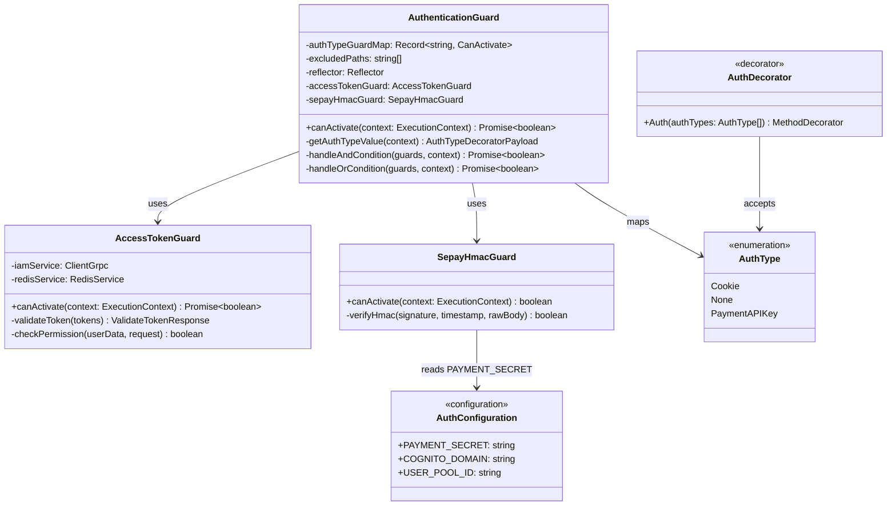

# CLS-01: BFF Authentication Guard Chain

```mermaid
classDiagram
    class AuthenticationGuard {
        -authTypeGuardMap: Record~string, CanActivate~
        -excludedPaths: string[]
        -reflector: Reflector
        -accessTokenGuard: AccessTokenGuard
        -sepayHmacGuard: SepayHmacGuard
        +canActivate(context: ExecutionContext) Promise~boolean~
        -getAuthTypeValue(context) AuthTypeDecoratorPayload
        -handleAndCondition(guards, context) Promise~boolean~
        -handleOrCondition(guards, context) Promise~boolean~
    }

    class AccessTokenGuard {
        -iamService: ClientGrpc
        -redisService: RedisService
        +canActivate(context: ExecutionContext) Promise~boolean~
        -validateToken(tokens) ValidateTokenResponse
        -checkPermission(userData, request) boolean
    }

    class SepayHmacGuard {
        +canActivate(context: ExecutionContext) boolean
        -verifyHmac(signature, timestamp, rawBody) boolean
    }

    class AuthDecorator {
        <<decorator>>
        +Auth(authTypes: AuthType[]) MethodDecorator
    }

    class AuthType {
        <<enumeration>>
        Cookie
        None
        PaymentAPIKey
    }

    class AuthConfiguration {
        <<configuration>>
        +PAYMENT_SECRET: string
        +COGNITO_DOMAIN: string
        +USER_POOL_ID: string
    }

    AuthenticationGuard --> AccessTokenGuard : uses
    AuthenticationGuard --> SepayHmacGuard : uses
    AuthenticationGuard --> AuthType : maps
    SepayHmacGuard --> AuthConfiguration : reads PAYMENT_SECRET
    AuthDecorator --> AuthType : accepts
```
