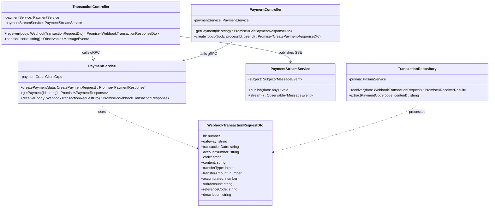

# CLS-02: Payment Domain

```mermaid
classDiagram
    class TransactionController {
        -paymentService: PaymentService
        -paymentStreamService: PaymentStreamService
        +receiver(body: WebhookTransactionRequestDto) Promise~WebhookTransactionResponseDto~
        +handle(userId: string) Observable~MessageEvent~
    }

    class PaymentController {
        -paymentService: PaymentService
        +getPayment(id: string) Promise~GetPaymentResponseDto~
        +createTopup(body, processId, userId) Promise~CreatePaymentResponseDto~
    }

    class PaymentService {
        -paymentGrpc: ClientGrpc
        +createPayment(data: CreatePaymentRequest) Promise~PaymentResponse~
        +getPayment(id: string) Promise~PaymentResponse~
        +receiver(body: WebhookTransactionRequestDto) Promise~WebhookTransactionResponse~
    }

    class PaymentStreamService {
        -subject: Subject~MessageEvent~
        +publish(data: any) void
        +stream() Observable~MessageEvent~
    }

    class WebhookTransactionRequestDto {
        +id: number
        +gateway: string
        +transactionDate: string
        +accountNumber: string
        +code: string
        +content: string
        +transferType: in|out
        +transferAmount: number
        +accumulated: number
        +subAccount: string
        +referenceCode: string
        +description: string
    }

    class TransactionRepository {
        -prisma: PrismaService
        +receiver(data: WebhookTransactionRequest) Promise~ReceiverResult~
        -extractPaymentCode(code, content) string
    }

    TransactionController --> PaymentService : calls gRPC
    TransactionController --> PaymentStreamService : publishes SSE
    PaymentController --> PaymentService : calls gRPC
    PaymentService ..> WebhookTransactionRequestDto : uses
    TransactionRepository ..> WebhookTransactionRequestDto : processes
```
