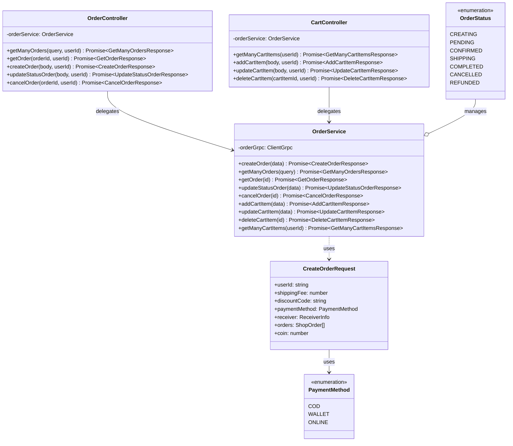

# CLS-03: Order Domain

```mermaid
classDiagram
    class OrderController {
        -orderService: OrderService
        +getManyOrders(query, userId) Promise~GetManyOrdersResponse~
        +getOrder(orderId, userId) Promise~GetOrderResponse~
        +createOrder(body, userId) Promise~CreateOrderResponse~
        +updateStatusOrder(body, userId) Promise~UpdateStatusOrderResponse~
        +cancelOrder(orderId, userId) Promise~CancelOrderResponse~
    }

    class CartController {
        -orderService: OrderService
        +getManyCartItems(userId) Promise~GetManyCartItemsResponse~
        +addCartItem(body, userId) Promise~AddCartItemResponse~
        +updateCartItem(body, userId) Promise~UpdateCartItemResponse~
        +deleteCartItem(cartItemId, userId) Promise~DeleteCartItemResponse~
    }

    class OrderService {
        -orderGrpc: ClientGrpc
        +createOrder(data) Promise~CreateOrderResponse~
        +getManyOrders(query) Promise~GetManyOrdersResponse~
        +getOrder(id) Promise~GetOrderResponse~
        +updateStatusOrder(data) Promise~UpdateStatusOrderResponse~
        +cancelOrder(id) Promise~CancelOrderResponse~
        +addCartItem(data) Promise~AddCartItemResponse~
        +updateCartItem(data) Promise~UpdateCartItemResponse~
        +deleteCartItem(id) Promise~DeleteCartItemResponse~
        +getManyCartItems(userId) Promise~GetManyCartItemsResponse~
    }

    class OrderStatus {
        <<enumeration>>
        CREATING
        PENDING
        CONFIRMED
        SHIPPING
        COMPLETED
        CANCELLED
        REFUNDED
    }

    class PaymentMethod {
        <<enumeration>>
        COD
        WALLET
        ONLINE
    }

    class CreateOrderRequest {
        +userId: string
        +shippingFee: number
        +discountCode: string
        +paymentMethod: PaymentMethod
        +receiver: ReceiverInfo
        +orders: ShopOrder[]
        +coin: number
    }

    OrderController --> OrderService : delegates
    CartController --> OrderService : delegates
    OrderService ..> CreateOrderRequest : uses
    CreateOrderRequest --> PaymentMethod : uses
    OrderStatus --o OrderService : manages
```
