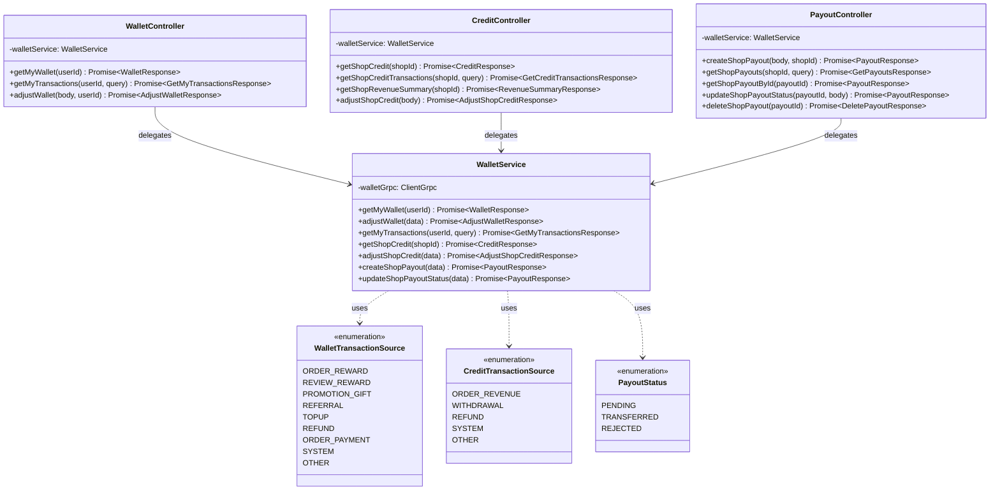

# CLS-04: Wallet Domain

```mermaid
classDiagram
    class WalletController {
        -walletService: WalletService
        +getMyWallet(userId) Promise~WalletResponse~
        +getMyTransactions(userId, query) Promise~GetMyTransactionsResponse~
        +adjustWallet(body, userId) Promise~AdjustWalletResponse~
    }

    class CreditController {
        -walletService: WalletService
        +getShopCredit(shopId) Promise~CreditResponse~
        +getShopCreditTransactions(shopId, query) Promise~GetCreditTransactionsResponse~
        +getShopRevenueSummary(shopId) Promise~RevenueSummaryResponse~
        +adjustShopCredit(body) Promise~AdjustShopCreditResponse~
    }

    class PayoutController {
        -walletService: WalletService
        +createShopPayout(body, shopId) Promise~PayoutResponse~
        +getShopPayouts(shopId, query) Promise~GetPayoutsResponse~
        +getShopPayoutById(payoutId) Promise~PayoutResponse~
        +updateShopPayoutStatus(payoutId, body) Promise~PayoutResponse~
        +deleteShopPayout(payoutId) Promise~DeletePayoutResponse~
    }

    class WalletService {
        -walletGrpc: ClientGrpc
        +getMyWallet(userId) Promise~WalletResponse~
        +adjustWallet(data) Promise~AdjustWalletResponse~
        +getMyTransactions(userId, query) Promise~GetMyTransactionsResponse~
        +getShopCredit(shopId) Promise~CreditResponse~
        +adjustShopCredit(data) Promise~AdjustShopCreditResponse~
        +createShopPayout(data) Promise~PayoutResponse~
        +updateShopPayoutStatus(data) Promise~PayoutResponse~
    }

    class WalletTransactionSource {
        <<enumeration>>
        ORDER_REWARD
        REVIEW_REWARD
        PROMOTION_GIFT
        REFERRAL
        TOPUP
        REFUND
        ORDER_PAYMENT
        SYSTEM
        OTHER
    }

    class CreditTransactionSource {
        <<enumeration>>
        ORDER_REVENUE
        WITHDRAWAL
        REFUND
        SYSTEM
        OTHER
    }

    class PayoutStatus {
        <<enumeration>>
        PENDING
        TRANSFERRED
        REJECTED
    }

    WalletController --> WalletService : delegates
    CreditController --> WalletService : delegates
    PayoutController --> WalletService : delegates
    WalletService ..> WalletTransactionSource : uses
    WalletService ..> CreditTransactionSource : uses
    WalletService ..> PayoutStatus : uses
```
