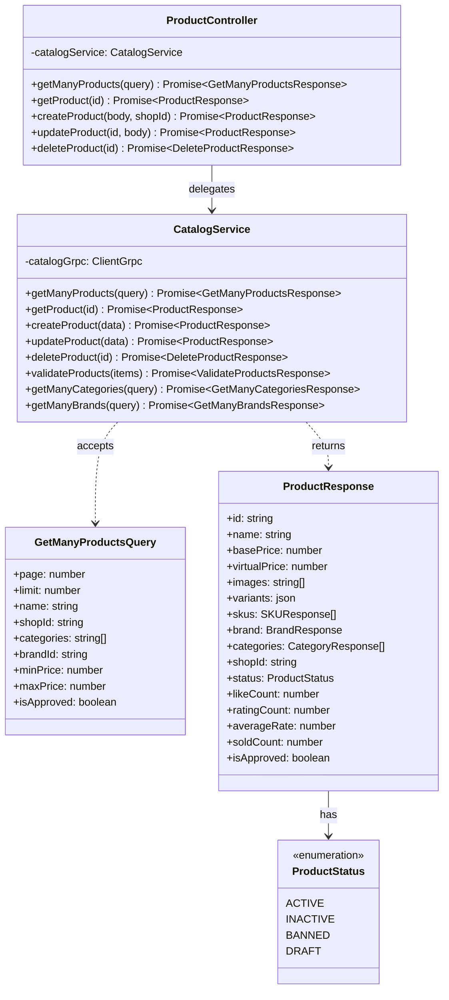

# CLS-05: Catalog Domain

```mermaid
classDiagram
    class ProductController {
        -catalogService: CatalogService
        +getManyProducts(query) Promise~GetManyProductsResponse~
        +getProduct(id) Promise~ProductResponse~
        +createProduct(body, shopId) Promise~ProductResponse~
        +updateProduct(id, body) Promise~ProductResponse~
        +deleteProduct(id) Promise~DeleteProductResponse~
    }

    class CatalogService {
        -catalogGrpc: ClientGrpc
        +getManyProducts(query) Promise~GetManyProductsResponse~
        +getProduct(id) Promise~ProductResponse~
        +createProduct(data) Promise~ProductResponse~
        +updateProduct(data) Promise~ProductResponse~
        +deleteProduct(id) Promise~DeleteProductResponse~
        +validateProducts(items) Promise~ValidateProductsResponse~
        +getManyCategories(query) Promise~GetManyCategoriesResponse~
        +getManyBrands(query) Promise~GetManyBrandsResponse~
    }

    class ProductStatus {
        <<enumeration>>
        ACTIVE
        INACTIVE
        BANNED
        DRAFT
    }

    class GetManyProductsQuery {
        +page: number
        +limit: number
        +name: string
        +shopId: string
        +categories: string[]
        +brandId: string
        +minPrice: number
        +maxPrice: number
        +isApproved: boolean
    }

    class ProductResponse {
        +id: string
        +name: string
        +basePrice: number
        +virtualPrice: number
        +images: string[]
        +variants: json
        +skus: SKUResponse[]
        +brand: BrandResponse
        +categories: CategoryResponse[]
        +shopId: string
        +status: ProductStatus
        +likeCount: number
        +ratingCount: number
        +averageRate: number
        +soldCount: number
        +isApproved: boolean
    }

    ProductController --> CatalogService : delegates
    CatalogService ..> GetManyProductsQuery : accepts
    CatalogService ..> ProductResponse : returns
    ProductResponse --> ProductStatus : has
```
