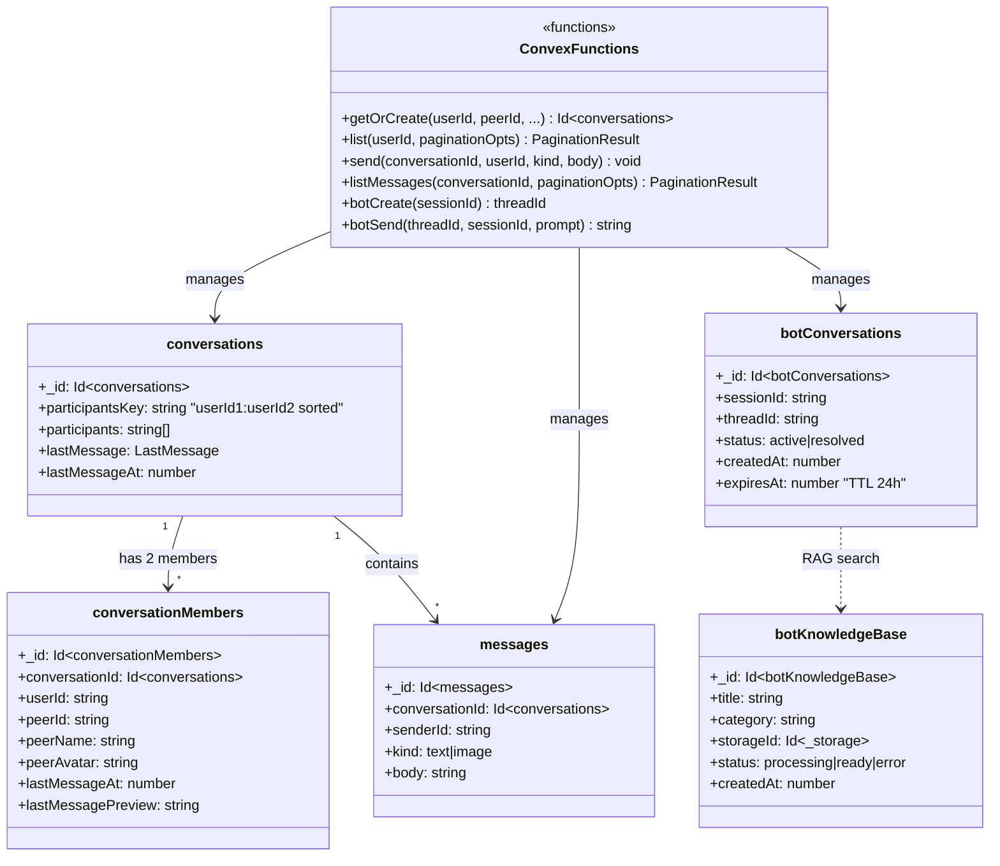

# CLS-06: Convex Chat Schema

```mermaid
classDiagram
    class conversations {
        +_id: Id~conversations~
        +participantsKey: string "userId1:userId2 sorted"
        +participants: string[]
        +lastMessage: LastMessage
        +lastMessageAt: number
    }

    class conversationMembers {
        +_id: Id~conversationMembers~
        +conversationId: Id~conversations~
        +userId: string
        +peerId: string
        +peerName: string
        +peerAvatar: string
        +lastMessageAt: number
        +lastMessagePreview: string
    }

    class messages {
        +_id: Id~messages~
        +conversationId: Id~conversations~
        +senderId: string
        +kind: text|image
        +body: string
    }

    class botConversations {
        +_id: Id~botConversations~
        +sessionId: string
        +threadId: string
        +status: active|resolved
        +createdAt: number
        +expiresAt: number "TTL 24h"
    }

    class botKnowledgeBase {
        +_id: Id~botKnowledgeBase~
        +title: string
        +category: string
        +storageId: Id~_storage~
        +status: processing|ready|error
        +createdAt: number
    }

    class ConvexFunctions {
        <<functions>>
        +getOrCreate(userId, peerId, ...) Id~conversations~
        +list(userId, paginationOpts) PaginationResult
        +send(conversationId, userId, kind, body) void
        +listMessages(conversationId, paginationOpts) PaginationResult
        +botCreate(sessionId) threadId
        +botSend(threadId, sessionId, prompt) string
    }

    conversations "1" --> "*" conversationMembers : has 2 members
    conversations "1" --> "*" messages : contains
    botConversations ..> botKnowledgeBase : RAG search
    ConvexFunctions --> conversations : manages
    ConvexFunctions --> messages : manages
    ConvexFunctions --> botConversations : manages
```
