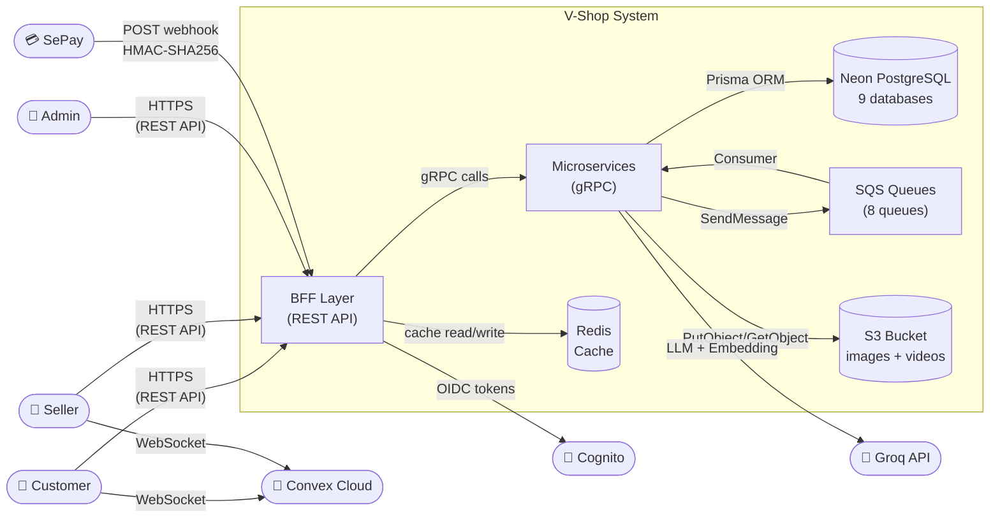

# DFD-01: System-Level Data Flow Diagram (Level 0)

```mermaid
flowchart LR
    Customer(["👤 Customer"])
    Seller(["🏪 Seller"])
    Admin(["🔑 Admin"])
    SePay(["💳 SePay"])
    Cognito(["🔐 Cognito"])
    Convex(["💬 Convex Cloud"])
    Groq(["🤖 Groq API"])

    subgraph VSHOP["V-Shop System"]
        BFF["BFF Layer\n(REST API)"]
        SVC["Microservices\n(gRPC)"]
        DB[("Neon PostgreSQL\n9 databases")]
        CACHE[("Redis\nCache")]
        QUEUE["SQS Queues\n(8 queues)"]
        S3[("S3 Bucket\nimages + videos")]
    end

    Customer -- "HTTPS\n(REST API)" --> BFF
    Seller -- "HTTPS\n(REST API)" --> BFF
    Admin -- "HTTPS\n(REST API)" --> BFF
    SePay -- "POST webhook\nHMAC-SHA256" --> BFF
    BFF -- "OIDC tokens" --> Cognito
    BFF -- "gRPC calls" --> SVC
    BFF -- "cache read/write" --> CACHE
    SVC -- "Prisma ORM" --> DB
    SVC -- "SendMessage" --> QUEUE
    QUEUE -- "Consumer" --> SVC
    SVC -- "PutObject/GetObject" --> S3
    Customer -- "WebSocket" --> Convex
    Seller -- "WebSocket" --> Convex
    SVC -- "LLM + Embedding" --> Groq
```
