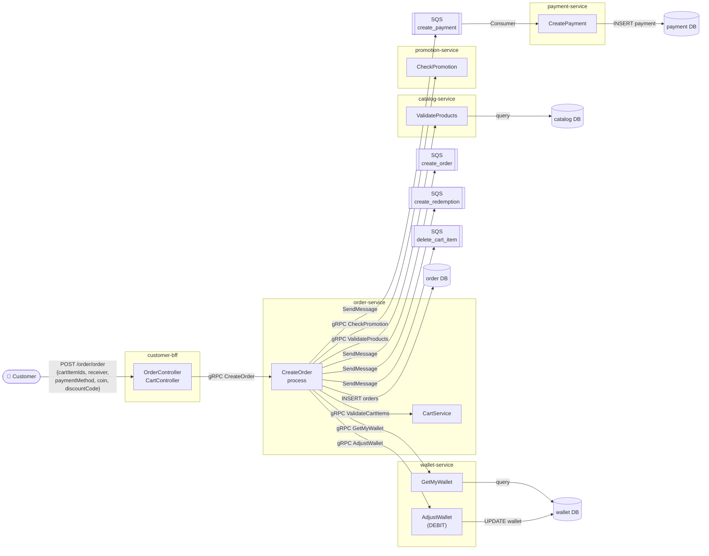

# DFD-02: Order Data Flow (Level 1)

```mermaid
flowchart LR
    Customer(["👤 Customer"])

    subgraph BFF["customer-bff"]
        OrderCtrl["OrderController\nCartController"]
    end

    subgraph OrderSvc["order-service"]
        CreateOrder["CreateOrder\nprocess"]
        CartSvc["CartService"]
    end

    subgraph CatalogSvc["catalog-service"]
        ValidateProducts["ValidateProducts"]
    end

    subgraph PromotionSvc["promotion-service"]
        CheckPromo["CheckPromotion"]
    end

    subgraph WalletSvc["wallet-service"]
        GetWallet["GetMyWallet"]
        AdjustWallet["AdjustWallet\n(DEBIT)"]
    end

    subgraph PaymentSvc["payment-service"]
        CreatePayment["CreatePayment"]
    end

    SQS_Payment[["SQS\ncreate_payment"]]
    SQS_Order[["SQS\ncreate_order"]]
    SQS_Redemption[["SQS\ncreate_redemption"]]
    SQS_Cart[["SQS\ndelete_cart_item"]]

    OrderDB[("order DB")]
    CatalogDB[("catalog DB")]
    WalletDB[("wallet DB")]
    PaymentDB[("payment DB")]

    Customer -- "POST /order/order\n{cartItemIds, receiver,\npaymentMethod, coin, discountCode}" --> OrderCtrl
    OrderCtrl -- "gRPC CreateOrder" --> CreateOrder
    CreateOrder -- "gRPC ValidateCartItems" --> CartSvc
    CreateOrder -- "gRPC ValidateProducts" --> ValidateProducts
    ValidateProducts -- "query" --> CatalogDB
    CreateOrder -- "gRPC CheckPromotion" --> CheckPromo
    CreateOrder -- "gRPC GetMyWallet" --> GetWallet
    GetWallet -- "query" --> WalletDB
    CreateOrder -- "INSERT orders" --> OrderDB
    CreateOrder -- "gRPC AdjustWallet" --> AdjustWallet
    AdjustWallet -- "UPDATE wallet" --> WalletDB
    CreateOrder -- "SendMessage" --> SQS_Payment
    CreateOrder -- "SendMessage" --> SQS_Order
    CreateOrder -- "SendMessage" --> SQS_Redemption
    CreateOrder -- "SendMessage" --> SQS_Cart
    SQS_Payment -- "Consumer" --> CreatePayment
    CreatePayment -- "INSERT payment" --> PaymentDB
```
