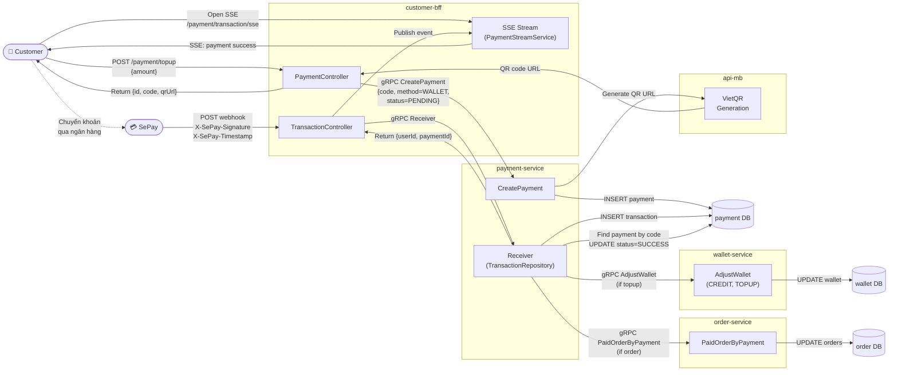

# DFD-03: Payment Data Flow (Level 1)

```mermaid
flowchart LR
    Customer(["👤 Customer"])
    SePay(["💳 SePay"])

    subgraph BFF["customer-bff"]
        PayCtrl["PaymentController"]
        TxCtrl["TransactionController"]
        SSE["SSE Stream\n(PaymentStreamService)"]
    end

    subgraph PaymentSvc["payment-service"]
        CreatePay["CreatePayment"]
        Receiver["Receiver\n(TransactionRepository)"]
    end

    subgraph WalletSvc["wallet-service"]
        AdjustWallet["AdjustWallet\n(CREDIT, TOPUP)"]
    end

    subgraph OrderSvc["order-service"]
        PaidOrder["PaidOrderByPayment"]
    end

    subgraph ApiMB["api-mb"]
        VietQR["VietQR\nGeneration"]
    end

    PaymentDB[("payment DB")]
    WalletDB[("wallet DB")]
    OrderDB[("order DB")]

    Customer -- "POST /payment/topup\n{amount}" --> PayCtrl
    PayCtrl -- "gRPC CreatePayment\n{code, method=WALLET,\nstatus=PENDING}" --> CreatePay
    CreatePay -- "INSERT payment" --> PaymentDB
    CreatePay -- "Generate QR URL" --> VietQR
    VietQR -- "QR code URL" --> PayCtrl
    PayCtrl -- "Return {id, code, qrUrl}" --> Customer
    Customer -- "Open SSE\n/payment/transaction/sse" --> SSE

    Customer -. "Chuyển khoản\nqua ngân hàng" .-> SePay
    SePay -- "POST webhook\nX-SePay-Signature\nX-SePay-Timestamp" --> TxCtrl
    TxCtrl -- "gRPC Receiver" --> Receiver
    Receiver -- "INSERT transaction" --> PaymentDB
    Receiver -- "Find payment by code\nUPDATE status=SUCCESS" --> PaymentDB
    Receiver -- "gRPC AdjustWallet\n(if topup)" --> AdjustWallet
    AdjustWallet -- "UPDATE wallet" --> WalletDB
    Receiver -- "gRPC PaidOrderByPayment\n(if order)" --> PaidOrder
    PaidOrder -- "UPDATE orders" --> OrderDB
    Receiver -- "Return {userId, paymentId}" --> TxCtrl
    TxCtrl -- "Publish event" --> SSE
    SSE -- "SSE: payment success" --> Customer
```
