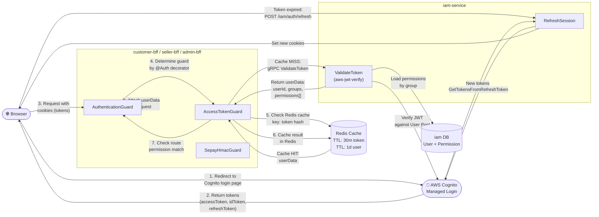

# DFD-04: Authentication Data Flow (Level 1)

```mermaid
flowchart LR
    Browser(["🌐 Browser"])
    Cognito(["🔐 AWS Cognito\nManaged Login"])

    subgraph BFF["customer-bff / seller-bff / admin-bff"]
        AuthGuard["AuthenticationGuard"]
        AccessGuard["AccessTokenGuard"]
        SepayGuard["SepayHmacGuard"]
    end

    subgraph IAMSvc["iam-service"]
        ValidateToken["ValidateToken\n(aws-jwt-verify)"]
        RefreshSession["RefreshSession"]
    end

    Redis[("Redis Cache\nTTL: 30m token\nTTL: 1d user")]
    IAMDB[("iam DB\nUser + Permission")]

    Browser -- "1. Redirect to\nCognito login page" --> Cognito
    Cognito -- "2. Return tokens\n(accessToken, idToken,\nrefreshToken)" --> Browser
    Browser -- "3. Request with\ncookies (tokens)" --> AuthGuard
    AuthGuard -- "4. Determine guard\nby @Auth decorator" --> AccessGuard
    AccessGuard -- "5. Check Redis cache\nkey: token hash" --> Redis
    Redis -- "Cache HIT:\nuserData" --> AccessGuard
    AccessGuard -- "Cache MISS:\ngRPC ValidateToken" --> ValidateToken
    ValidateToken -- "Verify JWT\nagainst User Pool" --> Cognito
    ValidateToken -- "Load permissions\nby group" --> IAMDB
    ValidateToken -- "Return userData:\nuserId, groups,\npermissions[]" --> AccessGuard
    AccessGuard -- "6. Cache result\nin Redis" --> Redis
    AccessGuard -- "7. Check route\npermission match" --> AuthGuard
    AuthGuard -- "8. Attach userData\nto request" --> BFF

    Browser -- "Token expired:\nPOST /iam/auth/refresh" --> RefreshSession
    RefreshSession -- "GetTokensFromRefreshToken" --> Cognito
    Cognito -- "New tokens" --> RefreshSession
    RefreshSession -- "Set new cookies" --> Browser
```
