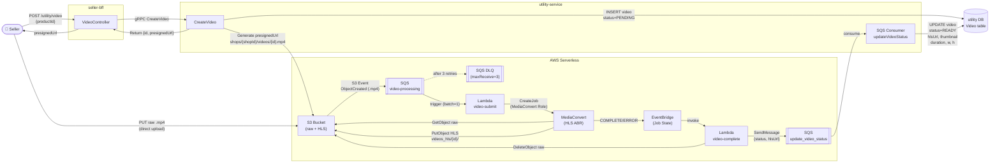

# DFD-05: Video Processing Data Flow (Level 1)

```mermaid
flowchart LR
    Seller(["🏪 Seller"])

    subgraph BFF["seller-bff"]
        VideoCtrl["VideoController"]
    end

    subgraph UtilitySvc["utility-service"]
        CreateVideo["CreateVideo"]
        Consumer["SQS Consumer\nupdateVideoStatus"]
    end

    subgraph AWS["AWS Serverless"]
        S3["S3 Bucket\n(raw + HLS)"]
        SQS_Proc[["SQS\nvideo-processing"]]
        SQS_DLQ[["SQS DLQ\n(maxReceive=3)"]]
        LamSubmit["Lambda\nvideo-submit"]
        MC["MediaConvert\n(HLS ABR)"]
        EB["EventBridge\n(Job State)"]
        LamComplete["Lambda\nvideo-complete"]
        SQS_Status[["SQS\nupdate_video_status"]]
    end

    UtilityDB[("utility DB\nVideo table")]

    Seller -- "POST /utility/video\n{productId}" --> VideoCtrl
    VideoCtrl -- "gRPC CreateVideo" --> CreateVideo
    CreateVideo -- "INSERT video\nstatus=PENDING" --> UtilityDB
    CreateVideo -- "Generate presignedUrl\nshops/{shopId}/videos/{id}.mp4" --> S3
    CreateVideo -- "Return {id, presignedUrl}" --> VideoCtrl
    VideoCtrl -- "presignedUrl" --> Seller
    Seller -- "PUT raw .mp4\n(direct upload)" --> S3

    S3 -- "S3 Event\nObjectCreated (.mp4)" --> SQS_Proc
    SQS_Proc -- "trigger (batch=1)" --> LamSubmit
    SQS_Proc -. "after 3 retries" .-> SQS_DLQ
    LamSubmit -- "CreateJob\n(MediaConvert Role)" --> MC
    MC -- "GetObject raw" --> S3
    MC -- "PutObject HLS\nvideos_hls/{id}/" --> S3
    MC -- "COMPLETE/ERROR" --> EB
    EB -- "invoke" --> LamComplete
    LamComplete -- "DeleteObject raw" --> S3
    LamComplete -- "SendMessage\n{status, hlsUrl}" --> SQS_Status
    SQS_Status -- "consume" --> Consumer
    Consumer -- "UPDATE video\nstatus=READY\nhlsUrl, thumbnail\nduration, w, h" --> UtilityDB
```
