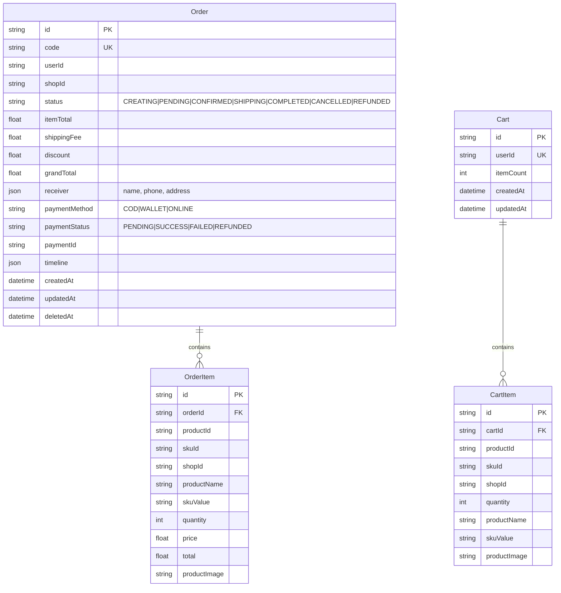

# ERD-01: Order Service

```mermaid
erDiagram
    Order {
        string id PK
        string code UK
        string userId
        string shopId
        string status "CREATING|PENDING|CONFIRMED|SHIPPING|COMPLETED|CANCELLED|REFUNDED"
        float itemTotal
        float shippingFee
        float discount
        float grandTotal
        json receiver "name, phone, address"
        string paymentMethod "COD|WALLET|ONLINE"
        string paymentStatus "PENDING|SUCCESS|FAILED|REFUNDED"
        string paymentId
        json timeline
        datetime createdAt
        datetime updatedAt
        datetime deletedAt
    }

    OrderItem {
        string id PK
        string orderId FK
        string productId
        string skuId
        string shopId
        string productName
        string skuValue
        int quantity
        float price
        float total
        string productImage
    }

    Cart {
        string id PK
        string userId UK
        int itemCount
        datetime createdAt
        datetime updatedAt
    }

    CartItem {
        string id PK
        string cartId FK
        string productId
        string skuId
        string shopId
        int quantity
        string productName
        string skuValue
        string productImage
    }

    Order ||--o{ OrderItem : "contains"
    Cart ||--o{ CartItem : "contains"
```
