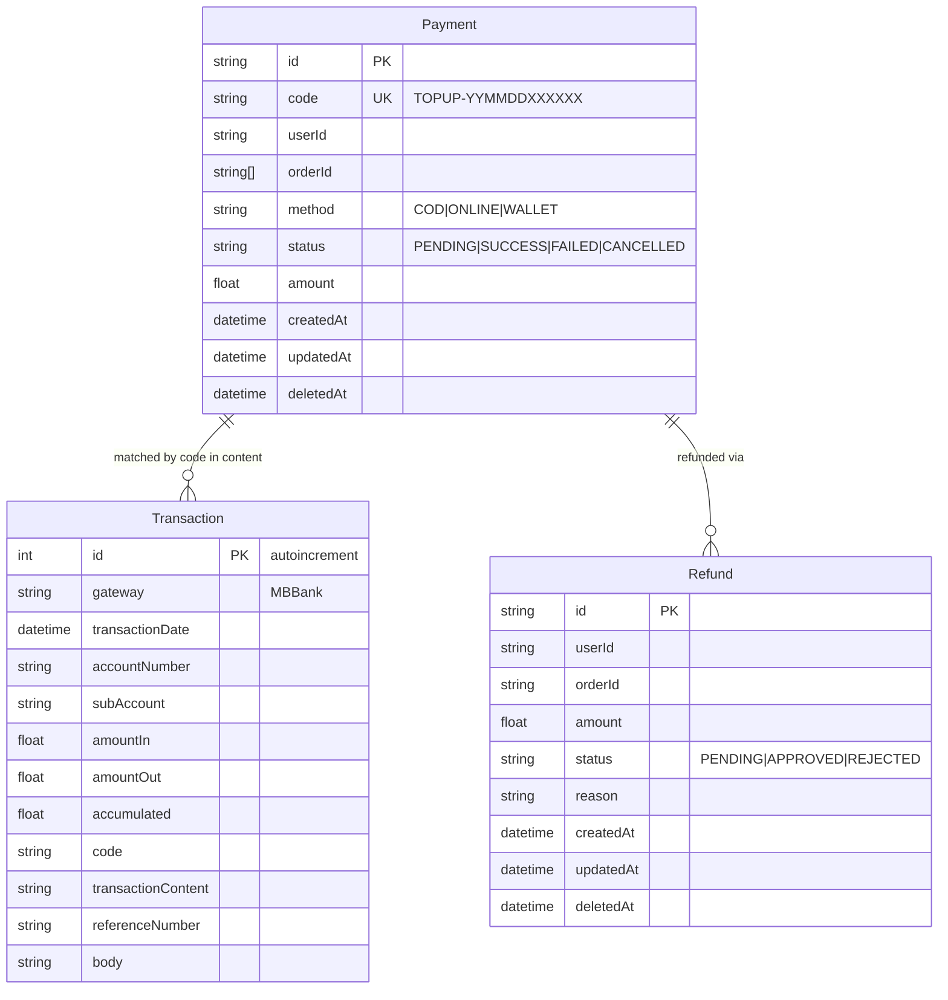

# ERD-02: Payment Service

```mermaid
erDiagram
    Payment {
        string id PK
        string code UK "TOPUP-YYMMDDXXXXXX"
        string userId
        string[] orderId
        string method "COD|ONLINE|WALLET"
        string status "PENDING|SUCCESS|FAILED|CANCELLED"
        float amount
        datetime createdAt
        datetime updatedAt
        datetime deletedAt
    }

    Transaction {
        int id PK "autoincrement"
        string gateway "MBBank"
        datetime transactionDate
        string accountNumber
        string subAccount
        float amountIn
        float amountOut
        float accumulated
        string code
        string transactionContent
        string referenceNumber
        string body
    }

    Refund {
        string id PK
        string userId
        string orderId
        float amount
        string status "PENDING|APPROVED|REJECTED"
        string reason
        datetime createdAt
        datetime updatedAt
        datetime deletedAt
    }

    Payment ||--o{ Transaction : "matched by code in content"
    Payment ||--o{ Refund : "refunded via"
```
