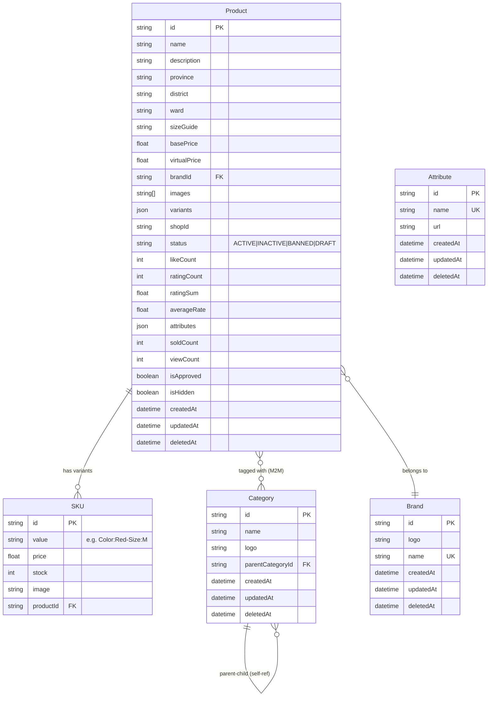

# ERD-03: Catalog Service

```mermaid
erDiagram
    Product {
        string id PK
        string name
        string description
        string province
        string district
        string ward
        string sizeGuide
        float basePrice
        float virtualPrice
        string brandId FK
        string[] images
        json variants
        string shopId
        string status "ACTIVE|INACTIVE|BANNED|DRAFT"
        int likeCount
        int ratingCount
        float ratingSum
        float averageRate
        json attributes
        int soldCount
        int viewCount
        boolean isApproved
        boolean isHidden
        datetime createdAt
        datetime updatedAt
        datetime deletedAt
    }

    SKU {
        string id PK
        string value "e.g. Color:Red-Size:M"
        float price
        int stock
        string image
        string productId FK
    }

    Category {
        string id PK
        string name
        string logo
        string parentCategoryId FK
        datetime createdAt
        datetime updatedAt
        datetime deletedAt
    }

    Brand {
        string id PK
        string logo
        string name UK
        datetime createdAt
        datetime updatedAt
        datetime deletedAt
    }

    Attribute {
        string id PK
        string name UK
        string url
        datetime createdAt
        datetime updatedAt
        datetime deletedAt
    }

    Product }o--|| Brand : "belongs to"
    Product }o--o{ Category : "tagged with (M2M)"
    Product ||--o{ SKU : "has variants"
    Category ||--o{ Category : "parent-child (self-ref)"
```
