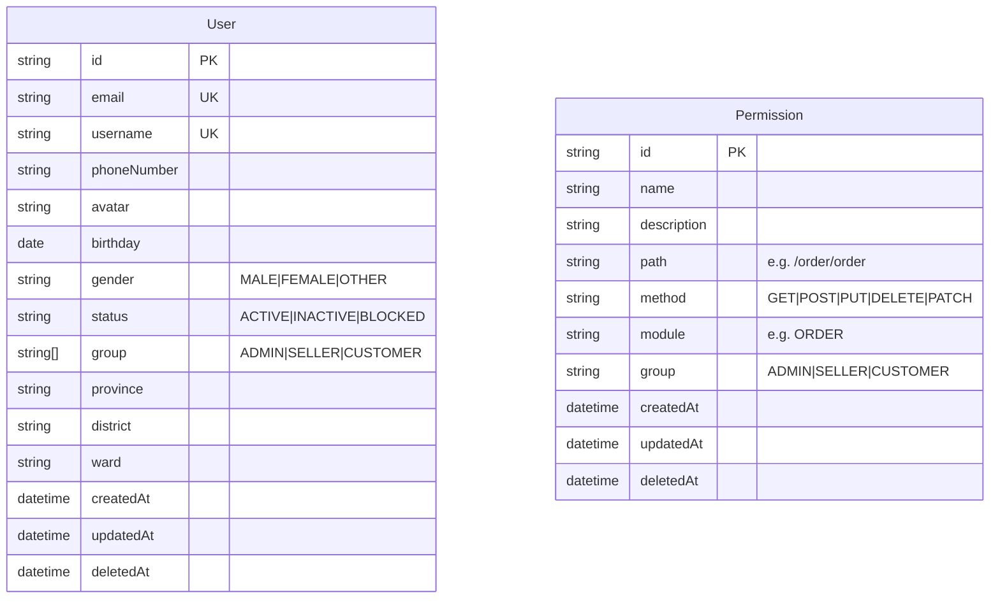

# ERD-04: IAM Service

```mermaid
erDiagram
    User {
        string id PK
        string email UK
        string username UK
        string phoneNumber
        string avatar
        date birthday
        string gender "MALE|FEMALE|OTHER"
        string status "ACTIVE|INACTIVE|BLOCKED"
        string[] group "ADMIN|SELLER|CUSTOMER"
        string province
        string district
        string ward
        datetime createdAt
        datetime updatedAt
        datetime deletedAt
    }

    Permission {
        string id PK
        string name
        string description
        string path "e.g. /order/order"
        string method "GET|POST|PUT|DELETE|PATCH"
        string module "e.g. ORDER"
        string group "ADMIN|SELLER|CUSTOMER"
        datetime createdAt
        datetime updatedAt
        datetime deletedAt
    }
```
