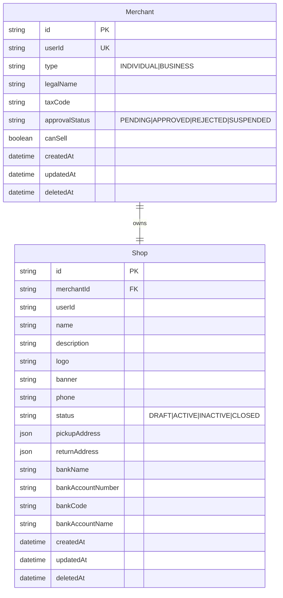

# ERD-05: Shop Service

```mermaid
erDiagram
    Merchant {
        string id PK
        string userId UK
        string type "INDIVIDUAL|BUSINESS"
        string legalName
        string taxCode
        string approvalStatus "PENDING|APPROVED|REJECTED|SUSPENDED"
        boolean canSell
        datetime createdAt
        datetime updatedAt
        datetime deletedAt
    }

    Shop {
        string id PK
        string merchantId FK
        string userId
        string name
        string description
        string logo
        string banner
        string phone
        string status "DRAFT|ACTIVE|INACTIVE|CLOSED"
        json pickupAddress
        json returnAddress
        string bankName
        string bankAccountNumber
        string bankCode
        string bankAccountName
        datetime createdAt
        datetime updatedAt
        datetime deletedAt
    }

    Merchant ||--|| Shop : "owns"
```
