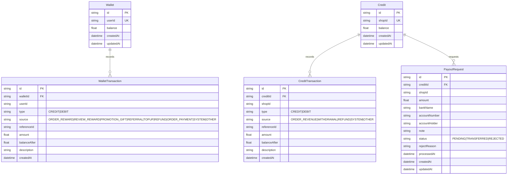

# ERD-06: Wallet Service

```mermaid
erDiagram
    Wallet {
        string id PK
        string userId UK
        float balance
        datetime createdAt
        datetime updatedAt
    }

    WalletTransaction {
        string id PK
        string walletId FK
        string userId
        string type "CREDIT|DEBIT"
        string source "ORDER_REWARD|REVIEW_REWARD|PROMOTION_GIFT|REFERRAL|TOPUP|REFUND|ORDER_PAYMENT|SYSTEM|OTHER"
        string referenceId
        float amount
        float balanceAfter
        string description
        datetime createdAt
    }

    Credit {
        string id PK
        string shopId UK
        float balance
        datetime createdAt
        datetime updatedAt
    }

    CreditTransaction {
        string id PK
        string creditId FK
        string shopId
        string type "CREDIT|DEBIT"
        string source "ORDER_REVENUE|WITHDRAWAL|REFUND|SYSTEM|OTHER"
        string referenceId
        float amount
        float balanceAfter
        string description
        datetime createdAt
    }

    PayoutRequest {
        string id PK
        string creditId FK
        string shopId
        float amount
        string bankName
        string accountNumber
        string accountHolder
        string note
        string status "PENDING|TRANSFERRED|REJECTED"
        string rejectReason
        datetime processedAt
        datetime createdAt
        datetime updatedAt
    }

    Wallet ||--o{ WalletTransaction : "records"
    Credit ||--o{ CreditTransaction : "records"
    Credit ||--o{ PayoutRequest : "requests"
```
