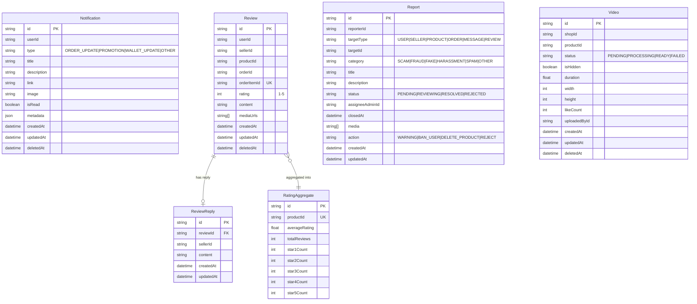

# ERD-07: Utility Service

```mermaid
erDiagram
    Notification {
        string id PK
        string userId
        string type "ORDER_UPDATE|PROMOTION|WALLET_UPDATE|OTHER"
        string title
        string description
        string link
        string image
        boolean isRead
        json metadata
        datetime createdAt
        datetime updatedAt
        datetime deletedAt
    }

    Review {
        string id PK
        string userId
        string sellerId
        string productId
        string orderId
        string orderItemId UK
        int rating "1-5"
        string content
        string[] mediaUrls
        datetime createdAt
        datetime updatedAt
        datetime deletedAt
    }

    ReviewReply {
        string id PK
        string reviewId FK
        string sellerId
        string content
        datetime createdAt
        datetime updatedAt
    }

    RatingAggregate {
        string id PK
        string productId UK
        float averageRating
        int totalReviews
        int star1Count
        int star2Count
        int star3Count
        int star4Count
        int star5Count
    }

    Report {
        string id PK
        string reporterId
        string targetType "USER|SELLER|PRODUCT|ORDER|MESSAGE|REVIEW"
        string targetId
        string category "SCAM|FRAUD|FAKE|HARASSMENT|SPAM|OTHER"
        string title
        string description
        string status "PENDING|REVIEWING|RESOLVED|REJECTED"
        string assigneeAdminId
        datetime closedAt
        string[] media
        string action "WARNING|BAN_USER|DELETE_PRODUCT|REJECT"
        datetime createdAt
        datetime updatedAt
    }

    Video {
        string id PK
        string shopId
        string productId
        string status "PENDING|PROCESSING|READY|FAILED"
        boolean isHidden
        float duration
        int width
        int height
        int likeCount
        string uploadedById
        datetime createdAt
        datetime updatedAt
        datetime deletedAt
    }

    Review ||--o| ReviewReply : "has reply"
    Review }o--|| RatingAggregate : "aggregated into"
```
