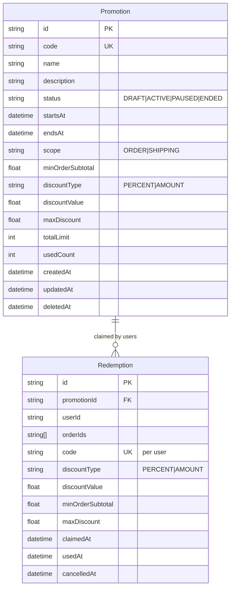

# ERD-08: Promotion Service

```mermaid
erDiagram
    Promotion {
        string id PK
        string code UK
        string name
        string description
        string status "DRAFT|ACTIVE|PAUSED|ENDED"
        datetime startsAt
        datetime endsAt
        string scope "ORDER|SHIPPING"
        float minOrderSubtotal
        string discountType "PERCENT|AMOUNT"
        float discountValue
        float maxDiscount
        int totalLimit
        int usedCount
        datetime createdAt
        datetime updatedAt
        datetime deletedAt
    }

    Redemption {
        string id PK
        string promotionId FK
        string userId
        string[] orderIds
        string code UK "per user"
        string discountType "PERCENT|AMOUNT"
        float discountValue
        float minOrderSubtotal
        float maxDiscount
        datetime claimedAt
        datetime usedAt
        datetime cancelledAt
    }

    Promotion ||--o{ Redemption : "claimed by users"
```
