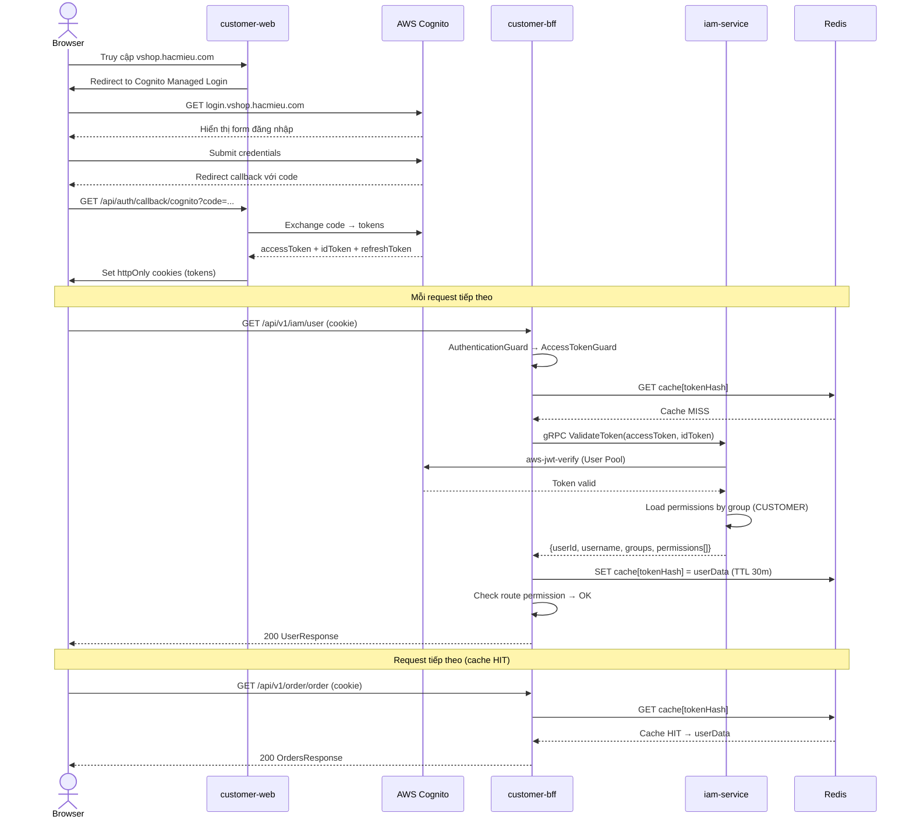

# SEQ-01: Customer Login (Cognito OIDC)

```mermaid
sequenceDiagram
    actor Browser
    participant CW as customer-web
    participant Cognito as AWS Cognito
    participant CBFF as customer-bff
    participant IAM as iam-service
    participant Redis

    Browser->>CW: Truy cập vshop.hacmieu.com
    CW->>Browser: Redirect to Cognito Managed Login
    Browser->>Cognito: GET login.vshop.hacmieu.com
    Cognito-->>Browser: Hiển thị form đăng nhập

    Browser->>Cognito: Submit credentials
    Cognito-->>Browser: Redirect callback với code
    Browser->>CW: GET /api/auth/callback/cognito?code=...

    CW->>Cognito: Exchange code → tokens
    Cognito-->>CW: accessToken + idToken + refreshToken
    CW->>Browser: Set httpOnly cookies (tokens)

    Note over Browser,Redis: Mỗi request tiếp theo

    Browser->>CBFF: GET /api/v1/iam/user (cookie)
    CBFF->>CBFF: AuthenticationGuard → AccessTokenGuard
    CBFF->>Redis: GET cache[tokenHash]
    Redis-->>CBFF: Cache MISS

    CBFF->>IAM: gRPC ValidateToken(accessToken, idToken)
    IAM->>Cognito: aws-jwt-verify (User Pool)
    Cognito-->>IAM: Token valid
    IAM->>IAM: Load permissions by group (CUSTOMER)
    IAM-->>CBFF: {userId, username, groups, permissions[]}

    CBFF->>Redis: SET cache[tokenHash] = userData (TTL 30m)
    CBFF->>CBFF: Check route permission → OK
    CBFF-->>Browser: 200 UserResponse

    Note over Browser,Redis: Request tiếp theo (cache HIT)
    Browser->>CBFF: GET /api/v1/order/order (cookie)
    CBFF->>Redis: GET cache[tokenHash]
    Redis-->>CBFF: Cache HIT → userData
    CBFF-->>Browser: 200 OrdersResponse
```
