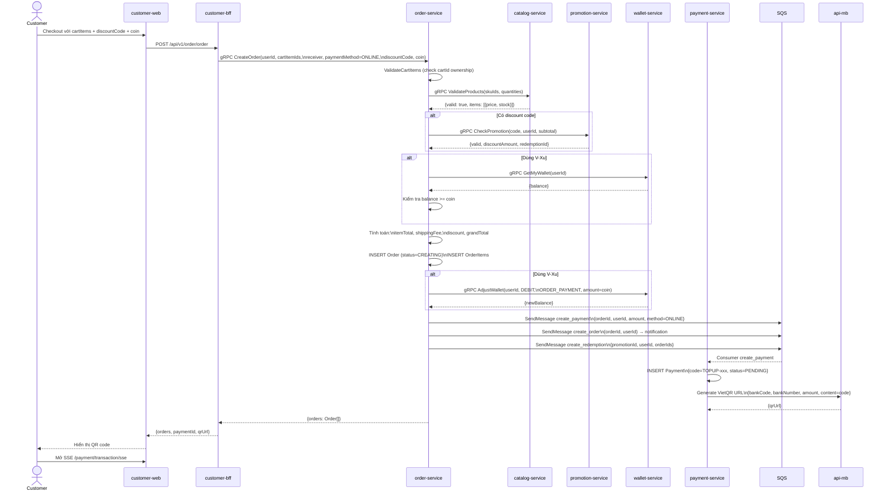

# SEQ-02: Place Order (ONLINE QR Payment)

```mermaid
sequenceDiagram
    actor Customer
    participant CW as customer-web
    participant CBFF as customer-bff
    participant OS as order-service
    participant CS as catalog-service
    participant PS as promotion-service
    participant WS as wallet-service
    participant PAY as payment-service
    participant SQS
    participant APIMB as api-mb

    Customer->>CW: Checkout với cartItems + discountCode + coin
    CW->>CBFF: POST /api/v1/order/order
    CBFF->>OS: gRPC CreateOrder(userId, cartItemIds,\nreceiver, paymentMethod=ONLINE,\ndiscountCode, coin)

    OS->>OS: ValidateCartItems (check cartId ownership)

    OS->>CS: gRPC ValidateProducts(skuIds, quantities)
    CS-->>OS: {valid: true, items: [{price, stock}]}

    alt Có discount code
        OS->>PS: gRPC CheckPromotion(code, userId, subtotal)
        PS-->>OS: {valid, discountAmount, redemptionId}
    end

    alt Dùng V-Xu
        OS->>WS: gRPC GetMyWallet(userId)
        WS-->>OS: {balance}
        OS->>OS: Kiểm tra balance >= coin
    end

    OS->>OS: Tính toán:\nitemTotal, shippingFee,\ndiscount, grandTotal

    OS->>OS: INSERT Order (status=CREATING)\nINSERT OrderItems

    alt Dùng V-Xu
        OS->>WS: gRPC AdjustWallet(userId, DEBIT,\nORDER_PAYMENT, amount=coin)
        WS-->>OS: {newBalance}
    end

    OS->>SQS: SendMessage create_payment\n{orderId, userId, amount, method=ONLINE}
    OS->>SQS: SendMessage create_order\n{orderId, userId} → notification
    OS->>SQS: SendMessage create_redemption\n{promotionId, userId, orderIds}

    SQS-->>PAY: Consumer create_payment
    PAY->>PAY: INSERT Payment\n{code=TOPUP-xxx, status=PENDING}
    PAY->>APIMB: Generate VietQR URL\n{bankCode, bankNumber, amount, content=code}
    APIMB-->>PAY: {qrUrl}

    OS-->>CBFF: {orders: Order[]}
    CBFF-->>CW: {orders, paymentId, qrUrl}
    CW-->>Customer: Hiển thị QR code
    Customer->>CW: Mở SSE /payment/transaction/sse
```
