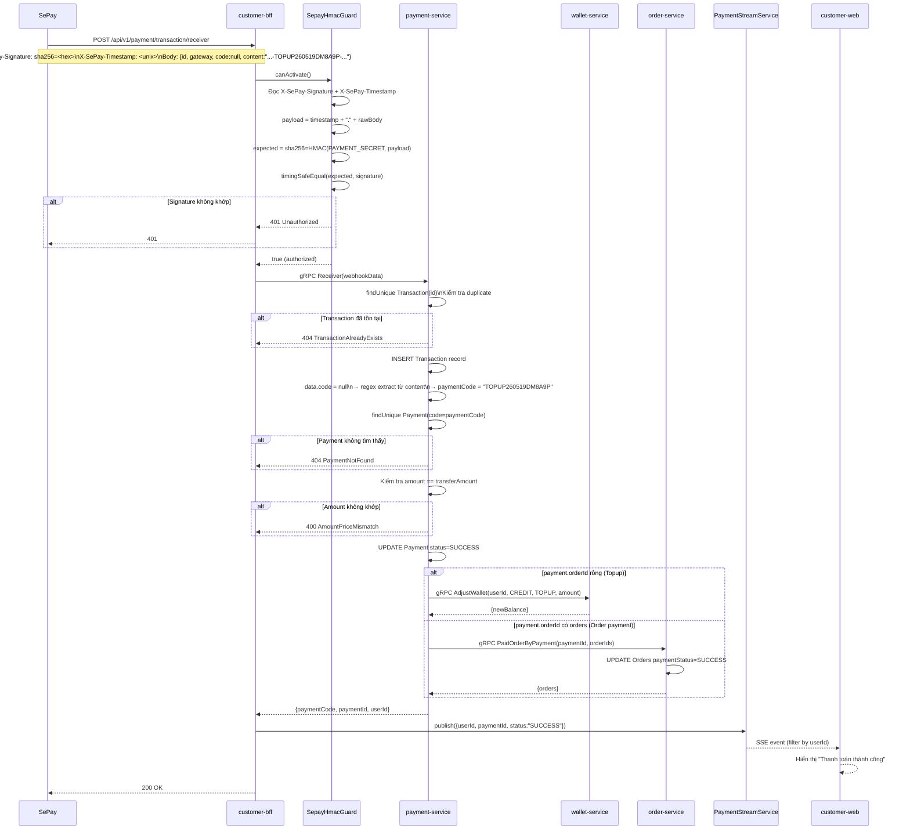

# SEQ-03: SePay Webhook → Payment Confirmation

```mermaid
sequenceDiagram
    participant SePay
    participant CBFF as customer-bff
    participant Guard as SepayHmacGuard
    participant PAY as payment-service
    participant WS as wallet-service
    participant OS as order-service
    participant SSE as PaymentStreamService
    participant CW as customer-web

    SePay->>CBFF: POST /api/v1/payment/transaction/receiver
    Note over SePay,CBFF: Headers: X-SePay-Signature: sha256=<hex>\nX-SePay-Timestamp: <unix>\nBody: {id, gateway, code:null, content:"...-TOPUP260519DM8A9P-..."}

    CBFF->>Guard: canActivate()
    Guard->>Guard: Đọc X-SePay-Signature + X-SePay-Timestamp
    Guard->>Guard: payload = timestamp + "." + rawBody
    Guard->>Guard: expected = sha256=HMAC(PAYMENT_SECRET, payload)
    Guard->>Guard: timingSafeEqual(expected, signature)
    alt Signature không khớp
        Guard-->>CBFF: 401 Unauthorized
        CBFF-->>SePay: 401
    end

    Guard-->>CBFF: true (authorized)
    CBFF->>PAY: gRPC Receiver(webhookData)

    PAY->>PAY: findUnique Transaction(id)\nKiểm tra duplicate
    alt Transaction đã tồn tại
        PAY-->>CBFF: 404 TransactionAlreadyExists
    end

    PAY->>PAY: INSERT Transaction record

    PAY->>PAY: data.code = null\n→ regex extract từ content\n→ paymentCode = "TOPUP260519DM8A9P"

    PAY->>PAY: findUnique Payment(code=paymentCode)
    alt Payment không tìm thấy
        PAY-->>CBFF: 404 PaymentNotFound
    end

    PAY->>PAY: Kiểm tra amount == transferAmount
    alt Amount không khớp
        PAY-->>CBFF: 400 AmountPriceMismatch
    end

    PAY->>PAY: UPDATE Payment status=SUCCESS

    alt payment.orderId rỗng (Topup)
        PAY->>WS: gRPC AdjustWallet(userId, CREDIT, TOPUP, amount)
        WS-->>PAY: {newBalance}
    else payment.orderId có orders (Order payment)
        PAY->>OS: gRPC PaidOrderByPayment(paymentId, orderIds)
        OS->>OS: UPDATE Orders paymentStatus=SUCCESS
        OS-->>PAY: {orders}
    end

    PAY-->>CBFF: {paymentCode, paymentId, userId}
    CBFF->>SSE: publish({userId, paymentId, status:"SUCCESS"})
    SSE-->>CW: SSE event (filter by userId)
    CW-->>CW: Hiển thị "Thanh toán thành công"
    CBFF-->>SePay: 200 OK
```
