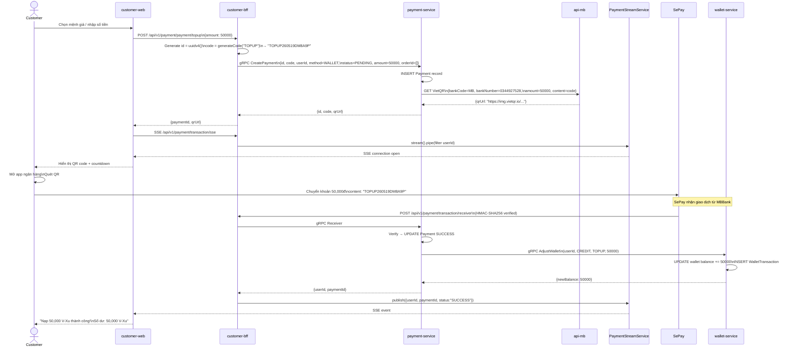

# SEQ-04: QR Topup (Nạp V-Xu)

```mermaid
sequenceDiagram
    actor Customer
    participant CW as customer-web
    participant CBFF as customer-bff
    participant PAY as payment-service
    participant APIMB as api-mb
    participant SSE as PaymentStreamService
    participant SePay
    participant WS as wallet-service

    Customer->>CW: Chọn mệnh giá / nhập số tiền
    CW->>CBFF: POST /api/v1/payment/payment/topup\n{amount: 50000}

    CBFF->>CBFF: Generate id = uuidv4()\ncode = generateCode("TOPUP")\n→ "TOPUP260519DM8A9P"

    CBFF->>PAY: gRPC CreatePayment\n{id, code, userId, method=WALLET,\nstatus=PENDING, amount=50000, orderId=[]}

    PAY->>PAY: INSERT Payment record
    PAY->>APIMB: GET VietQR\n{bankCode=MB, bankNumber=0344927528,\namount=50000, content=code}
    APIMB-->>PAY: {qrUrl: "https://img.vietqr.io/..."}
    PAY-->>CBFF: {id, code, qrUrl}
    CBFF-->>CW: {paymentId, qrUrl}

    CW->>CBFF: SSE /api/v1/payment/transaction/sse
    CBFF->>SSE: stream().pipe(filter userId)
    SSE-->>CW: SSE connection open

    CW-->>Customer: Hiển thị QR code + countdown

    Customer->>Customer: Mở app ngân hàng\nQuét QR
    Customer->>SePay: Chuyển khoản 50,000đ\ncontent: "TOPUP260519DM8A9P"

    Note over SePay,WS: SePay nhận giao dịch từ MBBank

    SePay->>CBFF: POST /api/v1/payment/transaction/receiver\n(HMAC-SHA256 verified)
    CBFF->>PAY: gRPC Receiver
    PAY->>PAY: Verify → UPDATE Payment SUCCESS
    PAY->>WS: gRPC AdjustWallet\n(userId, CREDIT, TOPUP, 50000)
    WS->>WS: UPDATE wallet balance += 50000\nINSERT WalletTransaction
    WS-->>PAY: {newBalance: 50000}
    PAY-->>CBFF: {userId, paymentId}

    CBFF->>SSE: publish({userId, paymentId, status:"SUCCESS"})
    SSE-->>CW: SSE event
    CW-->>Customer: "Nạp 50,000 V-Xu thành công!\nSố dư: 50,000 V-Xu"
```
