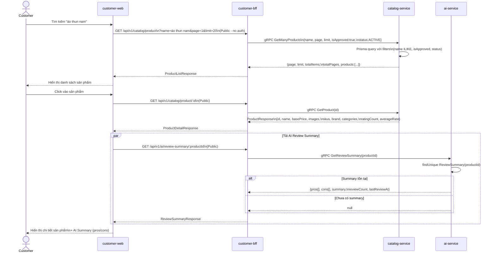

# SEQ-05: Product Search & View

```mermaid
sequenceDiagram
    actor Customer
    participant CW as customer-web
    participant CBFF as customer-bff
    participant CS as catalog-service
    participant AIS as ai-service

    Customer->>CW: Tìm kiếm "áo thun nam"
    CW->>CBFF: GET /api/v1/catalog/product\n?name=áo thun nam&page=1&limit=20\n(Public - no auth)

    CBFF->>CS: gRPC GetManyProducts\n{name, page, limit, isApproved:true,\nstatus:ACTIVE}
    CS->>CS: Prisma query với filters\n(name ILIKE, isApproved, status)
    CS-->>CBFF: {page, limit, totalItems,\ntotalPages, products:[...]}
    CBFF-->>CW: ProductListResponse
    CW-->>Customer: Hiển thị danh sách sản phẩm

    Customer->>CW: Click vào sản phẩm
    CW->>CBFF: GET /api/v1/catalog/product/:id\n(Public)
    CBFF->>CS: gRPC GetProduct(id)
    CS-->>CBFF: ProductResponse\n{id, name, basePrice, images,\nskus, brand, categories,\nratingCount, averageRate}
    CBFF-->>CW: ProductDetailResponse

    par Tải AI Review Summary
        CW->>CBFF: GET /api/v1/ai/review-summary/:productId\n(Public)
        CBFF->>AIS: gRPC GetReviewSummary(productId)
        AIS->>AIS: findUnique ReviewSummary(productId)
        alt Summary tồn tại
            AIS-->>CBFF: {pros[], cons[], summary,\nreviewCount, lastReviewAt}
        else Chưa có summary
            AIS-->>CBFF: null
        end
        CBFF-->>CW: ReviewSummaryResponse
    end

    CW-->>Customer: Hiển thị chi tiết sản phẩm\n+ AI Summary (pros/cons)
```
