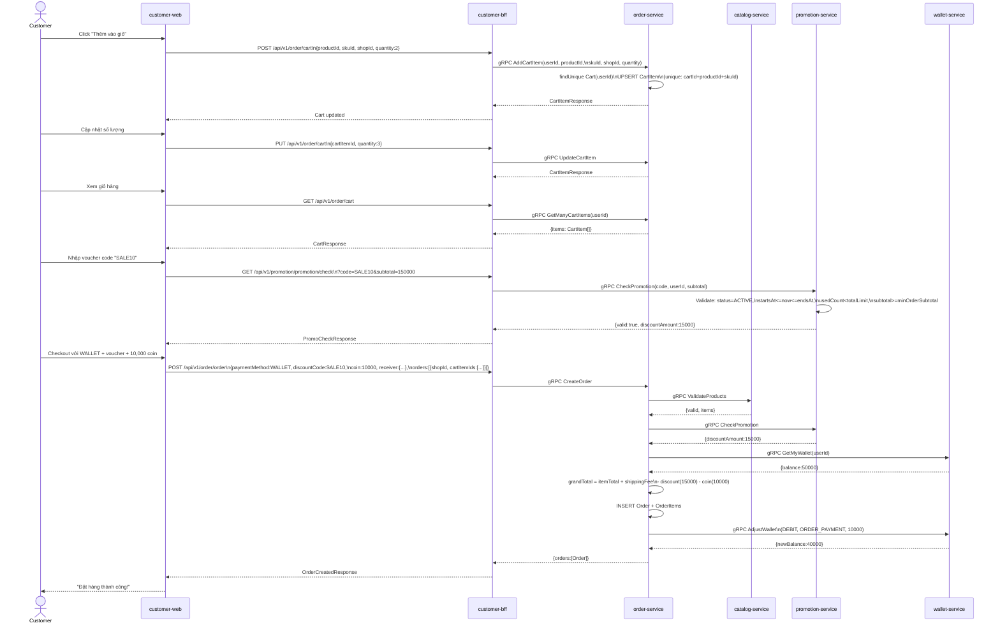

# SEQ-06: Add to Cart & Checkout (WALLET payment)

```mermaid
sequenceDiagram
    actor Customer
    participant CW as customer-web
    participant CBFF as customer-bff
    participant OS as order-service
    participant CS as catalog-service
    participant PS as promotion-service
    participant WS as wallet-service

    Customer->>CW: Click "Thêm vào giỏ"
    CW->>CBFF: POST /api/v1/order/cart\n{productId, skuId, shopId, quantity:2}
    CBFF->>OS: gRPC AddCartItem(userId, productId,\nskuId, shopId, quantity)
    OS->>OS: findUnique Cart(userId)\nUPSERT CartItem\n(unique: cartId+productId+skuId)
    OS-->>CBFF: CartItemResponse
    CBFF-->>CW: Cart updated

    Customer->>CW: Cập nhật số lượng
    CW->>CBFF: PUT /api/v1/order/cart\n{cartItemId, quantity:3}
    CBFF->>OS: gRPC UpdateCartItem
    OS-->>CBFF: CartItemResponse

    Customer->>CW: Xem giỏ hàng
    CW->>CBFF: GET /api/v1/order/cart
    CBFF->>OS: gRPC GetManyCartItems(userId)
    OS-->>CBFF: {items: CartItem[]}
    CBFF-->>CW: CartResponse

    Customer->>CW: Nhập voucher code "SALE10"
    CW->>CBFF: GET /api/v1/promotion/promotion/check\n?code=SALE10&subtotal=150000
    CBFF->>PS: gRPC CheckPromotion(code, userId, subtotal)
    PS->>PS: Validate: status=ACTIVE,\nstartsAt<=now<=endsAt,\nusedCount<totalLimit,\nsubtotal>=minOrderSubtotal
    PS-->>CBFF: {valid:true, discountAmount:15000}
    CBFF-->>CW: PromoCheckResponse

    Customer->>CW: Checkout với WALLET + voucher + 10,000 coin
    CW->>CBFF: POST /api/v1/order/order\n{paymentMethod:WALLET, discountCode:SALE10,\ncoin:10000, receiver:{...},\norders:[{shopId, cartItemIds:[...]}]}

    CBFF->>OS: gRPC CreateOrder
    OS->>CS: gRPC ValidateProducts
    CS-->>OS: {valid, items}
    OS->>PS: gRPC CheckPromotion
    PS-->>OS: {discountAmount:15000}
    OS->>WS: gRPC GetMyWallet(userId)
    WS-->>OS: {balance:50000}
    OS->>OS: grandTotal = itemTotal + shippingFee\n- discount(15000) - coin(10000)
    OS->>OS: INSERT Order + OrderItems
    OS->>WS: gRPC AdjustWallet\n(DEBIT, ORDER_PAYMENT, 10000)
    WS-->>OS: {newBalance:40000}
    OS-->>CBFF: {orders:[Order]}
    CBFF-->>CW: OrderCreatedResponse
    CW-->>Customer: "Đặt hàng thành công!"
```
