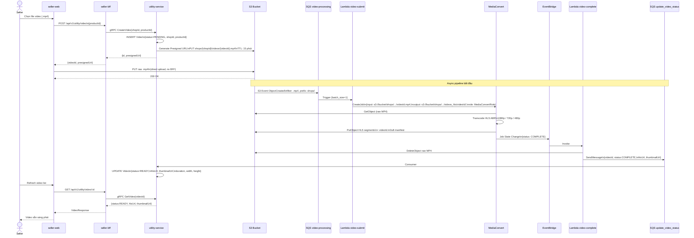

# SEQ-07: Seller Upload Video

```mermaid
sequenceDiagram
    actor Seller
    participant SW as seller-web
    participant SBFF as seller-bff
    participant US as utility-service
    participant S3 as S3 Bucket
    participant SQS_Proc as SQS video-processing
    participant LamSubmit as Lambda video-submit
    participant MC as MediaConvert
    participant EB as EventBridge
    participant LamComplete as Lambda video-complete
    participant SQS_Stat as SQS update_video_status

    Seller->>SW: Chọn file video (.mp4)
    SW->>SBFF: POST /api/v1/utility/video\n{productId}
    SBFF->>US: gRPC CreateVideo(shopId, productId)
    US->>US: INSERT Video\n{status=PENDING, shopId, productId}
    US->>S3: Generate Presigned URL\nPUT shops/{shopId}/videos/{videoId}.mp4\nTTL: 15 phút
    US-->>SBFF: {id, presignedUrl}
    SBFF-->>SW: {videoId, presignedUrl}

    SW->>S3: PUT raw .mp4\n(direct upload, no BFF)
    S3-->>SW: 200 OK

    Note over S3,SQS_Stat: Async pipeline bắt đầu

    S3->>SQS_Proc: S3 Event ObjectCreated\nfilter: .mp4, prefix: shops/
    SQS_Proc->>LamSubmit: Trigger (batch_size=1)
    LamSubmit->>MC: CreateJob\n{input: s3://bucket/shops/.../videoId.mp4,\noutput: s3://bucket/shops/.../videos_hls/videoId/,\nrole: MediaConvertRole}
    MC->>S3: GetObject (raw MP4)
    MC->>MC: Transcode HLS ABR\n1080p / 720p / 480p
    MC->>S3: PutObject HLS segments\n+ videoId.m3u8 manifest
    MC->>EB: Job State Change\n{status: COMPLETE}
    EB->>LamComplete: Invoke
    LamComplete->>S3: DeleteObject raw MP4
    LamComplete->>SQS_Stat: SendMessage\n{videoId, status:COMPLETE,\nhlsUrl, thumbnailUrl}

    SQS_Stat->>US: Consumer
    US->>US: UPDATE Video\n{status=READY,\nhlsUrl, thumbnailUrl,\nduration, width, height}

    Seller->>SW: Refresh video list
    SW->>SBFF: GET /api/v1/utility/video/:id
    SBFF->>US: gRPC GetVideo(videoId)
    US-->>SBFF: {status:READY, hlsUrl, thumbnailUrl}
    SBFF-->>SW: VideoResponse
    SW-->>Seller: Video sẵn sàng phát
```
