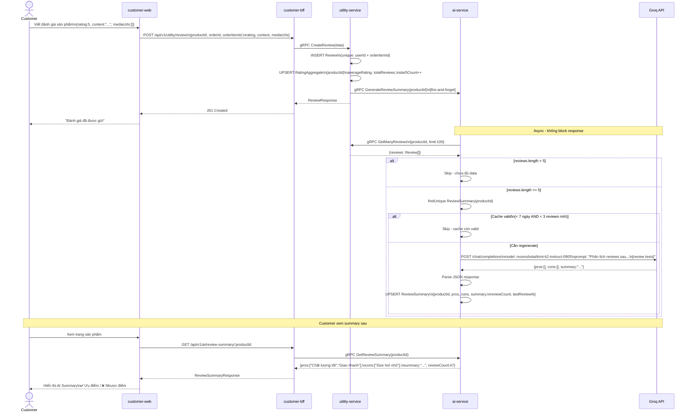

# SEQ-08: AI Review Summary

```mermaid
sequenceDiagram
    actor Customer
    participant CW as customer-web
    participant CBFF as customer-bff
    participant US as utility-service
    participant AIS as ai-service
    participant Groq as Groq API

    Customer->>CW: Viết đánh giá sản phẩm\n{rating:5, content:"...", mediaUrls:[]}
    CW->>CBFF: POST /api/v1/utility/review\n{productId, orderId, orderItemId,\nrating, content, mediaUrls}
    CBFF->>US: gRPC CreateReview(data)

    US->>US: INSERT Review\n(unique: userId + orderItemId)
    US->>US: UPSERT RatingAggregate\n(productId)\naverageRating, totalReviews,\nstar5Count++

    US->>AIS: gRPC GenerateReviewSummary(productId)\n[fire-and-forget]
    US-->>CBFF: ReviewResponse
    CBFF-->>CW: 201 Created
    CW-->>Customer: "Đánh giá đã được gửi"

    Note over AIS,Groq: Async - không block response

    AIS->>US: gRPC GetManyReviews\n{productId, limit:100}
    US-->>AIS: {reviews: Review[]}

    alt reviews.length < 5
        AIS->>AIS: Skip - chưa đủ data
    else reviews.length >= 5
        AIS->>AIS: findUnique ReviewSummary(productId)
        alt Cache valid\n(< 7 ngày AND < 3 reviews mới)
            AIS->>AIS: Skip - cache còn valid
        else Cần regenerate
            AIS->>Groq: POST /chat/completions\nmodel: moonshotai/kimi-k2-instruct-0905\nprompt: "Phân tích reviews sau...\n[review texts]"
            Groq-->>AIS: {pros:[], cons:[], summary:"..."}
            AIS->>AIS: Parse JSON response
            AIS->>AIS: UPSERT ReviewSummary\n{productId, pros, cons, summary,\nreviewCount, lastReviewAt}
        end
    end

    Note over Customer,Groq: Customer xem summary sau

    Customer->>CW: Xem trang sản phẩm
    CW->>CBFF: GET /api/v1/ai/review-summary/:productId
    CBFF->>AIS: gRPC GetReviewSummary(productId)
    AIS-->>CBFF: {pros:["Chất lượng tốt","Giao nhanh"],\ncons:["Size hơi nhỏ"],\nsummary:"...", reviewCount:47}
    CBFF-->>CW: ReviewSummaryResponse
    CW-->>Customer: Hiển thị AI Summary\n✅ Ưu điểm / ❌ Nhược điểm
```
