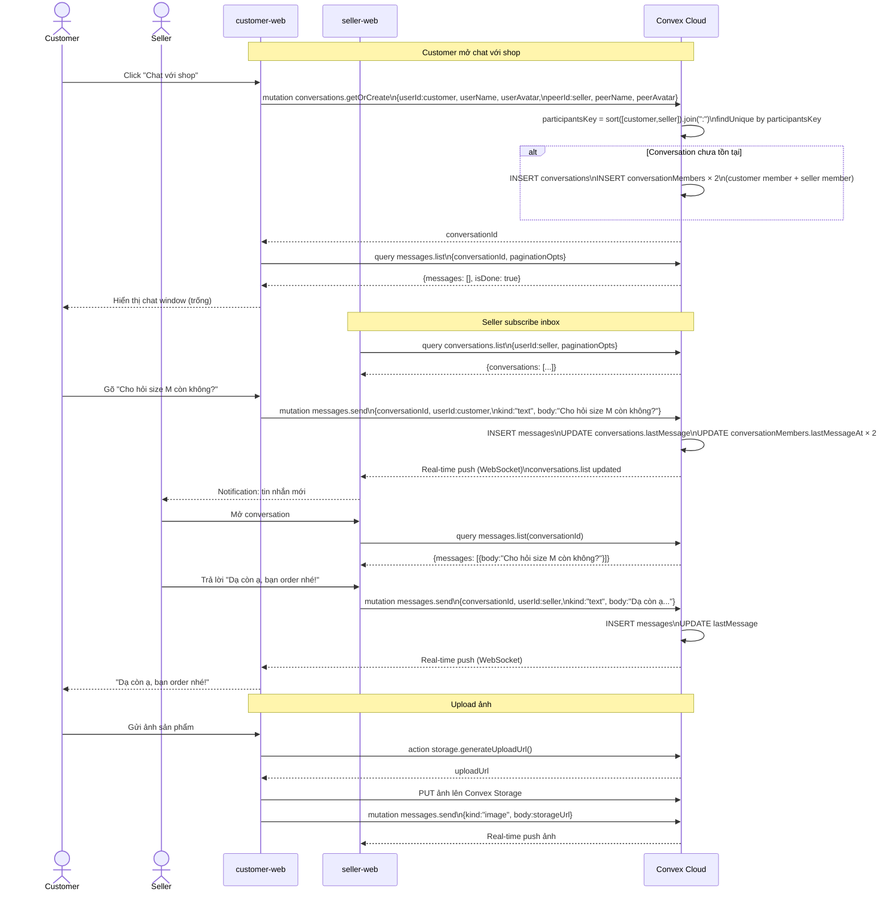

# SEQ-09: Convex 1-1 Chat (Customer ↔ Seller)

```mermaid
sequenceDiagram
    actor Customer
    actor Seller
    participant CW as customer-web
    participant SW as seller-web
    participant Convex as Convex Cloud

    Note over CW,Convex: Customer mở chat với shop

    Customer->>CW: Click "Chat với shop"
    CW->>Convex: mutation conversations.getOrCreate\n{userId:customer, userName, userAvatar,\npeerId:seller, peerName, peerAvatar}
    Convex->>Convex: participantsKey = sort([customer,seller]).join(":")\nfindUnique by participantsKey
    alt Conversation chưa tồn tại
        Convex->>Convex: INSERT conversations\nINSERT conversationMembers × 2\n(customer member + seller member)
    end
    Convex-->>CW: conversationId

    CW->>Convex: query messages.list\n{conversationId, paginationOpts}
    Convex-->>CW: {messages: [], isDone: true}
    CW-->>Customer: Hiển thị chat window (trống)

    Note over SW,Convex: Seller subscribe inbox

    SW->>Convex: query conversations.list\n{userId:seller, paginationOpts}
    Convex-->>SW: {conversations: [...]}

    Customer->>CW: Gõ "Cho hỏi size M còn không?"
    CW->>Convex: mutation messages.send\n{conversationId, userId:customer,\nkind:"text", body:"Cho hỏi size M còn không?"}
    Convex->>Convex: INSERT messages\nUPDATE conversations.lastMessage\nUPDATE conversationMembers.lastMessageAt × 2

    Convex-->>SW: Real-time push (WebSocket)\nconversations.list updated
    SW-->>Seller: Notification: tin nhắn mới

    Seller->>SW: Mở conversation
    SW->>Convex: query messages.list(conversationId)
    Convex-->>SW: {messages: [{body:"Cho hỏi size M còn không?"}]}

    Seller->>SW: Trả lời "Dạ còn ạ, bạn order nhé!"
    SW->>Convex: mutation messages.send\n{conversationId, userId:seller,\nkind:"text", body:"Dạ còn ạ..."}
    Convex->>Convex: INSERT messages\nUPDATE lastMessage

    Convex-->>CW: Real-time push (WebSocket)
    CW-->>Customer: "Dạ còn ạ, bạn order nhé!"

    Note over CW,Convex: Upload ảnh

    Customer->>CW: Gửi ảnh sản phẩm
    CW->>Convex: action storage.generateUploadUrl()
    Convex-->>CW: uploadUrl
    CW->>Convex: PUT ảnh lên Convex Storage
    CW->>Convex: mutation messages.send\n{kind:"image", body:storageUrl}
    Convex-->>SW: Real-time push ảnh
```
