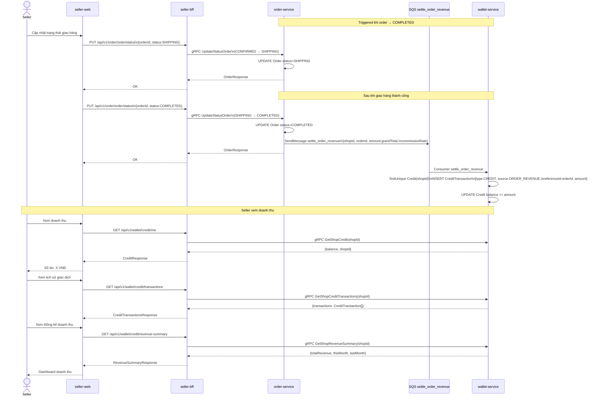

# SEQ-10: Shop Revenue Settlement

```mermaid
sequenceDiagram
    actor Seller
    participant SW as seller-web
    participant SBFF as seller-bff
    participant OS as order-service
    participant SQS as SQS settle_order_revenue
    participant WS as wallet-service

    Note over OS,WS: Triggered khi order → COMPLETED

    Seller->>SW: Cập nhật trạng thái giao hàng
    SW->>SBFF: PUT /api/v1/order/order/status\n{orderId, status:SHIPPING}
    SBFF->>OS: gRPC UpdateStatusOrder\n(CONFIRMED → SHIPPING)
    OS->>OS: UPDATE Order status=SHIPPING
    OS-->>SBFF: OrderResponse
    SBFF-->>SW: OK

    Note over OS,WS: Sau khi giao hàng thành công

    SW->>SBFF: PUT /api/v1/order/order/status\n{orderId, status:COMPLETED}
    SBFF->>OS: gRPC UpdateStatusOrder\n(SHIPPING → COMPLETED)
    OS->>OS: UPDATE Order status=COMPLETED
    OS->>SQS: SendMessage settle_order_revenue\n{shopId, orderId, amount:grandTotal,\ncommissionRate}
    OS-->>SBFF: OrderResponse
    SBFF-->>SW: OK

    SQS->>WS: Consumer settle_order_revenue
    WS->>WS: findUnique Credit(shopId)\nINSERT CreditTransaction\n{type:CREDIT, source:ORDER_REVENUE,\nreferenceId:orderId, amount}
    WS->>WS: UPDATE Credit balance += amount

    Note over Seller,WS: Seller xem doanh thu

    Seller->>SW: Xem doanh thu
    SW->>SBFF: GET /api/v1/wallet/credit/me
    SBFF->>WS: gRPC GetShopCredit(shopId)
    WS-->>SBFF: {balance, shopId}
    SBFF-->>SW: CreditResponse
    SW-->>Seller: Số dư: X VNĐ

    Seller->>SW: Xem lịch sử giao dịch
    SW->>SBFF: GET /api/v1/wallet/credit/transactions
    SBFF->>WS: gRPC GetShopCreditTransactions(shopId)
    WS-->>SBFF: {transactions: CreditTransaction[]}
    SBFF-->>SW: CreditTransactionsResponse

    Seller->>SW: Xem thống kê doanh thu
    SW->>SBFF: GET /api/v1/wallet/credit/revenue-summary
    SBFF->>WS: gRPC GetShopRevenueSummary(shopId)
    WS-->>SBFF: {totalRevenue, thisMonth, lastMonth}
    SBFF-->>SW: RevenueSummaryResponse
    SW-->>Seller: Dashboard doanh thu
```
