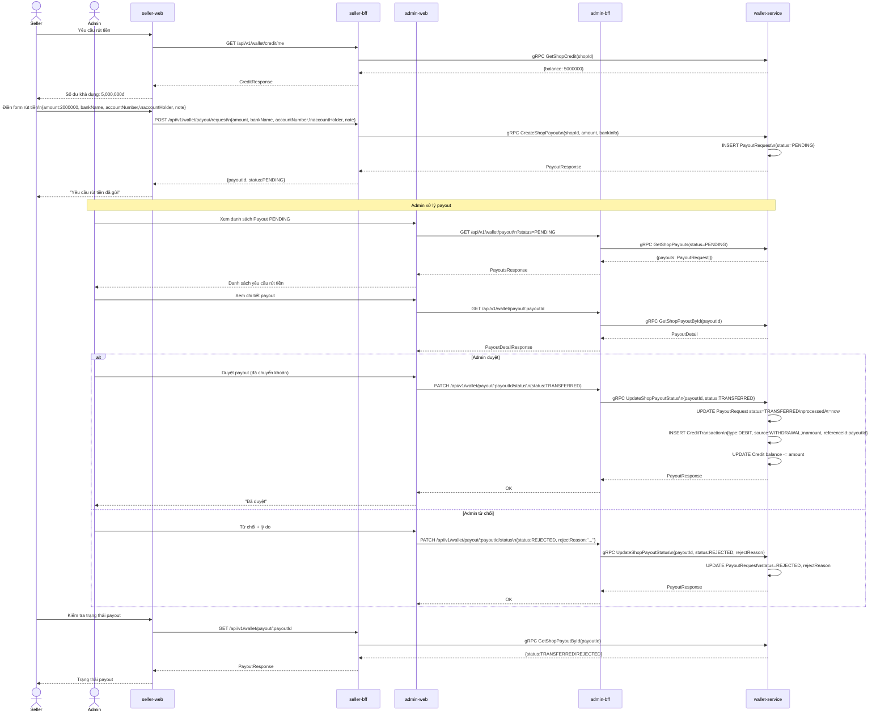

# SEQ-11: Seller Payout Request

```mermaid
sequenceDiagram
    actor Seller
    actor Admin
    participant SW as seller-web
    participant SBFF as seller-bff
    participant AW as admin-web
    participant ABFF as admin-bff
    participant WS as wallet-service

    Seller->>SW: Yêu cầu rút tiền
    SW->>SBFF: GET /api/v1/wallet/credit/me
    SBFF->>WS: gRPC GetShopCredit(shopId)
    WS-->>SBFF: {balance: 5000000}
    SBFF-->>SW: CreditResponse
    SW-->>Seller: Số dư khả dụng: 5,000,000đ

    Seller->>SW: Điền form rút tiền\n{amount:2000000, bankName, accountNumber,\naccountHolder, note}
    SW->>SBFF: POST /api/v1/wallet/payout/request\n{amount, bankName, accountNumber,\naccountHolder, note}
    SBFF->>WS: gRPC CreateShopPayout\n{shopId, amount, bankInfo}
    WS->>WS: INSERT PayoutRequest\n{status=PENDING}
    WS-->>SBFF: PayoutResponse
    SBFF-->>SW: {payoutId, status:PENDING}
    SW-->>Seller: "Yêu cầu rút tiền đã gửi"

    Note over Admin,WS: Admin xử lý payout

    Admin->>AW: Xem danh sách Payout PENDING
    AW->>ABFF: GET /api/v1/wallet/payout\n?status=PENDING
    ABFF->>WS: gRPC GetShopPayouts(status=PENDING)
    WS-->>ABFF: {payouts: PayoutRequest[]}
    ABFF-->>AW: PayoutsResponse
    AW-->>Admin: Danh sách yêu cầu rút tiền

    Admin->>AW: Xem chi tiết payout
    AW->>ABFF: GET /api/v1/wallet/payout/:payoutId
    ABFF->>WS: gRPC GetShopPayoutById(payoutId)
    WS-->>ABFF: PayoutDetail
    ABFF-->>AW: PayoutDetailResponse

    alt Admin duyệt
        Admin->>AW: Duyệt payout (đã chuyển khoản)
        AW->>ABFF: PATCH /api/v1/wallet/payout/:payoutId/status\n{status:TRANSFERRED}
        ABFF->>WS: gRPC UpdateShopPayoutStatus\n{payoutId, status:TRANSFERRED}
        WS->>WS: UPDATE PayoutRequest status=TRANSFERRED\nprocessedAt=now
        WS->>WS: INSERT CreditTransaction\n{type:DEBIT, source:WITHDRAWAL,\namount, referenceId:payoutId}
        WS->>WS: UPDATE Credit balance -= amount
        WS-->>ABFF: PayoutResponse
        ABFF-->>AW: OK
        AW-->>Admin: "Đã duyệt"
    else Admin từ chối
        Admin->>AW: Từ chối + lý do
        AW->>ABFF: PATCH /api/v1/wallet/payout/:payoutId/status\n{status:REJECTED, rejectReason:"..."}
        ABFF->>WS: gRPC UpdateShopPayoutStatus\n{payoutId, status:REJECTED, rejectReason}
        WS->>WS: UPDATE PayoutRequest\nstatus=REJECTED, rejectReason
        WS-->>ABFF: PayoutResponse
        ABFF-->>AW: OK
    end

    Seller->>SW: Kiểm tra trạng thái payout
    SW->>SBFF: GET /api/v1/wallet/payout/:payoutId
    SBFF->>WS: gRPC GetShopPayoutById(payoutId)
    WS-->>SBFF: {status:TRANSFERRED/REJECTED}
    SBFF-->>SW: PayoutResponse
    SW-->>Seller: Trạng thái payout
```
