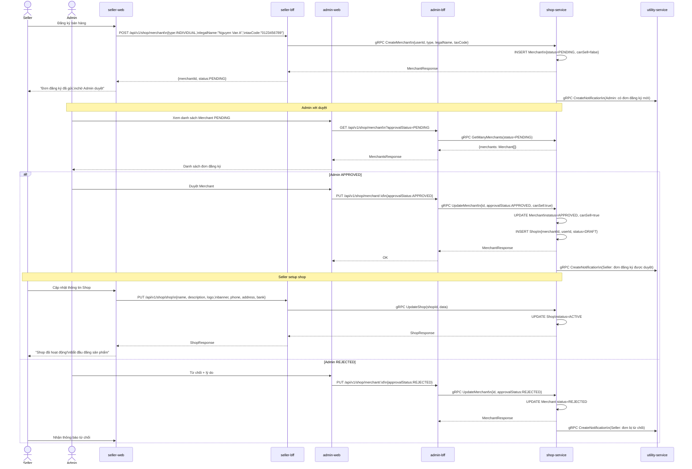

# SEQ-12: Merchant Registration & Approval

```mermaid
sequenceDiagram
    actor Seller
    actor Admin
    participant SW as seller-web
    participant SBFF as seller-bff
    participant AW as admin-web
    participant ABFF as admin-bff
    participant SS as shop-service
    participant US as utility-service

    Seller->>SW: Đăng ký bán hàng
    SW->>SBFF: POST /api/v1/shop/merchant\n{type:INDIVIDUAL,\nlegalName:"Nguyen Van A",\ntaxCode:"0123456789"}
    SBFF->>SS: gRPC CreateMerchant\n{userId, type, legalName, taxCode}
    SS->>SS: INSERT Merchant\n{status=PENDING, canSell=false}
    SS-->>SBFF: MerchantResponse
    SBFF-->>SW: {merchantId, status:PENDING}
    SW-->>Seller: "Đơn đăng ký đã gửi,\nchờ Admin duyệt"

    SS->>US: gRPC CreateNotification\n(Admin: có đơn đăng ký mới)

    Note over Admin,SS: Admin xét duyệt

    Admin->>AW: Xem danh sách Merchant PENDING
    AW->>ABFF: GET /api/v1/shop/merchant\n?approvalStatus=PENDING
    ABFF->>SS: gRPC GetManyMerchants(status=PENDING)
    SS-->>ABFF: {merchants: Merchant[]}
    ABFF-->>AW: MerchantsResponse
    AW-->>Admin: Danh sách đơn đăng ký

    alt Admin APPROVED
        Admin->>AW: Duyệt Merchant
        AW->>ABFF: PUT /api/v1/shop/merchant/:id\n{approvalStatus:APPROVED}
        ABFF->>SS: gRPC UpdateMerchant\n{id, approvalStatus:APPROVED, canSell:true}
        SS->>SS: UPDATE Merchant\nstatus=APPROVED, canSell=true
        SS->>SS: INSERT Shop\n{merchantId, userId, status=DRAFT}
        SS-->>ABFF: MerchantResponse
        ABFF-->>AW: OK
        SS->>US: gRPC CreateNotification\n(Seller: đơn đăng ký được duyệt)

        Note over Seller,SS: Seller setup shop

        Seller->>SW: Cập nhật thông tin Shop
        SW->>SBFF: PUT /api/v1/shop/shop\n{name, description, logo,\nbanner, phone, address, bank}
        SBFF->>SS: gRPC UpdateShop(shopId, data)
        SS->>SS: UPDATE Shop\nstatus=ACTIVE
        SS-->>SBFF: ShopResponse
        SBFF-->>SW: ShopResponse
        SW-->>Seller: "Shop đã hoạt động!\nBắt đầu đăng sản phẩm"

    else Admin REJECTED
        Admin->>AW: Từ chối + lý do
        AW->>ABFF: PUT /api/v1/shop/merchant/:id\n{approvalStatus:REJECTED}
        ABFF->>SS: gRPC UpdateMerchant\n{id, approvalStatus:REJECTED}
        SS->>SS: UPDATE Merchant status=REJECTED
        SS-->>ABFF: MerchantResponse
        SS->>US: gRPC CreateNotification\n(Seller: đơn bị từ chối)
        Seller->>SW: Nhận thông báo từ chối
    end
```
