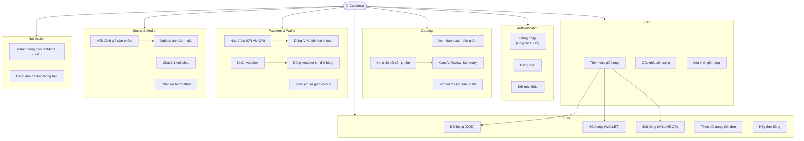

# UC-01: Customer Use Cases

```mermaid
flowchart TD
    Customer(["👤 Customer"])

    subgraph Auth["Authentication"]
        UC1["Đăng nhập\n(Cognito OIDC)"]
        UC2["Đăng xuất"]
        UC3["Đổi mật khẩu"]
    end

    subgraph Catalog["Catalog"]
        UC4["Xem danh sách sản phẩm"]
        UC5["Tìm kiếm / lọc sản phẩm"]
        UC6["Xem chi tiết sản phẩm"]
        UC7["Xem AI Review Summary"]
    end

    subgraph Cart["Cart"]
        UC8["Thêm vào giỏ hàng"]
        UC9["Cập nhật số lượng"]
        UC10["Xóa khỏi giỏ hàng"]
    end

    subgraph Order["Order"]
        UC11["Đặt hàng (COD)"]
        UC12["Đặt hàng (WALLET)"]
        UC13["Đặt hàng (ONLINE QR)"]
        UC14["Theo dõi trạng thái đơn"]
        UC15["Hủy đơn hàng"]
    end

    subgraph Payment["Payment & Wallet"]
        UC16["Nạp V-Xu (QR VietQR)"]
        UC17["Dùng V-Xu khi thanh toán"]
        UC18["Xem lịch sử giao dịch ví"]
        UC19["Nhận voucher"]
        UC20["Dùng voucher khi đặt hàng"]
    end

    subgraph Social["Social & Media"]
        UC21["Viết đánh giá sản phẩm"]
        UC22["Upload ảnh đánh giá"]
        UC23["Chat 1-1 với shop"]
        UC24["Chat với AI Chatbot"]
    end

    subgraph Notification["Notification"]
        UC25["Nhận thông báo real-time (SSE)"]
        UC26["Đánh dấu đã đọc thông báo"]
    end

    Customer --> Auth
    Customer --> Catalog
    Customer --> Cart
    Customer --> Order
    Customer --> Payment
    Customer --> Social
    Customer --> Notification

    UC6 --> UC7
    UC8 --> UC11
    UC8 --> UC12
    UC8 --> UC13
    UC16 --> UC17
    UC19 --> UC20
    UC21 --> UC22
```
