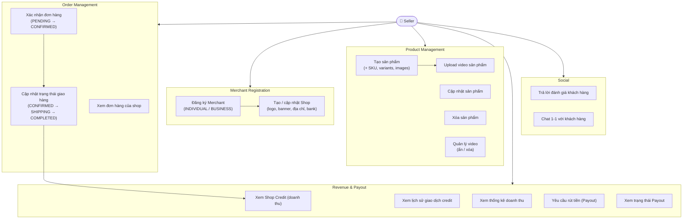

# UC-02: Seller Use Cases

```mermaid
flowchart TD
    Seller(["🏪 Seller"])

    subgraph Registration["Merchant Registration"]
        UC1["Đăng ký Merchant\n(INDIVIDUAL / BUSINESS)"]
        UC2["Tạo / cập nhật Shop\n(logo, banner, địa chỉ, bank)"]
    end

    subgraph Product["Product Management"]
        UC3["Tạo sản phẩm\n(+ SKU, variants, images)"]
        UC4["Cập nhật sản phẩm"]
        UC5["Xóa sản phẩm"]
        UC6["Upload video sản phẩm"]
        UC7["Quản lý video\n(ẩn / xóa)"]
    end

    subgraph OrderMgmt["Order Management"]
        UC8["Xem đơn hàng của shop"]
        UC9["Xác nhận đơn hàng\n(PENDING → CONFIRMED)"]
        UC10["Cập nhật trạng thái giao hàng\n(CONFIRMED → SHIPPING → COMPLETED)"]
    end

    subgraph Revenue["Revenue & Payout"]
        UC11["Xem Shop Credit (doanh thu)"]
        UC12["Xem lịch sử giao dịch credit"]
        UC13["Xem thống kê doanh thu"]
        UC14["Yêu cầu rút tiền (Payout)"]
        UC15["Xem trạng thái Payout"]
    end

    subgraph Social["Social"]
        UC16["Trả lời đánh giá khách hàng"]
        UC17["Chat 1-1 với khách hàng"]
    end

    Seller --> Registration
    Seller --> Product
    Seller --> OrderMgmt
    Seller --> Revenue
    Seller --> Social

    UC1 --> UC2
    UC3 --> UC6
    UC9 --> UC10
    UC10 --> UC11
```
