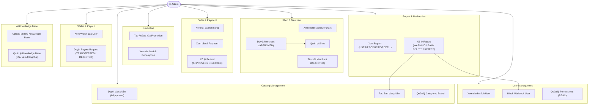

# UC-03: Admin Use Cases

```mermaid
flowchart TD
    Admin(["🔑 Admin"])

    subgraph UserMgmt["User Management"]
        UC1["Xem danh sách User"]
        UC2["Block / Unblock User"]
        UC3["Quản lý Permissions (RBAC)"]
    end

    subgraph ShopMgmt["Shop & Merchant"]
        UC4["Xem danh sách Merchant"]
        UC5["Duyệt Merchant (APPROVED)"]
        UC6["Từ chối Merchant (REJECTED)"]
        UC7["Quản lý Shop"]
    end

    subgraph CatalogMgmt["Catalog Management"]
        UC8["Duyệt sản phẩm (isApproved)"]
        UC9["Ẩn / Ban sản phẩm"]
        UC10["Quản lý Category / Brand"]
    end

    subgraph OrderMgmt["Order & Payment"]
        UC11["Xem tất cả đơn hàng"]
        UC12["Xem tất cả Payment"]
        UC13["Xử lý Refund\n(APPROVED / REJECTED)"]
    end

    subgraph PromotionMgmt["Promotion"]
        UC14["Tạo / sửa / xóa Promotion"]
        UC15["Xem danh sách Redemption"]
    end

    subgraph ReportMgmt["Report & Moderation"]
        UC16["Xem Report (USER/PRODUCT/ORDER...)"]
        UC17["Xử lý Report\n(WARNING / BAN / DELETE / REJECT)"]
    end

    subgraph WalletMgmt["Wallet & Payout"]
        UC18["Xem Wallet của User"]
        UC19["Duyệt Payout Request\n(TRANSFERRED / REJECTED)"]
    end

    subgraph AI["AI Knowledge Base"]
        UC20["Upload tài liệu Knowledge Base"]
        UC21["Quản lý Knowledge Base\n(xóa, xem trạng thái)"]
    end

    Admin --> UserMgmt
    Admin --> ShopMgmt
    Admin --> CatalogMgmt
    Admin --> OrderMgmt
    Admin --> PromotionMgmt
    Admin --> ReportMgmt
    Admin --> WalletMgmt
    Admin --> AI

    UC5 --> UC7
    UC17 --> UC2
    UC17 --> UC9
```
